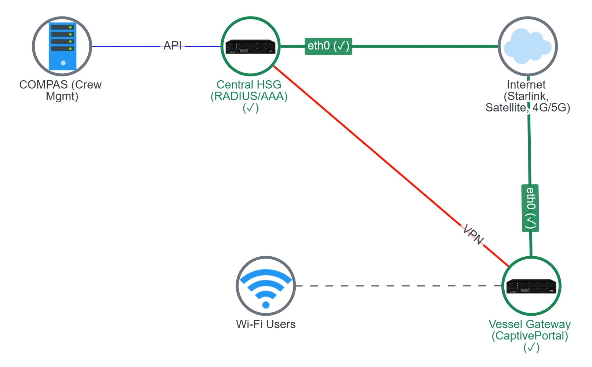
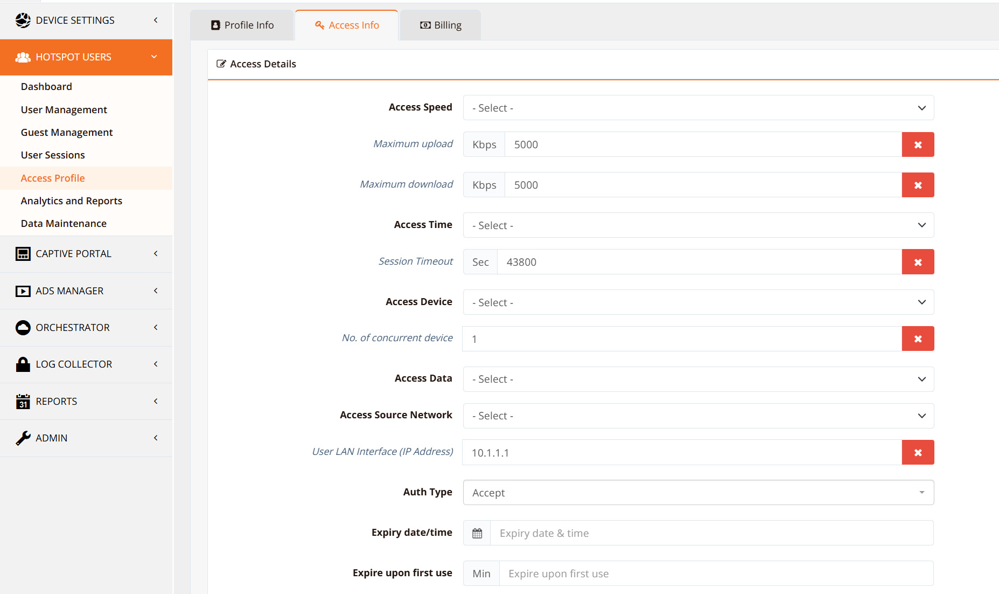
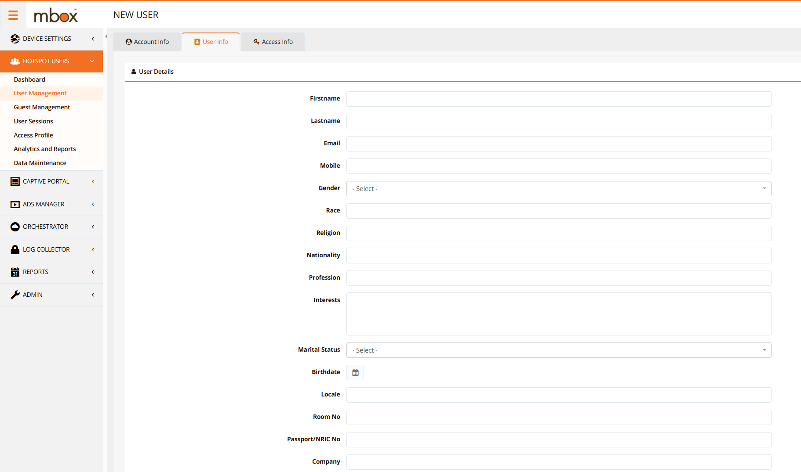
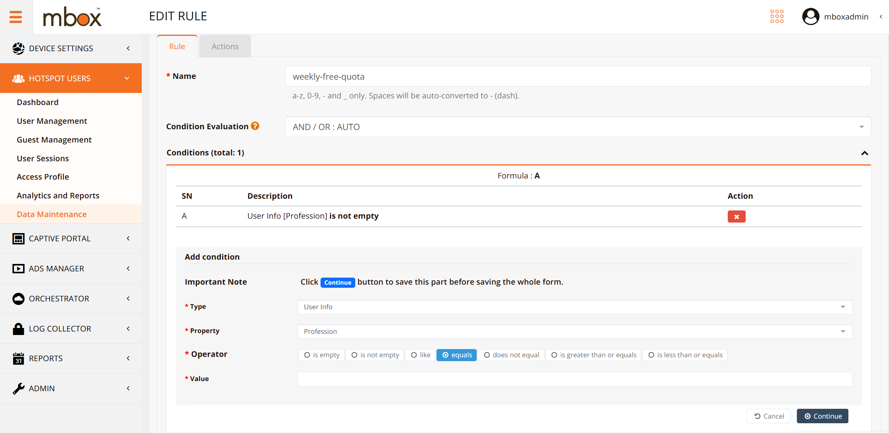
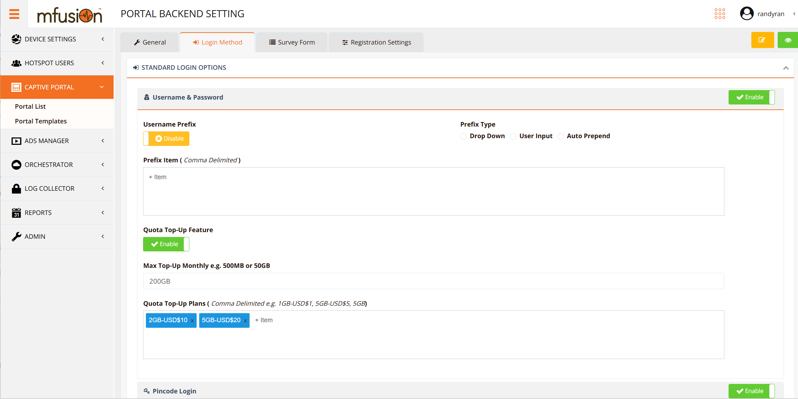
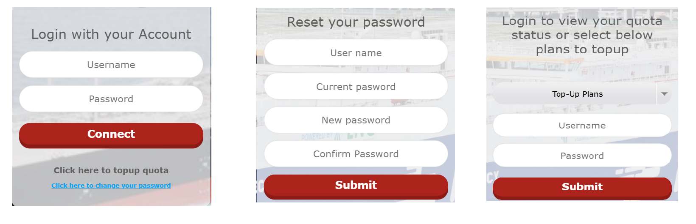
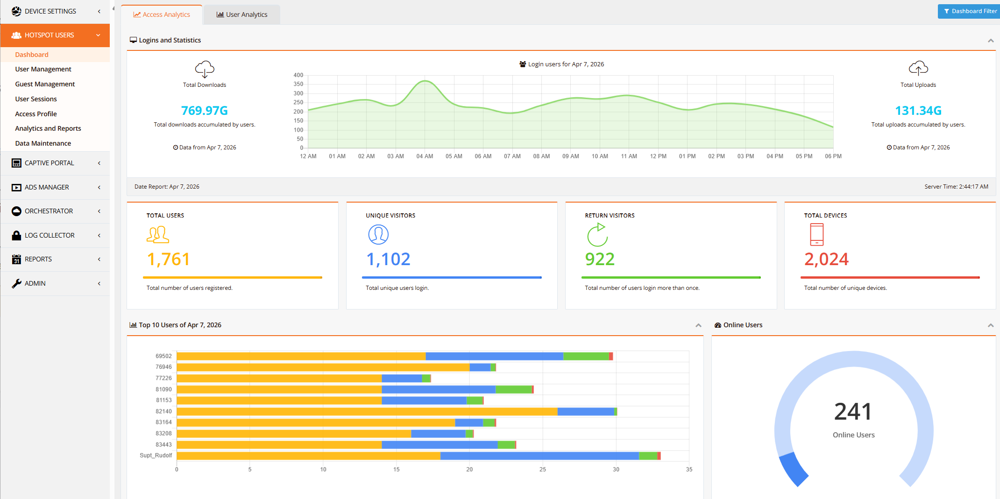
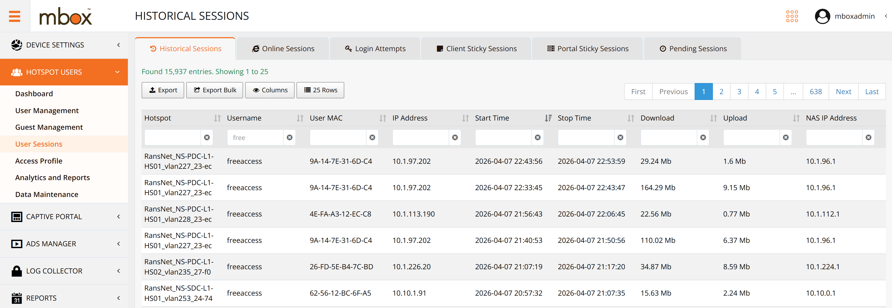
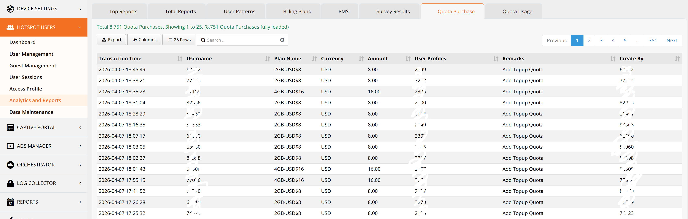
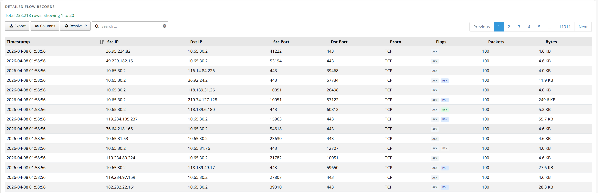

# Crew Wi-Fi Hotspot Management

## Overview

Many vessels today provide Internet access for crew members, but authenticating users, managing accounts, enforcing usage quotas, and handling billing across a large fleet can become operationally complex — especially when crew assignments rotate between vessels and satellite connectivity is intermittent.

RansNet [HotSpot Gateway (HSG)](../hotspot/index.md) addresses these challenges by automating the end-to-end crew Internet access lifecycle. The solution integrates with COMPAS (and other crew management and payment systems via API), synchronises crew identities automatically, enforces per-user usage quotas, and allows crew members to self-purchase additional data when needed.

### Solution Architecture

The solution uses a **two-tier HSG deployment**:

- **Central HSG** (hardware appliance or VM) — hosted at the operator's data centre or a preferred cloud platform (Azure or AWS). This is the single source of truth for crew identity, access profiles, quota management, billing records, and API integration with COMPAS.
- **Vessel HSG** (hardware appliance or VM) — deployed on board each vessel. The captive portal login page is hosted locally on the vessel HSG, ensuring a fast and responsive login experience for crew members even when satellite connectivity is limited or intermittent.

An SD-WAN VPN tunnel connects each vessel HSG back to the central HSG, providing the authentication backhaul and synchronisation path.

### Key Capabilities

- **Centralised identity management** — crew IDs are automatically synchronised from COMPAS to the central HSG via API, with vessel assignment determined by the crew scheduling system
- **Vessel-bound access** — each crew ID is restricted to authenticate only from its currently assigned vessel network; access automatically follows the crew member's rotation schedule
- **Single device enforcement** — each crew ID is permitted to be logged in from one device at a time, preventing account sharing
- **Weekly free quota** — every crew member receives a configurable weekly free data quota that resets automatically on a scheduled day and time
- **Self-service top-up** — crew members can purchase additional data quota directly through the captive portal; purchased quota does not expire and carries over across vessel reassignments
- **Post-billing integration** — COMPAS retrieves top-up purchase records from the central HSG via API for reconciliation and billing
- **Compliance logging** — Internet access logs are captured as NetFlow records on the local vessel HSG for security compliance, audit trails, and dispute investigation

---

## Deployment

### Step 1 — Deploy HSG Appliances and Build SD-WAN

- Follow the [Getting Started](../start/overview.md) guide to deploy the central HSG and each vessel HSG appliance
- Refer to the [HotSpot API](../api/hotspot.md) guide to configure API access on the central HSG for COMPAS or other crew management system integration
- Build an SD-WAN VPN tunnel from each vessel HSG to the central HSG (refer to the SD-WAN setup guide)

!!! note
    - The central HSG must have a static public IP address so that vessel HSGs can establish outbound SD-WAN VPN tunnels to it
    - Vessel HSGs can use any available Internet uplink (satellite, cellular, or shore connection) to initiate the VPN tunnel to the central HSG

### Step 2 — Configure Access Profiles

On the central HSG, create an access profile for each vessel (each profile maps to a unique Vessel ID). Configure the access rights attached to each profile, including:

- Session timeout and idle timeout
- Bandwidth rate limits (upstream and downstream)
- Access control rules (permitted/blocked services or destinations)
- Free quota allocation per period

!!! info
    Users assigned to an access profile automatically inherit all access rights defined in that profile. Updating a profile immediately applies to all users assigned to it.

### Step 3 — Create and Manage Crew Accounts

Crew accounts can be provisioned through multiple methods:

- **API automation** — integrate with COMPAS or any crew management system via the HSG RESTful API to automate account creation, modification, suspension, and deletion as crew assignments change
- **Payment gateway integration** — configure a payment gateway to allow crew members to self-purchase access plans directly; HSG includes built-in billing and invoicing functions
- **Manual VIP accounts** — create individual accounts manually and assign them directly to an access profile
- **Voucher bulk creation** — use the built-in guest management console to mass-generate and print access vouchers for distribution

When creating user accounts, assign a **user attribute** (e.g. crew rank or department) to each account. This attribute is used as a matching criterion in automated quota management rules (Step 4).

!!! note
    If automating quota management — for example, performing weekly free quota resets — it is important to assign a consistent user attribute to each account so that automation rules can accurately identify and target the correct user groups.

### Step 4 — Configure Automated Quota Management

Under **Data Maintenance**, create automated rules to assign free data quota based on user attributes (e.g. crew rank). Rules can match on multiple criteria simultaneously, allowing differentiated quota tiers — for example, officers receiving a higher weekly allowance than ratings.

!!! note
    - When a user holds both a free quota allocation and purchased top-up quota, free quota is consumed first. Top-up quota is only drawn down once the free quota is exhausted.
    - A scheduled maintenance job runs every Sunday at 00:00 to purge any remaining unused free quota from the previous week, assign the new week's free quota, and carry over any remaining purchased top-up quota to the following week.

### Step 5 — Create the Crew Login Portal

RansNet provides extensive captive portal capabilities with a fully customisable interface. The crew Wi-Fi portal is configured to expose the following self-service functions to crew members:

- **Quota plan selection** — view available data plans and current quota balance
- **Password change** — allow crew members to update their own login credentials
- **Data top-up** — self-service purchase of additional data quota via the integrated payment gateway (top-up can be enabled or disabled per portal configuration)

The portal content is hosted locally on the on-board vessel HSG, providing a fast login experience independent of satellite link quality or latency.

---

## Reporting

The HSG provides comprehensive reporting for fleet administrators and business stakeholders, covering user activity, session history, quota usage, purchase records, and detailed traffic logs.

### User Dashboard

A real-time overview of active sessions, connected devices, quota consumption, and system health across the fleet.

### Session History

Complete historical session records per user, including login time, logout time, device, data consumed per session, and applied access profile. Used for traceability, SLA reporting, and dispute investigation.

### Purchase and Top-Up Records

Full billing history of all self-service data top-up transactions, including amount, plan purchased, payment method, and timestamp. Records are retrievable by COMPAS or external billing systems via the HSG API for post-billing reconciliation.

### NetFlow Traffic Logs

Granular per-connection traffic records captured as NetFlow data on the local vessel HSG. Provides visibility into individual connection destinations, protocols, and data volumes — supporting deeper user behaviour analysis, security audits, and dispute resolution without relying on central connectivity.

