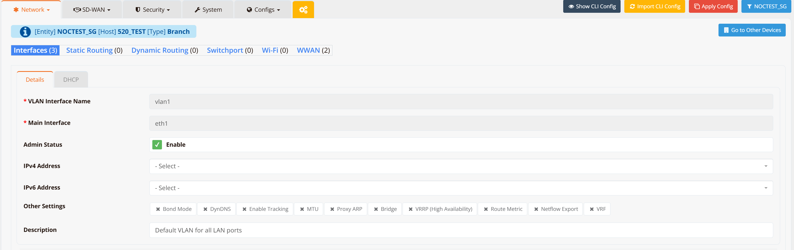
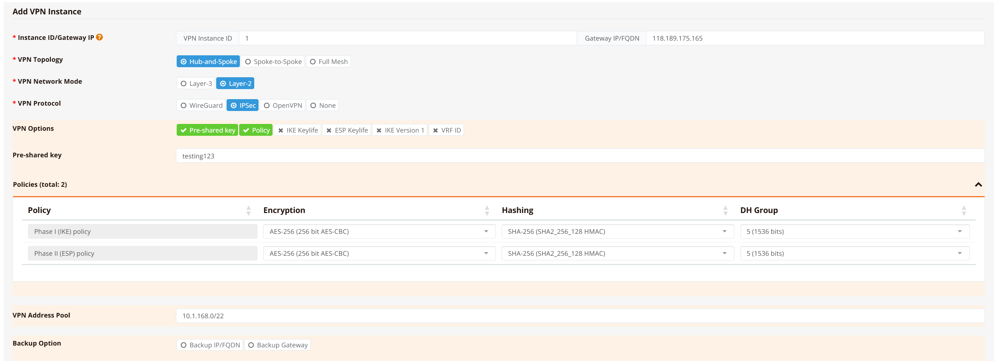
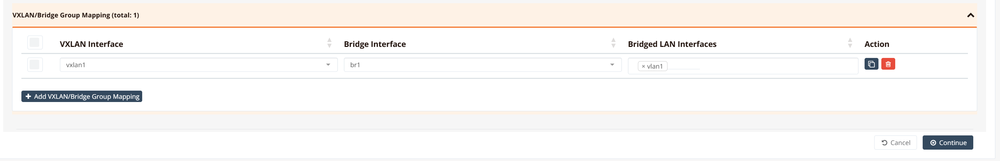
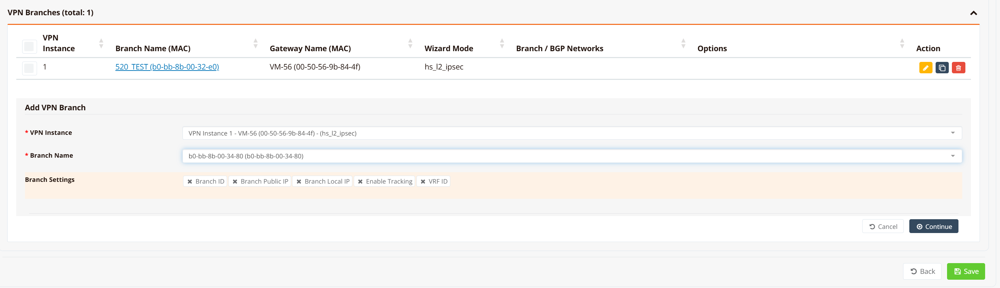
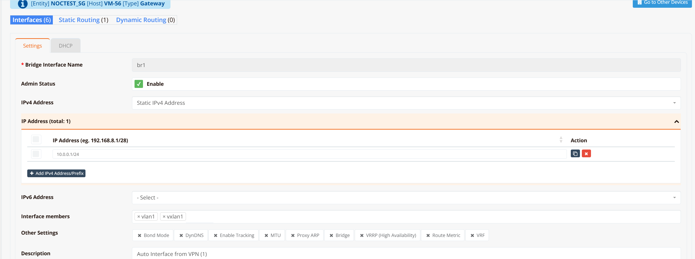

# Layer-2 SD-WAN (Hub and Spoke)

## Overview

For most enterprises with distributed remote offices or outlets, remote sites connect back to the HQ or data centre via Layer-3 IP networks — through the public Internet, 4G/5G, MPLS, or private leased lines. Traditional SD-WAN solutions are optimised for Layer-3 (IP) connectivity. However, some deployments require Layer-2 extension across geographically distributed sites, such as:

- Extending VLANs across branches
- Preserving broadcast-based services (DHCP, mDNS, legacy protocols)
- Supporting VM mobility or live migration across sites
- Supporting industrial automation and OT networks that do not rely on TCP/IP routing

**L2 over SD-WAN** (also known as L2VPN or Ethernet VPN over SD-WAN) addresses these requirements by encapsulating Ethernet frames inside VXLAN tunnels. It also provides traffic isolation and enhanced network security by logically separating WAN and LAN traffic — WAN links use the default routing table (underlay) to establish tunnel connectivity, while LAN devices communicate through a private VLAN segment isolated from external reachability.

Common use cases for L2 over SD-WAN include:

- Factory automation and OT (Operational Technology) networks
- IoT or retail chains with centralised services
- Maritime and transportation systems
- VM or container mobility across data centres or sites

L2VPN also simplifies large distributed deployments in several important ways:

- **No per-site address planning** — unlike Layer-3 SD-WAN, there is no need to allocate subnets or manage routing per location. All sites share the same Layer-2 broadcast domain.
- **Seamless device roaming** — branch routers are transparent to LAN devices, acting as L2 switches in the data path. No IP reconfiguration is needed when devices move between sites or when hardware is swapped.
- **Centralised firewall and policy** — all LAN devices use the central gateway as their default gateway, enabling centralised inter-VLAN routing, firewall enforcement, and traffic inspection at the hub.
- **Reduced attack surface** — branch routers have no routable IP address exposed to internal LAN networks, making them invisible to network scanners and harder to exploit.

**Key Technologies**

| Layer | Technology | Role |
|---|---|---|
| **Data plane** | Multipoint VXLAN | Encapsulates Ethernet frames (including broadcast and multicast) for transport across the IP underlay |
| **Underlay encryption** | WireGuard or IPSec | Encrypts the outer IP tunnel between VXLAN Tunnel Endpoints (VTEPs) |

---

## Configuration on Gateway

Most configuration is performed on the gateway via mfusion. The resulting configuration is automatically compiled and pushed to assigned branch routers.

This guide walks through the **[Hub-and-Spoke](../sdwan/vpn/topology.md#hub-and-spoke-l2)** topology. In this topology:

- The **system default routing table (underlay)** is used to establish L2VPN tunnels over available WAN links. Configure WAN failover between links if redundancy is required.
- The **VXLAN tunnel interface is bridged to the LAN interface**, creating a flat Layer-2 network that spans from each branch to the gateway.

### Step 1 — Configure LAN Interfaces

On both the gateway and each branch router, configure VLAN 1 as a Layer-2 interface (substitute VLAN 1 with your actual LAN or VLAN interface).

!!! note
    No IP address is required on the LAN/VLAN interface — it will be bridged into the VXLAN tunnel in the next step.

Navigate to **Device → Interfaces → VLAN** and create VLAN 1 without assigning an IP address.

**Gateway**


**Branch Routers** (repeat for each branch)



### Step 2 — Configure SD-WAN VPN Instance

On the gateway, navigate to **SD-WAN → VPN → Add VPN Instance**. Select the VPN topology and encryption protocol.



Select **Hub-and-Spoke** topology, ***Layer-2** network mode, and **IPSec** as the encryption protocol.

!!! note
    Hub-and-Spoke restricts spoke devices to communicate with the hub only — no spoke-to-spoke traffic. This is the recommended topology when inter-branch communication is not required, as it improves security and suppresses Layer-2 broadcast storms.

Bridge the VPN tunnel to the LAN interface, then click **Continue**, **Save and Apply Config**.



After the configuration is pushed, a `br1` bridge and `vxlan1` tunnel interface are automatically created on the gateway. If you need to bridge additional LAN/VLAN interfaces into the same tunnel, add them in the **Bridged LAN Interfaces** section.

!!! tip
    For testing and verification, you can assign an IP address to the `br1` interface to ping across the bridge and validate LAN-to-LAN reachability. In production deployments this is not required — LAN devices only need to be in the same subnet and will communicate as if attached to a single virtual Layer-2 switch.

### Step 3 — Assign Branch Routers to VPN Instance

Scroll down in the VPN instance configuration, go to **VPN Branches → Add VPN Branch**, and select the branch routers to include. Repeat for all branch routers.



mfusion compiles and pushes the LAN/VLAN, bridge, VXLAN, and IPSec configuration to each branch automatically. No further manual configuration is required on branch devices.

### Step 4 (Optional) — Assign IP Address to Gateway Bridge Interface

If the gateway router will act as the default gateway for all branch devices, assign an IP address to the `br1` bridge interface. Optionally enable a DHCP server to issue IP addresses to branch devices across the L2 overlay.



!!! note
    If an upstream firewall or DHCP server connects to the gateway's LAN/VLAN interface (which is bridged into the VPN tunnel), no IP address is required here. The gateway and branch routers act as a logical wire between branch devices and the upstream firewall — transparent to the data path.

### CLI Reference (Gateway)

!!! note
    SD-WAN configuration is generated automatically by mfusion. The CLI snippets below are provided for reference and troubleshooting only.

```
!
interface lo
 enable
 ip address 10.1.168.1/32
!
interface vxlan1
 description "Auto Interface from VPN (1)"
 vx-local 10.1.168.1
 enable
 bridge-group 1
!
interface vlan 0 1
 enable
 bridge-group 1
!
interface bridge br1
 description "Auto Interface from VPN (1)"
 enable
 ip address 10.0.0.1/24
!
ipsec ike-policy 1
 authentication psk
 policy AES-256 SHA-256 5
!
ipsec esp-policy 1
 policy AES-256 SHA-256 5
!
ipsec peer b0-bb-8b-00-32-e0
 local-net 10.1.168.1/32
 remote-id b0-bb-8b-00-32-e0
 remote-ip any
 remote-net 10.1.168.2/32
 policy ike 1 esp 1
 psk testing123
!
ipsec peer b0-bb-8b-00-34-80
 local-net 10.1.168.1/32
 remote-id b0-bb-8b-00-34-80
 remote-ip any
 remote-net 10.1.168.3/32
 policy ike 1 esp 1
 psk testing123
!
```

**Key points:**

- Each branch router is assigned a loopback IP (`10.1.168.x/32`) used as the VXLAN local endpoint and IPSec tunnel identity.
- The gateway loopback (`10.1.168.1`) is the hub VTEP — all branches point their VXLAN `remote` to this address.
- IPSec peers are identified by the branch MAC address (`remote-id`), which allows branches behind NAT to register with a dynamic IP (`remote-ip any`).
- `bridge-group 1` on both `vxlan1` and `vlan 0 1` places them into the `br1` bridge, creating the Layer-2 overlay.

---

## Configuration on Branch Routers

### GUI Configuration

Branch router GUI configuration follows [Step 1](#step-1--configure-lan-interfaces) — configure VLAN 1 as a Layer-2 interface without assigning an IP address. mfusion automatically generates and pushes all remaining tunnel and IPSec configuration to each assigned branch.

### CLI Reference (Branch)

!!! note
    Branch router configuration is auto-generated by mfusion. The CLI snippets below are provided for reference and troubleshooting only.

```
!
interface lo
 enable
 ip address 10.1.168.3/32
!
interface vxlan1
 description "Auto Interface from VPN (1)"
 vx-local 10.1.168.3 remote 10.1.168.1
 enable
 bridge-group 1
!
interface wwan0
 enable
!
interface vlan 1 1
 description "Default VLAN for all LAN ports"
 enable
 bridge-group 1
!
interface bridge br1
 description "Auto Interface from VPN (1)"
 bridge
 enable
!
ip name-server 8.8.8.8 8.8.4.4
!
ipsec ike-policy 1
 authentication psk
 policy AES-256 SHA-256 5
!
ipsec esp-policy 1
 policy AES-256 SHA-256 5
!
ipsec peer 118.189.175.165
 local-id b0-bb-8b-00-34-80
 local-net 10.1.168.3/32
 remote-net 10.1.168.1/32
 policy ike 1 esp 1
 psk testing123
!
```

**Key points:**

- Unlike the gateway, the branch VXLAN uses `vx-local <branch-lo> remote <hub-lo>` — specifying the hub as the single remote VTEP.
- The branch identifies itself to the gateway using its MAC address as the IPSec `local-id`.
- The branch has no explicit `remote-ip` configured; it initiates the IPSec connection to the gateway's static IP (`118.189.175.165`).
- No IP address is configured on `br1` — the branch acts as a transparent L2 switch.

---

## Verification

### Gateway

**Check IPSec peer status:**

```
VM-56# show ipsec status
================================================================================
 IPSec Status
 Uptime  : 8 minutes, since Apr 24 12:47:41 2026
 Local   : 10.65.31.56, Gateway: 10.0.0.1
 Peers   : 2 established, 0 connecting
================================================================================

Peer                                State          Local Net         Remote Net             Tx       Rx  Uptime      IKE(Auth)    ESP
------------------------------------------------------------------------------------------------------------------------------------------------
b0-bb-8b-00-32-e0 (61.13.198.166)   ESTABLISHED    10.1.168.1/32     10.1.168.2/32          0B     816B  8 minutes   IKEv2(PSK)   AES-256/SHA256
b0-bb-8b-00-34-80 (61.13.198.166)   ESTABLISHED    10.1.168.1/32     10.1.168.3/32          0B     816B  8 minutes   IKEv2(PSK)   AES-256/SHA256

VM-56#
```

All branch peers should show `ESTABLISHED`. Each peer is identified by its MAC address, which is used as the remote identity in PSK authentication.

**Check bridge membership:**

```
VM-56# show interface bridge
  Bridge                 : br1
  Bridge ID              : 8000.c2017b8e3415
  STP                    : Disabled
  Member Interfaces      : vlan1 vxlan1

  Bridge                 : vxlan1
  STP                    : Disabled

VM-56#
```

Verify that both `vxlan1` and `vlan1` appear as members of `br1`. This confirms that the VTEP and LAN segment are correctly bridged.

**Check VXLAN tunnel endpoint:**

```
VM-56# show interface vxlan1
================================================================================
  Interface : vxlan1
================================================================================

  Network Information
  ----------------------------------------
  Admin State            : UP
  Link State             : UP
  MAC Address            : 76:7a:f0:30:39:43
  MTU                    : 1500 bytes
  IPv6 Address           : fe80::747a:f0ff:fe30:3943/64 [link]

  VXLAN Peers
  ----------------------------------------
a2:5c:9e:24:f0:75 master br1
a2:c9:10:5d:ea:bd master br1
76:7a:f0:30:39:43 vlan 1 master br1 permanent
76:7a:f0:30:39:43 master br1 permanent
a2:5c:9e:24:f0:75 dst 10.1.168.3 self
a2:c9:10:5d:ea:bd dst 10.1.168.2 self

  Physical Information
  ----------------------------------------
  Speed                  : Unknown!
  Duplex                 : Unknown! (255)
  Port Type              : Other
  Auto-Negotiation       : off
  Link Detected          : yes

================================================================================
VM-56#
```

The VXLAN Peers table shows each branch VTEP IP (`10.1.168.2`, `10.1.168.3`) alongside the remote MAC address learned over the overlay. These entries confirm that the hub has established forwarding paths to each branch.

### Branch Routers

**Check IPSec peer status:**

```
HSA-520# show ipsec status
================================================================================
 IPSec Status
 Uptime  : 20 minutes, since Apr 24 04:47:45 2026
 Local   : 10.18.18.94, Gateway: 10.194.71.166
 Peers   : 1 established, 0 connecting
================================================================================

Peer                                State          Local Net         Remote Net             Tx       Rx  Uptime      IKE(Auth)    ESP
------------------------------------------------------------------------------------------------------------------------------------------------
118.189.175.165 (118.189.175.165)   ESTABLISHED    10.1.168.2/32     10.1.168.1/32       2.0KB       0B  20 minutes  IKEv2(PSK)   AES-256/SHA256

HSA-520#
```

Each branch should have exactly one `ESTABLISHED` IPSec peer pointing to the hub gateway.

**Check bridge membership:**

```
HSA-520# show interface bridge
  Bridge                 : br-br1
  Bridge ID              : 7fff.a2c9105deabd
  STP                    : Disabled
  Member Interfaces      : vlan1 vxlan1

  Bridge                 : vxlan1
  STP                    : Disabled

HSA-520#
```

**Check VXLAN tunnel endpoint:**

```
HSA-520# show interface vxlan1
================================================================================
  Interface : vxlan1
================================================================================

  Network Information
  ----------------------------------------
  Admin State            : UP
  Link State             : UP
  MAC Address            : fe:6c:59:8e:30:e0
  MTU                    : 1500 bytes

  VXLAN Peers
  ----------------------------------------
fe:6c:59:8e:30:e0 master br-br1 permanent
00:00:00:00:00:00 dst 10.1.168.1 self permanent

  Physical Information
  ----------------------------------------
  Link Detected          : yes

================================================================================
HSA-520#
```

The entry `00:00:00:00:00:00 dst 10.1.168.1 self permanent` is the default VXLAN forwarding entry that directs all unknown-destination traffic to the hub VTEP (`10.1.168.1`). This is expected in hub-and-spoke — branches forward all overlay traffic to the hub rather than learning direct peer-to-peer VTEP routes.

**End-to-end LAN device test:**

Connect a PC to the branch router's VLAN 1 port. Configure it with an IP address in the same subnet as the gateway bridge interface (for example `10.0.0.2/24`) and ping the gateway bridge address (`10.0.0.1`). A successful response confirms that the Layer-2 path from the branch LAN through the VXLAN tunnel to the gateway bridge is fully operational.
