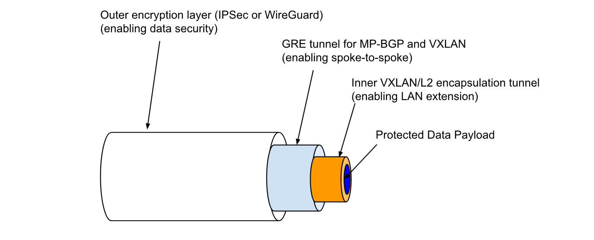
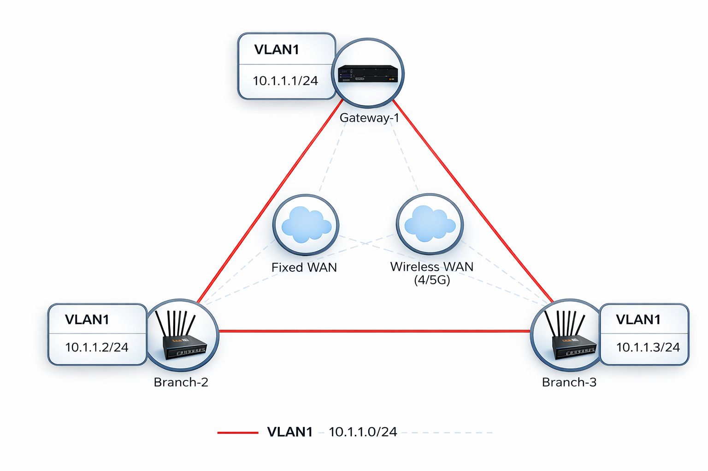
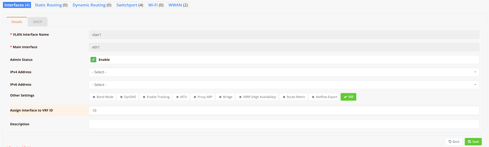
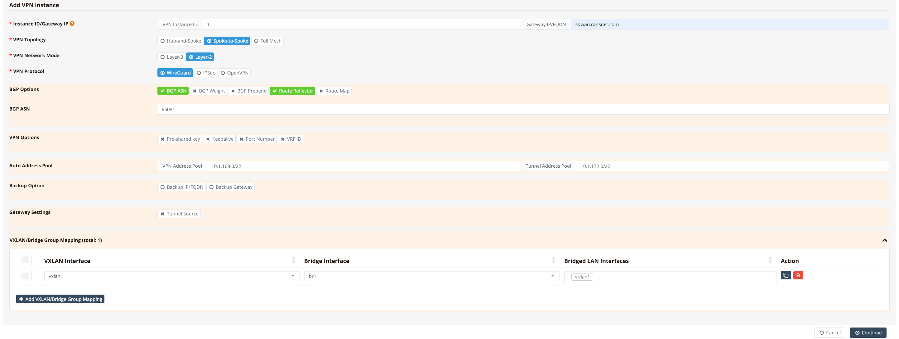
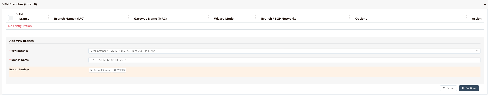

# Layer-2 SD-WAN (L2VPN)

## Overview

For most enterprises with many distributed remote offices or outlets, remote sites are connected back to the HQ or data centre network via Layer-3 IP networks — through the public Internet, 4G/5G, MPLS, or private leased lines. Traditional SD-WAN solutions are optimised for Layer-3 (IP) connectivity. However, some deployments require Layer-2 extension across geographically distributed sites, such as:

- Extending VLANs across branches
- Preserving broadcast-based services (DHCP, mDNS, legacy protocols)
- Supporting VM mobility or live migration across sites
- Supporting industrial automation and OT networks that do not support TCP/IP routing

"L2 over SD-WAN" (also known as "L2VPN over SD-WAN" or "Ethernet VPN") addresses these requirements by encapsulating Ethernet frames inside **VXLAN** tunnels, while using **MP-BGP EVPN** as the control plane to dynamically distribute MAC and VLAN reachability information across sites. It also creates traffic isolation and enhances network security by logically separating WAN and LAN traffic — WAN links use the default routing table (underlay) to establish tunnel connectivity, while LAN devices communicate through a private VLAN segment that is isolated from external reachability (similar to "VRF over SD-WAN" but operating at Layer 2).

Common use cases for "L2 over SD-WAN" include:

- Factory automation and OT (Operational Technology) networks
- IoT or retail chains with centralised services
- Maritime and transportation systems
- VM or container mobility across data centres or sites

Additionally, L2VPN simplifies large distributed deployments in several ways:

- **No per-site address planning** — unlike Layer-3 SD-WAN, there is no need to allocate subnets or manage routing per location. All sites share the same Layer-2 broadcast domain.
- **Seamless device roaming** — branch routers are transparent to LAN devices (acting as L2 switches in the data path). No IP reconfiguration is needed when devices move between sites or when hardware is swapped.
- **Centralised firewall and policy** — all LAN devices use the central gateway as their default gateway, enabling centralised inter-VLAN routing, firewall enforcement, and traffic inspection at the hub.
- **Reduced attack surface** — branch routers have no routable IP exposed to internal LAN networks, making them invisible to network scanners and harder to exploit.

**Key Technologies**

| Layer | Technology | Role |
|---|---|---|
| **Data plane encapsulation** | Multipoint VXLAN | Encapsulates Ethernet frames (including broadcast and multicast) for transport across the IP underlay |
| **Control plane** | MP-BGP EVPN | Distributes MAC/IP binding (type-2) and BUM replication (type-3) routes between VTEPs; eliminates flood-and-learn |
| **Underlay encryption** | WireGuard or IPSec | Encrypts the outer IP tunnel between VXLAN Tunnel Endpoints (VTEPs) |

Below is an illustration of how the various layers fit together.



---

## Configuration on Gateway

Most configuration is performed on the gateway via mfusion. The resulting configuration is automatically compiled and pushed to assigned branch routers.

We will use this topology to walk through the configuration guide. 



In this scenario:

- The **system default routing table (underlay)** is used to establish L2VPN tunnels over available WAN links. Configure WAN failover between links if redundancy is required.
- The **VPN tunnel interface (VXLAN) is bridged to the LAN interface**, establishing a flat Layer-2 network — a single broadcast domain — across all locations.
- Both **hub-and-spoke** (branch ↔ gateway) and **spoke-to-spoke** (branch ↔ branch) access patterns are supported, selectable per VPN instance.

### Step 1 — Configure LAN Interfaces

On both the gateway and each branch router, configure VLAN 1 as a Layer-2 interface. No IP address is required at this stage — the interface will be bridged into the VXLAN tunnel in the next step.

Navigate to **Device → Interfaces → VLAN** and create VLAN 1 without assigning an IP address.



### Step 2 — Configure SD-WAN VPN Instance

On the gateway, navigate to **SD-WAN → VPN → Add VPN Instance**. Select the VPN topology and encryption protocol according to your requirements.



In this example, we select **Spoke-to-Spoke** topology with **WireGuard** as the encryption protocol. Spoke-to-spoke permits Layer-2 traffic directly between branch VTEPs, but the broadcast domain size is constrained by broadcast storm control limits. For most deployments where branches do not need to communicate directly, **Hub-and-Spoke** topology with **IPSec** is the common choice.

Save and Apply Config.

After the configuration is pushed, a `br1` and `vxlan1` interface are automatically created on the gateway.

!!! tip
    For testing and verification, you can assign an IP address to the `br1` interface so you can ping routers directly over the bridge interface to validate LAN-to-LAN reachability. In production deployments, this is not required — LAN devices only need to be in the same subnet, and they will communicate directly as if attached to a large virtual Layer-2 switch.

### Step 3 — Assign Branch Routers

Scroll down in the gateway VPN instance configuration, go to **VPN Branches → Add VPN Branch**, and select the branch routers to include in the VPN instance.



mfusion compiles and pushes the bridge, VXLAN, WireGuard, and BGP EVPN configuration to each branch automatically. Branch routers receive their VTEP address, tunnel endpoint configuration, and the gateway's overlay IP as the iBGP route-reflector peer. No manual CLI configuration is required on branch devices.

### CLI Reference (WireGuard)

!!! note
    CLI configuration for SD-WAN is complex and generated automatically by mfusion. It is strongly recommended to use mfusion for all SD-WAN orchestration. The CLI snippets below are provided for reference and troubleshooting only (spoke-to-spoke setup, generated by mfusion).

```
!
interface eth0
 description "Default connection to WAN"
 enable
 ip address dhcp
!
interface gre1
 tunnel local 10.1.168.1
 enable
 ip address 10.1.172.1/22
 ip neigh 10.1.172.2 10.1.168.2
 ip neigh 10.1.172.3 10.1.168.3
!
interface vxlan1
 vx-local 10.1.172.1
 enable
 bridge-group 1
!
interface wg1
 enable
 ip address 10.1.168.1/32
 wg-peer b0-bb-8b-00-e7-a8
  remote-net 10.1.168.2/32
 wg-peer b0-bb-8b-00-ea-20
  remote-net 10.1.168.3/32
!
interface vlan 1 1
 enable
 bridge-group 1
!
interface bridge br1
 description "Auto Interface from IPSec VPN (1)"
 enable
 ip address 10.1.1.1/24
!
router bgp 65051
 bgp timer 5 15
 neighbor 0168_RansNet_SSL2WG_1 as-peer
 neighbor 0168_RansNet_SSL2WG_1 as-remote 65051
 neighbor 0168_RansNet_SSL2WG_1 next-hop-self
 neighbor 0168_RansNet_SSL2WG_1 route-reflector-client
 neighbor 0168_RansNet_SSL2WG_1 soft-reconfiguration
 neighbor 0168_RansNet_SSL2WG_1 weight 0
 neighbor range 10.1.172.0/22 as-peer 0168_RansNet_SSL2WG_1
 address-family-l2vpn
  advertise-all-vni
  neighbor 0168_RansNet_SSL2WG_1 activate
  neighbor 0168_RansNet_SSL2WG_1 route-reflector-client
  neighbor 0168_RansNet_SSL2WG_1 soft-reconfiguration
!
```

---

## Configuration on Branch Routers

### GUI Configuration

On each branch router, configure VLAN 1 as a Layer-2 interface (Step 1 above). All other SD-WAN configuration — VXLAN VTEP, WireGuard tunnel, and BGP EVPN peering — is automatically generated from the gateway VPN instance and pushed to branch routers by mfusion. No further manual configuration is required on branch devices.

### CLI Reference (WireGuard)

```
interface eth0
 description "Connection to WAN"
 enable
 ip address dhcp
!
interface gre1
 tunnel local 10.1.168.2 remote 10.1.168.1
 enable
 ip address 10.1.172.2/22
!
interface vxlan1
 vx-local 10.1.172.2
 enable
 bridge-group 1
!
interface wg1
 enable
 ip address 10.1.168.2/32
 wg-peer 00-60-e0-a3-59-f7
  remote-ip sdwan.ransnet.com
  remote-net 10.1.168.1/32
!
interface vlan 1 1
 description "Default VLAN for all LAN ports"
 enable
 bridge-group 1
!
interface bridge br1
 description "Auto Interface from IPSec VPN (1)"
 bridge
 enable
 ip address 10.1.1.2/24
!
router bgp 65051
 bgp timer 5 15
 neighbor 0168_RansNet_SSL2WG_1 as-peer
 neighbor 0168_RansNet_SSL2WG_1 as-remote 65051
 neighbor 0168_RansNet_SSL2WG_1 next-hop-self
 neighbor 0168_RansNet_SSL2WG_1 soft-reconfiguration
 neighbor 0168_RansNet_SSL2WG_1 weight 0
 neighbor 10.1.172.1 as-peer 0168_RansNet_SSL2WG_1
 address-family-l2vpn
  advertise-all-vni
  neighbor 0168_RansNet_SSL2WG_1 activate
  neighbor 0168_RansNet_SSL2WG_1 route-reflector-client
  neighbor 0168_RansNet_SSL2WG_1 soft-reconfiguration
!

```

---

## Verification

### Gateway Verification

**Check bridge members:**

```
show interface bridge
```

Verify that both `vxlan1` and `vlan 1` appear as members of `br1`. This confirms the VTEP and LAN segment are correctly bridged.

**Check BGP EVPN peer state:**

```
Gateway-1# show ip bgp summary

IPv4 Unicast Summary (VRF default):
BGP router identifier 10.18.18.194, local AS number 65051 vrf-id 0
BGP table version 0
RIB entries 0, using 0 bytes of memory
Peers 2, using 1448 KiB of memory
Peer groups 1, using 64 bytes of memory

Neighbor        V         AS   MsgRcvd   MsgSent   TblVer  InQ OutQ  Up/Down State/PfxRcd   PfxSnt Desc
*10.1.172.2     4      65051      2845      2845        0    0    0 03:55:55            0        0 N/A
*10.1.172.3     4      65051       536       536        0    0    0 00:43:52            0        0 N/A

Total number of neighbors 2
* - dynamic neighbor
2 dynamic neighbor(s), limit 2000
Gateway-1#
```

All branch overlay IPs (`10.1.172.2`, `10.1.172.3`) should show an established iBGP session. The gateway acts as the BGP route-reflector, redistributing EVPN routes between all VTEPs.

**Check EVPN MAC/VLAN routes:**

```
Gateway-1# show bgp l2vpn
BGP table version is 58, local router ID is 10.18.18.194
Status codes: s suppressed, d damped, h history, * valid, > best, i - internal
Origin codes: i - IGP, e - EGP, ? - incomplete
EVPN type-1 prefix: [1]:[EthTag]:[ESI]:[IPlen]:[VTEP-IP]:[Frag-id]
EVPN type-2 prefix: [2]:[EthTag]:[MAClen]:[MAC]:[IPlen]:[IP]
EVPN type-3 prefix: [3]:[EthTag]:[IPlen]:[OrigIP]
EVPN type-4 prefix: [4]:[ESI]:[IPlen]:[OrigIP]
EVPN type-5 prefix: [5]:[EthTag]:[IPlen]:[IP]

   Network          Next Hop            Metric LocPrf Weight Path
Route Distinguisher: 10.18.18.169:2
*>i[2]:[0]:[48]:[00:40:9d:23:e9:cb]
                    10.1.172.2                    100      0 i
                    RT:65051:1 ET:8
*>i[2]:[0]:[48]:[00:90:0b:44:a6:73]
                    10.1.172.2                    100      0 i
                    RT:65051:1 ET:8
*>i[2]:[0]:[48]:[30:65:ec:6a:e7:55]
                    10.1.172.2                    100      0 i
                    RT:65051:1 ET:8
*>i[2]:[0]:[48]:[88:dc:96:87:3a:e2]
                    10.1.172.2                    100      0 i
                    RT:65051:1 ET:8
*>i[2]:[0]:[48]:[88:dc:96:87:3a:f6]
                    10.1.172.2                    100      0 i
                    RT:65051:1 ET:8
*>i[3]:[0]:[32]:[10.1.172.2]
                    10.1.172.2                    100      0 i
                    RT:65051:1 ET:8
Route Distinguisher: 10.18.18.194:2
*> [3]:[0]:[32]:[10.1.172.1]
                    10.1.172.1                         32768 i
                    ET:8 RT:65051:1
Route Distinguisher: 10.18.18.251:2
*>i[3]:[0]:[32]:[10.1.172.3]
                    10.1.172.3                    100      0 i
                    RT:65051:1 ET:8

Displayed 8 out of 8 total prefixes
Gateway-1#
```

EVPN **type-2** routes (`[2]`) carry MAC/IP bindings learned from each branch VTEP — confirming that remote MAC addresses are distributed via the control plane rather than flood-and-learn. EVPN **type-3** routes (`[3]`) are Inclusive Multicast Ethernet Tag (IMET) routes, advertising each VTEP's endpoint for BUM (Broadcast, Unknown-unicast, Multicast) traffic replication.

**Test end-to-end Layer-2 reachability:**

```
Gateway-1# ping 10.1.1.2 source 10.1.1.1
PING 10.1.1.2 (10.1.1.2) from 10.1.1.1 : 56(84) bytes of data.
64 bytes from 10.1.1.2: icmp_seq=1 ttl=64 time=1.36 ms
64 bytes from 10.1.1.2: icmp_seq=2 ttl=64 time=1.26 ms
64 bytes from 10.1.1.2: icmp_seq=3 ttl=64 time=1.21 ms
64 bytes from 10.1.1.2: icmp_seq=4 ttl=64 time=1.17 ms
64 bytes from 10.1.1.2: icmp_seq=5 ttl=64 time=1.26 ms

--- 10.1.1.2 ping statistics ---
5 packets transmitted, 5 received, 0% packet loss, time 4006ms
rtt min/avg/max/mdev = 1.168/1.251/1.362/0.065 ms
Gateway-1# ping 10.1.1.3 source 10.1.1.1
PING 10.1.1.3 (10.1.1.3) from 10.1.1.1 : 56(84) bytes of data.
64 bytes from 10.1.1.3: icmp_seq=1 ttl=64 time=1.35 ms
64 bytes from 10.1.1.3: icmp_seq=2 ttl=64 time=1.13 ms
64 bytes from 10.1.1.3: icmp_seq=3 ttl=64 time=1.19 ms
64 bytes from 10.1.1.3: icmp_seq=4 ttl=64 time=1.29 ms
64 bytes from 10.1.1.3: icmp_seq=5 ttl=64 time=1.15 ms

--- 10.1.1.3 ping statistics ---
5 packets transmitted, 5 received, 0% packet loss, time 4006ms
rtt min/avg/max/mdev = 1.125/1.222/1.351/0.086 ms
```

Because all sites share the same Layer-2 segment, ARP resolution is transparent across the VXLAN overlay. The ARP table on the gateway bridge confirms MAC addresses learned from remote branches:

```
Gateway-1# show arp
Address                  HWtype  HWaddress           Flags Mask            Iface
10.1.1.2                 ether   1e:cc:8b:49:fb:e7   C                     br1
10.1.1.3                 ether   4a:e4:80:5f:64:4f   C                     br1
Gateway-1#
```

### Branch Routers Verification

**Check BGP EVPN peer state (Branch-2):**

```
Branch-2# show ip bgp summary

IPv4 Unicast Summary (VRF default):
BGP router identifier 10.18.18.169, local AS number 65051 vrf-id 0
BGP table version 0
RIB entries 0, using 0 bytes of memory
Peers 1, using 712 KiB of memory
Peer groups 1, using 32 bytes of memory

Neighbor        V         AS   MsgRcvd   MsgSent   TblVer  InQ OutQ  Up/Down State/PfxRcd   PfxSnt Desc
10.1.172.1      4      65051      2972      2972        0    0    0 04:06:26            0        0 N/A

Total number of neighbors 1
Branch-2#
```

Branch routers peer only with the gateway (route-reflector). The single iBGP session to `10.1.172.1` carries all EVPN routes for the VPN instance.

**Check EVPN routes (Branch-2):**

```
Branch-2# show bgp l2vpn
BGP table version is 58, local router ID is 10.18.18.169
Status codes: s suppressed, d damped, h history, * valid, > best, i - internal
Origin codes: i - IGP, e - EGP, ? - incomplete
EVPN type-1 prefix: [1]:[EthTag]:[ESI]:[IPlen]:[VTEP-IP]:[Frag-id]
EVPN type-2 prefix: [2]:[EthTag]:[MAClen]:[MAC]:[IPlen]:[IP]
EVPN type-3 prefix: [3]:[EthTag]:[IPlen]:[OrigIP]
EVPN type-4 prefix: [4]:[ESI]:[IPlen]:[OrigIP]
EVPN type-5 prefix: [5]:[EthTag]:[IPlen]:[IP]

   Network          Next Hop            Metric LocPrf Weight Path
Route Distinguisher: 10.18.18.169:2
*> [2]:[0]:[48]:[00:40:9d:23:e9:cb]
                    10.1.172.2                         32768 i
                    ET:8 RT:65051:1
*> [2]:[0]:[48]:[00:90:0b:44:a6:73]
                    10.1.172.2                         32768 i
                    ET:8 RT:65051:1
*> [2]:[0]:[48]:[30:65:ec:6a:e7:55]
                    10.1.172.2                         32768 i
                    ET:8 RT:65051:1
*> [2]:[0]:[48]:[88:dc:96:87:3a:e2]
                    10.1.172.2                         32768 i
                    ET:8 RT:65051:1
*> [2]:[0]:[48]:[88:dc:96:87:3a:f6]
                    10.1.172.2                         32768 i
                    ET:8 RT:65051:1
*> [3]:[0]:[32]:[10.1.172.2]
                    10.1.172.2                         32768 i
                    ET:8 RT:65051:1
Route Distinguisher: 10.18.18.194:2
*>i[3]:[0]:[32]:[10.1.172.1]
                    10.1.172.1                    100      0 i
                    RT:65051:1 ET:8
Route Distinguisher: 10.18.18.251:2
*>i[3]:[0]:[32]:[10.1.172.3]
                    10.1.172.3               0    100      0 i
                    RT:65051:1 ET:8

Displayed 8 out of 8 total prefixes
Branch-2#
```

**Test end-to-end connectivity (Branch-2):**

```
Branch-2# ping 10.1.1.1 source 10.1.1.2
PING 10.1.1.1 (10.1.1.1) from 10.1.1.2: 56 data bytes
64 bytes from 10.1.1.1: seq=0 ttl=64 time=1.486 ms
64 bytes from 10.1.1.1: seq=1 ttl=64 time=1.466 ms
64 bytes from 10.1.1.1: seq=2 ttl=64 time=1.300 ms
64 bytes from 10.1.1.1: seq=3 ttl=64 time=1.451 ms
64 bytes from 10.1.1.1: seq=4 ttl=64 time=1.314 ms

--- 10.1.1.1 ping statistics ---
5 packets transmitted, 5 packets received, 0% packet loss
round-trip min/avg/max = 1.300/1.403/1.486 ms
Branch-2# ping 10.1.1.3 source 10.1.1.2
PING 10.1.1.3 (10.1.1.3) from 10.1.1.2: 56 data bytes
64 bytes from 10.1.1.3: seq=0 ttl=64 time=2.813 ms
64 bytes from 10.1.1.3: seq=1 ttl=64 time=2.249 ms
64 bytes from 10.1.1.3: seq=2 ttl=64 time=2.587 ms
64 bytes from 10.1.1.3: seq=3 ttl=64 time=2.234 ms
64 bytes from 10.1.1.3: seq=4 ttl=64 time=2.479 ms

--- 10.1.1.3 ping statistics ---
5 packets transmitted, 5 packets received, 0% packet loss
round-trip min/avg/max = 2.234/2.472/2.813 ms
Branch-2# show arp
IP address       HW type     Flags       HW address            Mask     Device
10.1.1.1         0x1         0x2         7a:09:1e:a3:d1:a0     *        br-br1
10.1.1.3         0x1         0x2         4a:e4:80:5f:64:4f     *        br-br1
Branch-2#
```

---

## Alternative: IPSec Encryption

Some deployments require IPSec as the encryption protocol for regulatory compliance. Select **IPSec** as the VPN protocol in Step 2; mfusion will automatically generate IPSec IKE/ESP policies and peer configuration in place of WireGuard.

#### Gateway CLI Reference

```
!
interface eth0
 description "Default connection to WAN"
 enable
 ip address dhcp
!
interface gre1
 tunnel local 10.1.168.1
 enable
 ip address 10.1.172.1/22
 ip map 10.1.172.2 10.1.168.2
 ip map 10.1.172.3 10.1.168.3
!
interface lo
 enable
 ip address 10.1.168.1/32
!
interface vxlan1
 description "Auto Interface from VPN (1)"
 vx-local 10.1.172.1
 enable
 bridge-group 1
!
interface vlan 1 1
 enable
 bridge-group 1
!
interface bridge br1
 description "Auto Interface from IPSec VPN (1)"
 enable
!
ipsec ike-policy 1
 authentication psk
 policy AES SHA 5
!
ipsec esp-policy 1
 policy AES SHA 5
!
ipsec peer b0-bb-8b-00-e7-a8
 local-net 10.1.168.1/32
 remote-id b0-bb-8b-00-e7-a8
 remote-ip any
 remote-net 10.1.168.2/32
 policy ike 1 esp 1
 psk xxx
!
ipsec peer b0-bb-8b-00-ea-20
 local-net 10.1.168.1/32
 remote-id b0-bb-8b-00-ea-20
 remote-ip any
 remote-net 10.1.168.3/32
 policy ike 1 esp 1
 psk xxx
!
router bgp 65051
 bgp timer 5 15
 neighbor 0168_RansNet_SSL2IPSEC_1 as-peer
 neighbor 0168_RansNet_SSL2IPSEC_1 as-remote 65051
 neighbor 0168_RansNet_SSL2IPSEC_1 next-hop-self
 neighbor 0168_RansNet_SSL2IPSEC_1 route-reflector-client
 neighbor 0168_RansNet_SSL2IPSEC_1 soft-reconfiguration
 neighbor 0168_RansNet_SSL2IPSEC_1 weight 0
 neighbor range 10.1.172.0/22 as-peer 0168_RansNet_SSL2IPSEC_1
 address-family-l2vpn
  advertise-all-vni
  neighbor 0168_RansNet_SSL2IPSEC_1 activate
  neighbor 0168_RansNet_SSL2IPSEC_1 route-reflector-client
  neighbor 0168_RansNet_SSL2IPSEC_1 soft-reconfiguration
!
```

#### Branch CLI Reference

```
!
interface gre1
 tunnel local 10.1.168.2 remote 10.1.168.1
 enable
 ip address 10.1.172.2/22
!
interface lo
 enable
 ip address 10.1.168.2/32
!
interface vxlan1
 description "Auto Interface from VPN (1)"
 vx-local 10.1.172.2
 enable
 bridge-group 1
!
interface vlan 1 1
 description "Default VLAN for all LAN ports"
 enable
 bridge-group 1
!
interface bridge br1
 description "Auto Interface from IPSec VPN (1)"
 bridge
 enable
!
ipsec ike-policy 1
 authentication psk
 policy AES SHA 5
!
ipsec esp-policy 1
 policy AES SHA 5
!
ipsec peer 10.18.18.194
 local-id b0-bb-8b-00-e7-a8
 local-net 10.1.168.2/32
 remote-net 10.1.168.1/32
 policy ike 1 esp 1
 psk xxx
!
router bgp 65051
 bgp timer 5 15
 neighbor 0168_RansNet_SSL2IPSEC_1 as-peer
 neighbor 0168_RansNet_SSL2IPSEC_1 as-remote 65051
 neighbor 0168_RansNet_SSL2IPSEC_1 next-hop-self
 neighbor 0168_RansNet_SSL2IPSEC_1 soft-reconfiguration
 neighbor 0168_RansNet_SSL2IPSEC_1 weight 0
 neighbor 10.1.172.1 as-peer 0168_RansNet_SSL2IPSEC_1
 address-family-l2vpn
  advertise-all-vni
  neighbor 0168_RansNet_SSL2IPSEC_1 activate
  neighbor 0168_RansNet_SSL2IPSEC_1 route-reflector-client
  neighbor 0168_RansNet_SSL2IPSEC_1 soft-reconfiguration

```
