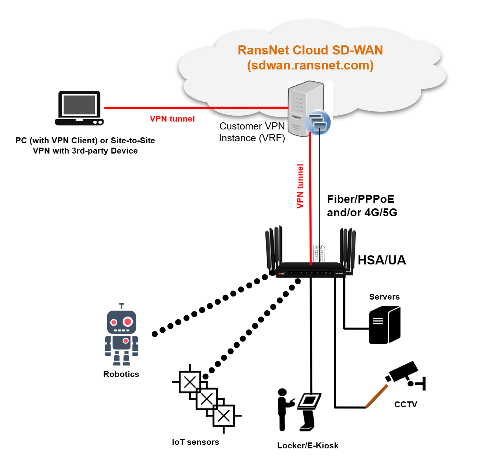

# On-premise SD-WAN

Typical SD-WAN deployment architecture is cloud sd-wan and on-premise sd-wan. Continue to explain what they are, their differences, how they are setup, and the typical deployment scenarios etc.

On-premise SD-WAN requires a static IP connection at the head-end (eg. HQ office or DC), typically through a fiber network. The remote can be any form of connection, eg. static, dynamic, cellular (4G/5G). This is typical when there's compliance requirements (isolate network), and the applications are hosted at HQ or DC.

Cloud SD-WAN simplies the client setup, by hosting SD-WAN gateway at RansNet DC. Since client sites do not require any static IP for the gateway/head-end, and all the sites will tunnel to RansNet hosted SD-WAN gateway, where each customer is allocated into a dedicated VRF for complete traffic and routing seperation.

!!! tip
    Some services providers may use RansNet SD-WAN solutions to provide cloud sd-wan services to their end customers also.

Cloud SD-WAN is provided on a subscription basis. On top of having RansNet SD-Branch routers at each location, customer subsribe to a sd-wan service to tunnel each branch router to RansNet cloud. this service offers several benefits:

1. no need dedicated on-premise SD-WAN gateway at customer premise (hence no need fiber connection)
2. no static IP for branch sites (can be 4/5G do dynamic broadband)
3. secure and easy remote connectity to any of the branch network
4. RansNet provides a static IP from outside into customer internal devices through port forwarding or peering with 3rd-party networks.

Solution components

• Install an HSA/UA/CMG at each customer premise/location
• Subscribe to ISP Internet over 4G/5G (UA) or Fiber
• Subscribe to RansNet cloud SD-WAN service

Solution features

• Each customer is provisioned with private VPN instance on RansNet
• Each UA/HSA establishes a VPN tunnel to RansNet cloud SD-WAN

Remote access options 

• User device (PC or mobile) installs software VPN client and tunnels to the same private VPN instance to access internal device IP directly
• OR, RansNet SD-WAN will do port forwarding to private devices. User will access via https://sdwan.ransnet.com:xxx (xxx is the port mapped to each device)
• OR, Site-to-Site VPN tunnel with 3rd-party VPN gateway through RansNet cloud static IP address

Solution benefits

• Support all WAN connection type (broadband, 4G or 5G)
• Support all WAN IP address types (dynamic/static/private/public)
• Secure access from anywhere.

