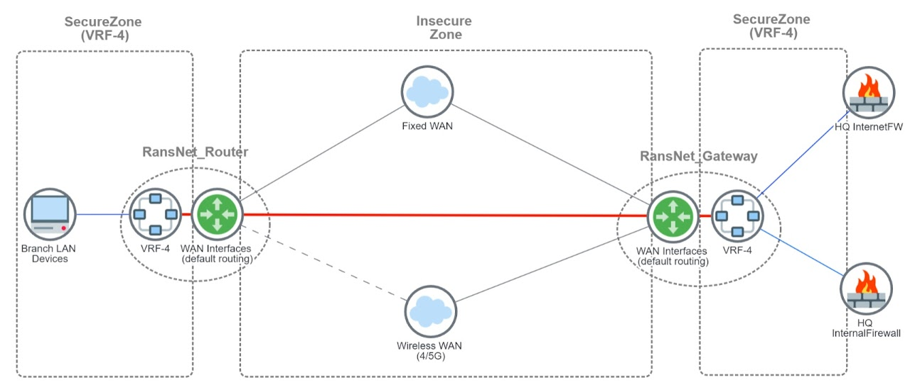
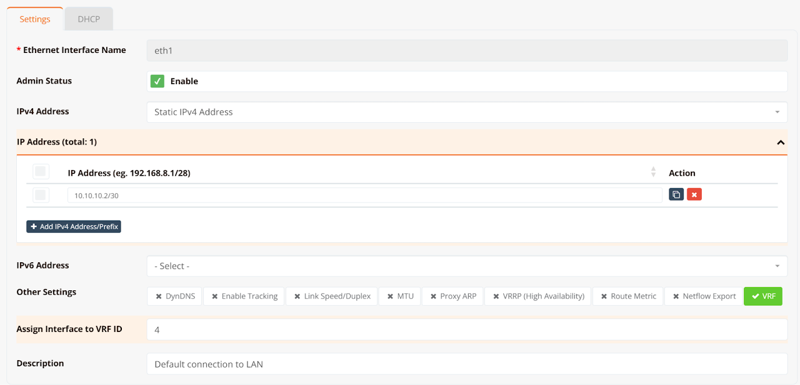
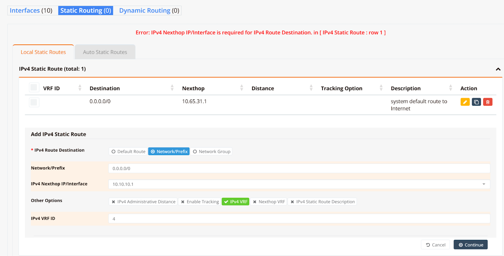
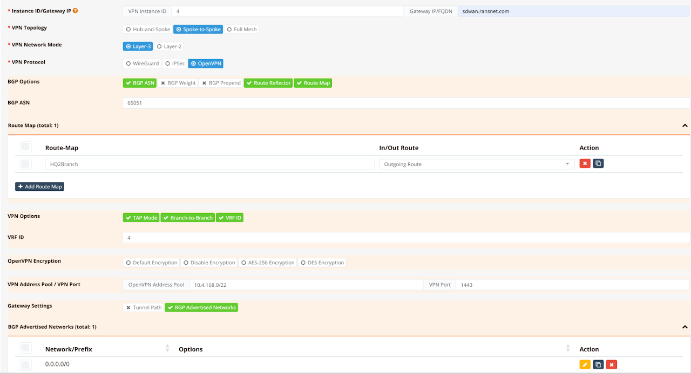
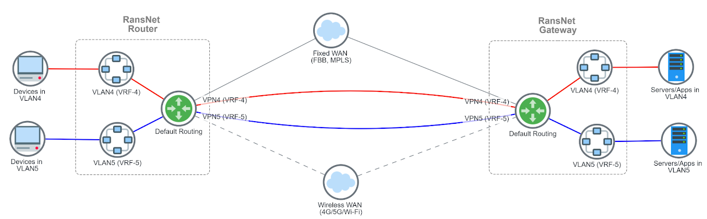

# VRF over SD-WAN

## Overview

In certain SD-WAN deployments, branch networks are required to backhaul all traffic to a centralised firewall located at the headquarters or data centre for centralised security inspection and policy enforcement. RansNet routers support this model through **VRF over SD-WAN** — establishing VPN tunnels using the system default routing table (transport VRF), while running a dedicated routing domain (service VRF) over the SD-WAN overlay to carry internal LAN traffic end-to-end.

This architecture provides several advantages over a traditional full-mesh or split-tunnel SD-WAN deployment:

- **Simplified WAN failover** — VPN tunnel connectivity uses the system default routing table; WAN link redundancy is handled independently of the service VRF, so branch failover configuration is uniform regardless of how many VRFs are in use.
- **Full traffic backhaul** — all branch LAN traffic is routed through the SD-WAN overlay to the gateway, where centralised firewall policies, NAC, and inspection are applied. Branches have no direct Internet breakout by default.
- **Network segmentation** — internal networks can be further separated by assigning different VLANs to distinct service VRFs, each mapped to its own SD-WAN VPN instance, achieving end-to-end traffic isolation between network segments.
- **Multi-tenant SD-WAN** — service providers can share a single CMG gateway among multiple customers by assigning each customer to a unique service VRF, maintaining full routing isolation between tenants.

!!! note
    For smaller deployments requiring Layer-2 transparency rather than routed backhaul, see [Layer-2 SD-WAN (L2VPN)](l2vpn.md) as an alternative.

---

## Topology



The following design principles apply to this topology:

- Both the gateway and branch routers use the **system default routing table (transport VRF)** to establish VPN tunnels. Configure WAN link failover independently if redundant uplinks are available (refer to WAN Failover options).
- The **SD-WAN VPN tunnel interface and LAN interfaces** (on both gateway and branch routers) are assigned into a dedicated **service VRF** (e.g. VRF-4, matching the VPN instance ID). All internal routing occurs within this VRF.
- The gateway runs an **iBGP instance within the service VRF** and advertises a default route (`0.0.0.0/0`) to all branch routers. Each branch router advertises its local LAN prefix(es) back to the gateway (default-route-only advertisement pattern).
- Branch LAN traffic is forwarded through the VPN tunnel to the gateway using the BGP-learned default route, achieving full-tunnel backhaul for centralised policy enforcement.
- **Route leaking** between the service VRF and the default VRF is optional and required only if branch traffic needs Internet breakout via the gateway, or local breakout (split tunneling, route leaking on branch router).

---

## Configuration on Gateway

Most configuration is performed on the gateway via mfusion. The resulting configuration is automatically compiled and pushed to assigned branch routers.

!!! note
    - Add a route-map (with a prefix-list) on the VPN instance to filter outbound BGP advertisements to branches — advertise only `0.0.0.0/0` so branches do not receive each other's routes unnecessarily (prevents unintended spoke-to-spoke routing).
    - To allow the service VRF to reach additional networks (e.g. a downstream firewall), assign the connected interface to the same VRF and add a static default route pointing to that firewall within the service VRF.
    - Route leaking is only required if service VRF traffic needs to break out to the Internet via the gateway's default routing table. See [Route Leaking (Optional)](#route-leaking-optional) below.

### Step 1 — Configure LAN Interfaces

On both the gateway and each branch router, assign the LAN interface to the service VRF and configure the IP address.

Navigate to **Device → Network → Interfaces**, click the target LAN interface, configure the IP settings, and assign the VRF ID.



### Step 2 — Configure Default Route for the Service VRF

On the gateway, add a static default route within the service VRF pointing to the upstream firewall or next-hop.

Navigate to **Device → Network → Static Routing** and configure the default route for the target VRF.



### Step 3 — Configure Route Policy (Optional)

This step is required if you want to control which routes are advertised to branch routers. In the typical hub-and-spoke VRF backhaul model, branches should only receive the default route from the gateway — not each other's LAN prefixes.

Create a prefix-list permitting only `0.0.0.0/0`, then attach it to a route-map to be applied outbound on the BGP neighbour group.

### Step 4 — Add VPN Instance and Assign Branch Routers

Navigate to **Device → SD-WAN → VPN → Add VPN Instance**. Define the VPN parameters, assign the VPN instance to the service VRF, and optionally attach the route-map from Step 3.

Scroll down to **VPN Branches → Add VPN Branch** and assign the branch routers. Save and Apply Config.

mfusion compiles and pushes the VPN, VRF, and BGP configuration to all assigned branch routers automatically.



#### CLI Reference (Gateway)

!!! note
    CLI configuration for SD-WAN is complex and generated automatically by mfusion. Use mfusion for all SD-WAN orchestration. The CLI snippets below are for reference and expert troubleshooting only.

```
!
interface eth1 vrf 4
 description "Interface connection to firewall"
 ip address 10.10.10.2/30
!
ip route 0.0.0.0/0 nexthop 10.65.31.1 remark "system default route to Internet"
ip route 0.0.0.0/0 nexthop 10.10.10.1 vrf 4 remark "VRF-4 default route to firewall"
!
router bgp 65051 vrf 4
 bgp timer 5 15
 neighbor 0168_RansNet_SSL3OPENVPN_4 as-peer
 neighbor 0168_RansNet_SSL3OPENVPN_4 as-remote 65051
 neighbor 0168_RansNet_SSL3OPENVPN_4 next-hop-self
 neighbor 0168_RansNet_SSL3OPENVPN_4 route-map HQ2Branch out
 neighbor 0168_RansNet_SSL3OPENVPN_4 route-reflector-client
 neighbor 0168_RansNet_SSL3OPENVPN_4 soft-reconfiguration
 neighbor 0168_RansNet_SSL3OPENVPN_4 weight 0
 neighbor range 10.4.168.0/22 as-peer 0168_RansNet_SSL3OPENVPN_4
 network 0.0.0.0/0
!
ip prefix-list HQ2Branch permit 0.0.0.0/0
!
route-map HQ2Branch permit 10
 match ip address prefix-list HQ2Branch
!
firewall-input 500 permit all tcp dport 179 src 10.0.0.0/8
!
firewall-access 500 permit outbound eth0 remark "Permit out to Internet"
firewall-access 501 permit outbound tap+ remark "Permit SD-WAN traffic"
firewall-access 502 permit inbound tap+ remark "Permit SD-WAN traffic"
!
firewall-snat 500 overload outbound eth0
!
security sslvpn-server 4 vrf 4
 server address sdwan.ransnet.com 1604
 server tap-mode
 encryption AES-256-CBC
 server client-to-client
 tunnel-pool 10.4.168.0/22
 client 00-60-e0-a3-59-f7
 start
```

---

## Configuration on Branch Routers

On each branch router, assign the LAN interface (where internal devices reside) to the service VRF. All other SD-WAN configuration — VPN tunnel, VRF assignment, and BGP peering — is automatically generated from the gateway VPN instance and pushed to branch routers by mfusion.

Navigate to **Device → Network → Interfaces**, click the LAN interface, and assign the same VRF ID as configured on the gateway.

Save and Apply Config.

#### CLI Reference (Branch)

```
!
interface eth1 vrf 4
 description "Default connection to LAN"
 enable
 ip address 192.168.8.1/22
 dhcp-server
  lease-time 86400 86400
  router 192.168.8.1
  dns 8.8.8.8 8.8.4.4
  range 192.168.8.10 192.168.11.254
  enable
!
router bgp 65051 vrf 4
 bgp timer 5 15
 neighbor 0168_RansNet_SSL3OPENVPN_4 as-peer
 neighbor 0168_RansNet_SSL3OPENVPN_4 as-remote 65051
 neighbor 0168_RansNet_SSL3OPENVPN_4 next-hop-self
 neighbor 0168_RansNet_SSL3OPENVPN_4 soft-reconfiguration
 neighbor 0168_RansNet_SSL3OPENVPN_4 weight 0
 neighbor 10.4.168.1 as-peer 0168_RansNet_SSL3OPENVPN_4
 network 192.168.8.1/22
!
firewall-input 500 permit all tcp dport 179 src 10.0.0.0/8
!
firewall-access 500 permit outbound eth0 remark "Permit out to Internet"
firewall-access 501 permit outbound tap+ remark "Permit SD-WAN traffic"
firewall-access 502 permit inbound tap+ remark "Permit SD-WAN traffic"
!
firewall-snat 500 overload outbound eth0
!
security sslvpn-client 4 vrf 4
 start
```

---

## Verification

Run the following commands on the gateway to confirm the VRF over SD-WAN deployment is operating correctly.

**Check BGP peer state within the service VRF:**

```
Gateway# show ip bgp summary
```

All branch overlay IPs should show an established iBGP session within VRF 4. The gateway acts as the BGP route-reflector for the service VRF, redistributing the default route to all branch peers and receiving each branch's LAN prefix in return.

**Check the routing table within the service VRF:**

```
Gateway# show ip route vrf 4
```

Confirm that:

- `0.0.0.0/0` is present as a static route pointing to the upstream firewall or default gateway within VRF 4
- Branch LAN prefixes (e.g. `192.168.8.0/22`) appear as BGP routes (`B`) learned via the VPN tunnel interface (`tap4`)

---

## Route Leaking (Optional)

By default, VRFs are fully isolated — they do not share routes with the default routing table or with other VRFs. If branch traffic needs Internet breakout via the gateway (rather than through a downstream firewall within the service VRF), routes must be **leaked** between the service VRF and the default VRF on the gateway router.

Route leaking requires:

1. A cross-VRF static or dynamic default route in the service VRF pointing to the gateway's default routing table (for outbound traffic)
2. Return path routes in the default routing table pointing back into the service VRF (for inbound return traffic from the Internet)

!!! note
    - Route leaking is only configured on the **gateway router**. Branch routers do not require any route leaking configuration.
    - Configure SNAT (masquerade/PAT) to permit outbound Internet traffic from the service VRF through the gateway's WAN interface.
    - If branch routers generally require local Internet breakout without centralised backhaul, VRF over SD-WAN is not necessary — use standard SD-WAN with selective route advertisement instead.

Two options are available for configuring route leaking:

| | **Option 1 — Static Route Leaking** | **Option 2 — Dynamic Route Import (MP-BGP)** |
|---|---|---|
| **Complexity** | Simple | Moderate |
| **Scalability** | Low — one static route per remote network | High — BGP dynamically imports routes between VRFs |
| **Best for** | Small deployments with few remote sites | Large deployments with many branches |

### Option 1 — Static Route Leaking

Static route leaking is straightforward for small deployments. Cross-VRF static routes use the **VRF ID** (not the interface name) as the nexthop, with `nexthop-vrf` to specify the destination VRF.

!!! note
    - Static route leaking requires a static nexthop for each remote network. As the number of remote sites grows, this becomes operationally expensive to maintain.
    - Use the VRF ID (not the interface name) as the nexthop when leaking between VRFs.

**Example — leak routes between two locally-connected VRFs** (e.g. allow `vlan1` in VRF-1 to reach `vlan2` in VRF-2):

```
ip route 10.2.99.0/24 nexthop 2 vrf 1 nexthop-vrf 2
ip route 10.1.99.0/24 nexthop 1 vrf 2 nexthop-vrf 1
```

#### CLI Reference (Gateway — Static Leaking)

```
!
hostname Gateway
!
interface eth0
 description "Default connection to WAN"
 enable
 ip address 10.65.31.134/24
!
interface lo
 enable
 ip address 2.1.2.1/32
!
interface tap4 vrf 4
 enable
!
ip host portal.ransnet.com 10.65.30.18
!
ip route 0.0.0.0/0 nexthop 10.65.31.1 remark "system default route"
ip route 0.0.0.0/0 nexthop 10.65.31.1 vrf 4 nexthop-vrf default remark "VRF-4 default route via system"
ip route 10.4.168.0/22 nexthop 4 nexthop-vrf 4 remark "return from default VRF to VPN network in VRF-4"
ip route 192.168.8.0/22 nexthop 4 nexthop-vrf 4 remark "return from default VRF to branch LAN in VRF-4"
!
router bgp 65051 vrf 4
 bgp timer 5 15
 neighbor 0168_RansNet_SSL3OPENVPN_4 as-peer
 neighbor 0168_RansNet_SSL3OPENVPN_4 as-remote 65051
 neighbor 0168_RansNet_SSL3OPENVPN_4 next-hop-self
 neighbor 0168_RansNet_SSL3OPENVPN_4 route-map HQ2Branch out
 neighbor 0168_RansNet_SSL3OPENVPN_4 route-reflector-client
 neighbor 0168_RansNet_SSL3OPENVPN_4 soft-reconfiguration
 neighbor 0168_RansNet_SSL3OPENVPN_4 weight 0
 neighbor range 10.4.168.0/22 as-peer 0168_RansNet_SSL3OPENVPN_4
 network 0.0.0.0/0
!
ip prefix-list HQ2Branch permit 0.0.0.0/0
!
route-map HQ2Branch permit 10
 match ip address prefix-list HQ2Branch
!
firewall-input 500 permit all tcp dport 179 src 10.0.0.0/8
!
firewall-access 500 permit outbound eth0 remark "Permit out to Internet"
firewall-access 501 permit inbound tap+ remark "Permit SD-WAN traffic"
!
firewall-snat 500 overload outbound eth0
!
security sslvpn-server 4 vrf 4
 server address sdwan.ransnet.com 1604
 server tap-mode
 encryption AES-256-CBC
 server client-to-client
 tunnel-pool 10.4.168.0/22
 client 00-60-e0-a3-59-f7
  static 10.4.168.10
 start
```

### Option 2 — Dynamic Route Import (MP-BGP)

For large deployments with hundreds or thousands of remote branches, managing static return routes per branch becomes operationally unscalable. The preferred approach is **dynamic VRF route import using MP-BGP** — run a BGP instance in each VRF and use the `import vrf` directive to dynamically import routes from the target VRF into the default routing table.

!!! note
    - MP-BGP route leaking only imports and exports **routes learned via BGP** — it does not automatically import connected or static routes unless those are redistributed into BGP within the source VRF.
    - A route-map filter is strongly recommended to restrict which routes are imported into the default VRF, preventing unintended route pollution. In the example below, only routes matching `192.168.0.0/16` (branch LAN ranges) are imported.
    - Due to the potential operational impact of misconfiguration, this feature is only configurable via CLI.

Configuration involves:

1. A cross-VRF static default route in the service VRF (via the gateway's default routing table) for outbound Internet access
2. A BGP `import vrf` directive in the default VRF BGP instance to dynamically pull branch LAN routes from the service VRF — providing the return path for Internet-bound traffic
3. A route-map to filter which VRF routes are permitted into the default routing table

#### CLI Reference (Gateway — Dynamic Route Import)

```
!
hostname Gateway
!
interface eth0
 description "Default connection to WAN"
 enable
 ip address 10.65.31.134/24
!
interface lo
 enable
 ip address 2.1.2.1/32
!
interface vlan 0 11 vrf 4
 enable
 ip address 10.11.11.1/24
!
interface vlan 0 12 vrf 4
 enable
 ip address 10.12.12.1/24
!
ip route 0.0.0.0/0 nexthop 10.65.31.1 remark "default route to Internet"
ip route 0.0.0.0/0 nexthop 10.65.31.1 vrf 4 nexthop-vrf default "default route to Internet for VRF-4"
!
router bgp 65051
 import vrf 4
 import vrf route-map VRF4_TO_DEFAULT
!
router bgp 65051 vrf 4
 bgp timer 5 15
 neighbor 0168_RansNet_SSL3OPENVPN_4 as-peer
 neighbor 0168_RansNet_SSL3OPENVPN_4 as-remote 65051
 neighbor 0168_RansNet_SSL3OPENVPN_4 next-hop-self
 neighbor 0168_RansNet_SSL3OPENVPN_4 route-map HQ2Branch out
 neighbor 0168_RansNet_SSL3OPENVPN_4 route-reflector-client
 neighbor 0168_RansNet_SSL3OPENVPN_4 soft-reconfiguration
 neighbor 0168_RansNet_SSL3OPENVPN_4 weight 0
 neighbor range 10.4.168.0/22 as-peer 0168_RansNet_SSL3OPENVPN_4
 network 0.0.0.0/0
 network 10.11.11.1/24
 network 10.12.12.1/24
!
ip prefix-list HQ2Branch permit 0.0.0.0/0
ip prefix-list VRF4_TO_DEFAULT permit 192.168.0.0/16 ge 16
!
route-map HQ2Branch permit 10
 match ip address prefix-list HQ2Branch
!
route-map VRF4_TO_DEFAULT permit 10
 match ip address prefix-list VRF4_TO_DEFAULT
!
firewall-input 100 permit all tcp dport 179,22 src 10.0.0.0/8
!
firewall-access 500 permit outbound eth0 remark "Permit out to Internet"
firewall-access 501 permit inbound tap+ remark "Permit SD-WAN traffic"
!
firewall-snat 500 overload outbound eth0 remark "PAT to Internet"
!
security sslvpn-server 4 vrf 4
 server address sdwan.ransnet.com 1604
 server tap-mode
 encryption AES-256-CBC
 server client-to-client
 tunnel-pool 10.4.168.0/22
 client 00-60-e0-a3-59-f7
 client b0-bb-8b-00-e7-a8
 start
```

#### Verification

**Check BGP peer state:**

```
Gateway# show ip bgp summary
% No BGP neighbors found in VRF default

IPv4 Unicast Summary (VRF 4):
BGP router identifier 10.65.31.134, local AS number 65051 vrf-id 7
BGP table version 5
RIB entries 7, using 1344 bytes of memory
Peers 2, using 1448 KiB of memory
Peer groups 1, using 64 bytes of memory

Neighbor        V         AS   MsgRcvd   MsgSent   TblVer  InQ OutQ  Up/Down State/PfxRcd   PfxSnt Desc
*10.4.168.9     4      65051       618       618        0    0    0 00:51:11            1        1 N/A
*10.4.168.10    4      65051       618       618        0    0    0 00:51:13            1        1 N/A

Total number of neighbors 2
* - dynamic neighbor
2 dynamic neighbor(s), limit 2000
Gateway#
```

**Check routing tables across all VRFs:**

```
Gateway# show ip route vrf all
Codes: K - kernel route, C - connected, S - static, R - RIP,
       O - OSPF, I - IS-IS, B - BGP, E - EIGRP, N - NHRP,
       T - Table, v - VNC, V - VNC-Direct, A - Babel, F - PBR,
       f - OpenFabric,
       > - selected route, * - FIB route, q - queued, r - rejected, b - backup
       t - trapped, o - offload failure

VRF 4:
S>* 0.0.0.0/0 [1/0] via 10.65.31.1, eth0 (vrf default), weight 1, 00:52:39
C>* 10.4.168.0/22 is directly connected, tap4, 00:52:14
C>* 10.11.11.0/24 is directly connected, vlan11, 00:52:40
C>* 10.12.12.0/24 is directly connected, vlan12, 00:52:40
B>* 192.168.8.0/22 [200/0] via 10.4.168.10, tap4, weight 1, 00:51:19
B>* 192.168.16.0/22 [200/0] via 10.4.168.9, tap4, weight 1, 00:51:17

VRF default:
S>* 0.0.0.0/0 [1/0] via 10.65.31.1, eth0, weight 1, 00:52:39
C>* 2.1.2.1/32 is directly connected, lo, 00:52:47
K * 10.3.168.0/22 [0/0] via 10.3.168.2, tun3, 00:52:22
C>* 10.3.168.0/22 is directly connected, tun3, 00:52:22
C>* 10.65.31.0/24 is directly connected, eth0, 00:52:47
B>* 192.168.8.0/22 [20/0] via 10.4.168.10, tap4 (vrf 4), weight 1, 00:06:20
B>* 192.168.16.0/22 [20/0] via 10.4.168.9, tap4 (vrf 4), weight 1, 00:06:20
Gateway#
```

Confirm that:

- **VRF 4** contains the cross-VRF default route (`S>* 0.0.0.0/0 via eth0 (vrf default)`) and BGP-learned branch LAN prefixes (`B>*`)
- **VRF default** contains the dynamically imported branch LAN routes (`B>* ... via tap4 (vrf 4)`) — these are the return paths for Internet-bound traffic originating from the service VRF

---

## Multi-VRF SD-WAN

Using the same principles, internal networks can be split into multiple VLANs, with each VLAN assigned to a distinct service VRF and mapped to a separate SD-WAN VPN instance. This achieves full end-to-end traffic isolation between network segments — for example, separating corporate, IoT, and guest traffic across the SD-WAN fabric without any routing between them.


