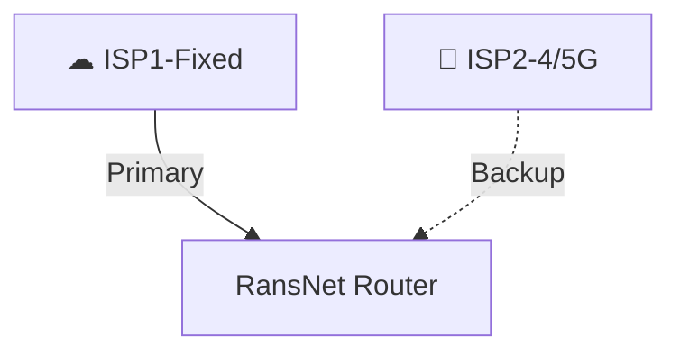
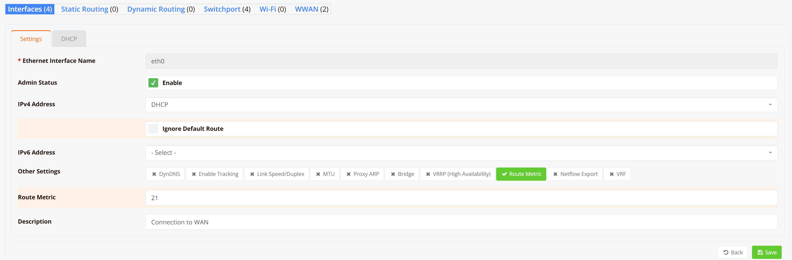
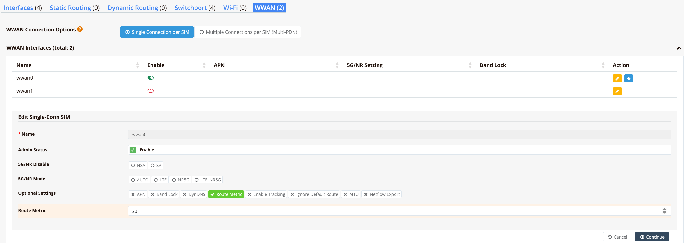
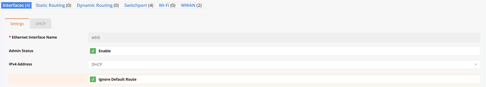
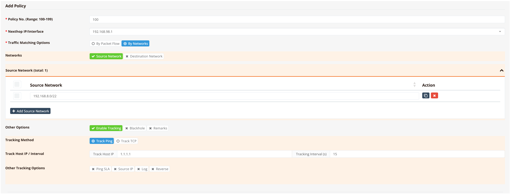

# SD-WAN Failover (WAN Resiliency)

WAN resiliency ensures that network connectivity is maintained when a primary WAN link fails.



RansNet devices support three distinct failover approaches, each with different levels of detection capability and configuration complexity.

| Option | Method | Detects Interface Down | Detects Upstream Failure |
|---|---|---|---|
| **1 — Route Metric** | Kernel default route failover | Yes | No |
| **2 — PBR with Tracking** | Policy-based routing + ICMP probe | Yes | Yes |
| **3 — Multi-WAN (MWAN)** | MWAN engine + ICMP probe | Yes | Yes |

---

## Option 1 — Kernel Default Route Failover

The simplest failover method. Each WAN interface is assigned a **route metric** — the interface with the lowest metric becomes the primary default gateway. When the primary interface goes down, the kernel withdraws its route and traffic shifts automatically to the next lowest metric interface.

**Limitation:** This method only detects physical link failure (interface UP/DOWN). It does not verify upstream reachability — if the WAN port stays physically up but the ISP connection drops, failover will not trigger.

**Failover time:** Typically 2–3 seconds for physical link failure detection.

### GUI Configuration

Below is an example of setting route-metric using GUI.

Navigate to **Device Settings → Network → Interfaces**, select the WAN interface and click on "Route Metric" option to set the desired value.



To set route metric, for WWAN interface, use below option




### CLI Configuration

```
interface eth0
  description "ISP1 - Fixed line"
  enable
  route-metric 21

interface wwan0
  description "ISP2 - LTE backup"
  enable
  route-metric 20
```

In this example, we intentionally set `wwan0` with lower metric (`20`) and is the preferred (primary) path. `eth0` becomes active only if `wwan0` goes down.

!!! note
    Route metrics are assigned automatically based on interface load order at boot. Explicitly setting `route-metric` ensures predictable primary/backup behaviour regardless of boot sequence. By default, eth0 is booted up earlier and will be the primary path over wwan0.

---

## Option 2 — PBR with Upstream Tracking

Policy-Based Routing (PBR) combined with ICMP tracking provides upstream-aware failover. A PBR rule sends traffic from the LAN via a specific WAN gateway, while continuously probing an upstream IP address (e.g., `1.1.1.1`) to verify end-to-end reachability. When the probe fails, the PBR rule is withdrawn and traffic falls back to the secondary WAN interface.

**Advantage over Option 1:** Detects upstream failures (e.g., ISP routing issues) even when the WAN interface remains physically UP.

**Failover time:** Depends on the tracking probe interval and retry count.

### GUI Configuration
Navigate to **Device Settings → Network → Interfaces**, select the WAN interface, use DHCP for and "Ignore Default Route".



Navigate to **Device Settings → SD-WAN → Traffic Steering**, configure new PBR route as per below



You can optionally set ping SLA values for more granular control. For more options and config guide, refer to the [Tracking](../config/tracking.md) section.

### CLI Configuration

```
interface eth0
  description "Connection to WAN"
  enable
  ip address dhcp nodefault

interface wwan0
  enable

interface vlan 1 1
  description "Default VLAN for all LAN ports"
  enable
  ip address 192.168.8.1/22

ip pbr policy 100 src 192.168.8.0/22 remark LAN
ip pbr 100 nexthop 192.168.98.1 track icmp 1.1.1.1 15

firewall-access 100 permit outbound eth0
firewall-access 101 permit outbound wwan+
firewall-snat 100 overload outbound eth0
firewall-snat 101 overload outbound wwan+
```

**Key points:**

- `ip address dhcp nodefault` — obtain IP from DHCP but do not install the ISP-assigned default route. The PBR rule handles routing instead.
- `ip pbr 100 nexthop 192.168.98.1` — the PBR nexthop must be the **WAN gateway IP** of the primary interface, not the WAN IP itself.
- `track icmp 1.1.1.1 15` — probe `1.1.1.1` every 15 seconds. If the probe fails, the PBR rule is deactivated and traffic falls through to `wwan0`.
- `wwan+` in firewall rules is a wildcard matching all WWAN interfaces (`wwan0`, `wwan1`).

---

## Option 3 — Multi-WAN (MWAN)

Multi-WAN is the most capable and flexible option. It supports both **active/standby** (failover) and **active/active** (load balancing) configurations. Each WAN interface independently tracks upstream reachability via ICMP probes. Routing decisions are made based on per-interface **metric** and **weight** values, and traffic is distributed across healthy interfaces according to those parameters.

**Advantages over Options 1 and 2:**
- Upstream-aware failover per interface
- Active/active load balancing with configurable traffic weighting
- Supports multiple WAN links simultaneously

**Failover time:** Configurable via tracking timer and retry count (e.g., `timer 5 5` = probe every 5 seconds, fail after 5 consecutive missed probes = ~25 seconds).

### CLI Configuration

#### Active/Standby (Failover)

```
interface eth0
  description "ISP1 connection via fixed line"
  enable
  ip address dhcp
  mwan-group 99
  track 8.8.8.8 timer 5 5
  metric 1
  weight 1

interface wwan0
  description "ISP2 connection via LTE"
  enable
  mwan-group 99
  track 8.8.4.4 timer 10 10
  metric 2
  weight 1

mwan-rule 99 ip dst 0.0.0.0/0 group 99
```

Both interfaces belong to `mwan-group 99`. `eth0` has metric `1` (primary) and `wwan0` has metric `2` (standby). Traffic flows through `eth0` as long as its probe to `8.8.8.8` succeeds. On probe failure, MWAN routes traffic through `wwan0`.

#### Active/Active (Load Balancing)

To balance traffic across both links simultaneously, set equal metrics and adjust weights to control the traffic ratio:

```
interface eth0
  description "ISP1 - 100 Mbps fibre"
  enable
  ip address dhcp
  mwan-group 99
  track 8.8.8.8 timer 5 5
  metric 1
  weight 2

interface wwan0
  description "ISP2 - LTE backup"
  enable
  mwan-group 99
  track 8.8.4.4 timer 5 5
  metric 1
  weight 1

mwan-rule 99 ip dst 0.0.0.0/0 group 99
```

With equal metrics, both interfaces are active. The `weight` ratio (`2:1`) distributes approximately two-thirds of traffic through `eth0` and one-third through `wwan0`.

### Tracking Parameters

The `track` command syntax is:

```
track <probe-ip> timer <interval> <retries>
```

| Parameter | Description |
|---|---|
| **probe-ip** | IP address to probe (use a reliable public IP, e.g., `8.8.8.8` or `1.1.1.1`) |
| **interval** | Probe interval in seconds |
| **retries** | Number of consecutive failed probes before the interface is marked down |

**Failover time** = `interval × retries`. For example, `timer 5 5` triggers failover after ~25 seconds.

!!! tip
    Set longer time for wwan (SIM) interface to avoid false failover. eg. `timer 10 10`, because wwan latency is usually higher and less reliable. 

---

## Choosing the Right Option

| Scenario | Recommended Option |
|---|---|
| Single WAN with WWAN backup, simple setup | Option 1 — Route Metric |
| Dual WAN, need upstream failure detection, no load balancing required | Option 2 — PBR with Tracking |
| Dual or multi-WAN, need upstream detection + load balancing | Option 3 — MWAN |
