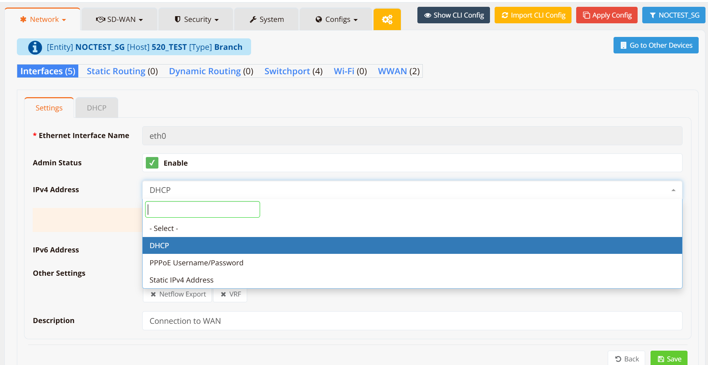
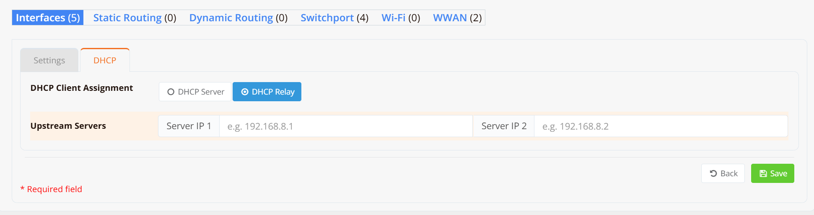
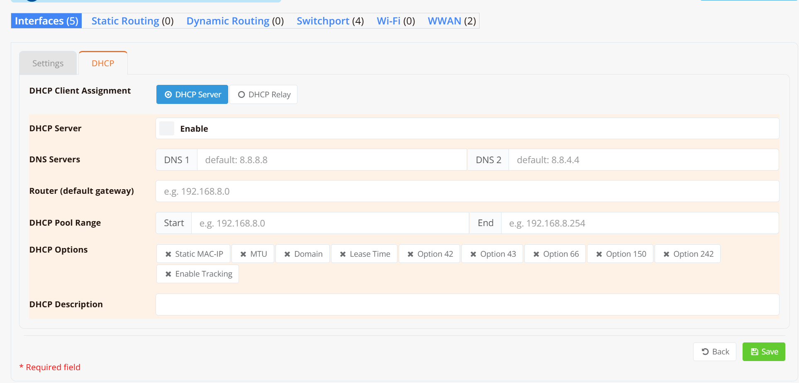
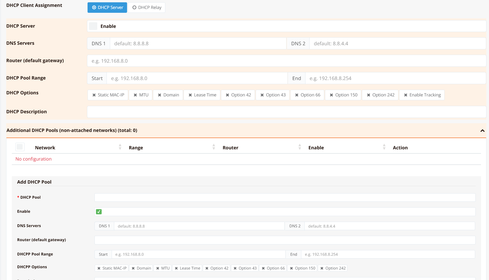

# DHCP

DHCP configuration is managed per interface under **Device Settings → Network → Interfaces**. Click on an interface to open its settings.

Three DHCP roles are supported:

- **DHCP Client** — the interface obtains its IP address automatically from an upstream DHCP server
- **DHCP Relay** — the interface forwards DHCP requests from connected clients to a remote DHCP server
- **DHCP Server** — the interface assigns IP addresses to connected clients from a locally defined address pool

!!! warning
    DHCP Server and DHCP Relay both use UDP ports 67/68. They **cannot be enabled on the same interface simultaneously**.

---

## DHCP Client

When configured as a DHCP client, the interface automatically requests and obtains an IP address, subnet mask, default gateway, and DNS servers from an upstream DHCP server. This is the typical setting for WAN-facing interfaces connecting to an ISP or upstream router.

To configure, go to the interface **Settings** tab and set **IPv4 Address** to `DHCP`.



No further configuration is required. The interface will begin soliciting an IP address as soon as the setting is saved and applied.

---

## DHCP Relay

DHCP Relay (also known as DHCP Helper) forwards DHCP requests from clients on a locally attached network to a centralized DHCP server on a different subnet. This is useful when a single DHCP server serves multiple network segments across routed boundaries.

To configure, go to the interface **DHCP** tab and select **DHCP Relay**.



| Field | Description |
|---|---|
| **Upstream Server IP 1** | Primary DHCP server IP address to forward requests to |
| **Upstream Server IP 2** | Secondary DHCP server IP address (optional, for redundancy) |

The device forwards all DHCP broadcasts received on this interface to the configured upstream server(s) and relays the responses back to the requesting client.

### CLI Configuration

```
interface eth1
  ip address 10.89.4.245/24
  ip dhcp-helper 192.168.8.1
```

For redundancy, specify a secondary server:

```
interface eth1
  ip address 10.89.4.245/24
  ip dhcp-helper 192.168.8.1
  ip dhcp-helper 192.168.8.2
```

!!! note
    The relay interface must have IP reachability to the upstream DHCP server. Ensure routing is configured accordingly.

---

## DHCP Server

When configured as a DHCP server, the interface assigns IP addresses to clients connected to its local network from a defined address pool.

To configure, go to the interface **DHCP** tab and select **DHCP Server**.



| Field | Description |
|---|---|
| **DHCP Server** | Enable or disable the DHCP server on this interface |
| **DNS 1 / DNS 2** | DNS server addresses distributed to clients (default: `8.8.8.8` / `8.4.4.4`) |
| **Router (default gateway)** | Default gateway address advertised to clients |
| **DHCP Pool Range: Start** | First IP address in the allocatable address pool |
| **DHCP Pool Range: End** | Last IP address in the allocatable address pool |
| **DHCP Description** | Optional label for this DHCP server instance |

!!! note
    Only the **primary IP address** of an interface can be used as the basis for the DHCP pool range. Secondary IP addresses on the same interface are not eligible.

### DHCP Options

Additional DHCP options can be enabled to pass supplementary configuration to clients:

| Option | Description |
|---|---|
| **Static MAC-IP** | Define static lease bindings — assign a fixed IP to a specific MAC address |
| **MTU** | Advertise a specific MTU value to clients (Option 26) |
| **Domain** | Distribute a DNS search domain to clients |
| **Lease Time** | Override the default IP lease duration |
| **Option 42** | NTP server addresses |
| **Option 43** | Vendor-specific information (e.g., pushing controller IP to lightweight APs for automatic registration) |
| **Option 66** | TFTP server hostname (used for PXE boot or IP phone provisioning) |
| **Option 150** | TFTP server IP address (Cisco IP phone provisioning) |
| **Option 242** | IP phone configuration (Avaya IP phone provisioning) |
| **Enable Tracking** | Log client lease activity for visibility and troubleshooting |

### CLI Configuration

**DHCP server on a physical interface:**

```
interface eth1
  ip address 192.168.8.1/24
  dhcp-server
    description "DHCP pool for LAN"
    router 192.168.8.1
    dns 8.8.8.8 8.8.4.4
    range 192.168.8.10 192.168.8.254
    enable
```

**DHCP server on a VLAN interface:**

```
interface vlan 1 10
  ip address 10.10.10.1/24
  dhcp-server
    description "DHCP pool for VLAN-10"
    router 10.10.10.1
    dns 8.8.8.8 8.8.4.4
    range 10.10.10.2 10.10.10.254
    enable
```

!!! note
    After modifying DHCP server settings, the service must be restarted to apply changes. Disable and re-enable the DHCP server to restart it.

---

## Additional DHCP Pools

!!! note
    This feature is available on gateway-series devices only.

Additional DHCP pools allow a single device's DHCP server to assign addresses to networks that are **not directly attached** to the server interface — for example, remote subnets reachable via relay agents on downstream devices.

These pools appear under the **Additional DHCP Pools (non-attached networks)** section at the bottom of the DHCP tab.



Click **+ Add DHCP Pool** to define a new pool. Each pool supports the same configuration fields as the primary DHCP server — DNS servers, default gateway, pool range, and DHCP options — but is scoped to a specific non-attached network.

| Field | Description |
|---|---|
| **Network** | The target subnet this pool serves |
| **Range** | Start and end IP addresses for the pool |
| **Router** | Default gateway advertised to clients in this pool |
| **Enable** | Toggle to activate or suspend this pool without deleting it |

### CLI Configuration

For each remote network pool, define the pool and add a host route back to the relay agent:

```
ip dhcp-pool 10.30.30.0/24
  description "DHCP pool for remote VLAN-30"
  router 10.30.30.1
  dns 8.8.8.8 8.8.4.4
  range 10.30.30.2 10.30.30.254
  enable

ip route 10.30.30.1/32 nexthop 192.168.8.9
```

The host route (`/32`) to the relay agent's interface IP is required so the DHCP server can return responses to the correct relay.

---

## Verification and Troubleshooting

Use the following CLI commands to verify DHCP operation and diagnose issues:

| Command | Description |
|---|---|
| `show ip dhcp-server` | Display DHCP server configuration and status |
| `show ip dhcp-lease` | List all active DHCP leases and their assigned IP/MAC bindings |
| `show ip dhcp-log` | Show DHCP service logs for debugging lease assignment issues |
| `tcpdump interface <ifname> port 67` | Capture live DHCP traffic on a specific interface to verify relay or server operation |
