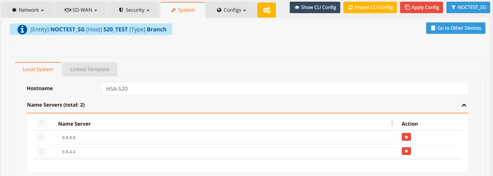
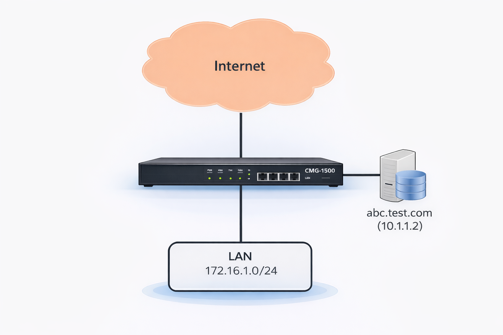
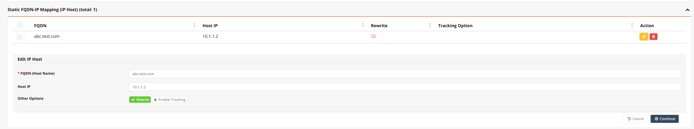

# DNS & DNS Rewrite

The router handles DNS in two distinct roles: forwarding upstream DNS server addresses to DHCP clients, and acting as a DNS proxy that intercepts and optionally rewrites DNS responses for those clients.

When the router is configured as a DNS proxy, it sits between clients and the upstream resolver. This enables **DNS Rewrite** — the ability to intercept a client's DNS query for a specific domain and return a configured IP address instead of forwarding the query upstream. This allows you to redirect domains to internal servers, block unwanted domains, or control DNS resolution per-site without changing anything on the clients.

Two common use cases:

- **Split DNS for DMZ servers** — A public server (e.g. `abc.test.com`) resolves to a public IP for external users, but internal LAN clients should reach it via its private LAN IP to avoid hairpin NAT. DNS Rewrite returns the private IP only to internal clients while external DNS remains unchanged.
- **DNS-based content filtering** — Redirect or block specific domains across all clients on the network without installing software on each device.

---

## DNS Server Configuration

The upstream DNS servers the router uses for its own resolution and forwards to DHCP clients are configured under **Device Settings → System**.



**CLI Configuration**

```
ip name-server 8.8.8.8 8.8.4.4
```
---

## DNS Rewrite

DNS Rewrite intercepts DNS queries from clients and returns a configured response instead of forwarding to the upstream resolver. The interception is handled by the router's local DNS proxy; clients receive the overridden answer transparently.

!!! note
    For DNS Rewrite to work, the router must intercept client DNS queries. There are two ways to achieve this:

    - **DHCP assignment** — assign the router's LAN IP as the DNS server via DHCP so clients send queries directly to the router.
    - **Transparent DNS redirect** — add a DNAT rule to redirect all port 53 traffic to the router itself, intercepting queries even from clients that have a manually configured DNS server or a hardcoded resolver IP.

!!! warning "firewall-dnat and firewall-input must be used together"
    A `firewall-dnat redirect` rule alone is not sufficient. After the DNAT rule redirects port 53 traffic to the router, the redirected packet arrives as an **inbound** packet destined for the router itself. Without a matching `firewall-input permit` rule, the router's firewall drops it.

    Both rules are always required:

    ```
    firewall-dnat 10 redirect inbound eth1 udp dport 53
    firewall-input 10 permit inbound eth1 udp dport 53
    ```

    Replace `eth1` with the LAN-facing interface. Use the same rule ID for clarity — they are independent rules evaluated by their own chains, so matching IDs do not conflict.

The `ip host` command supports four modes:

| Mode | CLI Keyword | Behaviour |
|---|---|---|
| **Override** | `ip host <fqdn> <ip> rewrite` | Return the configured IP for all client queries for this domain. |
| **Block** | `ip host <fqdn> reject` | Return `0.0.0.0` for queries for this domain — effectively blocking access. |
| **Router-local host** | `ip host <fqdn> <ip>` | Add a static entry to the router's own setting. Affects only the router's own resolution — not client DNS queries. |

### GUI Configuration

Navigate to **Device Settings → System**, scroll to the **Static FQDN-IP Mapping** section.



Click **+ Add** to open the mapping form.



Enter the domain name and the IP address to return. The mapping takes effect immediately and applies to all clients using this router as their DNS server.

### CLI Configuration

**Override — redirect a domain to a specific IP**

```
ip host abc.test.com 10.1.1.2 rewrite
```

All client DNS queries for `abc.test.com` will receive `10.1.1.2` regardless of what the upstream DNS would return.

**Block — prevent access to a domain**

```
ip host ads.tracker.com reject
```

Queries for `ads.tracker.com` return `0.0.0.0`. Clients attempting to connect to this domain will get no valid address.

### Complete Example — Split DNS for a DMZ Server

**Scenario:** `abc.test.com` has a public IP `202.127.9.2` on the WAN. Internal clients should reach the same server at its private IP `10.1.1.2` to avoid hairpin NAT. External users continue to resolve the public IP normally.

```
ip name-server 8.8.8.8 8.8.4.4
ip host abc.test.com 10.1.1.2 rewrite
firewall-dnat 10 redirect inbound eth1 udp dport 53
firewall-dnat 20 translate inbound eth0 dst 202.127.9.2 xdst 10.1.1.2
!
firewall-input 10 permit inbound eth1 udp dport 53
```

**Key points:**

- `ip name-server` — upstream resolvers for all other domains
- `ip host abc.test.com 10.1.1.2 rewrite` — internal clients querying `abc.test.com` receive `10.1.1.2`
- `firewall-dnat 10 redirect inbound eth1 udp dport 53` — transparently intercepts all DNS queries on the LAN interface, redirecting them to the router's DNS proxy regardless of what DNS server clients have configured
- `firewall-input 10 permit inbound eth1 udp dport 53` — required alongside the DNAT rule; after redirection the packet arrives inbound to the router itself and must be explicitly permitted
- `firewall-dnat 20 translate ... xdst 10.1.1.2` — inbound traffic from the WAN to the public IP is still translated to the internal server for external users

External users continue to resolve `abc.test.com` to `202.127.9.2` via public DNS — the rewrite only affects clients whose queries pass through this router.

---

## Tracked DNS Entry

A DNS entry can be made conditional on the reachability of a target host. When the tracked host is alive, the configured IP is returned; when it fails, the entry is either removed or switched to a backup IP. This is useful for routing clients to an active server when multiple instances exist.

```
ip host service.example.com 192.168.1.10 rewrite track icmp 192.168.1.10 15 max 200 20 backup 192.168.1.20
```

**Key points:**

- `rewrite` — the domain override is active while the tracked host is alive
- `track icmp 192.168.1.10 15` — probe `192.168.1.10` with ICMP every `15` seconds
- `max 200 20` — probe fails if RTT exceeds `200 ms` or packet loss exceeds `20%`
- `backup 192.168.1.20` — when the probe fails, switch the DNS entry to return `192.168.1.20` instead of removing it entirely; omit `backup` to remove the entry on failure

TCP-based tracking is also supported:

```
ip host service.example.com 192.168.1.10 rewrite track tcp 192.168.1.10 443 15
```

- `track tcp 192.168.1.10 443 15` — probe TCP port `443` on `192.168.1.10` every `15` seconds

---

## Verification

Test DNS resolution from the router:

```
nslookup abc.test.com
```

Test from a client (the response should reflect the configured override):

```
nslookup abc.test.com <router-lan-ip>
```