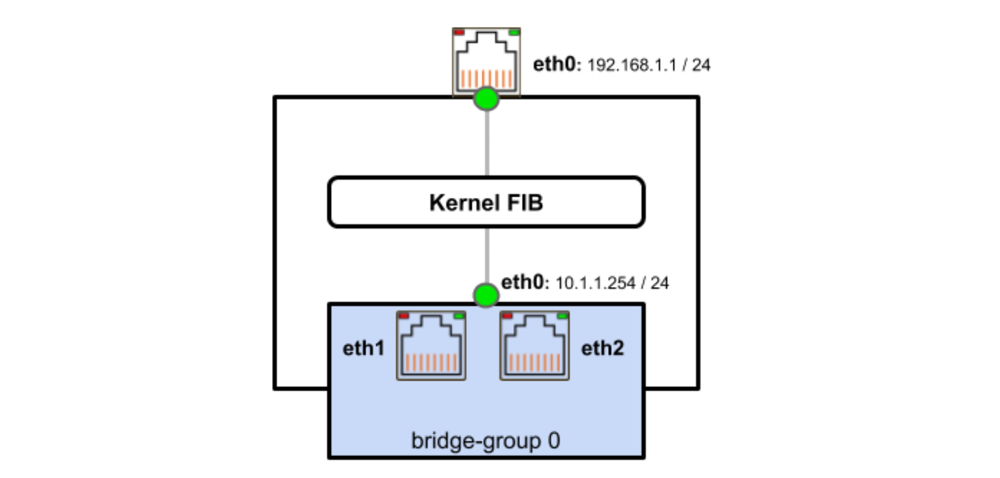
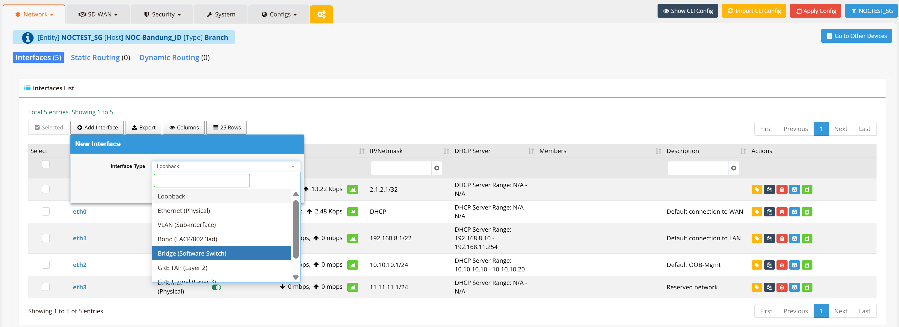
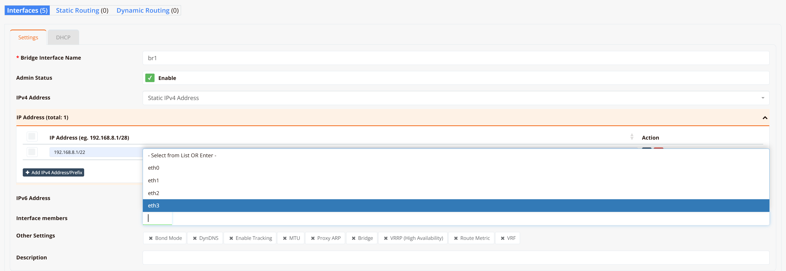

# Bridge Interface

By default, all RansNet router interfaces operate as Layer-3 routed interfaces. Hosts connected through different interfaces must communicate via routing through the device.

In scenarios where Layer-2 connectivity is required — for example, bridging wired LAN ports with wireless SSIDs so all clients share the same IP subnet — a bridge interface can be created to group multiple interfaces into a single Layer-2 broadcast domain.

RansNet routers support **IEEE 802.1d Ethernet bridging**, allowing physical Ethernet ports, VLAN sub-interfaces, and wireless interfaces to be combined into a single bridge group.



In the diagram above, `eth1` and `eth2` are assigned as members of `bridge-group 0`. The bridge itself is assigned `eth0: 10.1.1.254/24` as its Layer-3 IP address, which becomes the default gateway for all hosts connected through any member port. The separate `eth0: 192.168.1.1/24` interface on the top remains a standalone routed uplink.

!!! note
    All interfaces assigned as bridge members lose their individual Layer-3 IP addresses. The IP address is assigned to the bridge interface itself, not the member ports.

---

## Use Cases

| Scenario | Description |
|---|---|
| **Wired + Wireless bridging** | Bridge a LAN Ethernet port with a Wi-Fi SSID so wireless clients appear on the same subnet as wired hosts |
| **Multi-port LAN segment** | Group multiple Ethernet ports into a single Layer-2 segment (software switch) without a dedicated managed switch |
| **VLAN bridging** | Bridge a VLAN sub-interface with a wireless SSID to extend a tagged VLAN over Wi-Fi |

---

## GUI Configuration

Navigate to **Device Settings → Network → Interfaces**, then click **+ Add Interface** and select **Bridge (Software Switch)**.



Configure the bridge name and assign member interfaces.



### Settings

| Field | Description |
|---|---|
| **Bridge Interface Name** | Name for the bridge interface (e.g., `br1`, `br2`) |
| **Admin Status** | Enable or disable the bridge interface |
| **IPv4 Address** | IP address assigned to the bridge (shared gateway for all member hosts). Multiple IPs can be added via **+ Add IPv4 Address/Prefix**. |
| **IPv6 Address** | IPv6 address for the bridge (optional) |
| **Interface Members** | Physical or logical interfaces to include in this bridge group. Select from the dropdown (e.g., `eth0`, `eth1`, `eth2`). Multiple members can be added. |
| **Description** | Optional label for this bridge interface |

**Other Settings:**

| Option | Description |
|---|---|
| **Bond Mode** | Include the bridge in a link aggregation bond |
| **DynDNS** | Enable Dynamic DNS updates for the bridge IP |
| **Enable Tracking** | Enable interface tracking for link-state monitoring |
| **MTU** | Override the bridge MTU (default: `1500`). All member interfaces should share the same MTU. |
| **Proxy ARP** | Enable Proxy ARP on the bridge interface |
| **Bridge** | Bridge to an additional interface (e.g., a wireless SSID) |
| **VRRP (High Availability)** | Configure VRRP for gateway redundancy on this bridge |
| **Route Metric** | Administrative metric for routes via this bridge |
| **VRF** | Assign the bridge to a VRF instance for traffic segmentation |

---

## CLI Configuration

### Basic bridge with two Ethernet members

```
interface eth1
 enable
 bridge-group 1
!
interface eth2
 enable
 bridge-group 1
!
interface bridge br1
  enable
  ip address 192.168.1.254/24
```

!!! warning
    Member interfaces must not have IP addresses configured individually before being added to a bridge. Remove any existing IP from a member interface before assigning it to a bridge group.

---

## Verification

```
show interface br1
```

Example output:

```
================================================================================
Interface : br1
================================================================================

  Network Information
  ----------------------------------------
  Admin State            : UP
  Link State             : UP
  MAC Address            : ee:ce:65:2f:34:2a
  MTU                    : 1500 bytes
  IPv4 Address           : 192.168.1.254/24
  IPv4 Broadcast         : 192.168.1.255
  IPv6 Address           : fe80::ecce:65ff:fe2f:342a/64 [link]

  Bridge Information
  ----------------------------------------
  Bridge ID              : 7fff.eece652f342a
  STP                    : Disabled
  Member Interfaces      : eth1 eth2

  Physical Information
  ----------------------------------------
  Link Detected          : yes

================================================================================
```

To view all interfaces including bridge interfaces:

```
show interface
```
