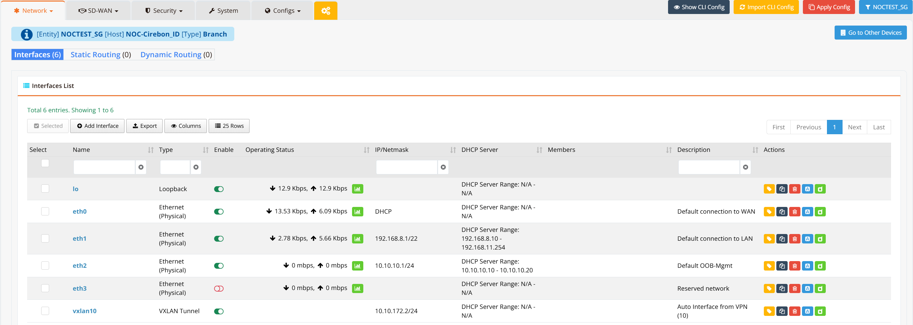
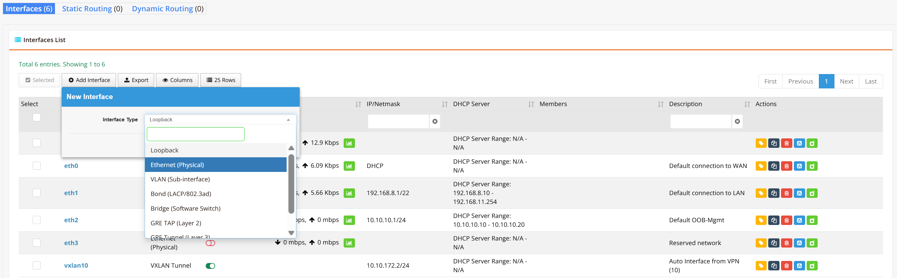
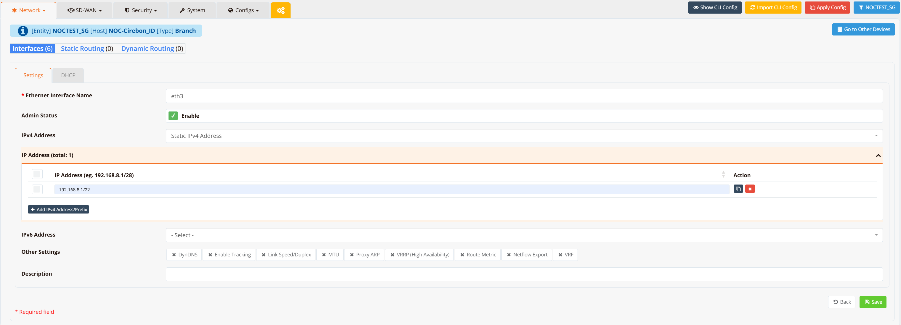

# Ethernet

Ethernet interfaces operate in **Layer-3 routing mode** by default. Interfaces are automatically created when a device is onboarded using a standard template. Additional interfaces can be added manually if needed.

---

## GUI Configuration

Navigate to **Device Settings → Network → Interfaces**.



The Interfaces list shows all configured interfaces with their current state:

| Column | Description |
|---|---|
| **Name** | Interface identifier (e.g., `eth0`, `eth1`, `vlan10`) |
| **Type** | Interface type — Ethernet (Physical), VLAN, Loopback, VXLAN Tunnel, etc. |
| **Enable** | Toggle to administratively enable or disable the interface |
| **Operating Status** | Live link state and traffic throughput (Tx/Rx Kbps or Mbps) |
| **IP / Network** | Assigned IP address(es) and prefix |
| **DHCP Server** | Summary of DHCP server pool range configured on this interface |
| **Members** | Member interfaces (for bridge or bond types) |
| **Description** | Optional label assigned to the interface |

To add a new interface, click **+ Add Interface** and select the interface type from the dropdown.



Available interface types include:

| Type | Description |
|---|---|
| **Ethernet (Physical)** | Layer-3 routed physical port |
| **VLAN (Sub-interface)** | 802.1Q tagged sub-interface on a physical port |
| **Bond (LACP/802.3ad)** | Link aggregation group for bandwidth or redundancy |
| **Bridge (Software Switch)** | Layer-2 software bridge combining multiple ports |
| **GRE TAP (Layer 2)** | GRE tunnel operating in Layer-2 TAP mode |
| **Loopback** | Virtual loopback interface |

Assign a name to the new interface (or click on an existing interface name) to open the edit form.



---

## Settings

### Basic Settings

| Field | Description |
|---|---|
| **Ethernet Interface Name** | Physical interface identifier (e.g., `eth0`, `eth1`). This maps directly to the OS-level interface name. |
| **Admin Status** | Enable or disable the interface administratively |
| **IPv4 Address** | Set to `Static IPv4 Address` to manually assign an IP, or `DHCP` to obtain one from an upstream server |
| **IP Address / Prefix** | One or more IPv4 addresses in CIDR notation (e.g., `192.168.8.1/22`). Click **+ Add IPv4 Address/Prefix** to assign additional IPs. |
| **IPv6 Address** | IPv6 address assignment (optional) |
| **Description** | Free-text label for this interface |

!!! note
    Multiple IPv4 and IPv6 addresses can be assigned to a single interface. The **first (primary) IP** is used as the source address for routing decisions and DHCP server pool anchoring.

### Other Settings

Click each option to expand and configure it:

| Option | Description |
|---|---|
| **DynDNS** | Enable Dynamic DNS updates for this interface's IP address |
| **Enable Tracking** | Enable interface tracking for VRRP failover or link-state monitoring |
| **Link Speed/Duplex** | Override auto-negotiation — set speed to `10`, `100`, or `1000` Mbps and duplex to `auto`, `full`, or `half` (default: `1000` / `auto`) |
| **MTU** | Maximum Transmission Unit in bytes (default: `1500`). Reduce for tunneled interfaces to avoid fragmentation. |
| **Proxy ARP** | Enable Proxy ARP so the device responds to ARP requests on behalf of hosts on other subnets |
| **VRRP (High Availability)** | Configure VRRP for gateway redundancy on this interface |
| **Route Metric** | Set the administrative distance/metric for routes via this interface |
| **Netflow Export** | Enable NetFlow traffic export on this interface for flow-based monitoring |
| **VRF** | Assign the interface to a VRF instance for network segmentation |

---

## CLI Configuration

### Basic interface setup

```
interface eth0
  description "WAN uplink"
  speed 1000
  duplex auto
  mtu 1500
  ip address 61.13.198.166/30
  ip default-gateway 203.128.19.103
  enable
```

### Reduced MTU (e.g., for tunneled or PPPoE WAN)

```
interface eth0
  mtu 1300
  ip address 61.13.198.166/30
  enable
```

### Multiple IP addresses on one interface

```
interface eth1
  ip address 192.168.8.1/24
  ip address 10.0.0.1/30
  enable
```

---

## Verification

```
show interface eth0
```

Example output:

```
Interface  : eth0
Admin State: UP
Link State : UP
MAC Address: 00:1a:2b:3c:4d:5e
MTU        : 1500
IPv4       : 61.13.198.166/30
IPv6       : -
Speed      : 1000Mb/s
Duplex     : Full
Auto-Nego  : Enabled
Link Detect: yes
```
