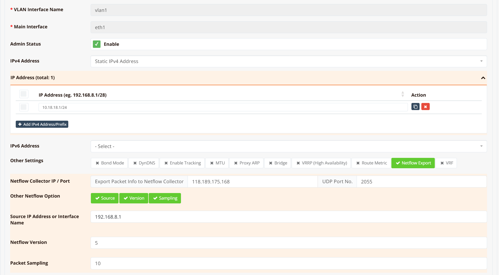

# NetFlow Export

NetFlow is a network protocol for collecting and exporting IP traffic statistics. When enabled on an interface, the router monitors all traffic flows passing through it — recording source and destination IP, protocol, port numbers, bytes, and packet counts — and periodically exports these records as UDP packets to a collector for analysis.

Typical use cases:

- **Traffic visibility** — identify which applications, hosts, or users consume the most bandwidth
- **Security monitoring** — detect anomalies, unusual traffic patterns, or potential intrusions
- **Capacity planning** — understand traffic trends over time to plan link upgrades
- **Usage accounting** — attribute bandwidth consumption per site or user group

All RansNet SD-WAN routers support NetFlow export. The mfusion orchestrator can act as an integrated NetFlow collector and analyser — see [Device Monitoring → NetFlow](../../monitor/netflow.md). You can also export to any third-party collector that supports standard NetFlow v5/v9.

---

## GUI Configuration

Navigate to **Device Settings → Network → Interfaces**, select the interface to monitor, then click **NetFlow Export**.



| Field | Description |
|---|---|
| Collector IP | IP address of the NetFlow collector |
| Collector Port | UDP port the collector listens on (commonly `2055`) |
| Other NetFlow Options | Optional advanced parameters — includes sampling ratio and other export tuning |

NetFlow export is configured per interface. Choose the interface based on what visibility you need:

| Goal | Enable NetFlow on |
|---|---|
| Per-host / per-user traffic breakdown | LAN or VLAN interface |
| Total WAN usage / ISP bandwidth monitoring | WAN interface |
| Both | Both interfaces |

!!! note "Sampling ratio"
    NetFlow uses packet sampling — only 1 in every N packets is exported to the collector rather than every packet. The default sampling ratio is **10** (1 in 10 packets sampled). This reduces CPU load and export bandwidth, but the collector must apply the inverse multiplier (×10) when calculating actual throughput figures.

    A lower ratio (e.g. 1) gives more accurate data at the cost of higher overhead. For most deployments the default of 10 is appropriate. The ratio is adjustable under **Other NetFlow Options**.

!!! warning "NAT affects source IP visibility on the WAN interface"
    If SNAT (masquerade) is configured on the WAN interface, NetFlow records on that interface will show the **translated public IP** as the source — not the original private IP of the client. This is because SNAT rewrites the source address before the packet leaves the interface, so all outbound traffic from all LAN hosts appears as a single source IP in the flow records.

    To retain per-host visibility, enable NetFlow on the **LAN or VLAN interface** instead, where traffic is sampled before NAT is applied.

---

## CLI Configuration

```
interface vlan 1 1
  ip flow-export <collector-ip> <port>
```

**Example** — export traffic from the LAN VLAN to mfusion at `118.189.175.168` on port `2055`:

```
interface vlan 1 1
  description "Default VLAN for all LAN ports"
  bridge
  ip address 10.18.18.1/24
  ip flow-export 118.189.175.168 2055
  dhcp-server
    router 10.18.18.1
    dns 8.8.8.8 8.8.4.4
    range 10.18.18.2 10.18.18.254
    enable
  enable
```

---

## Verification

**Step 1 — Confirm a route exists to the collector**

```
show ip route 118.189.175.168
```

Expected output shows a valid route (static default or specific route) to the collector IP:

```
Routing entry for 0.0.0.0/0
  Known via "static", distance 1, metric 0, best
  Last update 02w0d19h ago
  * 61.13.198.165, via eth0, weight 1
```

If no route is returned, the collector is unreachable — check the routing table and upstream connectivity.

**Step 2 — Capture NetFlow packets on the egress interface**

```
tcpdump interface eth0 port 2055
```

Expected output shows UDP packets flowing from the router's WAN IP to the collector on port 2055:

```
16:32:31.771742 IP 61.13.198.166.49398 > 118.189.175.168.2055: UDP, length 984
16:32:35.111606 IP 61.13.198.166.49398 > 118.189.175.168.2055: UDP, length 456
16:33:01.391643 IP 61.13.198.166.49398 > 118.189.175.168.2055: UDP, length 1416
```

If no packets appear, verify the `ip flow-export` command is applied to the correct interface and that traffic is actively flowing through it.
