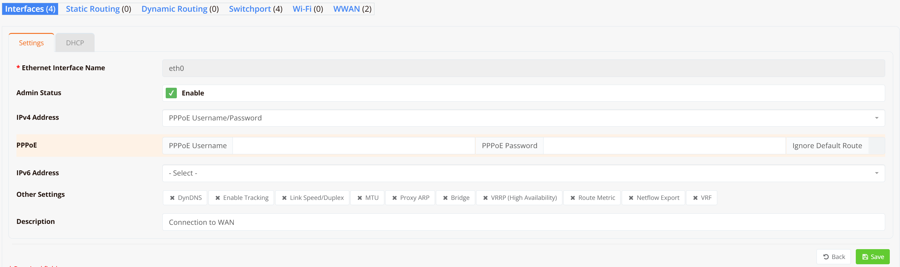

# PPPoE

Point-to-Point Protocol over Ethernet (PPPoE) is a WAN encapsulation method used by some ISPs — particularly for DSL and fibre broadband services — to authenticate subscribers and establish a routed session. The ISP provides a username and password which the router uses to authenticate against the provider's access concentrator (BRAS/NAS) before a public IP address is assigned.

PPPoE is configured directly on the WAN interface rather than as a separate interface type. Once the session is established, the operating system creates a virtual PPP interface (`ppp0`, `ppp1`, etc.) which carries the actual traffic.

!!! note
    Some ISPs require PPPoE to be configured on a VLAN sub-interface rather than the physical port. In this case, first create a VLAN interface on the WAN port, then configure PPPoE on that VLAN interface. See [VLAN Interface](vlaniface.md) for details.

---

## GUI Configuration

Navigate to **Device Settings → Network → Interfaces**, click on the WAN interface (typically `eth0` or a VLAN sub-interface), and set **IPv4 Address** to `PPPoE Username/Password`.



### Settings

| Field | Description |
|---|---|
| **Ethernet Interface Name** | The physical or VLAN interface connected to the ISP modem (e.g., `eth0`) |
| **Admin Status** | Enable or disable this interface |
| **IPv4 Address** | Set to `PPPoE Username/Password` to activate PPPoE mode |
| **PPPoE Username** | Username provided by the ISP for authentication |
| **PPPoE Password** | Password provided by the ISP for authentication |
| **Ignore Default Route** | Do not install the ISP-assigned default route into the routing table. Enable this when PPPoE is one of multiple WAN links managed by Multi-WAN — the Multi-WAN engine handles routing instead. |

**Other Settings:**

| Option | Description |
|---|---|
| **DynDNS** | Enable Dynamic DNS updates using the PPPoE-assigned IP |
| **Enable Tracking** | Enable link tracking on this interface for failover detection |
| **Link Speed/Duplex** | Override physical link speed and duplex settings |
| **MTU** | PPPoE adds an 8-byte header overhead to each frame. The effective payload MTU is reduced to **1492 bytes** (1500 − 8). Set this to `1492` if the ISP does not handle MSS clamping. |
| **Proxy ARP** | Enable Proxy ARP on this interface |
| **Bridge** | Bridge this interface to another interface |
| **VRRP (High Availability)** | Configure VRRP for gateway redundancy |
| **Route Metric** | Administrative metric for the default route via this PPPoE session. Use this to set priority when multiple WAN links are present. |
| **Netflow Export** | Enable NetFlow traffic export on this interface |
| **VRF** | Assign to a VRF instance |

---

## CLI Configuration

PPPoE is configured under the physical ethernet interface connected to the ISP modem:

### Basic PPPoE setup

```
interface eth0
  enable
  pppoe <username> <password>
```

### PPPoE with firewall rules

For a single-WAN setup, include outbound NAT and access rules referencing the virtual `ppp0` interface:

```
interface eth0
  enable
  pppoe 101500223 20160205665

firewall-access 11 permit outbound ppp0
firewall-snat 11 overload outbound ppp0
```

### PPPoE over a VLAN interface

When the ISP requires a tagged VLAN on the WAN port:

```
interface eth0
  enable

interface vlan 0 10
  enable
  pppoe <username> <password> nodefault
```

### Set DNS servers explicitly

By default, mbox does not use DNS servers pushed by the ISP over PPPoE. Configure DNS explicitly:

```
ip name-server 8.8.8.8
ip name-server 8.8.4.4
```

### Multi-WAN with PPPoE

When PPPoE is one of multiple WAN links, omit the `default` command and manage routing via the Multi-WAN engine. MWAN configuration is applied under the virtual `ppp` interface:

```
interface eth0
  enable
  pppoe <username> <password>

interface ppp0
  mwan-group 0
  track 8.8.8.8
  metric 2
  weight 1
```

Use `ppp0` (or `ppp1` for a second PPPoE session) as the nexthop interface name in MWAN and routing rules.

---

## Verification

```
show interface ppp0
```

Example output:

```
Interface  : ppp0
Admin State: UP
Link State : UP
MTU        : 1492
IPv4       : 203.128.x.x/32
```

```
show pppoe
```

Displays the active PPPoE session, authentication state, assigned IP, and session uptime.
