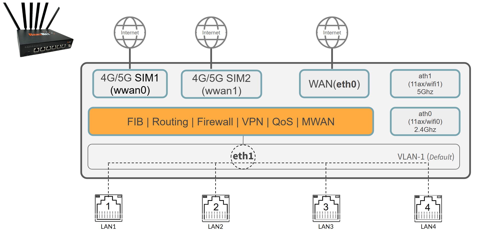
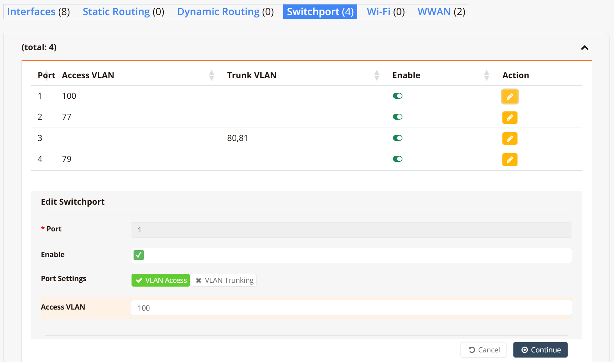
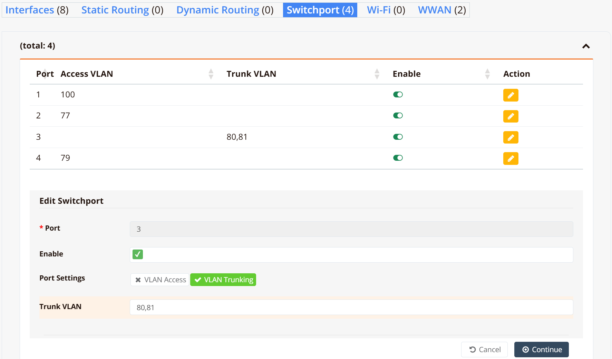

# Switch Ports

RansNet SD-Branch routers have multiple GE or FE ports, each configurable as a WAN or LAN interface. Understanding the port architecture of your device is important before configuring them.

- **Gateway series (CMG/HSG)** and **UA-800** — each port is a **routed (Layer 3) port**, operating independently with its own IP address, like a traditional router interface.
- **520 series (UA-520/HSA-520)** — the WAN port (`eth0`) is a routed port; `LAN1`–`LAN4` are **switchports** on an internal Layer 2 switch chip, with `eth1` as the logical uplink between the switch chip and the CPU.

For routed port configuration, refer to [Ethernet Interface](ethernet.md) and [VLAN Interface](vlaniface.md). This page covers switchport configuration for the 520 series.

---

## Hardware Architecture

The 520 series uses an internal Layer 2 switch chip. `LAN1`–`LAN4` are physical switchports on the chip; `eth1` is the logical uplink from the chip to the CPU routing engine. All inter-VLAN routing, VPN, firewall, and WAN traffic passes through `eth1` via VLAN sub-interfaces — the switch chip handles per-port VLAN tagging and untagging in hardware.



By default, all four LAN ports belong to **VLAN 1**, tagged to `eth1`. Connected devices share a single Layer 2 broadcast domain and are served by the router's default LAN gateway on the `vlan1` interface.

---

## Configure Access Port

An **access port** (IEEE 802.1Q untagged port) carries traffic for a single VLAN. The switch chip automatically tags incoming frames with the configured VLAN ID and strips the tag on egress — connected end devices such as PCs, printers, and access points operate normally with no VLAN awareness required.

!!! note
    Create the target VLAN interface on `eth1` before assigning a switchport to it. Refer to [VLAN Interface](vlaniface.md) for details.

### GUI Configuration

Navigate to **Device Settings → Network → Switchport**. Click the **Edit** button (pencil icon) for the target port.



The **Edit Switchport** panel opens at the bottom of the page:

| Field | Description |
|---|---|
| **Port** | Physical port number (read-only) |
| **Enable** | Toggle to enable or disable this switchport |
| **Port Settings** | Select `VLAN Access` for a single-VLAN untagged port |
| **Access VLAN** | The VLAN ID to assign to this port |

Click **Continue** to save.

!!! tip
    The example above configures LAN1 as an access port on VLAN 100 — for instance, connecting to an upstream ISP modem with DHCP. The VLAN ID here is locally significant only, just use a unique VLAN and configure VLAN interface a "WAN" interface.

### CLI Configuration

```
interface vlan 1 100
 description "Used as WAN, over LAN1"
 enable
 ip address dhcp
!
interface switchport 1
 vlan access 100
!
```

Repeat for each additional port as needed.

---

## Configure Trunk Port

A **trunk port** (IEEE 802.1Q tagged port) carries traffic for multiple VLANs simultaneously over a single link. Use this when connecting to a downstream managed switch or a multi-SSID wireless AP where each VLAN must remain logically segregated end-to-end. The downstream device must be configured in trunk mode with matching VLAN IDs.

!!! note
    VLAN 1 is always passed as the **native (untagged) VLAN** on trunk ports. Ensure the downstream switch port is configured to match.

### GUI Configuration

Navigate to **Device Settings → Network → Switchport**. Click the **Edit** button for the target port.



In the **Edit Switchport** panel:

| Field | Description |
|---|---|
| **Port Settings** | Select `VLAN Trunking` |
| **Trunk VLAN** | Comma-separated list of VLAN IDs to carry as 802.1Q tagged traffic (e.g. `80,81`) |

Click **Continue** to save.

### CLI Configuration

First, define the VLAN interfaces on `eth1`:

```
interface vlan 1 80
 description VLAN_80
 enable
 ip address 192.168.80.1/24
 dhcp-server
  lease-time 86400 86400
  router 192.168.80.1
  dns 8.8.8.8 8.8.4.4
  range 192.168.80.11 192.168.80.250
  enable
!
interface vlan 1 81
 description VLAN_81
 enable
 ip address 192.168.81.1/24
 dhcp-server
  lease-time 86400 86400
  router 192.168.81.1
  dns 8.8.8.8 8.8.4.4
  range 192.168.81.11 192.168.81.250
  enable
!
```

Then assign the trunk VLANs to the switchport:

```
interface switchport 3
 vlan dot1q 80,81
!
```

---

## Verification

```
show interface switchport
```

Example output:

```
Switch     Port    VLAN            Status  Link                            RX           TX
---------  ------  --------------  ------  ------------------------------  -----------  -----------
switch1    LAN1    100             down    -                               -            -
switch1    LAN2    77              UP      100M/Full [tx/rx]               39.2M        259.4M
switch1    LAN3    1 80(T) 81(T)   UP      1000M/Full [tx/rx]              71.5M        1.1G
switch1    LAN4    79              down    -                               -            -
```

Key points:

- A single VLAN ID with no suffix (e.g. `100`, `77`) indicates an **access port** assigned to that VLAN.
- Multiple entries where tagged VLANs are suffixed with `(T)` (e.g. `80(T) 81(T)`) indicate a **trunk port**; VLAN `1` with no suffix is the native untagged VLAN passed through by default.
- **Status** reflects the operating state; **Link** reflects the physical link state and negotiated speed/duplex.
