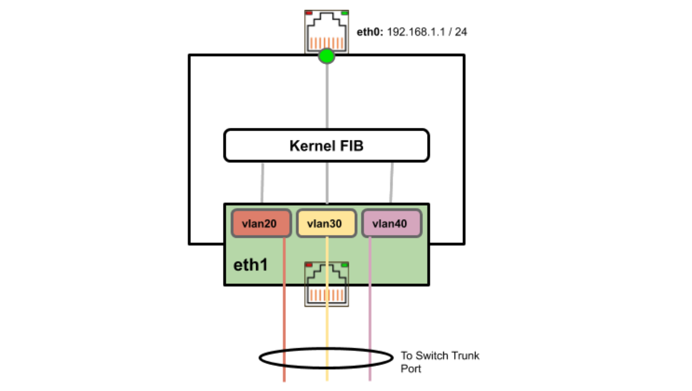
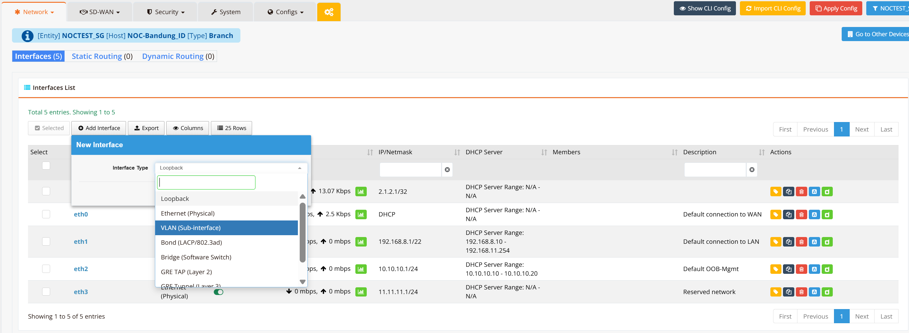
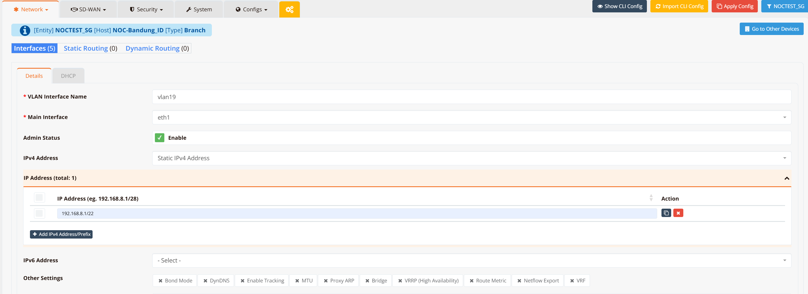

# VLAN Interface

RansNet routers support IEEE 802.1Q VLANs, allowing a single physical interface to be divided into multiple logical sub-interfaces. Each sub-interface is tagged with a VLAN ID and operates as an independent Layer-3 interface with its own IP address.



In the diagram above, `eth1` carries three tagged VLANs (`vlan20`, `vlan30`, `vlan40`) over a single trunk link to a downstream switch. Each VLAN sub-interface is presented to the Kernel FIB as a separate routed interface, while `eth0` remains a standard untagged Layer-3 uplink.

---

## Prerequisites

Before configuring VLAN interfaces, ensure the following:

- The **parent physical interface** (`eth0`, `eth1`, etc.) must be enabled
- The connected peer port (e.g., upstream switch port) must be configured as an **802.1Q trunk** with the relevant VLANs permitted
- Each VLAN sub-interface requires its own IP address assignment
- Physical interfaces are in **VLAN 1** by default (untagged)

!!! note
    VLAN interfaces bridged to wireless interfaces operate in **bridge mode** rather than pure routing mode.

---

## GUI Configuration

Navigate to **Device Settings → Network → Interfaces**, then click **+ Add Interface** and select **VLAN (Sub-interface)**.



Once you're in the VLAN interface edit mode, set the VLAN interface name (format: `vlan` + VLAN ID, e.g., `vlan19`) and select the parent physical interface.



### Settings

| Field | Description |
|---|---|
| **VLAN Interface Name** | Logical name for this sub-interface, formatted as `vlan` + VLAN ID (e.g., `vlan19`, `vlan100`). This determines the VLAN tag used on the wire. |
| **Main Interface** | Parent physical interface this sub-interface is created on (e.g., `eth1`) |
| **Admin Status** | Enable or disable this sub-interface |
| **IPv4 Address** | Set to `Static IPv4 Address` to manually assign, or `DHCP` to obtain from upstream. Multiple IPs can be added via **+ Add IPv4 Address/Prefix**. |
| **IPv6 Address** | IPv6 address assignment (optional) |

**Other Settings:**

| Option | Description |
|---|---|
| **Bond Mode** | Include this VLAN in a link aggregation bond |
| **DynDNS** | Enable Dynamic DNS updates for this interface's IP |
| **Enable Tracking** | Enable interface tracking for link-state or VRRP monitoring |
| **MTU** | Override MTU for this sub-interface (default: `1500`) |
| **Proxy ARP** | Enable Proxy ARP so the device responds to ARP requests on behalf of hosts on other subnets |
| **Bridge** | Bridge this VLAN to a wireless SSID or other interface (operates in Layer-2 bridge mode) |
| **VRRP (High Availability)** | Configure VRRP for gateway redundancy on this VLAN |
| **Route Metric** | Administrative metric for routes via this interface |
| **Netflow Export** | Enable NetFlow traffic export on this interface |
| **VRF** | Assign to a VRF instance for traffic segmentation |

---

## CLI Configuration

### Enable parent interface and create VLAN sub-interfaces

The CLI syntax for a VLAN sub-interface is:

```
interface vlan <parent-port-number> <vlan-id>
```

For example, `interface vlan 1 20` creates VLAN ID 20 on `eth1` (port 1).

### Multiple VLANs on the same physical interface

```
interface eth1
  enable

interface vlan 1 10
  description "Management VLAN"
  enable
  ip address 192.168.10.1/24

interface vlan 1 20
  description "Data VLAN"
  enable
  ip address 192.168.20.1/24

interface vlan 1 30
  description "IoT VLAN"
  enable
  ip address 192.168.30.1/24
```

---

## Verification

```
show interface vlan1
```

Example output (below vlan1 is bridged to wireless SSIDs)

```
  ================================================================================
  Interface : br-vlan1
================================================================================

  Network Information
  ----------------------------------------
  Admin State            : UP
  Link State             : UP
  MAC Address            : ee:ce:65:2f:34:2a
  MTU                    : 1500 bytes
  IPv4 Address           : 10.18.18.1/24
  IPv4 Broadcast         : 10.18.18.255
  IPv6 Address           : fe80::ecce:65ff:fe2f:342a/64 [link]

  VLAN Information
  ----------------------------------------
  VLAN ID                : 1
  Parent Interface       : eth1
  RX Frames              : 1272581
  RX Bytes               : 189871757
  RX Multicast/BC        : 52700
  TX Frames              : 1084385
  TX Bytes               : 308633299

  Bridge Information
  ----------------------------------------
  Bridge ID              : 7fff.eece652f342a
  STP                    : Disabled
  Member Interfaces      : ath0 ath01 ath1 ath11 vlan1

  Physical Information
  ----------------------------------------
  Link Detected          : yes

================================================================================
```

To view all interfaces including VLAN sub-interfaces:

```
show interface
```
