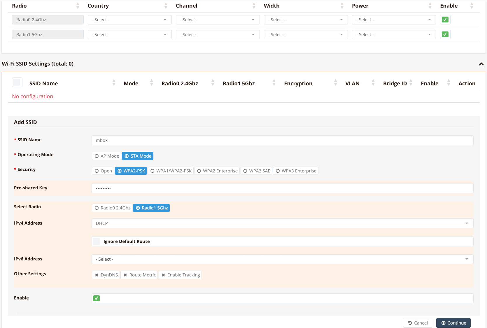

# Wi-Fi as WAN

RansNet routers support two Wi-Fi operating modes: **AP mode**, where the device acts as a wireless access point serving wireless clients, and **STA (Station) mode**, also known as **Wi-Fi as WAN**. In STA mode, the device connects to an existing upstream Wi-Fi network as a wireless client, using that connection as a WAN uplink — in the same role as a wired Ethernet or cellular interface.

Wi-Fi as WAN is suited for deployments where a wired broadband connection is unavailable or not yet provisioned — for example, connecting to a building's shared Wi-Fi, using a mobile hotspot as a temporary backhaul, or bridging connectivity across a site during installation.

For AP mode configuration, see [Wi-Fi Access Point](../wifi.md).

---

## Radio Interfaces

RansNet branch devices expose two Wi-Fi radio interfaces:

| Interface | Radio Band | Typical Use |
|---|---|---|
| `ath0` | 2.4 GHz | Longer range; better wall penetration; suitable when the upstream AP is further away |
| `ath1` | 5 GHz | Higher throughput; less interference; preferred where signal quality is good |

In STA mode, the selected radio interface (`ath0` or `ath1`) becomes the WAN-facing wireless client interface and can be configured with IP addressing, route metrics, and link tracking — just like any other WAN interface type.

---

## GUI Configuration

Navigate to **Device Settings → Network → Wi-Fi**.



Under **Operating Mode**, select **STA Mode**. This switches the radio from access point mode to wireless client (station) mode.

Configure the connection to the upstream Wi-Fi network:

| Field | Description |
|---|---|
| **SSID** | The network name of the upstream Wi-Fi network to connect to |
| **Security / Encryption** | Encryption method used by the upstream AP (e.g., `WPA2-PSK`) |
| **Pre-Shared Key (PSK)** | The Wi-Fi passphrase for the upstream network |
| **IP Address** | Set to `DHCP` to receive an address from the upstream router, or `Static` to assign a fixed IP |

!!! note
    The SSID and PSK must exactly match the upstream AP's configuration, including case sensitivity. A mismatch will prevent association.

Once STA mode is active, the resulting `ath0` or `ath1` interface is available as a WAN interface. Navigate to **Device Settings → Network → Interfaces** to configure IP addressing, route metric, and link tracking for this interface, alongside any other WAN uplinks.

!!! tip
    To use Wi-Fi as WAN as a secondary or failover uplink, assign it a higher **Route Metric** than the primary WAN interface. Multi-WAN will automatically route traffic via Wi-Fi if the primary link fails.

---

## CLI Configuration

### Connect to a 5 GHz upstream network (DHCP)

```
interface ath1
  ip address dhcp
  enable
!
interface wifi 1
  ssid HomeBroadband
    encryption WPA2-PSK key Letmein99
    client station
    enable
```

**Key points:**

- `interface ath1` configures the 5 GHz radio interface; use `ath0` for 2.4 GHz
- `interface wifi 1` references the same radio by index — `wifi 0` for 2.4 GHz, `wifi 1` for 5 GHz
- `client station` sets the radio to STA (client) mode
- `encryption WPA2-PSK key <passphrase>` sets the Wi-Fi authentication credentials
- Replace `ip address dhcp` with a static address if the upstream network requires a fixed IP

### Connect to a 2.4 GHz network with a static IP

```
interface ath0
  ip address 192.168.1.50/24
  enable
!
interface wifi 0
  ssid OfficeWifi
    encryption WPA2-PSK key MySecretKey
    client station
    enable
!
ip default-gateway 192.168.1.1

```

---

## Verification

```
show interface ath1
```

Example output:

```
================================================================================
  Interface : ath1
================================================================================

  Network Information
  ----------------------------------------
  Admin State            : UP
  Link State             : UP
  MTU                    : 1500 bytes
  IPv4 Address           : 192.168.1.100/24

  Wi-Fi Station
  ----------------------------------------
  SSID                   : HomeBroadband
  Signal                 : -55 dBm (good)
  TX Rate                : 433 Mbps

  Physical Information
  ----------------------------------------
  Link Detected          : yes

================================================================================
```

Confirm that **Link State** is `UP` and the **SSID** matches the upstream network. A signal level of `-70 dBm` or better is recommended for stable WAN operation.
