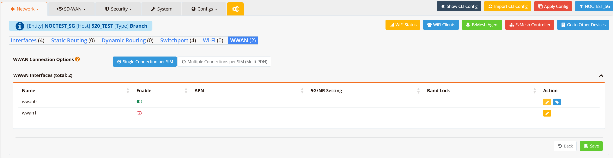
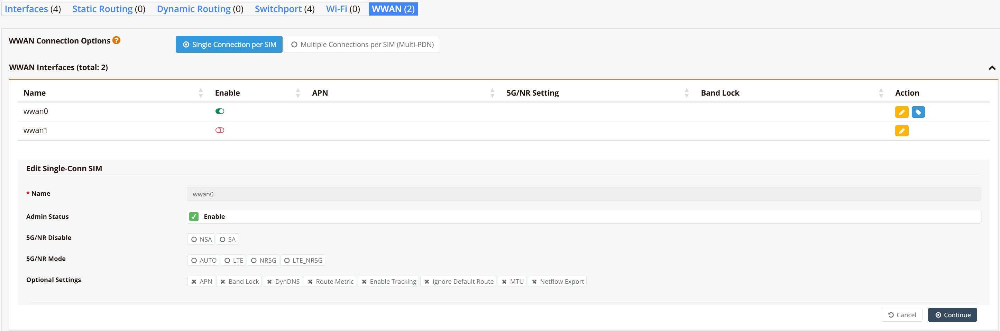

# Wireless WAN (WWAN)

Wireless WAN (WWAN), also referred to as a mobile or cellular interface, provides WAN backhaul connectivity over 4G LTE and 5G NR cellular networks. On RansNet branch-series devices, WWAN is the primary or secondary WAN link, enabling internet and SD-WAN connectivity without a fixed-line broadband connection.

Each WWAN interface corresponds to a physical cellular modem module installed in the device. The modem establishes a data session (PDN connection) with the mobile network using a SIM card and the configured APN, and presents the resulting IP address to the device as a routable WAN interface.

Navigate to **Device Settings → Network → WWAN**.



---

## Single vs Dual Modem

RansNet branch devices support single-module and dual-module configurations:

| Configuration | Devices | Behaviour |
|---|---|---|
| **Single module (wwan0 only)** | XE-300R, HSA-520R, UA-520R, UA-800NR | One active modem. Dual physical SIM slots supported — SIMs operate in **active/standby** mode. The standby SIM takes over automatically on primary SIM failure. |
| **Dual module (wwan0 + wwan1)** | HSA-520L2, UA-800NR2 | Two independent modem modules, each with its own SIM. Both run simultaneously in **active/active** mode, providing two independent cellular uplinks for load balancing or redundancy via Multi-WAN. |

---

## WWAN Connection Options

At the top of the WWAN tab, select the connection mode that matches your SIM plan:

| Option | Description |
|---|---|
| **Single Connection per SIM** | One PDN (Packet Data Network) session per SIM card. Standard for most SIM plans. |
| **Multiple Connections per SIM (Multi-PDN)** | Multiple simultaneous PDN sessions on a single SIM, each with a different APN. Used when a SIM plan provides separate APNs for internet and private network access (e.g., corporate intranet over a private APN alongside public internet). |

---

## WWAN Interfaces

The WWAN Interfaces table lists all modem interfaces on the device:

| Column | Description |
|---|---|
| **Name** | Interface identifier — `wwan0` (primary modem) or `wwan1` (secondary modem on dual-module devices) |
| **Enable** | Toggle to administratively enable or disable the modem interface |
| **APN** | Configured Access Point Name for this interface |
| **5G/NR Setting** | Active 5G mode configuration (NSA or SA, and radio access mode) |
| **Band Lock** | Frequency bands the modem is locked to, if configured |
| **Action** | Edit or reset the interface configuration |

Click the **edit (yellow)** button on the right side of an interface row to open its configuration form.

---

## Interface Configuration



### Basic Settings

| Field | Description |
|---|---|
| **Name** | Interface name (`wwan0` or `wwan1`) — read-only |
| **Admin Status** | Enable or disable this modem interface |

### 5G/NR Settings

These settings control how the modem connects to 5G networks. They are only relevant for 5G-capable modems.

**5G/NR Disable** — Select which 5G sub-architecture to disable if needed:

| Option | Description |
|---|---|
| **NSA** | Disable 5G Non-Standalone mode. NSA uses a 5G NR radio but anchors control signalling to an existing 4G LTE core. Disabling NSA forces the modem to use SA or fall back to LTE. |
| **SA** | Disable 5G Standalone mode. SA uses both a 5G NR radio and a full 5G core network. Disabling SA forces the modem to use NSA or LTE. |

**5G/NR Mode** — Select the radio access technology the modem is permitted to use:

| Mode | Description |
|---|---|
| **AUTO** | Let the modem select the best available technology automatically (recommended) |
| **LTE** | Lock to 4G LTE only — disables 5G even if available |
| **NR5G** | Lock to 5G NR only — the modem will not fall back to LTE |
| **LTE_NR5G** | Allow both LTE and 5G NR — modem selects based on signal quality |

### Optional Settings

Click each option to expand and configure it:

| Option | Description |
|---|---|
| **APN** | Access Point Name provided by the mobile carrier. Required for establishing the data session. Leave blank if the carrier provisions it automatically via SIM. |
| **Band Lock** | Lock the modem to specific frequency bands (e.g., B3, B7, B28 for LTE; n78 for 5G). Useful for optimising signal in areas with known strong bands or avoiding congested bands. Leave blank to allow auto band selection. |
| **DynDNS** | Enable Dynamic DNS updates for the WWAN interface IP |
| **Route Metric** | Administrative metric for the default route via this interface. Used to set WWAN as primary or secondary WAN when multiple uplinks are present — lower metric = higher priority. |
| **Enable Tracking** | Enable interface tracking to monitor the WWAN link health and trigger failover |
| **Ignore Default Route** | Do not install the carrier-assigned default route into the routing table. Useful when WWAN is used only for a specific VPN or SD-WAN tunnel, not as a general internet gateway. |
| **MTU** | Override the interface MTU (default: `1500`). Reduce to avoid fragmentation on tunneled connections (e.g., `1420` for IPsec over WWAN). |
| **Netflow Export** | Enable NetFlow traffic export on this interface for flow-based monitoring |

---

## CLI Configuration

### Set APN manually

```
interface wwan0
  apn internet
  enable
```

### Set 5G mode

```
interface wwan0
  nr-mode NR5G
  enable
```

### Band Lock

```
interface wwan0
  nr-band sa 78
  enable
```

### View status

```
show interface wwan0
================================================================================
  Interface : wwan0
================================================================================

  Network Information
  ----------------------------------------
  Admin State            : UP
  Link State             : UP
  MAC Address            : 9a:fb:90:59:30:f8
  MTU                    : 1500 bytes
  IPv4 Address           : 10.157.37.202/0
  IPv4 Broadcast         : 10.157.37.202

  Mobile Connection
  ----------------------------------------
  Modem IMEI      : 864624060795954
  Modem Rev       : RG255CGLABR01A04M4G
  SIM IMSI        : 525016143247533
  SIM ICCID       : 8965012501070124911F
  SIM State       : Connected
  SIM APN         : 
  Provider        : Zero1
  Network         : LTE B3
  Cell ID         : B4B6668
  RSSI            : -71 dBm (good)
  RSRP            : -105 dBm (fair)
  SINR            : 9 dB (fair)
  RSRQ            : -14 dB (fair)

  Physical Information
  ----------------------------------------
  Link Detected          : yes

================================================================================
mbox-hsa# 
```