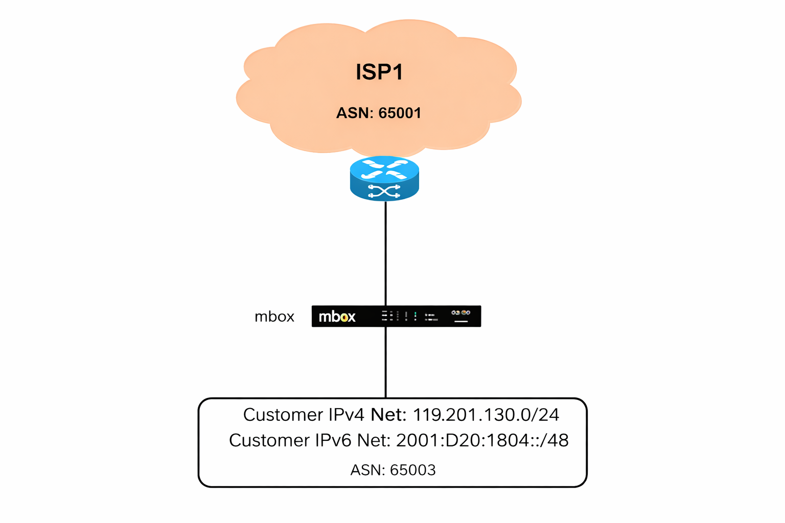
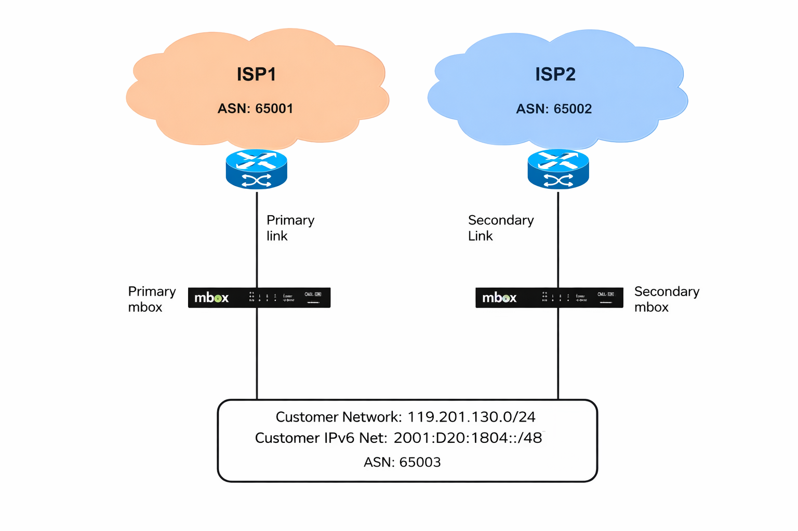
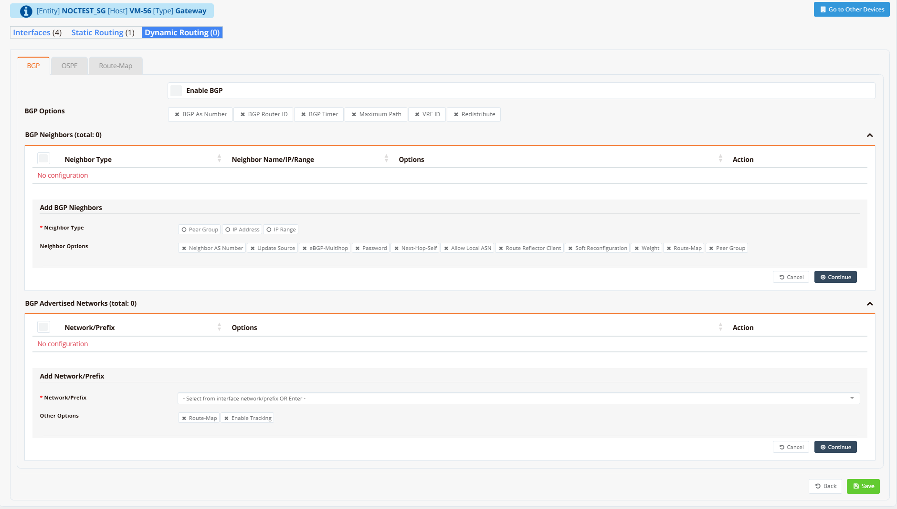

# Dynamic Routing (BGP)

BGP (Border Gateway Protocol) is the routing protocol of the internet — the standard mechanism by which autonomous systems (AS) exchange reachability information across administrative boundaries. Each BGP speaker is identified by an **Autonomous System Number (ASN)**, a globally unique identifier assigned by a regional internet registry (RIR).

RansNet devices support **eBGP** (external BGP, peering between different ASNs) and **iBGP** (internal BGP, peering within the same ASN). The most common deployment is eBGP peering with one or more ISPs to advertise a customer's public IP prefix and receive internet routes or a default route in return.

!!! note
    The mfusion SD-WAN orchestrator automatically generates and manages BGP configuration for SD-WAN tunnel overlays and inter-device route propagation. This page covers **generic BGP configuration** for peering with ISPs or third-party routers outside the SD-WAN domain — for example, when a customer has their own public ASN and IP block.

Key concepts:

| Term | Description |
|---|---|
| **ASN** | Autonomous System Number — a unique identifier for a routing domain. Public ASNs are globally routable; private ASNs (64512–65534) are for internal use only. |
| **eBGP** | External BGP — peering between routers in different ASNs, typically for ISP uplinks. BGP packets have TTL 1 by default, so peers must be directly connected unless `ebgp-multihop` is configured. |
| **iBGP** | Internal BGP — peering between routers within the same ASN, used to distribute routes learned from eBGP peers across the internal network. |
| **Prefix / Network** | The IP subnet being advertised into BGP. The prefix must exist in the local routing table (as a connected or static route) before BGP will announce it. |
| **Local Preference** | A BGP attribute used within an AS to prefer one exit path over another for outbound traffic. Higher value = preferred. Not propagated to eBGP peers. |
| **AS-path prepend** | A traffic engineering technique that artificially lengthens the AS-path by repeating the local ASN, making a prefix appear less preferred to external peers. Used to steer inbound traffic in multi-homed setups. |
| **MED** | Multi-Exit Discriminator — a hint sent to an adjacent AS to influence which of the AS's entry points is preferred for inbound traffic. Lower MED = preferred. |
| **next-hop-self** | Forces the router to advertise itself as the BGP next-hop when passing eBGP-learned routes to iBGP peers, rather than preserving the original eBGP next-hop address. |
| **Route Map** | A policy tool applied inbound or outbound on a neighbour session to filter, modify, or tag BGP routes — set local-preference, MED, AS-path, community, etc. |

---

## Typical Deployments

### Single ISP

A single mbox peers with one ISP using eBGP. The customer advertises their public IPv4 and IPv6 prefixes and receives a default route (or full routing table) from the ISP.



| Parameter | Value |
|---|---|
| **Customer ASN** | `65003` |
| **Customer IPv4 prefix** | `119.201.130.0/24` |
| **Customer IPv6 prefix** | `2001:D20:1804::/48` |
| **ISP1 ASN** | `65001` |

### Dual ISP (Multi-homed)

Two mbox devices each peer with a separate ISP, both advertising the same customer prefix. AS-path prepending on the secondary router steers inbound traffic to prefer the primary link under normal conditions. If the primary link fails, the secondary path is already established and takes over automatically without any manual intervention.



| Parameter | Value |
|---|---|
| **Customer ASN** | `65003` |
| **Customer IPv4 prefix** | `119.201.130.0/24` |
| **Customer IPv6 prefix** | `2001:D20:1804::/48` |
| **ISP1 ASN (primary link)** | `65001` |
| **ISP2 ASN (secondary link)** | `65002` |

---

## GUI Configuration

Navigate to **Device Settings → Network → Dynamic Routing → BGP**.



Toggle **Enable BGP** to activate the BGP process on this device.

**BGP Options**

Expand the following options as needed:

| Option | Description |
|---|---|
| **AS ID** | The local Autonomous System Number for this BGP instance (e.g. `65003`) |
| **BGP Router ID** | A stable 32-bit identifier in IPv4 address format (e.g. `119.201.130.1`). Should match a loopback or primary interface IP. If not set, BGP auto-selects from an active interface — which can reset all sessions if that interface changes. |
| **BGP Timers** | Keepalive and hold-time in seconds (defaults: keepalive `60 s`, hold `180 s`). Reducing these values allows faster failure detection but increases BGP control-plane traffic. Both values must be agreed with the peer. |
| **Maximum Path** | Number of equal-cost BGP paths to install in the routing table simultaneously for ECMP load balancing (e.g. `2` for two ISP links) |
| **Multipath** | Enable BGP multipath — allows routes from multiple eBGP peers to the same destination to be used simultaneously for load balancing |

**BGP Neighbors**

The BGP Neighbors table lists all configured BGP peers. Click **+ Add BGP Neighbors** to open the peer configuration form.

| Field | Description |
|---|---|
| **Neighbor Type** | `IP Address` — a single directly addressed peer. `IP Range` — accept peers from a defined subnet (for route reflector clients or dynamic peering). `Peer Group` — apply a shared configuration to multiple peers. |
| **Neighbor Name / IP** | The peer's IP address (typically the ISP's BGP peering IP), IP subnet, or peer group name |
| **Neighbor AS** | The remote ASN of the peer. For eBGP this is the ISP's ASN; for iBGP it matches the local ASN. |
| **Address Family** | Enable `IPv4 Unicast`, `IPv6 Unicast`, or both. Routes are only exchanged for address families that are activated on both sides. |
| **Auth Password** | MD5 password for BGP TCP session authentication. Must match exactly on both ends. |
| **Allow AS** | Permit routes whose AS-path contains the local ASN (disabled by default to prevent routing loops). Required in specific MPLS VPN scenarios. |
| **Route Reflector** | Designate this peer as a route reflector client. The local router acts as route reflector and re-advertises iBGP routes between clients. |
| **Nexthop** | Enable `next-hop-self` — advertise the local router as the BGP next-hop when sending routes to this peer. Required for iBGP sessions where peers cannot directly reach the original eBGP next-hop. |
| **Weight** | Assign a local weight to all routes received from this peer. Higher weight = preferred path. Weight is local-only and not propagated to other routers. |
| **Peer Group** | Assign this neighbour to a named peer group to inherit a shared set of options |

**BGP Advertised Networks**

The Advertised Networks table defines which prefixes this router announces into BGP. Click **+ Add Network/Prefix** to add an entry.

| Field | Description |
|---|---|
| **Network/Prefix** | The subnet to advertise (e.g. `119.201.130.0/24`). The prefix must be present in the local routing table as a connected or static route for BGP to announce it. |
| **Route Map** | Apply an outbound route-map to set attributes (community, MED, local-preference) on the advertised prefix before sending to peers |
| **Enable Tracking** | Conditionally withdraw the BGP advertisement when a reachability probe fails. See [Tracking — BGP Route](../tracking.md#tracking-bgp-route). |

---

## CLI Configuration

### Single ISP — IPv4 and IPv6

```
router bgp 65003
  bgp router-id 119.201.130.1
  neighbor 203.0.113.1 remote-as 65001
  !
  address-family ipv4 unicast
    network 119.201.130.0/24
    neighbor 203.0.113.1 activate
    neighbor 203.0.113.1 soft-reconfiguration inbound
  exit-address-family
  !
  address-family ipv6 unicast
    network 2001:D20:1804::/48
    neighbor 2001:db8::1 remote-as 65001
    neighbor 2001:db8::1 activate
    neighbor 2001:db8::1 soft-reconfiguration inbound
  exit-address-family
```

**Key points:**

- `router bgp 65003` — starts the BGP process with local ASN `65003`
- `neighbor <IP> remote-as <ASN>` — defines a peer; if the remote ASN differs from the local ASN, the session is eBGP
- `address-family ipv4 unicast` / `address-family ipv6 unicast` — routes are only exchanged for address families explicitly activated on both sides
- `network 119.201.130.0/24` — advertises this prefix to all active peers in the address-family; the route must exist in the local routing table
- `soft-reconfiguration inbound` — stores received routes before policy is applied, enabling policy refresh with `clear bgp soft` without tearing down the session

### Dual ISP — primary router

```
router bgp 65003
  bgp router-id 119.201.130.1
  neighbor 203.0.113.1 remote-as 65001
  !
  address-family ipv4 unicast
    network 119.201.130.0/24
    neighbor 203.0.113.1 activate
    neighbor 203.0.113.1 soft-reconfiguration inbound
  exit-address-family
```

### Dual ISP — secondary router with AS-path prepending

```
router bgp 65003
  bgp router-id 119.201.130.2
  neighbor 198.51.100.1 remote-as 65002
  !
  address-family ipv4 unicast
    network 119.201.130.0/24
    neighbor 198.51.100.1 activate
    neighbor 198.51.100.1 soft-reconfiguration inbound
    neighbor 198.51.100.1 route-map PREPEND-OUT out
  exit-address-family
!
route-map PREPEND-OUT permit 10
  set as-path prepend 65003 65003 65003
```

**Key points:**

- `route-map PREPEND-OUT` applied outbound to ISP2 repeats the local ASN `65003` three times, making the prefix appear three AS hops longer via the secondary path
- ISP2 (and its peers) will prefer the shorter AS-path via ISP1 for inbound traffic under normal conditions
- When the primary link fails and ISP1 withdraws the route, ISP2's path becomes the only available route and activates automatically — no manual intervention required

### eBGP over non-directly-connected peers (multihop)

```
router bgp 65003
  bgp router-id 10.0.0.1
  neighbor 10.0.0.2 remote-as 65001
  neighbor 10.0.0.2 ebgp-multihop 2
  neighbor 10.0.0.2 update-source lo0
  !
  address-family ipv4 unicast
    neighbor 10.0.0.2 activate
  exit-address-family
```

**Key points:**

- `ebgp-multihop <ttl>` — raises the TTL on BGP packets to allow peering across routers that are not directly connected; set the value to the number of hops between the two peers
- `update-source lo0` — binds the BGP session to a loopback address; the session remains stable even if a transit interface goes down or changes IP

### Inbound policy — prefer primary ISP for outbound traffic

```
route-map ISP1-IN permit 10
  set local-preference 200
!
route-map ISP2-IN permit 10
  set local-preference 100
!
router bgp 65003
  neighbor 203.0.113.1 remote-as 65001
  neighbor 198.51.100.1 remote-as 65002
  !
  address-family ipv4 unicast
    network 119.201.130.0/24
    neighbor 203.0.113.1 activate
    neighbor 203.0.113.1 route-map ISP1-IN in
    neighbor 198.51.100.1 activate
    neighbor 198.51.100.1 route-map ISP2-IN in
  exit-address-family
```

**Key points:**

- Routes received from ISP1 are tagged with local-preference `200`; routes from ISP2 with `100`
- BGP path selection prefers higher local-preference, so all outbound traffic uses ISP1 by default
- If ISP1's session drops, ISP2's routes (local-preference `100`) become the best path automatically

### MD5 session authentication

```
router bgp 65003
  neighbor 203.0.113.1 remote-as 65001
  neighbor 203.0.113.1 password MyBGPSecret
```

---

## Verification

View all peer session states:

```
show ip bgp summary
```

Example output:

```
BGP router identifier 119.201.130.1, local AS number 65003
BGP table version is 5

Neighbor        V         AS MsgRcvd MsgSent   TblVer  InQ OutQ  Up/Down State/PfxRcd
203.0.113.1     4      65001     142     138        5    0    0 02:01:14            4
198.51.100.1    4      65002       0       0        0    0    0    never       Active
```

A peer showing a numeric **PfxRcd** value is in **Established** state and exchanging routes. A text state (Active, Idle, Connect, OpenSent) means the session is not up — verify IP reachability to the peer, remote ASN, and MD5 password.

View the full BGP routing table:

```
show ip bgp
```

View routes received from a specific peer (requires `soft-reconfiguration inbound`):

```
show ip bgp neighbor 203.0.113.1 received-routes
```

View routes being advertised to a specific peer:

```
show ip bgp neighbor 203.0.113.1 advertised-routes
```

View detailed session information for a peer:

```
show ip bgp neighbor 203.0.113.1
```

View BGP routes installed in the main routing table:

```
show ip route bgp
```

View IPv6 BGP summary and table:

```
show ipv6 bgp summary
show ipv6 bgp
```
