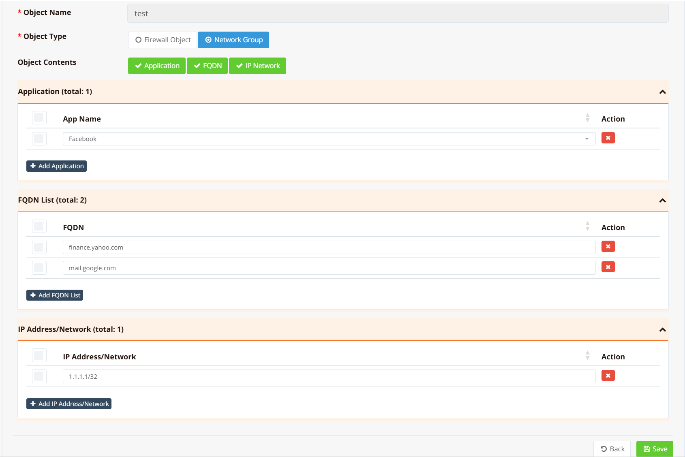
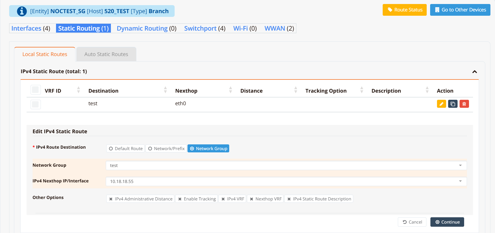

# Network Groups

A Network Group is a named collection of destinations that can be referenced by a static route in place of a single prefix. Instead of creating one static route per destination, you define all destinations in a group and point a single route at them — the router expands the group and installs individual entries automatically.

Beyond simple IP prefixes, a Network Group can include FQDN entries and application names. The system resolves FQDNs to IP addresses and updates the group automatically, giving you dynamic, name-based routing control on top of traditional static routing.

Network Groups are defined globally and shared across the entire entity — the same group can be referenced by multiple routes or different devices within the same entity.

---

## Destination Types

Each group can contain any combination of the following entry types:

| Type | Description |
|---|---|
| **net** | A static IP address or subnet in CIDR notation (e.g., `10.0.0.0/8`, `1.1.1.1/32`) |
| **fqdn** | A fully qualified domain name. The system resolves the name to IPs via DNS and refreshes the resolved addresses every hour. |
| **app** | A named application. The system fetches and maintains the application's IP list from the cloud, refreshed every hour. |

---

## GUI Configuration

Navigate to **ORCHESTRATOR → Templates → Object Groups**, click **New Object Group**.

Enter an object name and select type **Network Group**.



The group contents can combine any of the available entry types:

- **IP Network** — enter a network prefix in CIDR notation. You can add as many prefixes as needed; this is the equivalent of defining a large static address list.
- **FQDN** — enter a domain name. The system resolves it to IPs immediately and re-resolves every hour to track changes.
- **Application** — select from a pre-defined list of applications. The system fetches and maintains the corresponding IP list from the cloud.

Once configured, the Network Group becomes available as a destination option in the static route configuration for each device.

Navigate to **Device Settings → Network → Static Routing**.



---

## CLI Configuration

Define the group and its members, then reference it in a static route:

```
network-group test
  app Facebook
  fqdn finance.yahoo.com
  fqdn mail.google.com
  net 1.1.1.1/32

ip route dst_group test nexthop 10.18.18.55
```

**Key points:**

- The `network-group <name>` command enters the group configuration view. Use `net`, `fqdn`, and `app` subcommands to add members.
- `ip route dst_group <group-name> nexthop <ip>` installs one static route per resolved destination in the group, all pointing to the same next hop.
- FQDN and app entries are resolved at configuration time. The tracking daemon re-resolves them every hour and updates the routing table incrementally — adding new IPs and removing stale ones without disrupting active entries.

---

## Verification

Show the resolved IP list for a group:

```
show network-list test
```

Example output:

```
1.1.1.1/32
106.10.236.37/32
106.10.236.40/32
112.215.156.17/32
112.215.156.82/32
112.215.156.145/32
112.215.156.212/32
140.213.27.17/32
140.213.27.30/32
172.217.194.17/32
172.217.194.18/32
172.217.194.19/32
172.217.194.83/32
180.222.114.11/32
180.222.114.12/32
57.144.128.5/32
57.144.186.1/32
57.144.186.2/32
57.144.186.6/32
57.144.186.8/32
57.144.186.128/32
57.144.186.129/32
57.144.186.130/32
57.144.186.141/32
57.144.186.144/32
57.144.186.145/32
57.144.186.155/32
57.144.187.134/32
```

Show the installed static routes expanded from the group:

```
show ip route static
```

Example output:

```
Codes: K - kernel route, C - connected, S - static, R - RIP,
       O - OSPF, B - BGP, N - NHRP, T - Table, v - VNC,
       V - VNC-Direct,
       > - selected route, * - FIB route, q - queued, r - rejected, b - backup

S>* 1.1.1.1/32 [9/0] via 10.18.18.55, br-vlan1, weight 1, 00:01:29
S>* 57.144.128.5/32 [9/0] via 10.18.18.55, br-vlan1, weight 1, 00:01:07
S>* 57.144.186.1/32 [9/0] via 10.18.18.55, br-vlan1, weight 1, 00:01:05
S>* 57.144.186.2/32 [9/0] via 10.18.18.55, br-vlan1, weight 1, 00:00:51
S>* 57.144.186.6/32 [9/0] via 10.18.18.55, br-vlan1, weight 1, 00:00:50
S>* 57.144.186.8/32 [9/0] via 10.18.18.55, br-vlan1, weight 1, 00:00:48
S>* 57.144.186.128/32 [9/0] via 10.18.18.55, br-vlan1, weight 1, 00:01:03
S>* 57.144.186.129/32 [9/0] via 10.18.18.55, br-vlan1, weight 1, 00:01:02
S>* 57.144.186.130/32 [9/0] via 10.18.18.55, br-vlan1, weight 1, 00:01:00
S>* 57.144.186.141/32 [9/0] via 10.18.18.55, br-vlan1, weight 1, 00:00:58
S>* 57.144.186.144/32 [9/0] via 10.18.18.55, br-vlan1, weight 1, 00:00:57
S>* 57.144.186.145/32 [9/0] via 10.18.18.55, br-vlan1, weight 1, 00:00:55
S>* 57.144.186.155/32 [9/0] via 10.18.18.55, br-vlan1, weight 1, 00:00:53
S>* 57.144.187.134/32 [9/0] via 10.18.18.55, br-vlan1, weight 1, 00:00:46
S>* 106.10.236.37/32 [9/0] via 10.18.18.55, br-vlan1, weight 1, 00:01:27
S>* 106.10.236.40/32 [9/0] via 10.18.18.55, br-vlan1, weight 1, 00:01:25
S>* 112.215.156.17/32 [9/0] via 10.18.18.55, br-vlan1, weight 1, 00:01:22
S>* 112.215.156.82/32 [9/0] via 10.18.18.55, br-vlan1, weight 1, 00:01:19
S>* 112.215.156.145/32 [9/0] via 10.18.18.55, br-vlan1, weight 1, 00:01:24
S>* 112.215.156.212/32 [9/0] via 10.18.18.55, br-vlan1, weight 1, 00:01:20
S>* 140.213.27.17/32 [9/0] via 10.18.18.55, br-vlan1, weight 1, 00:01:17
S>* 140.213.27.30/32 [9/0] via 10.18.18.55, br-vlan1, weight 1, 00:01:15
S>* 172.217.194.17/32 [9/0] via 10.18.18.55, br-vlan1, weight 1, 00:00:45
S>* 172.217.194.18/32 [9/0] via 10.18.18.55, br-vlan1, weight 1, 00:00:43
S>* 172.217.194.19/32 [9/0] via 10.18.18.55, br-vlan1, weight 1, 00:00:41
S>* 172.217.194.83/32 [9/0] via 10.18.18.55, br-vlan1, weight 1, 00:00:40
S>* 180.222.114.11/32 [9/0] via 10.18.18.55, br-vlan1, weight 1, 00:01:14
S>* 180.222.114.12/32 [9/0] via 10.18.18.55, br-vlan1, weight 1, 00:01:12
```

Each `S>*` entry is an individual route installed from the group. As FQDN or app IPs change, entries are added or removed automatically without clearing the entire route table.
