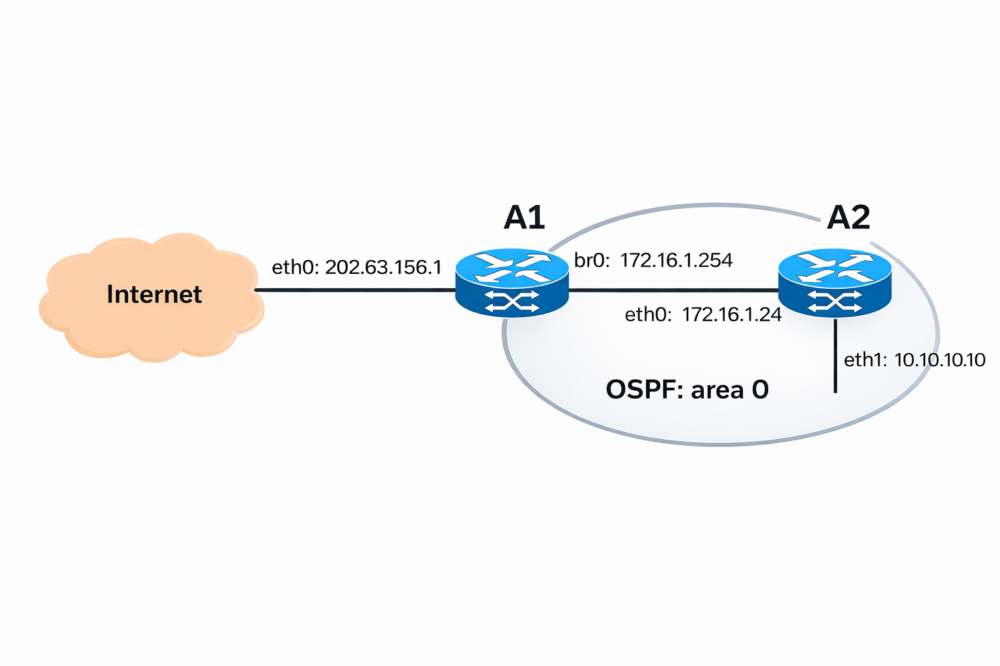
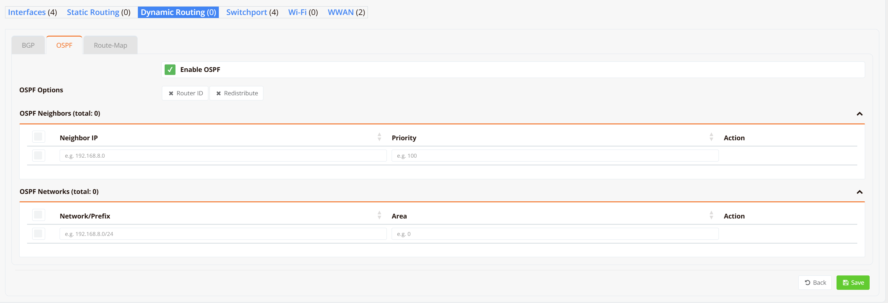

# Dynamic Routing (OSPF)

OSPF (Open Shortest Path First) is a link-state interior gateway protocol (IGP) standardised in RFC 2328. Unlike distance-vector protocols that only know next-hop direction, each OSPF router builds a complete map of the network topology — the link-state database — and uses Dijkstra's shortest path algorithm to independently compute optimal, loop-free routes. This makes OSPF fast to converge and well-suited to networks where topology changes frequently or where maintaining static routes across many routers becomes impractical.

OSPF is commonly used in RansNet deployments to exchange routing information between a branch router and on-premise infrastructure (core switches, firewalls, or data centre routers), or to propagate a default route from a gateway router to all connected internal routers.

Key concepts:

| Term | Description |
|---|---|
| **Area** | A logical grouping of routers that share the same link-state database. All areas must connect to the backbone (**area 0**). Dividing a network into areas limits LSA flooding and reduces CPU load. |
| **Router ID** | A unique 32-bit identifier (in IPv4 address format) assigned to each OSPF router. Set this explicitly for stability — if not configured, OSPF auto-selects from an active interface IP, which can change. |
| **Cost** | OSPF selects paths by minimising cumulative interface cost. The default cost is `100 / interface_bandwidth_Mbps` but can be set manually per interface to influence path selection. |
| **DR / BDR** | On broadcast segments (Ethernet), OSPF elects a Designated Router (DR) and Backup DR (BDR) to reduce flooding. Higher interface priority wins the election; equal priority falls back to Router ID. Set priority to `0` to exclude a router from election. |
| **Passive interface** | An interface included in OSPF advertisements (the prefix is announced) but on which no hello packets are sent and no neighbours are formed. Use this on WAN or untrusted interfaces. |
| **Redistribute** | Imports routes from another source (connected, static, BGP) into OSPF as external routes (Type 5 LSA). |

---

## Typical Deployment

The following topology illustrates a two-router OSPF setup: **A1** is an internet-facing gateway and **A2** is an internal router. Both participate in OSPF area 0 to exchange routing information dynamically.



| Device | Interface | Address | Role |
|---|---|---|---|
| **A1** | `eth0` | `202.63.156.1` | WAN uplink to internet |
| **A1** | `br0` | `172.16.1.254` | Internal segment, OSPF area 0 |
| **A2** | `eth0` | `172.16.1.24` | Uplink to A1, OSPF area 0 |
| **A2** | `eth1` | `10.10.10.10` | LAN segment advertised into OSPF |

A1 originates the default route into OSPF so A2 learns how to reach the internet. A2 advertises its `10.10.10.0/24` LAN prefix so A1 (and any other OSPF peers) can route traffic back to it.

---

## GUI Configuration

Navigate to **Device Settings → Network → Dynamic Routing → OSPF**.



Toggle **Enable OSPF** to activate the OSPF process on this device.

**OSPF Options**

Expand the following options as needed:

| Option | Description |
|---|---|
| **Router ID** | Assign a fixed 32-bit router identity in IPv4 address format (e.g. `172.16.1.254`). If left unset, OSPF auto-selects from an active interface IP, which can change and cause adjacency resets. Setting an explicit Router ID is strongly recommended. |
| **Redistribute** | Inject routes from other sources into OSPF as external routes. Enables redistribution of connected prefixes, static routes, or BGP routes into the OSPF domain. |

**OSPF Neighbors**

The Neighbors table lists manually configured OSPF neighbours. This is only needed on **non-broadcast** networks (e.g. NBMA or point-to-multipoint) where OSPF cannot discover neighbours via multicast. On standard Ethernet segments, neighbour discovery is automatic and this table can be left empty.

| Field | Description |
|---|---|
| **Neighbor IP** | The unicast IP address of the OSPF neighbour to contact manually (e.g. `192.168.8.0`) |
| **Priority** | The neighbour's DR election priority as seen from this router (e.g. `100`) |

**OSPF Networks**

The Networks table defines which interfaces participate in OSPF and which prefixes are advertised into the OSPF domain. Each entry maps a network prefix to an OSPF area.

| Field | Description |
|---|---|
| **Network/Prefix** | The subnet to enable OSPF on, in CIDR notation (e.g. `192.168.8.0/24`). OSPF will activate on any interface whose IP falls within this prefix. |
| **Area** | The OSPF area number this prefix belongs to (e.g. `0` for the backbone area). All routers sharing a segment must agree on the area. |

Click **+ Add** in each table to add a new neighbour or network entry. Click **Save** when done.

---

## CLI Configuration

### Basic setup — Router A1 (gateway)

```
router ospf
  router-id 172.16.1.254
  network 172.16.1.0/24 area 0
  default-information originate
  passive-interface eth0
```

**Key points:**

- `router-id 172.16.1.254` — sets an explicit, stable router ID; using the internal interface IP is recommended
- `network 172.16.1.0/24 area 0` — enables OSPF on `br0` and advertises the prefix into area 0
- `default-information originate` — redistributes A1's default route into OSPF so downstream routers (A2) learn a default gateway automatically
- `passive-interface eth0` — suppresses hello packets on the WAN interface; the interface is not included in OSPF advertisements and no neighbour adjacency can form on it

### Basic setup — Router A2 (internal router)

```
router ospf
  router-id 172.16.1.24
  network 172.16.1.0/24 area 0
  network 10.10.10.0/24 area 0
```

**Key points:**

- `network 172.16.1.0/24 area 0` — enables OSPF on `eth0` and forms a neighbour adjacency with A1
- `network 10.10.10.0/24 area 0` — advertises the `eth1` LAN prefix into OSPF, making it reachable by A1 and any other OSPF peers

### Redistributing connected and static routes

```
router ospf
  router-id 10.0.0.1
  network 172.16.1.0/24 area 0
  redistribute connected route-map OSPF-REDIST
  redistribute static route-map OSPF-REDIST
```

**Key points:**

- `redistribute connected` — injects all directly connected prefixes not already covered by a `network` statement as external OSPF routes (Type 5 LSA / ASBR)
- `redistribute static` — injects manually configured static routes into OSPF; useful for summarising or injecting routes learned from non-OSPF sources
- A `route-map` is required to control which routes are redistributed and optionally set the external metric

### OSPF within a VRF

```
router ospf vrf 4
  router-id 10.0.0.1
  network 192.168.10.0/24 area 0
```

### Interface cost and timers

```
interface eth0
  ip ospf cost 100
  ip ospf hello-interval 10
  ip ospf dead-interval 40
  ip ospf priority 1
```

**Key points:**

- `cost` — lower cost = preferred path; range `1`–`65535`. Set manually to influence traffic engineering when multiple paths exist.
- `hello-interval` — how often hello packets are sent in seconds (default: `10` on broadcast networks). **Must match between neighbours** or the adjacency will not form.
- `dead-interval` — how long before declaring a neighbour unreachable (default: `40` seconds; typically 4× hello). **Must match between neighbours.**
- `priority` — DR/BDR election weight; higher = more likely to become DR. Set to `0` to prevent this router from ever becoming DR.

### Point-to-point links (VPN tunnels, PPPoE)

```
interface tun0
  ip ospf network point-to-point
  ip ospf cost 50
```

!!! note
    On point-to-point interfaces there is no DR/BDR election — the two endpoints form a direct adjacency immediately. Always set `ip ospf network point-to-point` on tunnel or PPPoE interfaces to avoid election delays and adjacency failures.

### MD5 authentication

```
router ospf
  area 0 authentication message-digest
!
interface eth0
  ip ospf message-digest-key 1 md5 MySecretKey
```

**Key points:**

- `area 0 authentication message-digest` — enables MD5 authentication for all interfaces in area 0
- `ip ospf message-digest-key <key-id> md5 <password>` — sets the key on each participating interface; key ID and password must match on both sides of the adjacency

---

## Verification

View OSPF process summary and area status:

```
show ip ospf
```

Example output:

```
 OSPF Routing Process, Router ID: 172.16.1.254
 ...
 Number of areas attached to this router: 1

 Area ID: 0.0.0.0 (Backbone)
   Number of interfaces in this area: 1
   Number of fully adjacent neighbors in this area: 1
```

Check neighbour adjacency state:

```
show ip ospf neighbor
```

Example output:

```
Neighbor ID     Pri State           Dead Time Address         Interface
172.16.1.24       1 Full/DR         00:00:35  172.16.1.24     br0:172.16.1.254
```

A neighbour in **Full** state has completed LSA exchange and the adjacency is fully operational. Any other state (Init, 2-Way, ExStart, Exchange, Loading) indicates the adjacency is still forming or has stalled — check that hello/dead timers and authentication match on both sides.

View OSPF-computed routes:

```
show ip ospf route
```

Example output:

```
============ OSPF network routing table ============
N    10.10.10.0/24         [10] area: 0.0.0.0
                           via 172.16.1.24, br0

============ OSPF router routing table =============
R    172.16.1.24           [10] area: 0.0.0.0, ASBR
                           via 172.16.1.24, br0

============ OSPF external routing table ===========
N E2 0.0.0.0/0             [10/1] tag: 0
                           via 172.16.1.254, eth0
```

Check OSPF state on a specific interface:

```
show ip ospf interface br0
```

Example output:

```
br0 is up
  Internet Address 172.16.1.254/24, Area 0.0.0.0
  Router ID 172.16.1.254, Network Type BROADCAST, Cost: 1
  Transmit Delay is 1 sec, State DR, Priority 1
  Designated Router (ID) 172.16.1.254, Interface Address 172.16.1.254
  Backup Designated Router (ID) 172.16.1.24, Interface Address 172.16.1.24
  Timer intervals configured, Hello 10s, Dead 40s, Retransmit 5
  Neighbor Count is 1, Adjacent neighbor count is 1
```

View the link-state database:

```
show ip ospf database
```

View OSPF routes installed in the routing table alongside all other route sources:

```
show ip route ospf
```
