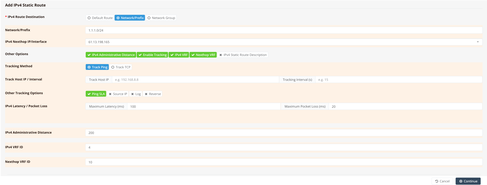
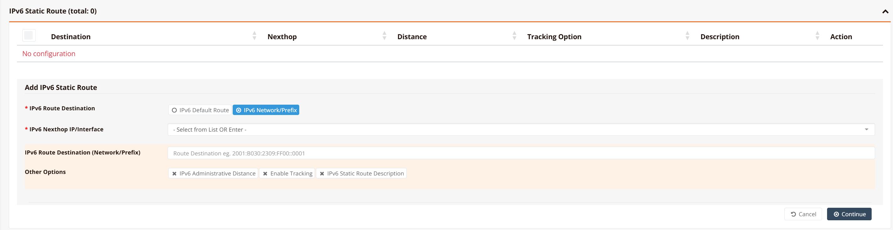

# Static Routing

Static routing lets you manually define routes to specific destinations, giving you precise control over traffic forwarding. Unlike dynamic routing protocols, static routes do not adapt automatically to topology changes — they are best suited for fixed, predictable paths such as default gateways, routes to specific subnets, or backup paths that should only activate when a primary link fails.

Both IPv4 and IPv6 static routes are supported. Each route can optionally be bound to a reachability probe that monitors next-hop health and withdraws the route from the routing table if the probe fails — providing route-level failover without requiring a full Multi-WAN configuration.

---

## GUI Configuration

Navigate to **Device Settings → Network → Static Routing**.

### IPv4 Static Routes



Click **+ Add** to open the IPv4 route configuration form.

**Route Destination**

Select the destination type for this route:

| Option | Description |
|---|---|
| **Default Route** | Installs `0.0.0.0/0` — the catch-all route used when no more-specific prefix matches. Equivalent to a default gateway entry. |
| **Network/Prefix** | A specific destination subnet in CIDR notation (e.g., `1.1.1.0/24`) |
| **Network Group** | Apply this route to a named group of prefixes configured under Network Objects |

**IPv4 Nexthop IP/Interface**

Enter the IP address of the next-hop router, or the exit interface name for point-to-point links (e.g., `ppp0`, `wwan0`). See [Nexthop: IP Address vs Interface](#nexthop-ip-address-vs-interface) for guidance on which format to use.

**Other Options**

Expand the following options as needed:

| Option | Description |
|---|---|
| **IPv4 Administrative Distance** | Route priority relative to other routes to the same destination. Lower values are preferred. The default for static routes is `1`; increase this to make the route a lower-priority fallback (e.g., `200` for a backup path). Range: `1`–`254`. |
| **Enable Tracking** | Attach a reachability probe to this route. If the probe fails, the route is withdrawn from the routing table until the probe recovers. |
| **IPv4 VRF** | Assign this route to a specific VRF instance by numeric ID. The route will only be visible and active within that VRF. |
| **Nexthop VRF** | The VRF instance in which the next-hop address is resolved. Used for inter-VRF route leaking — when the route destination belongs to one VRF but the next-hop gateway lives in another. |
| **IPv4 Static Route Description** | Optional free-text label for this route entry |

**Tracking Configuration**

When **Enable Tracking** is selected, configure the probe parameters. For a full description of all tracking fields and SLA thresholds, see [Tracking — Static Route](../tracking.md#tracking-static-route).

---

### IPv6 Static Routes



The IPv6 Static Routes table lists all configured routes with their **Destination**, **Nexthop**, **Distance**, **Tracking Option**, and **Description**. Click **+ Add** to open the route form.

| Field | Description |
|---|---|
| **IPv6 Route Destination** | `IPv6 Default Route` installs `::/0`. `IPv6 Network/Prefix` — enter the specific destination in full IPv6 CIDR notation (e.g., `2001:8020:2309:F100::/64`). |
| **IPv6 Nexthop IP/Interface** | The IPv6 address of the next-hop router, or an exit interface name for point-to-point links |
| **IPv6 Administrative Distance** | Route priority — lower value is preferred. Default is `1`. |
| **Enable Tracking** | Attach an ICMP or TCP reachability probe to monitor next-hop health |
| **IPv6 Static Route Description** | Optional label for this route entry |

---

## CLI Configuration

### Default gateway

```
ip route 0.0.0.0/0 nexthop 61.13.198.165
```

### Route to a specific prefix

```
ip route 192.168.100.0/24 nexthop 10.0.0.1
```

### Route with ICMP tracking and administrative distance

```
ip route 1.1.1.0/24 nexthop 61.13.198.165 track icmp 61.13.198.165 30 max 100 20 distance 200
```

**Key points:**

- `track icmp <host> <interval>` — probes `61.13.198.165` with ICMP every `30` seconds
- `max 100 20` — probe fails if round-trip latency exceeds `100 ms` or packet loss exceeds `20%`; when failed, the route is removed from the routing table
- `distance 200` — administrative distance of `200` makes this a low-priority backup; the route only becomes active if no lower-distance route to the same prefix exists

### Route with VRF and inter-VRF nexthop lookup

```
ip route 1.1.1.0/24 nexthop 61.13.198.165 track icmp 61.13.198.165 30 max 100 20 distance 200 vrf 4 nexthop-vrf 10
```

**Key points:**

- `vrf 4` — installs this route into VRF instance `4`; the route is only visible to traffic in that VRF
- `nexthop-vrf 10` — resolves the next-hop address `61.13.198.165` within VRF `10`, allowing the route to forward traffic across VRF boundaries (inter-VRF route leaking)

### Default route via a point-to-point interface

```
ip route 0.0.0.0/0 nexthop wwan0
```

### IPv6 static route

```
ipv6 route 2001:db8::/32 nexthop 2001:db8::1
```

### IPv6 default route

```
ipv6 route ::/0 nexthop 2001:db8::1
```

---

## Nexthop: IP Address vs Interface

When configuring a static route, the next-hop can be specified as either a **router IP address** or an **exit interface name**. The correct form depends on the interface type:

| Interface Type | Recommended Nexthop | Reason |
|---|---|---|
| **Ethernet** (physical, VLAN, bridge) | IP address — `nexthop 61.13.198.165` | On multi-point links, the router must ARP for the next-hop MAC address. Specifying an interface name causes the router to treat the destination as directly attached, resulting in ARP broadcast failures and dropped traffic. |
| **PPPoE** | IP address or interface name — `nexthop ppp0` | Point-to-point — only one neighbor exists on the link, so either form resolves correctly. |
| **LTE / WWAN** | IP address or interface name — `nexthop wwan0` | Point-to-point — same behaviour as PPPoE. |

!!! tip
    When in doubt, always specify the next-hop router's IP address. It works correctly on all interface types and makes the intended forwarding path explicit.

---

## Verification

List all active static routes:

```
show ip route static
```

Example output:

```
Codes: K - kernel route, C - connected, S - static, R - RIP,
       O - OSPF, I - IS-IS, B - BGP, E - EIGRP, N - NHRP,
       T - Table, v - VNC, V - VNC-Direct, A - Babel, F - PBR,
       > - selected route, * - FIB route, q - queued, r - rejected, b - backup

S>* 0.0.0.0/0 [1/0] via 61.13.198.165, eth0, weight 1, 00:42:11
S>* 1.1.1.0/24 [200/0] via 61.13.198.165, eth0, weight 1, 00:12:03
```

A route marked `>*` is both selected as the best match and installed in the forwarding table. A route shown without this prefix is known but not currently active — for example, when its tracking probe has failed.

Inspect a specific route:

```
show ip route 1.1.1.0/24
```

Example output:

```
Routing entry for 1.1.1.0/24
  Known via "static", distance 200, metric 0
  Last update 00:12:03 ago
  * 61.13.198.165, via eth0, weight 1
```

Show IPv6 static routes:

```
show ipv6 route static
```
