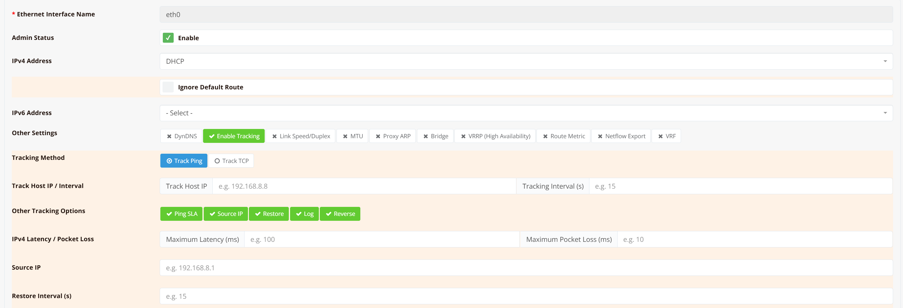
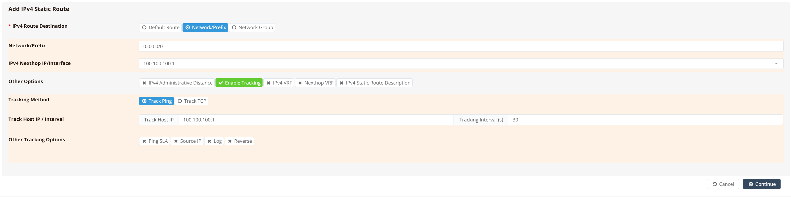
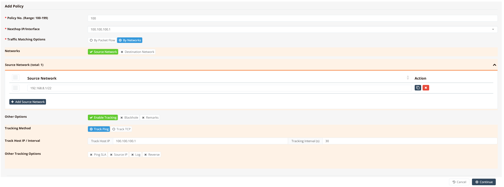
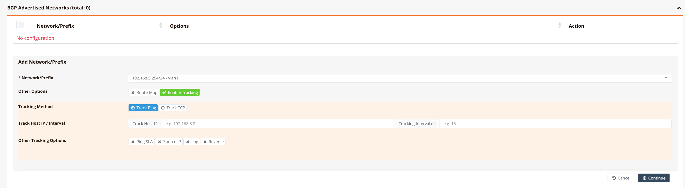
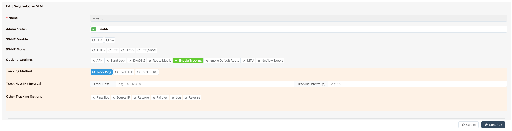
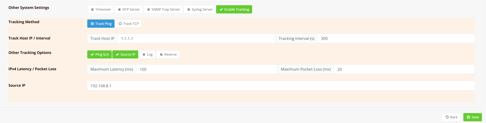

# Tracking Features

RansNet SD-WAN routers include a built-in tracking engine that continuously monitors network reachability and automatically reacts to changes. Rather than relying on link-state signals alone (which only detect physical failures), tracking probes real connectivity to a target host — so the router can detect upstream failures, degraded paths, or logical connectivity loss even when a link appears physically up.

When a tracked target becomes unreachable, the router takes a configured action: disabling an interface, withdrawing a route, or resetting a cellular connection. When the target recovers, the action is reversed and the original state is restored.

## Use Cases

| Context | What tracking controls |
|---|---|
| Interface settings | Enable or disable the interface |
| Static routing | Inject or withdraw a static route |
| Traffic steering (PBR) | Inject or withdraw a policy-based route |
| BGP network advertisement | Advertise or withdraw a BGP prefix |
| WWAN / SIM | Reset the mobile connection, or switch cellular mode |

## Common Options

All tracking contexts share the same set of probe options:

| Field | Description |
|---|---|
| **Tracking Method** | `Track Ping` (ICMP) — sends periodic ICMP echo requests to the target. Supports SLA thresholds for nuanced failure detection. `Track TCP` — attempts a TCP connection to verify reachability; use this when ICMP is blocked by the upstream network or firewall. |
| **Track Host IP** | The IP address to probe. Typically the next-hop router or a reliable host beyond it (e.g., `8.8.8.8`). |
| **Tracking Interval (s)** | How often probes are sent, in seconds (e.g., `30`) |
| **Ping SLA** | Enable SLA-based tracking: the action is triggered when latency or packet loss exceeds the configured thresholds, even if the host is technically responding to probes. |
| **Maximum Latency (ms)** | Round-trip latency threshold in milliseconds. Probes exceeding this value count as failures (e.g., `100`). Applies only when Ping SLA is enabled. |
| **Maximum Packet Loss (%)** | Percentage of lost probe packets before the tracked object is considered down (e.g., `20`). Applies only when Ping SLA is enabled. |
| **Source IP** | Source IP address for probe packets. Specify when verifying reachability via a particular path, or when the default source IP is ambiguous on a multi-homed device. |
| **Log** | Log tracking state changes and probe results to syslog. Useful during commissioning and troubleshooting. |
| **Reverse** | Invert the tracking logic — the configured action triggers when the probe *succeeds* instead of when it fails. Useful for enabling a backup object only when the primary becomes unavailable. |

---

## Tracking Interfaces

Interface tracking ties the administrative state of an interface to the reachability of an external host. If the tracked host becomes unreachable, the router disables the interface — removing it from routing and freeing the path for a backup. When connectivity is restored, the interface is re-enabled automatically.

A common use case is an optional or backup WAN interface: keep it disabled under normal conditions, and only bring it up when the primary WAN's upstream target is no longer reachable (using the **Reverse** option).

!!! note
    Tracking probes run independently of the physical interface state. A tracked object can be deactivated even when the interface is physically up — for example, if the upstream router is reachable at Layer 2 but connectivity beyond it has failed.

### GUI Configuration

Navigate to **Device Settings → Network → Interfaces**. Click an interface to open its settings, then click **Enable Tracking**.



### CLI Configuration

```
interface eth0
 ip address dhcp
 track icmp 10.18.18.99 30 src 10.18.18.1 log
```

!!! note
    Always specify a source IP that belongs to a separate, always-up interface — not the interface being tracked. If you use the tracked interface's own IP as the source, probes will always fail once the interface is disabled, preventing it from ever recovering.

---

## Tracking Static Route

Static route tracking allows a route to be conditionally present in the routing table based on reachability. The route is injected when the tracked target is reachable, and withdrawn when it is not.

This pattern is commonly called a **floating static route**. It is typically deployed alongside a backup default route at a higher administrative distance. Under normal conditions, the tracked primary route wins; if the primary path fails, the tracked route is withdrawn and traffic falls back to the backup automatically.

### GUI Configuration

Navigate to **Device Settings → Network → Static Routing**. Click to add or edit a route.



In this example, the default route via `100.100.100.1` is only active when the nexthop is reachable. If the upstream fails, the route is withdrawn and a backup (higher-metric) default takes over.

!!! tip
    For deeper upstream validation, track an IP further into the upstream network rather than just the immediate next-hop. This catches scenarios where the next-hop itself is up but connectivity beyond it has failed.

    Always specify a **Source IP** bound to the interface being tracked. In a multi-WAN setup, the probe target may be reachable via an alternate path, causing the probe to succeed even when the intended WAN link has failed — leaving a stale route in the table that attracts traffic it cannot deliver.

### CLI Configuration

```
ip route 0.0.0.0/0 nexthop 100.100.100.1 track icmp 100.100.100.1 30
```

---

## Tracking VRRP

VRRP tracking monitors a reachability target and stops or resumes a router's participation in a VRRP group based on the result. When the probe fails, the router withdraws from the group entirely — it stops sending advertisements and releases the VIP if it was MASTER — allowing the highest-priority remaining member to take over. When the probe recovers, participation resumes and the MASTER role is reclaimed.

This is the preferred mechanism for ensuring that a VRRP MASTER only holds the VIP when it has a working upstream path. Without tracking, a router whose WAN link has failed will continue to hold the VIP and attract traffic it cannot forward — a split-brain condition.

### GUI Configuration

Navigate to **Device Settings → Network → Interfaces**. Click an interface to open its settings, then expand the **VRRP** section, edit a VRRP group, and enable **Tracking Method**.

For a full description of all probe configuration fields, see [Common Options](#common-options).

### CLI Configuration

```
interface vlan 1 11
  vrrp-group 11
    priority 120
    virtual_ipaddress 10.10.10.1
    track icmp 1.1.1.1 30
```

In this example, VRRP group 11 has no explicit `enable` statement — its active state is governed entirely by the tracking result. The router participates as MASTER when `1.1.1.1` is reachable, and withdraws from the group when the probe fails.

!!! tip
    Track a host that is reachable via the upstream WAN path — such as the ISP gateway or a public DNS server — rather than a host on the LAN. This ensures the VRRP failover reflects actual WAN reachability, not just local link state.

---

## Tracking Policy-Based Route

Policy-based routing (PBR) allows traffic to be steered based on criteria beyond the destination address (e.g. source subnet, DSCP mark). PBR tracking works the same way as static route tracking — the PBR rule is only active when the tracked target is reachable.

The key advantage of PBR over static routing in a multi-WAN scenario is precedence. In most deployments, the WAN interfaces use DHCP, which installs kernel-level default routes. Kernel routes supersede static routes, so a static backup default may never be reached. PBR operates above the kernel routing table, so a tracked PBR rule will take effect regardless of what kernel or static routes are present — giving you reliable, deterministic traffic steering even in mixed-WAN environments.

### GUI Configuration

Navigate to **Device Settings → SD-WAN → Traffic Steering**. Click to add or edit a rule.



### CLI Configuration

```
ip pbr policy 100 src 192.168.8.0/22
ip pbr 100 nexthop 100.100.100.1 track icmp 1.1.1.1 15
```

In this example, traffic from `192.168.8.0/22` is steered via `100.100.100.1` as long as `1.1.1.1` is reachable. If tracking fails, the PBR rule is withdrawn and traffic follows normal routing.

!!! tip
     PBR route tracking will automatically use the nexthop interface as the tracking source. However, you can still explicitly specify tracking source if needed.

---

## Tracking BGP Route

By default, BGP advertises a connected prefix only when the corresponding interface is up. This works well for physical interfaces, but causes a problem on platforms where LAN interfaces are always logically up regardless of physical connectivity.

On HSA-520 series devices, the LAN interface is a VLAN interface — it remains administratively up even when the downstream switch or cable is unplugged. BGP has no visibility into this failure and will continue advertising the LAN prefix to peers, attracting traffic that cannot actually be delivered. BGP tracking solves this by tying prefix advertisement to a tracked host on the LAN segment.

When the tracked LAN host becomes unreachable (indicating a switch failure, cable pull, or downstream device outage), the router withdraws the BGP advertisement immediately, preventing upstream peers from forwarding traffic down a broken path.

### GUI Configuration

Navigate to the BGP configuration section (under **SD-WAN** or **Dynamic Routing**, depending on your deployment), and open the advertised network entry:



### CLI Configuration

```
router 65051
 ...
 network 192.168.5.254/24 track icmp 192.168.5.6 30
```

Set the tracked IP to a known-static host on the LAN (e.g. a server or a managed switch with a fixed IP). When that host becomes unreachable, the prefix is withdrawn from BGP within one tracking interval.

---

## Tracking WWAN/SIM Connections

### Connection Reset Behavior

WWAN tracking behaves differently from interface tracking. Rather than permanently disabling the interface on failure, the system briefly resets the cellular connection and immediately attempts to re-establish it. This is intentional.

Cellular networks are not perfectly stable — as a device moves between coverage areas, it can remain radio-associated with a distant tower while losing routable connectivity through that tower's backhaul. From the router's perspective, the interface is "up" but traffic goes nowhere. A connection reset forces the modem to re-register, pick up a nearby tower, and re-establish a fresh PDP context, restoring connectivity within seconds.

This behavior also benefits devices using **multi-profile SIMs** — a single SIM card with multiple carrier profiles loaded. When one profile fails, the reset cycle allows the system to try the next available profile automatically, without manual intervention.

**GUI Configuration**

Navigate to **Device Settings → Network → WWAN**.



**CLI Configuration**

```
interface wwan0
 track icmp 1.1.1.1 30
```

!!! note
    WWAN tracking has one additional tracking method beyond ICMP and TCP: **RSRQ** (Reference Signal Received Quality). RSRQ reflects radio signal quality rather than upper-layer IP reachability, making it useful for detecting degraded radio conditions before connectivity is fully lost.

### Switch Cellular Mode (5G → 4G)

RansNet cellular routers can automatically fall back from 5G to 4G LTE when end-to-end connectivity is lost over the 5G path — even when the 5G radio itself appears operational.

When 5G radio coverage is simply unavailable (the RAN is out of range or powered down), the modem falls back to LTE automatically without any tracking configuration. This section addresses a different and more subtle failure mode: the modem is registered on a 5G cell and the radio link is active, but the **5G core network (5GC)** has a fault. Traffic enters the 5G RAN but is silently dropped before reaching the internet. From the router's perspective, the `wwan` interface is up and the modem reports a healthy 5G connection — but no data flows.

A simple connection reset does not resolve this. The modem will re-associate with the same 5G cell and re-attach to the same faulty 5GC. The correct response is to switch the radio access technology to LTE, which uses a completely separate core network (the 4G EPC) and an independent backhaul path, bypassing the faulty 5GC entirely.

Configuring `nr-mode` with a tracking probe automates this: if the probe target becomes unreachable while in 5G mode, the router switches the modem to LTE and remains on LTE until the next reboot.

**CLI Configuration**

```
interface wwan0
 nr-mode NR5G track icmp 1.1.1.1 30 failover LTE
```

**Key points:**

- `nr-mode NR5G` — sets the preferred radio access mode to 5G NR
- `track icmp 1.1.1.1 30` — probes `1.1.1.1` every `30` seconds; probe failure indicates end-to-end connectivity loss
- `failover LTE` — switches the modem to LTE mode on probe failure; the router remains on LTE until reboot and does not attempt to switch back to 5G automatically

!!! note
    Once failover to LTE occurs, the router stays on LTE until the next reboot. It will not attempt to recover back to 5G mode automatically, to avoid flapping between modes. Choose a probe target that is reachable over the 5G path — such as a public DNS server (`1.1.1.1`, `8.8.8.8`).

---

## Tracking System Reachability

System reachability tracking is a last-resort watchdog mechanism that operates at the router level rather than at the interface or route level. Instead of withdrawing a route or disabling an interface on failure, it **reboots the router** — the assumption being that the device has entered a state it cannot self-recover from, and that a clean restart is the safest way to restore connectivity.

This is appropriate in scenarios where interface and route tracking have not resolved the problem — for example, a software deadlock, a hung process, a routing table inconsistency, or a connectivity issue (e.g., an auto-sensing fault with an adjacent device or a stale cellular attachment) that leaves the router unable to forward traffic despite all interfaces appearing up. Because a reboot is disruptive, system tracking should be configured with a long probe interval and strict failure thresholds to avoid unnecessary restarts.

### GUI Configuration

Navigate to **Device Settings → System → Other Settings**, then open the **Tracking** tab.



The configuration fields are the same as the [Common Options](#common-options) described above. In the example shown, the router probes `1.1.1.1` every `300` seconds using ICMP, with Ping SLA thresholds of `100 ms` latency and `20%` packet loss. Source IP is bound to `192.168.8.1`.

!!! note
    The router requires **2 consecutive probe failures** before triggering a reboot. With a 300-second interval, this means the target must be continuously unreachable for at least **10 minutes** before any action is taken.

### CLI Configuration

```
ip track icmp 1.1.1.1 300 max 100 20 src 192.168.8.1
```

**Key points:**

- `ip track` — configures system-level tracking; unlike interface or route tracking, this command is global and not tied to any specific object
- `icmp 1.1.1.1 300` — probes `1.1.1.1` with ICMP every `300` seconds
- `max 100 20` — Ping SLA thresholds: probe fails if round-trip latency exceeds `100 ms` or packet loss exceeds `20%`
- `src 192.168.8.1` — binds probe packets to this source IP, ensuring they follow the intended path

!!! tip
    System reachability tracking triggers a full router reboot — a disruptive action that should only fire when all other recovery options have been exhausted. Use a long probe interval (e.g., `300` seconds) with a stable, always-reachable target. Overly short intervals on an unreliable uplink risk repeated reboots that can make the device difficult to recover remotely.
