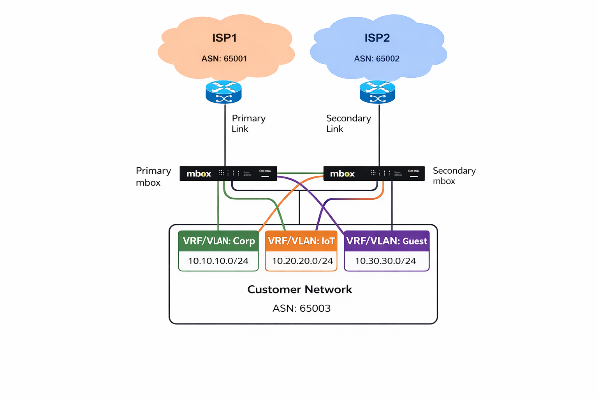
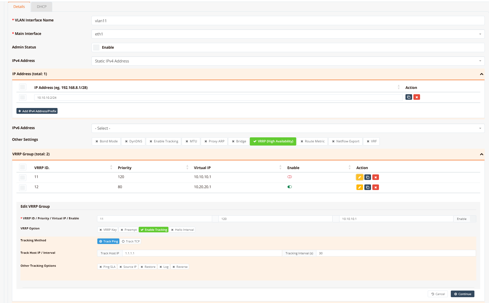

# VRRP (High Availability)

VRRP (Virtual Router Redundancy Protocol, RFC 5798) is a standard protocol for gateway redundancy. It creates a **Virtual IP address (VIP)** shared among a group of routers — the VRRP group. At any given time, exactly one router in the group holds the VIP and actively forwards traffic as the **MASTER**. All others remain in **BACKUP** state, ready to take over immediately if the MASTER fails.

From the client's perspective, the default gateway is always the VIP — the physical router behind it can change without any client-side reconfiguration or disruption.

RansNet SD-WAN routers all support standard VRRP for hardware-level redundancy. A single device can participate in multiple VRRP groups simultaneously at per interface level or across multiple interfaces.

---

## How It Works

- All routers in the same VRRP group share the same **Group ID** and **VIP**, and each is assigned a **priority** (range `1`–`254`, default `100`)
- **Election:** On startup, each router compares its own priority against received advertisements from peers. The router with the highest priority becomes MASTER; ties are broken by the highest interface IP address. A router that owns the VIP address is always assigned priority `255` and always wins.
- **Advertisements:** Only the MASTER sends periodic VRRP advertisement messages (multicast to `224.0.0.18`, every `1` second by default). BACKUP routers listen passively — they do not send advertisements under normal conditions.
- **MASTER failure:** If a BACKUP does not receive an advertisement within the **Master Down Interval** (3 × advertisement interval + a small skew based on priority), it concludes the MASTER has failed and promotes itself to MASTER.
- **Preemption:** If a higher-priority router joins or recovers while a lower-priority router is MASTER, the higher-priority router immediately sends an advertisement claiming the MASTER role — the lower-priority router steps down to BACKUP. Preemption is enabled by default.
- Failover is typically sub-second — clients experience only a brief interruption, if any

---

## Typical Deployment — Dual Gateway with Load Sharing

The diagram below shows a dual-mbox deployment where two gateways serve three customer VLANs (Corp, IoT, Guest) across two ISP uplinks. Both devices are active simultaneously, each acting as MASTER for a subset of VRRP groups while providing backup coverage for the other.



In this setup:

- **Primary mbox** — MASTER for VRRP group 11 (Corp, `10.10.10.0/24`) and group 13 (Guest, `10.30.30.0/24`); BACKUP for group 12 (IoT)
- **Secondary mbox** — MASTER for VRRP group 12 (IoT, `10.20.20.0/24`); BACKUP for groups 11 and 13

This arrangement provides **active/active load sharing** under normal conditions — both gateways handle live traffic — while guaranteeing full redundancy if either device fails. A single VRRP group can have more than two members; the router with the next highest priority takes over if the current MASTER fails.

!!! tip
    Assign priorities symmetrically across VLANs so that each gateway carries roughly equal traffic. For example: Primary mbox has priority `120` for groups 11 and 13, and `80` for group 12. Secondary mbox is the mirror image.

---

## GUI Configuration

VRRP is configured within the interface settings. Navigate to **Device Settings → Network → Interfaces**, then click to edit the target interface and expand the **VRRP** section.



The VRRP Group table lists all configured VRRP groups on this interface. Click **+ Add VRRP Group** or the edit button on an existing group to open the configuration form.

| Field | Description |
|---|---|
| **VRRP ID / Priority / Virtual IP** | The group number (`1`–`255`), this router's priority in the group (`1`–`254`), and the shared VIP assigned to the group |
| **Enable** | Toggle to administratively enable or disable participation in this VRRP group. When disabled, this router never becomes MASTER, even if its priority is highest. |

**Edit VRRP Group**

| Field | Description |
|---|---|
| **VRRP ID** | VRRP group identifier. Must match on all routers participating in the same group. Range: `1`–`255`. |
| **Priority** | This router's priority within the group. The highest-priority active member becomes MASTER. Range: `1`–`254`. Default: `100`. Set higher (e.g. `120`) on the preferred gateway. |
| **Virtual IP** | The shared VIP address. This must be in the same subnet as the interface's real IP address. All devices using this gateway as their default gateway point to this IP. |
| **Enable** | Enable or disable this VRRP group |

**VRRP Options**

| Option | Description |
|---|---|
| **Authentication** | MD5 password to authenticate VRRP advertisements between group members. Must match on all routers in the group. Prevents rogue devices from joining the VRRP group. |

**Tracking Method**

VRRP tracking monitors a reachability target and **stops or resumes VRRP participation** for the tracked group based on the result. When the probe fails, the router withdraws from the VRRP group entirely — it stops sending advertisements and releases the VIP if it was MASTER — allowing the highest-priority remaining member to take over. When the probe recovers, participation resumes and the MASTER role is reclaimed.

For a full description of all probe fields (Track Host IP, Interval, Ping SLA, Source IP, Log, Reverse), see [Tracking — Common Options](./tracking.md#tracking-vrrp).

!!! note
    In the example configuration, VRRP group 11 does **not** have **Enable** ticked directly — its active state is determined entirely by the tracking result. When tracking passes, this router participates in the VRRP election and wins as MASTER. When tracking fails, it withdraws from the group and the BACKUP takes over. This avoids a split-brain scenario where the MASTER holds the VIP but has no working upstream path.

---

## CLI Configuration

The following example implements the load-sharing topology above on the primary mbox: MASTER for group 11 (Corp) with tracking, BACKUP for group 12 (IoT).

```
interface vlan 1 11
  description Corp
  ip address 10.10.10.2/24
  vrrp-group 11
    priority 120
    authentication vrrppsk
    virtual_ipaddress 10.10.10.1
    track icmp 1.1.1.1 30
!
interface vlan 1 12
  description IoT
  ip address 10.20.20.2/24
  vrrp-group 12
    priority 80
    authentication vrrppsk
    virtual_ipaddress 10.20.20.1
    enable
```

**Key points:**

- `vrrp-group <id>` — defines a VRRP group on the interface; the ID must match on all participating routers
- `priority 120` — this router is preferred MASTER for group 11 (higher than the BACKUP's default `100`)
- `priority 80` — this router is intentionally BACKUP for group 12 (secondary mbox has priority `120` for that group)
- `authentication vrrppsk` — MD5 password protecting VRRP advertisements; must be identical on all group members
- `virtual_ipaddress 10.10.10.1` — the VIP advertised to clients as their default gateway
- `track icmp 1.1.1.1 30` — probes `1.1.1.1` every `30` seconds; if the probe fails, this router stops participating in VRRP group 11 entirely, causing the BACKUP to become MASTER. When the probe recovers, participation resumes and the MASTER role is reclaimed.
- Group 11 has no explicit `enable` — participation is gated entirely by the tracking result
- Group 12 has `enable` set explicitly — this router is always a willing BACKUP, participating in the group regardless of upstream conditions

**Secondary mbox** (mirror configuration):

```
interface vlan 1 11
  description Corp
  ip address 10.10.10.3/24
  vrrp-group 11
    priority 80
    authentication vrrppsk
    virtual_ipaddress 10.10.10.1
    enable
!
interface vlan 1 12
  description IoT
  ip address 10.20.20.3/24
  vrrp-group 12
    priority 120
    authentication vrrppsk
    virtual_ipaddress 10.20.20.1
    track icmp 1.1.1.1 30
```

---

## Verification

List all VRRP groups and their current state:

```
show ip vrrp
```

Example output:

```
VRRP_ID  Priority  Status   Interface  Interface IP     VRRP_VIP
---------------------------------------------------------------------------
11       120       running  vlan11     10.10.10.2/24    10.10.10.1/32
12       80        running  vlan12     10.20.20.2/24    (backup)
```

- **running** with a VIP address — this router is MASTER for the group and holds the VIP
- **running** with `(backup)` — this router is an active BACKUP; the VIP is held by another group member

Confirm the VIP is installed on the interface (MASTER only):

```
show interface vlan11
```

Example output:

```
================================================================================
  Interface : vlan11
================================================================================

  Network Information
  ----------------------------------------
  Admin State            : UP
  Link State             : UP
  MAC Address            : b2:3b:ef:24:ae:93
  MTU                    : 1500 bytes
  IPv4 Address           : 10.10.10.2/24
  IPv4 Broadcast         : 10.10.10.255
  IPv4 Address           : 10.10.10.1/32
  IPv6 Address           : fe80::b03b:efff:fe24:ae93/64 [link]
  ...
================================================================================
```

When this router is MASTER, the VIP (`10.10.10.1/32`) appears as a secondary address on the interface. When it transitions to BACKUP, the VIP is removed and only the real interface IP (`10.10.10.2/24`) remains.
