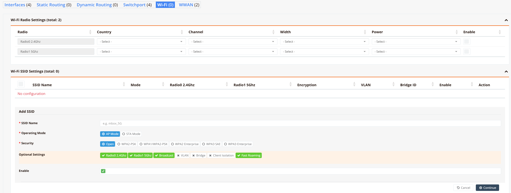
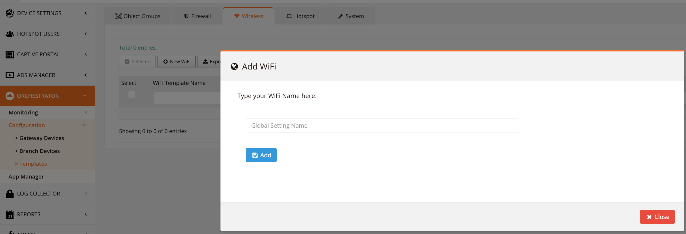
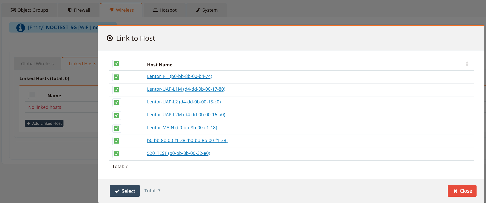
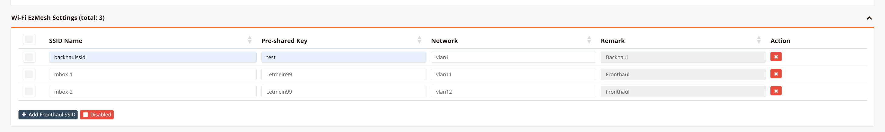

# Wireless Configuration

RansNet SD-WAN branch routers (UA, HSA, and XE series) include built-in dual-band Wi-Fi 6 (802.11ax) capability, supporting both 2.4 GHz and 5 GHz radios simultaneously. Refer to the [Product Overview](../start/overview.md) for hardware specifications by model.

Each router can operate in one of three wireless modes:

| Mode | Description |
|---|---|
| **Standalone AP** | Router serves as a wireless access point for client devices. SSIDs are configured directly on the device or pushed via a template. |
| **STA (Station) Mode** | Router connects as a wireless client to an upstream AP, using the Wi-Fi link as a WAN backhaul. See [Wi-Fi as WAN](./iface/wifiwan.md). |
| **EzMesh (Multi-AP)** | One router acts as an EzMesh controller and propagates SSID configuration to agent routers automatically over a mesh backhaul. |

---

## Standalone AP

In standalone AP mode, each router manages its own SSID configuration independently. This is suitable for single-site deployments or when per-device customization is required.

### GUI Configuration

Navigate to **Device Settings → Network → Wi-Fi**.

The page is divided into two sections: **Radio Settings** and **SSID Settings**.



#### Radio Settings

Each router has two radios. Configure the operating parameters for each:

| Field | Description |
|---|---|
| **Radio** | Radio identifier — `Radio0` operates at 2.4 GHz, `Radio1` at 5 GHz |
| **Country** | Regulatory domain — determines permitted channels and maximum transmit power for the deployment region |
| **Channel** | Operating channel. Select a specific channel or leave on **Auto** to let the radio choose the least congested channel at startup |
| **Width** | Channel bandwidth. 2.4 GHz supports 20/40 MHz; 5 GHz supports 20/40/80/160 MHz. Wider channels increase throughput but are more susceptible to interference |
| **Power** | Transmit power level. Reduce this in dense deployments to limit co-channel interference between adjacent APs |
| **Enable** | Enables or disables the radio entirely |

#### SSID Settings

Multiple SSIDs can be configured on a single device. Each SSID can be assigned to one or both radios, with independent security and network segmentation settings:

| Field | Description |
|---|---|
| **SSID Name** | The wireless network name broadcast to client devices |
| **Operating Mode** | **AP Mode** — serves wireless clients; **STA Mode** — connects as a client to an upstream AP (Wi-Fi as WAN) |
| **Security** | Encryption method: **Open**, **WPA2-PSK**, **WPA/WPA2-PSK** (mixed-mode for legacy client compatibility), **WPA2 Enterprise** (802.1X RADIUS), **WPA3 SAE**, **WPA3 Enterprise** |
| **Radio 2.4 GHz** | Broadcast this SSID on the 2.4 GHz radio |
| **Radio 5 GHz** | Broadcast this SSID on the 5 GHz radio |
| **Broadcast** | Controls whether the SSID is visible in wireless scans. Disable for hidden networks |
| **VLAN** | Tags client traffic with a VLAN ID for network segmentation — e.g. separate guest traffic from corporate traffic |
| **Bridge** | Bridge group to attach this SSID to — determines which LAN segment client traffic enters |
| **Client Isolation** | Prevents wireless clients on the same SSID from communicating directly with each other. Recommended for guest networks |
| **Fast Roaming** | Enables 802.11r Fast BSS Transition — reduces handoff latency when clients roam between APs on the same ESS |
| **Enable** | Enables or disables this SSID |

!!! tip
    Ensure the VLAN interfaces and bridge groups referenced by each SSID are already configured under [Interfaces](./iface/vlaniface.md) before saving. A misconfigured bridge or VLAN reference will prevent the SSID from passing traffic.

### CLI Configuration

```
interface wifi 0
 ssid corpnet
  encryption WPA2-PSK key pskpassword
  vlan access 10
  enable

interface wifi 1
 ssid corpnet
  encryption WPA2-PSK key pskpassword
  vlan access 10
  enable
```

In this example, `wifi 0` (2.4 GHz) and `wifi 1` (5 GHz) both broadcast the same SSID. Clients connect to whichever band their device supports and prefers.

---

## Wireless Templates

For multi-site deployments, wireless templates allow a single SSID configuration to be defined once and pushed to a group of devices — eliminating repetitive per-device configuration.

### GUI Configuration

Navigate to **ORCHESTRATOR → Configuration → Templates**, then select the **Wireless** tab. Click **New WiFi** and enter a template name.



The SSID settings within a template are identical to the per-device options described above.

!!! tip
    Define multiple templates to serve different groups of devices — for example, a retail template with a guest SSID and a corporate template with 802.1X authentication.

Once the template is saved, open it and go to the **Linked Hosts** tab. Click **Add Linked Host** to select the target devices.



Select the devices to apply the template to, then click **Select** and save. The orchestrator will push the wireless configuration to all linked devices on the next sync.

---

## EzMesh (Wi-Fi Multi-AP)

### Overview

RansNet EzMesh implements the **Wi-Fi Alliance Multi-AP (MAP)** specification, built on top of the **IEEE 1905.1** abstraction layer. This is the same standard behind Wi-Fi EasyMesh — a vendor-interoperable protocol for coordinated multi-AP wireless networks.

In an EzMesh deployment:

- **Controller** — one router manages the entire mesh network. It holds the SSID configuration (fronthaul and backhaul) and distributes it automatically to all agents using the MAP M1/M2 credential exchange (WPS-based provisioning).
- **Agent** — each additional router connects to the controller over a **backhaul** link (wireless or wired) and serves client devices over **fronthaul** SSIDs received from the controller.
- **Backhaul** — the inter-AP wireless link used for mesh communication and configuration exchange. Not visible to end users.
- **Fronthaul** — the SSIDs broadcast to end-user client devices. Agents inherit these from the controller automatically — no manual per-agent SSID configuration is needed.

This architecture supports multiple fronthaul SSIDs, each mapped to a different VLAN, enabling traffic segmentation across the mesh (e.g. corporate, guest, IoT on separate networks).

### GUI Configuration

Navigate to **Device Settings → Network → Wi-Fi**, then scroll to the **Wi-Fi EzMesh Settings** section.



Configure the backhaul and fronthaul SSIDs on the **controller** device:

| Field | Description |
|---|---|
| **SSID Name** | Wireless network name — one backhaul SSID and one or more fronthaul SSIDs |
| **Pre-shared Key** | WPA2-PSK passphrase for the SSID |
| **Network** | VLAN interface this SSID bridges into (e.g. `vlan1` for backhaul, `vlan11`/`vlan12` for fronthaul segments) |
| **Remark** | Role label — **Backhaul** for the inter-AP link, **Fronthaul** for client-facing SSIDs |

Click **+ Add Fronthaul SSID** to add additional client-facing networks. Each fronthaul SSID can be mapped to a different VLAN for traffic isolation.

### Agent Provisioning

Configuration only needs to be applied on the controller. Agents pull their entire SSID configuration from the controller automatically during the onboarding process:

1. Apply and save the EzMesh configuration on the **controller** router.
2. On the **agent** router, navigate to Device Settings and click **EzMesh Agent** to put it into agent mode.
3. Within **2 minutes**, on the controller router, click **EzMesh Controller** to trigger the WPS push-button exchange. The controller and agent must be **within 10 metres** of each other during this step to ensure a reliable wireless handshake.
4. The agent will automatically discover the controller, complete the MAP M1/M2 credential exchange, and apply the fronthaul SSID configuration. This process typically completes within 2 minutes.

!!! note
    The 10-metre proximity requirement and 2-minute window apply to the initial WPS-based onboarding only. Once an agent is provisioned, it can operate at normal deployment distances over the mesh backhaul.

### CLI Configuration

```
interface wifi mesh
 backhaul backhaulssid key pskpassword net vlan1
 ssid mbox-1
  vlan access 11
  encryption WPA2-PSK key pskpassword
 ssid mbox-2
  vlan access 12
  encryption WPA2-PSK key pskpassword
 enable
```

**Key points:**

- `backhaul` — defines the inter-AP backhaul SSID and maps it to a network interface (`vlan1`). This link is used for both mesh traffic and controller-to-agent configuration distribution.
- `ssid` entries under `interface wifi mesh` are fronthaul SSIDs pushed to agents automatically. Each can be mapped to a different VLAN for traffic separation.
- `wifi 0` and `wifi 1` (the individual 2.4/5 GHz radios) are managed by the mesh engine in controller mode and do not require separate SSID configuration.
