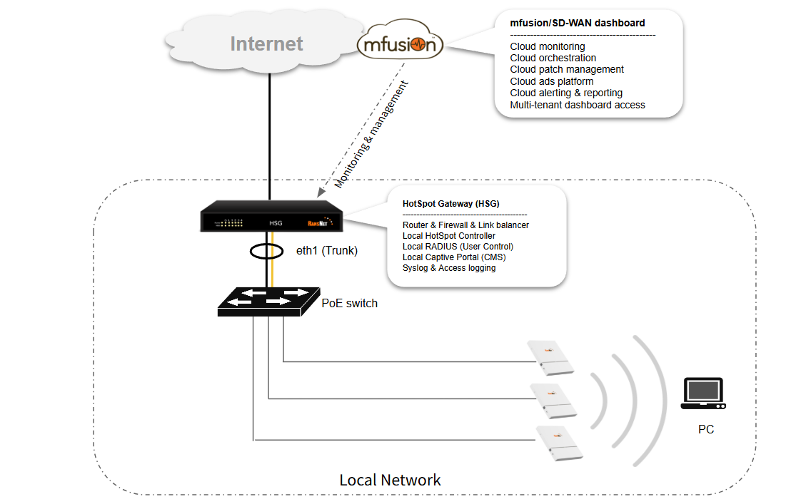
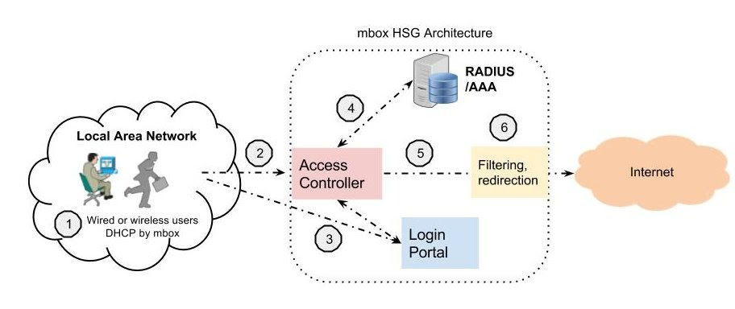

# HotSpot Gateway

RansNet HotSpot Gateway (HSG) is a dedicated captive portal gateway that controls and authenticates guest Internet access for enterprise and venue deployments — hotels, shopping malls, F&B outlets, clubs, stadiums, hospitals, and schools. It provides flexible, differentiated Internet access for guests, VIP members, and visitors, with granular policy enforcement per user or user group.

Sitting at the Internet edge, HSG integrates four core functional modules into a single appliance:

- **Router and stateful firewall** — WAN uplink management, NAT/PAT, traffic shaping, and security policy enforcement at the network edge
- **HotSpot Access Controller** — per-session captive portal interception, user authentication, and bandwidth/policy enforcement for all connected clients
- **Captive Portal (CP)** — a built-in web server that presents a fully customisable login page to unauthenticated users, supporting multiple sign-in methods and optional advertisement injection
- **AAA / RADIUS Server** — validates user credentials and returns per-user access profiles to the Access Controller, including bandwidth limits, session time, data volume quotas, and VLAN assignment

One HSG appliance supports multiple simultaneous HotSpot Access Controller instances. Each instance maps to a distinct network segment (VLAN or physical interface), allowing independent portal themes, authentication methods, and access policies per segment — for example, a hotel property could run separate instances for lobby guest Wi-Fi, executive lounge access, and back-of-house staff networks.

---

## Architecture

HSG is deployed as an on-premise gateway at the Internet edge, integrating into any existing wired or wireless network. It is AP-agnostic — any third-party access point or wireless controller can be used, as long as client traffic is trunked to the HSG via a VLAN. HSG intercepts all unauthenticated client traffic and enforces access control before allowing Internet connectivity.

### Deployment Modes

HSG supports two primary deployment modes:

- **Inline (routed) mode** — HSG acts as the default gateway for guest VLANs, performing routing, NAT, DHCP, and captive portal enforcement in a single device. All guest traffic passes through HSG before reaching the Internet uplink. This is the most common deployment.
- **Out-of-path (transparent) mode** — HSG is deployed alongside an existing router, with guest VLANs steered through HSG via policy routing or VLAN assignment on upstream switches. The existing router handles WAN routing while HSG handles authentication and access control only.

In both modes, HSG can coexist with the operator's existing upstream firewall, router, or SD-WAN gateway.

### Authentication Methods

HSG supports a broad range of user authentication and onboarding methods:

| Method | Description |
|---|---|
| **SMS OTP** | One-time password delivered via SMS; no pre-registration required |
| **Email OTP** | One-time password delivered to a verified email address |
| **Social login** | OAuth sign-in via Facebook, Google, LINE, and other social providers |
| **Username / password** | Local user database or RADIUS/LDAP directory authentication |
| **Voucher / coupon** | Pre-generated time- or usage-limited access codes |
| **POS integration** | Automatic access grant tied to point-of-sale transaction (F&B, retail) |
| **PMS integration** | Hotel Property Management System integration for in-room guest access |
| **Payment gateway** | Self-service paid access via credit card or e-wallet |
| **RADIUS / 802.1X** | Enterprise authentication via external RADIUS or LDAP directory |
| **WISPr** | Wi-Fi roaming and operator authentication (Wireless Internet Service Provider roaming) |
| **API** | RESTful API integration with third-party CRM, loyalty, or user database systems |

### Captive Portal

The built-in captive portal web server intercepts unauthenticated client HTTP/HTTPS requests and issues an HTTP 302 redirect to a login page. The portal is fully customisable — operators can upload branded HTML/CSS templates, configure sign-in options per hotspot instance, and set terms-of-service acceptance requirements. Each hotspot instance can present a distinct portal, allowing a single HSG to serve multiple venues or network zones with different branding and access rules.

### Content Management & Monetisation

HSG integrates with the RansNet cloud advertisement and content management server to enable venue monetisation:

- **Interstitial ads** — full-screen advertisements displayed to users after login, before Internet access is granted
- **Pop-up ads** — overlay advertisements injected into user browsing sessions at configurable intervals or triggers
- **Sponsored access** — users can earn free or extended access time by engaging with advertisements (ad-supported Wi-Fi model)
- **CMS templates** — centralised management of portal content, branding, and promotional campaigns across multiple HSG deployments from a single dashboard

### Access Policy Enforcement

Once a user is authenticated, the AAA server returns a RADIUS Access-Accept response containing the user's access profile. The Access Controller enforces the following attributes per session:

- **Bandwidth rate limiting** — upstream and downstream throughput caps per user
- **Session time limit** — maximum connected duration per login
- **Data volume quota** — total upload/download allowance per session
- **VLAN assignment** — dynamic VLAN steering per user group or role
- **Idle timeout** — automatic session expiry after a period of inactivity

---

## User Access Flow

The following describes the end-to-end flow for a new guest connecting to a captive portal network.

1. **Client connects** — the user's device connects to a LAN port or wireless SSID. For wireless access, the AP bridges the SSID traffic to a VLAN and trunks it to the HSG. For wired access, the switch port is assigned to the access VLAN and trunked to HSG.

2. **DHCP assignment** — HSG issues a DHCP IP address to the client from the respective VLAN pool.

3. **Network detection probe** — the client OS automatically initiates an HTTP request to a well-known URL (e.g. `connectivitycheck.gstatic.com` for Android, `captive.apple.com` for iOS) to detect Internet connectivity. This requires successful DNS resolution first — if DNS fails due to an upstream issue or firewall policy, the probe is never sent and the captive portal redirect cannot occur.

4. **Captive portal redirect** — the HSG Access Controller intercepts the HTTP probe and issues an HTTP 302 redirect to the captive portal login page.

    !!! note
        Each redirect is session-specific and short-lived for security reasons. On slow or congested wireless connections, the redirect may expire before the user reaches the login page. If users see a blank or error page, they should disconnect and reconnect to their SSID to restart the flow from step 1.

5. **Advertisement display** (optional) — if integrated with the RansNet cloud ads server, a pop-up or interstitial advertisement is displayed to the user before the login page is presented.

6. **Authentication** — the user enters credentials (username and password, OTP, voucher code, or completes a social/POS/PMS login). The portal submits the credentials to the RADIUS server for validation.

    !!! note
        Sign-in methods such as SMS OTP and Email OTP involve additional sub-steps — OTP generation, delivery, and expiry handling — before the RADIUS authentication exchange completes.

7. **Access granted** — on successful authentication, the RADIUS server returns an Access-Accept with the user's policy profile. The HSG Access Controller grants Internet access and enforces the assigned bandwidth, session time, and quota limits.

---

## Product Range

HSG is available in multiple throughput and capacity tiers to match deployment scale:

| Model | Max Throughput | Max Concurrent Devices | Form Factor |
|---|---|---|---|
| **HSG-200** | 500 Mbps | 200 | Desktop |
| **HSG-400** | 500 Mbps | 400 | Desktop |
| **HSG-800** | 2 Gbps | 800 | Desktop |
| **HSG-1000** | 2 Gbps | 1,000 | Desktop |
| **HSG-2000** | 2 Gbps | 2,000 | 1U rack |
| **HSG-5000** | 2 Gbps | 5,000 | 1U rack |
| **HSG-15000** | 3 Gbps | 15,000 | 2U rack |
| **HSG-25000** | 3 Gbps | 25,000 | 2U rack |

Redundant PSU is available from HSG-2000 and included as standard from HSG-15000.

HSG can be paired with **UAP-520** enterprise access points (indoor/outdoor, IP67, Wi-Fi 6) managed via mfusion or EasyMesh, or integrated with third-party APs over a standard VLAN trunk.
