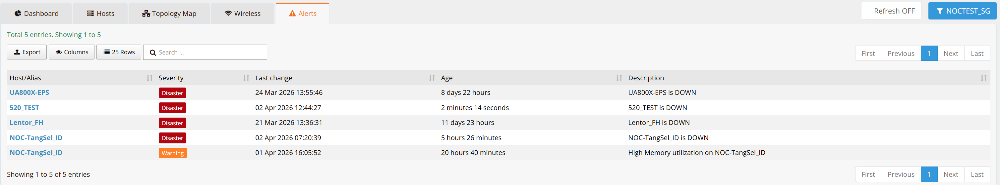

# Alerts

Navigate to **ORCHESTRATOR → Monitoring → Alerts**. Use the **[Entity]** button in the top-right corner to switch between entities.

The Alerts page shows all active alerts for the selected entity. An alert is created whenever a monitored device or metric meets a defined trigger condition — such as a device becoming unreachable, memory utilization exceeding a threshold, or a link going down.

When an alert is triggered, a notification email is automatically sent to:

- All users within the entity
- Parent entity users who have access rights to the current entity

---

## Alert Severity Levels

Each alert is assigned a severity level based on the trigger definition. Severity levels indicate the urgency and operational impact of the condition:

| Severity | Description |
|---|---|
| **Disaster** | Critical failure requiring immediate attention — typically a device or service that is completely down and unreachable |
| **High** | Serious issue with significant operational impact, but the system may still be partially functional |
| **Average** | Moderate issue that should be investigated, such as elevated error rates or resource usage approaching limits |
| **Warning** | Early indicator of a potential problem — e.g., high memory or CPU utilization trending upward |
| **Information** | Informational event with no immediate operational impact |

Severity thresholds are defined in the trigger settings. See [Monitoring Settings](settings.md) for details on how to configure triggers.

---

## Alert Fields

| Field | Description |
|---|---|
| **Host / Alias** | The hostname or alias of the device that triggered the alert |
| **Severity** | Alert severity level — colour-coded for quick visual identification |
| **Last Change** | Timestamp of the most recent status change for this alert |
| **Age** | Time elapsed since the alert was first triggered |
| **Description** | Details of the fault condition, e.g. `Device Down`, `Device restarted`, `Log space reached`, `High Memory utilization` |

---

## Filtering and Export

Use the **Search** box to filter alerts by keyword across all fields. This is useful for quickly isolating alerts for a specific device or fault type.

Click **Export** to download the current alert list as a CSV file for reporting or incident tracking purposes.

Use the **Columns** button to show or hide specific columns, and the rows selector to adjust how many entries are displayed per page.

---

## Auto-Refresh

The **Refresh** toggle in the top-right corner controls whether the alert list updates automatically. When enabled, the page periodically reloads to reflect new and resolved alerts without requiring a manual page refresh. Toggle it off if you need to examine the list without interruption.

---

## Alert Notifications and Actions

Alert delivery behaviour is governed by **Action** rules configured in [Monitoring Settings](settings.md). By default, each entity has one action rule that:

1. Creates a visible alert entry on this page
2. Sends an email notification to all users with access rights to the entity

Action rules can be temporarily disabled per entity — for example, during scheduled maintenance windows — to suppress notifications without modifying the underlying trigger configuration.
