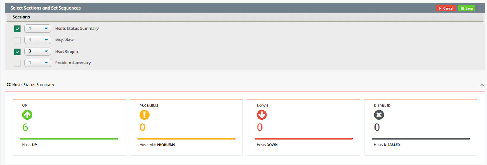
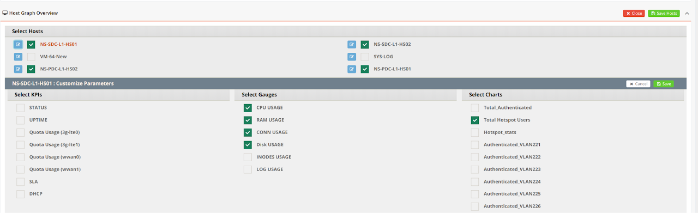
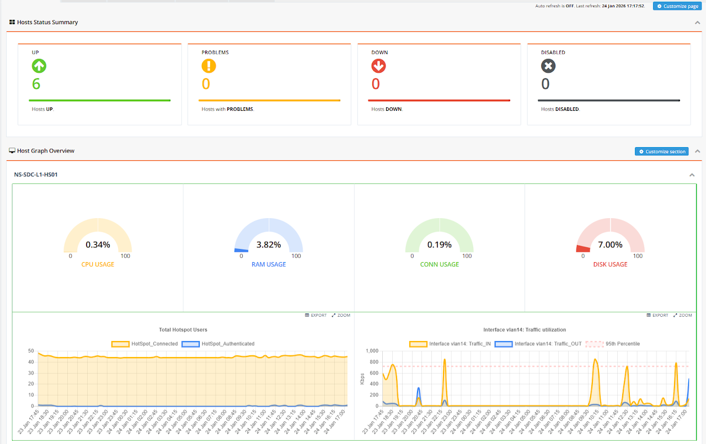

# Monitoring Dashboard

The Monitoring Dashboard provides a customisable, at-a-glance overview of device health and performance across the selected entity. Unlike the Devices page which presents a tabular list of hosts, the Dashboard is a freeform canvas — administrators choose exactly which devices, metrics, and graphs to surface, making it well-suited for building role-specific views: a NOC screen showing fleet-wide uptime, a site-focused panel for a specific vessel, or a capacity overview tracking WAN utilisation across multiple locations.

Navigate to **ORCHESTRATOR → Monitoring → Dashboard**. Use the **[Entity]** button in the top-right corner to switch between entities.

---

## Customising the Dashboard

The dashboard layout is fully user-configurable. You can add multiple sections, each populated with a distinct set of devices and graphs. Changes are saved per user, so each administrator can maintain their own personalised view without affecting others.

### Step 1 — Select Sections

Click **[Customize Page]** in the top-right corner to choose which sections to display on the dashboard. Enable the sections relevant to your monitoring needs and click **Save**.

### Step 2 — Select Devices and Graphs

Within each section, click **[Customize Section]** to configure its content:

- Select the devices (hosts) to include in this section
- Expand each device to choose which monitoring items and graphs to display

This allows you to compose targeted views — for example, a section showing only WAN traffic graphs for gateway devices at a specific site.

### Step 3 — Save and Review

Click **Save** to apply your changes. The dashboard will reload with the updated layout, displaying live data for all selected items and graphs.

---

## Troubleshooting

- **No data displayed** — confirm the device is online and actively reporting to mfusion. Check the device status under **Monitoring → Devices**.
- **Graph appears empty** — the selected monitoring item may be disabled on that host. Navigate to the host's **Items** tab under **Monitoring → Devices** to verify the item is enabled.
- **Section not showing** — return to **[Customize Page]** and confirm the section is toggled on.
