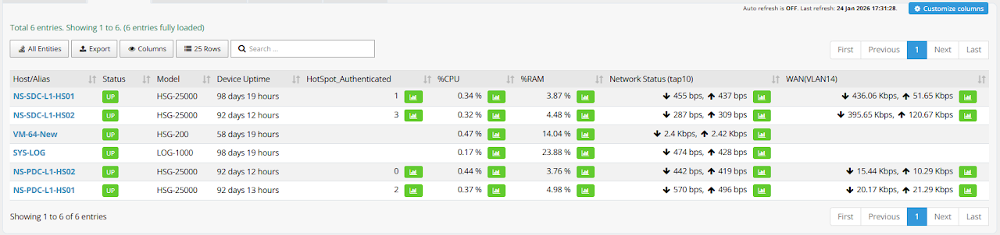
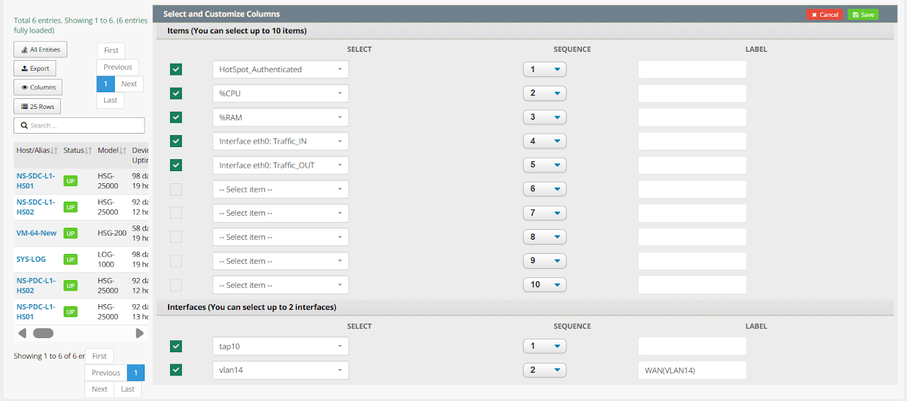
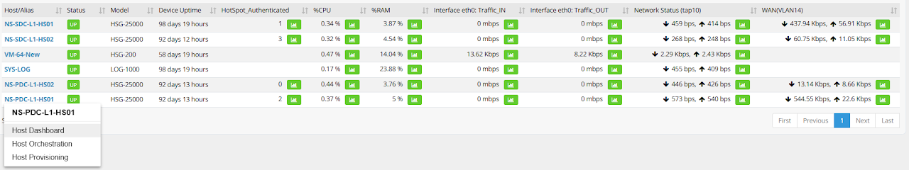
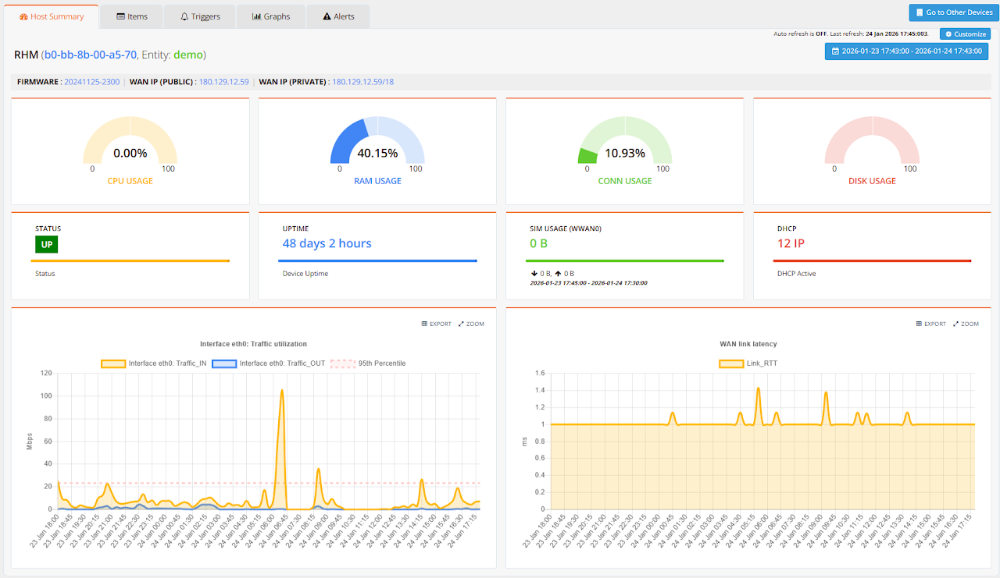
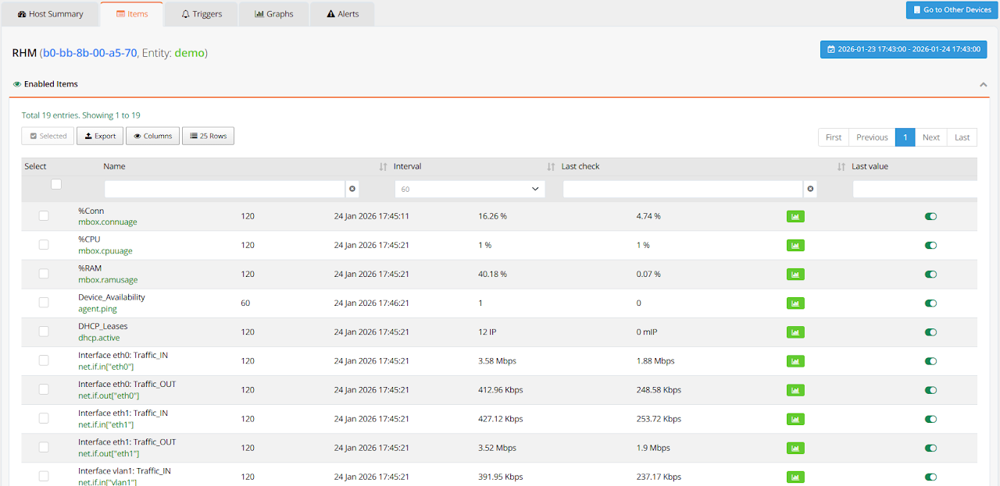
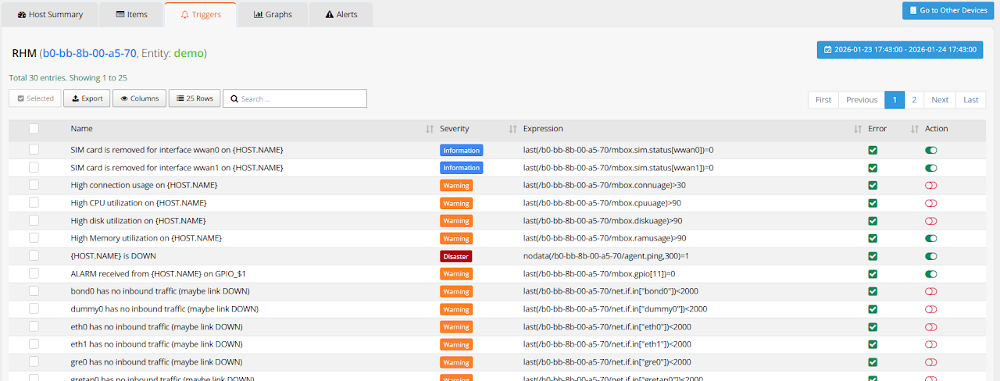

# Hosts/Devices

The Hosts page provides a centralised inventory of all monitored devices within the selected entity, along with their real-time status, key system information, and access to per-device drill-down analysis. It is the primary starting point for investigating a specific device — whether responding to an alert, checking firmware versions across a fleet, or reviewing a device's historical performance graphs.

Navigate to **ORCHESTRATOR → Monitoring → Hosts**. Use the **[Entity]** button in the top-right corner to switch between entities.

---

## Device List

The **Hosts** tab displays a summary table of all enabled devices within the selected entity. Each row represents one device and shows its current operational state at a glance.

| Field | Description |
|---|---|
| **Host / Alias** | Name used to identify the device. Configurable under **ADMIN → Hosts** |
| **Entity** | The entity the device belongs to |
| **Model** | Hardware model (HSG, CMG, HSA, UAP), automatically detected by mfusion |
| **Status** | Current device state — also used to enable or suspend monitoring for the device |
| **Device Uptime** | Time elapsed since the last reboot |
| **Firmware Version** | Current firmware version running on the device |
| **WAN Traffic Inbound** | Latest inbound traffic rate on the WAN interface |
| **WAN Traffic Outbound** | Latest outbound traffic rate on the WAN interface |
| **WAN IP (Public)** | External WAN IP address as seen from the internet |
| **WAN IP (Private)** | Internal WAN IP address from the device perspective |

Click **Customize columns** to tailor the table to your operational needs — add, remove, or reorder fields as required.

---

## Per-Device Analysis

To drill into a specific device, click its hostname and select **Host Dashboard**.

The Host Dashboard is organized into four tabs:

| Tab | Description |
|---|---|
| **Summary** | Overall device health, key metrics, and associated links |
| **Items** | All monitoring items configured for this device, including disabled ones |
| **Graphs** | Historical performance graphs for trending and capacity analysis |
| **Alerts** | Alert history specific to this device |

Use the date/time selector in the top-right corner to adjust the time range across all tabs.

### Summary

The Summary tab layout is customisable. Click **[Customize]** in the top-right corner to select which widgets and sections to display, allowing you to build a focused view of the metrics most relevant to that device type.

### Monitoring Items

The **Items** tab lists all metrics being collected from the device. Items are pre-defined by the monitoring template applied at provisioning (e.g. `Template_Branch`, `Template_Gateway`). Disabled items are shown at the bottom of the list.

To override an item's status for a specific device without modifying the template, click the action button next to the item and toggle it on or off.

### Monitoring Triggers

The **Triggers** tab lists all alert conditions configured for this device. Triggers evaluate collected metric values against defined thresholds — when a threshold is breached, an alert is created and email notifications are sent to users within the entity.

Triggers can be individually enabled or disabled per device, allowing you to suppress specific alert types on a device without affecting the rest of the fleet.

