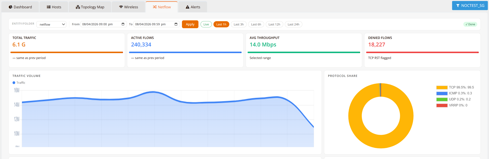
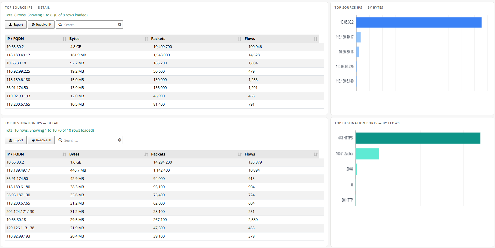
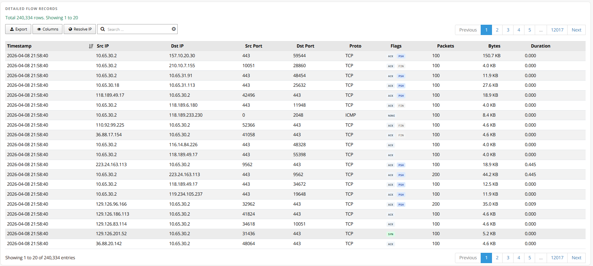

# NetFlow Analyzer

## Overview

NetFlow is an industry-standard network telemetry protocol (originally developed by Cisco) that enables network devices to export metadata about IP traffic flows as they pass through an interface. Each **flow record** captures key attributes of a traffic session — source and destination IP, source and destination port, protocol, byte and packet counts, timestamps, and interface — without capturing the actual packet payload. This makes NetFlow highly efficient for large-scale traffic visibility while preserving user privacy.

mfusion and HSG collect NetFlow exports from RansNet devices and supported third-party network equipment using **NetFlow v5** and **NetFlow v9** (which also supports IPFIX-compatible templates). Collected records are stored, processed, and presented through an intuitive analytics interface for network-wide traffic visibility.

NetFlow analysis is particularly valuable for:

- **Bandwidth accounting** — understanding which users, devices, applications, or destinations are consuming the most bandwidth
- **Security investigation** — identifying anomalous traffic patterns, unauthorised connections, or data exfiltration attempts
- **Capacity planning** — trending traffic volumes over time to inform WAN link or hardware sizing decisions
- **Dispute resolution** — providing verifiable, timestamped per-connection evidence to resolve user complaints or billing disputes
- **Compliance and forensics** — maintaining an auditable record of network activity for regulatory or incident response requirements

---

## Top Reports

The **Top Reports** view provides an at-a-glance summary of the highest-volume traffic across three dimensions — source, destination, and application — over a selected time window. Each dimension is presented as a ranked table and a visual chart.

### Top Sources

Ranks internal hosts or users by total data volume generated. This immediately surfaces the heaviest bandwidth consumers on the network — whether a specific workstation, IoT device, or user — enabling administrators to investigate whether consumption is expected or anomalous.

### Top Destinations

Ranks external IP addresses or services by inbound and outbound traffic volume. Common legitimate destinations (CDNs, cloud services, update servers) will dominate in normal operation. Unexpected high-volume destinations — unfamiliar IPs, unusual geographies, or known malicious hosts — can indicate data exfiltration, command-and-control activity, or misconfigured applications.

### Top Applications

Ranks traffic by application or service type based on destination port and protocol classification (e.g. HTTP, HTTPS, DNS, video streaming, P2P). This helps administrators understand the composition of network traffic — for example, identifying excessive video streaming, peer-to-peer file sharing, or unexpected protocols that may warrant policy action.

!!! tip
    Use the Top Reports view during routine monitoring to quickly detect capacity issues or abnormal traffic patterns without needing to inspect individual flow records. Any entry that stands out — an unfamiliar IP, a spike in a specific application, or an unknown device — can be drilled down to the Detail Flow Records view for full investigation.

---

## Detail Flow Records

The **Detail Flow Records** table provides a complete, granular log of every captured traffic flow across the network. Each record represents a single IP conversation and includes:

| Field | Description |
|---|---|
| **Timestamp** | Start time of the flow |
| **Source IP** | Internal host or device that initiated the connection |
| **Source Port** | Ephemeral port used by the source |
| **Destination IP** | Remote server or peer IP |
| **Destination Port** | Service port on the destination (e.g. 443 for HTTPS, 53 for DNS) |
| **Protocol** | IP protocol — TCP, UDP, ICMP, etc. |
| **Bytes / Packets** | Total data volume and packet count for the flow |
| **Duration** | Length of the flow session |
| **Interface** | Network interface the flow was observed on |

### Filtering and Search

The detail view supports free-text and field-specific filtering to narrow down records by source IP, destination IP, port, protocol, or time range. This allows administrators to rapidly isolate all connections from a specific device, all traffic to a specific destination, or all flows within a particular service port.

### IP Resolution (Resolve IP)

Click **Resolve IP** to perform reverse DNS lookups on source and destination IP addresses, replacing raw IPs with human-readable FQDNs (e.g. `203.0.113.5` → `cdn.example.com`). This significantly improves readability during investigations — it is far easier to recognise a known cloud service by domain name than by IP address, and it immediately highlights unfamiliar or suspicious hostnames that warrant closer scrutiny.

!!! note
    Reverse DNS resolution is performed on demand and depends on the availability of PTR records for the queried IPs. Not all IP addresses will resolve to a meaningful hostname — in particular, many cloud and CDN providers use dynamic or non-descriptive PTR records.

### Use Cases for Detail Flow Records

- **User dispute resolution** — a crew member or guest disputes a data usage charge; filter by their device IP across the billing period to produce a complete, timestamped record of every connection made and the data consumed
- **Security forensics** — an alert fires on a suspicious outbound connection; filter by the source host to reconstruct the full sequence of connections made before and after the alert, identifying whether a broader compromise occurred
- **Policy verification** — confirm that a firewall or access control policy is working as intended by checking whether blocked destinations appear in flow records
- **Bandwidth troubleshooting** — a WAN link is saturated at a specific time; filter by the time window and sort by bytes transferred to identify the responsible host and destination within seconds
