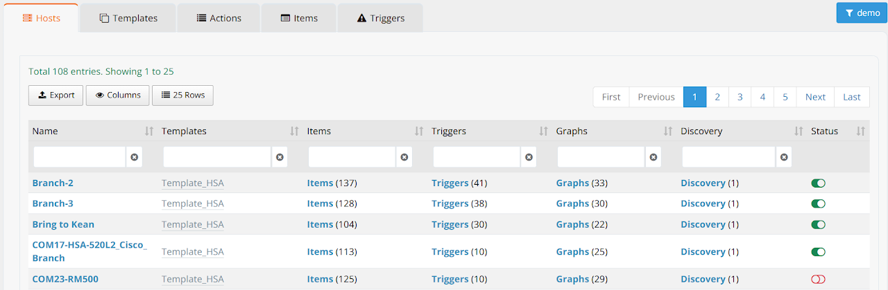
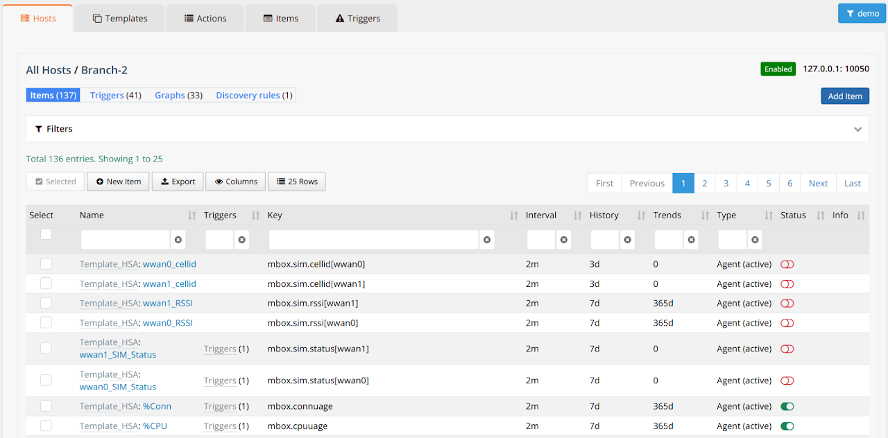
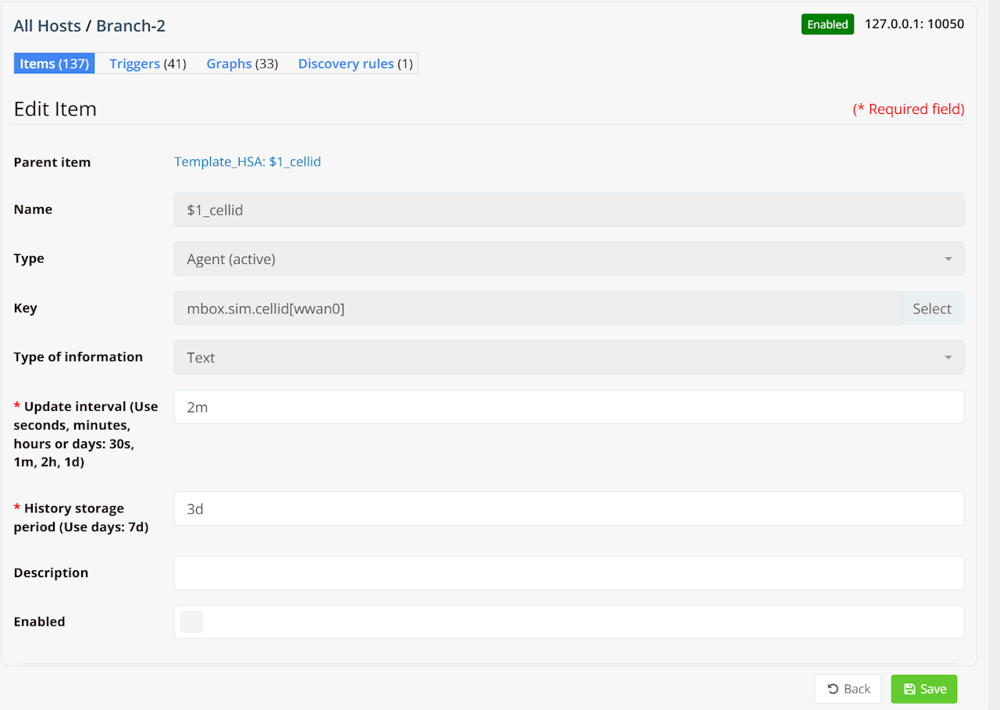
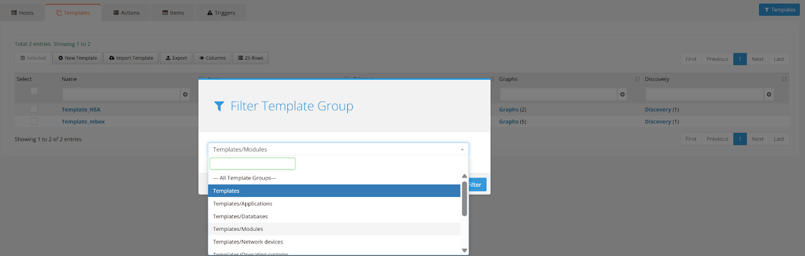
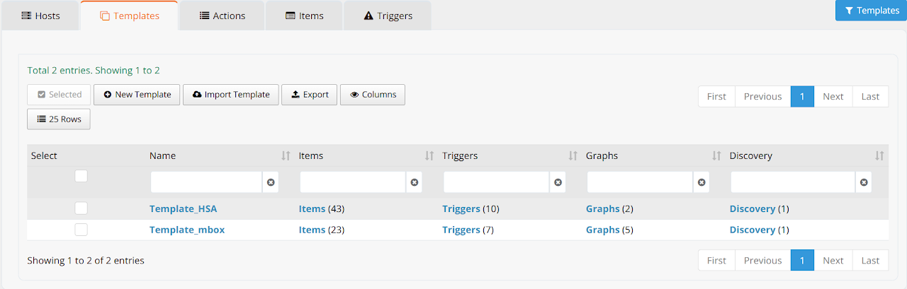
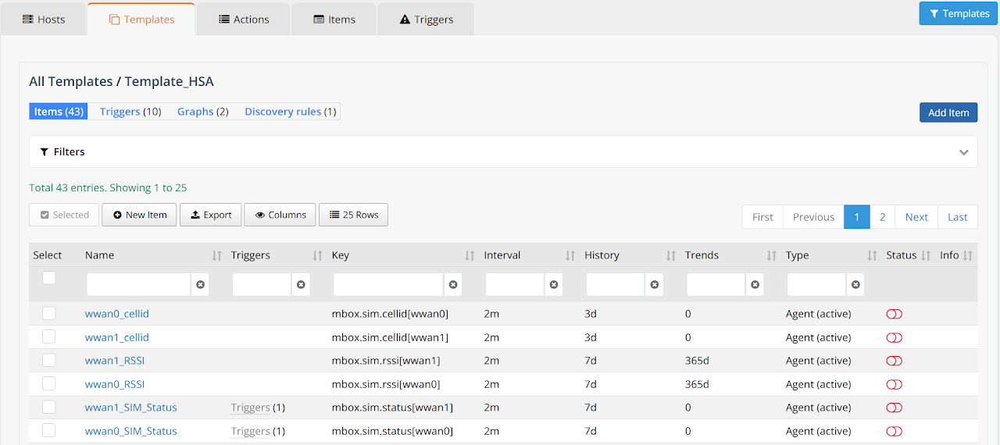
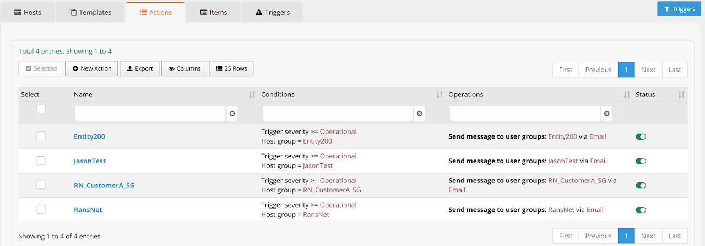
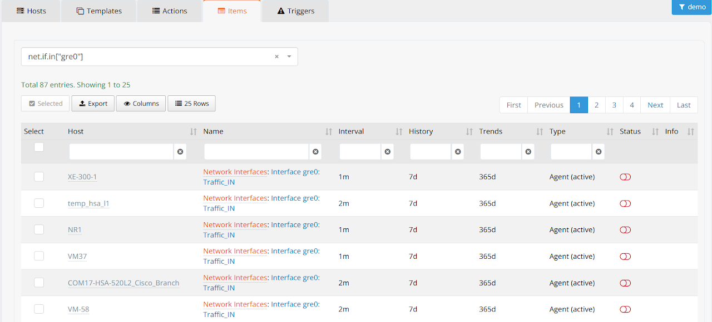
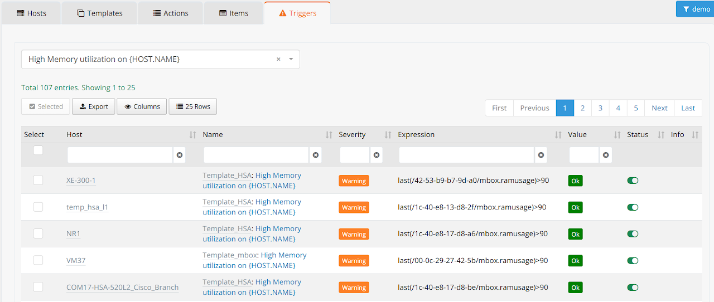

# Monitoring Settings

Navigate to **ORCHESTRATOR → Monitoring → Settings**. Use the **[Entity]** button in the top-right corner to switch between entities.

!!! warning
    This section is only accessible to super-admins, typically for customers with on-premise or private mfusion deployments.

The Settings panel is organized into five tabs: **Hosts**, **Templates**, **Actions**, **Items**, and **Triggers**.

During device provisioning, a template is attached to each device that pre-defines a set of monitoring items, triggers, and graphs. This section allows you to inspect individual host configurations, modify template settings, manage alert actions, and bulk enable/disable items or triggers across multiple hosts.

---

## Hosts

The **Hosts** tab lists all monitored devices within the selected entity, along with a summary of their attached monitoring configuration.

| Column | Description |
|---|---|
| **Name** | Device hostname as registered in mfusion |
| **Templates** | The monitoring template attached to this host (e.g., `Template_HSA`, `Template_mbox`) |
| **Items** | Number of monitoring items (metrics) configured for this host |
| **Triggers** | Number of alert triggers defined for this host |
| **Graphs** | Number of graphs configured for this host |
| **Discovery** | Number of auto-discovery rules attached to this host |
| **Status** | Enable/disable toggle for this host's monitoring |

Click on a host name to drill into its full configuration.

### Host Detail

The host detail view shows all monitoring objects for that device, organized into four tabs:

| Tab | Description |
|---|---|
| **Items** | All metrics being collected from this host |
| **Triggers** | Alert conditions evaluated against the collected metrics |
| **Graphs** | Pre-defined performance graphs for this host |
| **Discovery Rules** | Auto-discovery rules that dynamically create items (e.g., per network interface) |

The Items table shows each metric's collection key, polling interval, data retention periods (History and Trends), collection type, and current enabled/disabled status.

### Edit an Item

Click on an item name to open the Edit Item form. Key fields:

| Field | Description |
|---|---|
| **Parent Item** | The template this item is inherited from |
| **Name** | Display name for this metric |
| **Type** | Collection method — `Agent (active)` means the device agent pushes data to mfusion |
| **Key** | The specific metric key polled from the device (e.g., `mbox.sim.cellid[wwan0]`) |
| **Type of Information** | Data type — Text, Numeric (float), Numeric (unsigned), etc. |
| **Update Interval** | How frequently the metric is collected (e.g., `2m`, `30s`) |
| **History Storage Period** | How long raw metric values are retained (e.g., `3d`) |
| **Enabled** | Toggle to activate or suspend collection of this item |

!!! tip
    For most deployments, only the **Update Interval** and **Enabled** fields need adjustment. Contact RansNet support before modifying keys or collection types.

---

## Templates

The **Templates** tab lists all monitoring templates available in mfusion. Templates define the standard set of items, triggers, and graphs that are applied to devices at provisioning time.

Use the **Filter Template Group** button in the top-right corner to browse template groups. RansNet device templates are located in the **Templates** group.

RansNet provides two built-in device templates:

| Template | Description |
|---|---|
| **Template_HSA** | Applied to HSA and branch-series devices. Contains items, triggers, and graphs for device health, WAN interfaces, cellular modems, and SD-WAN. |
| **Template_mbox** | Applied to mbox gateway-series devices. Contains items, triggers, and graphs tailored to gateway hardware and services. |

### Modifying a Template

Click **Items** or **Triggers** next to the target template to modify its settings. Do not click the template name itself, as that opens the template properties rather than its contents.

From the Items list, click a specific item name to edit it, or click **Add Item** in the top-right corner to create a new item.

!!! warning
    Modifying a template applies changes to **all hosts** attached to that template. Default template settings are appropriate for most deployments. Modifying or adding items is for advanced users only — contact RansNet support if customization is required.

---

## Actions

The **Actions** tab defines what happens when a trigger fires. By default, mfusion creates an alert entry and sends an email notification to all users with access rights to the affected entity.

Each entity has one default action rule. The action list shows:

| Column | Description |
|---|---|
| **Name** | Action rule identifier, typically named after the entity |
| **Conditions** | The trigger conditions that must be met to fire the action (e.g., trigger severity ≥ Warning) |
| **Operations** | What the action does — typically `Send message to user groups` with the configured recipient group |
| **Status** | Enable/disable toggle for this action rule |

Disable an action rule to suppress email notifications for a specific entity — for example, during scheduled maintenance — without changing the underlying trigger configuration.

---

## Mass Update — Items and Triggers

The **Items** and **Triggers** tabs provide a cross-host view for bulk operations across multiple devices simultaneously. This is more efficient than editing each host individually and avoids template-wide changes that would affect all devices.

### Items

The Items tab lists all monitoring items across all hosts in the selected entity. Use the filters to narrow results by host or item name, then select and bulk enable/disable.

### Triggers

The Triggers tab lists all alert triggers across hosts. Each row shows the trigger name, severity, the expression evaluated, and current status. This view is useful for selectively enabling or disabling specific trigger types — for example, suppressing `High Memory utilization` warnings across a group of devices.

### How to Mass Update

1. Use the column filters to narrow down to the target hosts or item/trigger names.
2. Check the **Select** box in the column header to select all filtered results.
3. Click the **Selected** button and choose the action to apply (enable or disable).
