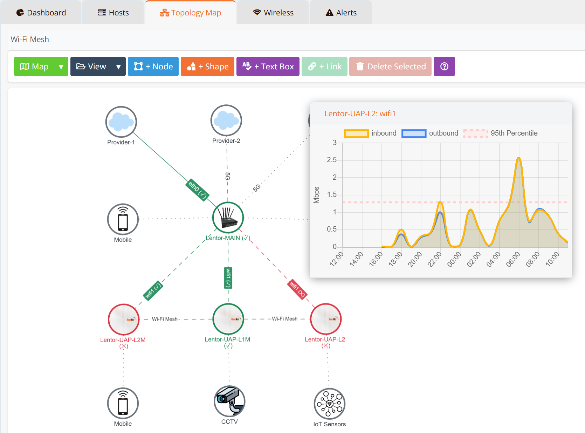
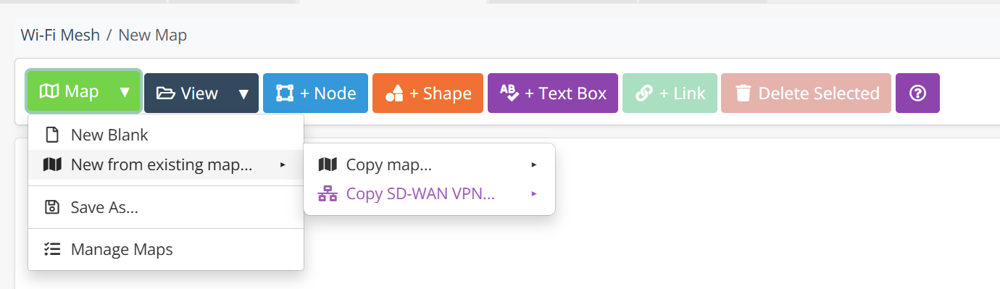
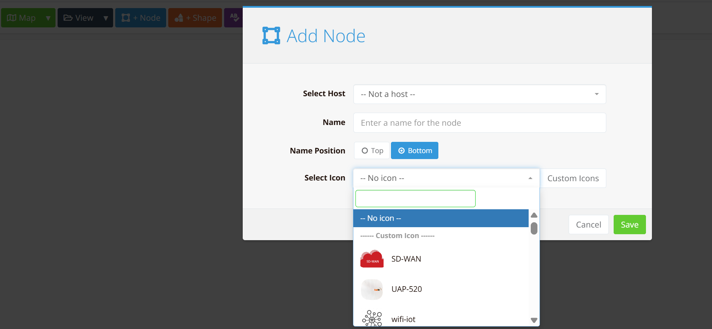
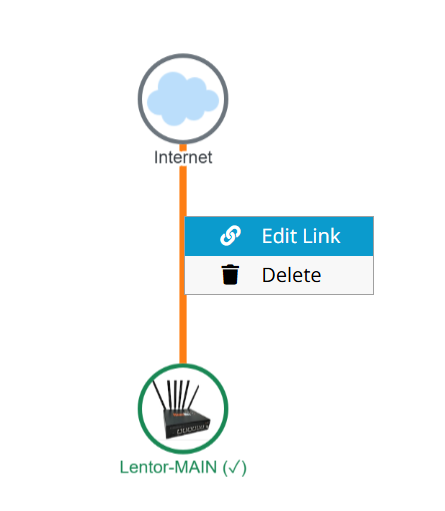
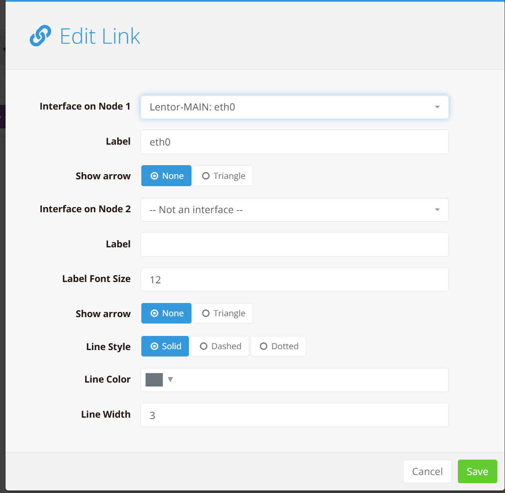
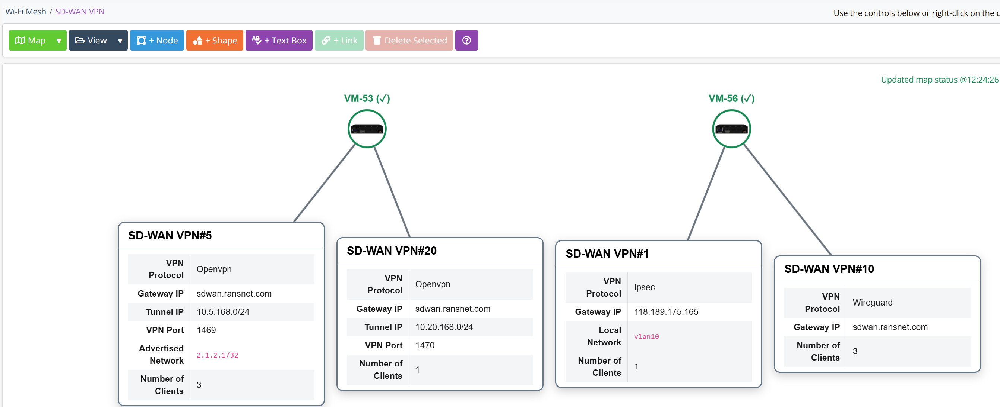

# Topology

The Topology section provides a visual network map editor for building and maintaining end-to-end network diagrams. Each node on the map is linked to a monitored host, allowing the map to reflect live device and link status at a glance.

Navigate to **ORCHESTRATOR → Monitoring → Topology**. Use the **[Entity]** button in the top-right corner to switch between entities.

The toolbar across the top of the editor provides all map editing functions:

| Control | Description |
|---|---|
| **Map** | Create, copy, save, and manage topology maps |
| **View** | Toggle display options such as labels and grid |
| **+ Node** | Add a monitored host as a node on the map |
| **+ Shape** | Add a decorative shape (e.g., cloud, rectangle) |
| **+ Text Box** | Add a free-form text label |
| **+ Link** | Create a link between two selected nodes |
| **Delete Selected** | Remove the selected node or link |

**Node status** is indicated by the ring colour surrounding each icon:

- **Green ring** — Device is online and reachable
- **Red ring** — Device is offline or unreachable

Clicking on a node opens a real-time bandwidth graph showing inbound and outbound traffic for the associated interface, along with the 95th percentile line for capacity planning reference.

---

## Creating a Topology Map

### 1. Create or copy a map

Click **Map** to open the map management menu.

| Option | Description |
|---|---|
| **New Blank** | Start from an empty canvas |
| **New from existing map → Copy map** | Duplicate an existing custom map |
| **New from existing map → Copy SD-WAN VPN** | Pre-populate the map from an existing SD-WAN VPN configuration |
| **Save As** | Save the current map under a new name |
| **Manage Maps** | View, rename, or delete saved maps |

### 2. Add nodes

Click **+ Node** to open the Add Node dialog.

| Field | Description |
|---|---|
| **Select Host** | Bind the node to a monitored host. When bound, the node reflects the live status of that host. Leave as *Not a host* for decorative/unmonitored nodes. |
| **Name** | Display label shown on the map |
| **Name Position** | Place the label above (Top) or below (Bottom) the icon |
| **Select Icon** | Choose from built-in icons (SD-WAN, UAP-520, wifi-iot, etc.) or upload a custom icon |

Click **Save** to place the node on the canvas. Reposition it by dragging.

### 3. Create links between nodes

1. Click to select the **first node**.
2. Hold **Ctrl** and click the **second node**.
3. Click **+ Link** in the toolbar to draw a link between them.

### 4. Configure link properties

Right-click a link to open the context menu, then select **Edit Link**.

| Field | Description |
|---|---|
| **Interface on Node 1** | Bind the link endpoint to a specific interface on the first device (e.g., `eth0`). The link will reflect the live status of that interface. |
| **Label** | Text label displayed alongside the link endpoint |
| **Interface on Node 2** | Bind the link endpoint to a specific interface on the second device, or to a VPN tunnel |
| **Show Arrow** | Display an arrowhead — None or Triangle |
| **Label Font Size** | Font size for the link label |
| **Line Style** | Visual style — Solid, Dashed, or Dotted |
| **Line Color** | Colour of the link line |
| **Line Width** | Thickness of the link line in pixels |

When an interface is bound, the link colour dynamically reflects its status: **green** for up, **red** for down, and **dashed** when the link is degraded or inactive.

### 5. Save the map

Click **Map → Save As** to name and save the map. Save regularly while editing — there is no auto-save.

---

## SD-WAN Topology

If SD-WAN instances are configured within the selected entity, mfusion **automatically generates** an SD-WAN topology map. No manual creation is required.

The auto-generated map displays all SD-WAN hub devices and their associated VPN instances. Each VPN panel shows a live summary of its configuration and connectivity:

| Field | Description |
|---|---|
| **VPN Protocol** | Tunneling protocol in use — OpenVPN, IPsec, or WireGuard |
| **Gateway IP** | Public IP or hostname of the SD-WAN gateway/concentrator |
| **Tunnel IP / Network** | The tunnel subnet allocated to this VPN instance |
| **VPN Port** | UDP/TCP port used by the VPN service |
| **Advertised Networks** | Networks advertised through this VPN tunnel |
| **Number of Clients** | Count of currently connected SD-WAN client devices |

Double-click any VPN instance on the map to view detailed connection status for that specific instance, including individual client device tunnels and their health.
