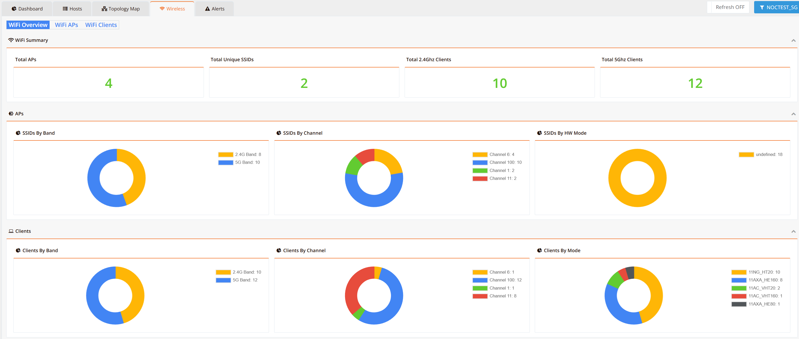
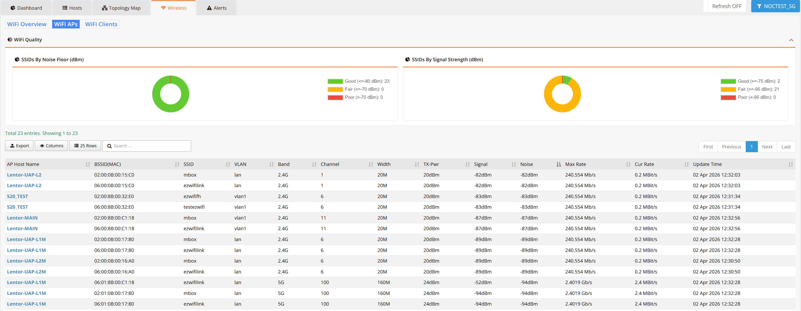
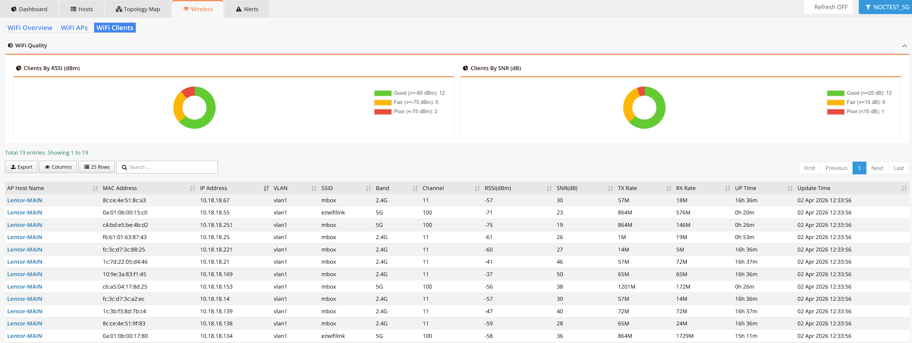

# Wireless Monitoring

RansNet Wi-Fi monitoring provides real-time visibility into wireless performance, client experience, and access point health across distributed networks. It enables operators to detect issues such as poor signal quality, channel congestion, client instability, and bandwidth saturation before they impact user experience.

Navigate to **ORCHESTRATOR → Monitoring → Wireless**. Use the **[Entity]** button in the top-right corner to switch between entities.

The Wireless section is organized into three subtabs: **WiFi Overview**, **WiFi APs**, and **WiFi Clients**.

---

## WiFi Overview

The **WiFi Overview** subtab provides a high-level summary of the wireless network across the selected entity.

The **WiFi Summary** banner at the top shows four key counters:

| Metric | Description |
|---|---|
| **Total APs** | Total number of access points reporting into mfusion |
| **Total Unique SSIDs** | Number of distinct SSIDs across all APs |
| **Total 2.4 GHz Clients** | Number of clients currently associated on the 2.4 GHz band |
| **Total 5 GHz Clients** | Number of clients currently associated on the 5 GHz band |

Below the summary, the **APs** and **Clients** sections each display three donut charts for distribution analysis:

**APs Distribution**

| Chart | Description |
|---|---|
| **SSIDs by Band** | Breakdown of SSIDs operating on 2.4 GHz vs. 5 GHz |
| **SSIDs by Channel** | Number of SSIDs on each active channel — useful for spotting channel congestion |
| **SSIDs by HT Mode** | Distribution of wireless standards in use (e.g., 802.11n, 802.11ac/VHT) |

**Clients Distribution**

| Chart | Description |
|---|---|
| **Clients by Band** | Client count split between 2.4 GHz and 5 GHz bands |
| **Clients by Channel** | Clients distributed across active channels |
| **Clients by Mode** | Client breakdown by 802.11 connection mode |

This view lets operators quickly assess overall network utilization, detect band/channel imbalances, and identify whether clients are connecting on optimal bands.

---

## WiFi APs

The **WiFi APs** subtab provides detailed per-AP and per-SSID RF performance data.

The **WiFi Quality** panel at the top displays two signal quality donut charts:

| Chart | Description |
|---|---|
| **SSIDs by Noise Floor (dBm)** | Categorizes SSIDs by ambient RF noise: **Quiet** (<−90 dBm), **Fair** (−75 to −90 dBm), **Noisy** (>−75 dBm) |
| **SSIDs by Signal Strength (dBm)** | Categorizes SSIDs by transmit signal: **Excellent** (>−70 dBm), **Good** (−70 to −80 dBm), **Fair** (−75 to −85 dBm), **Poor** (<−75 dBm) |

The AP table below lists every BSSID (per-radio, per-SSID combination) with the following columns:

| Column | Description |
|---|---|
| **AP Host Name** | The mfusion hostname of the access point |
| **BSSID (MAC)** | MAC address of the specific radio interface |
| **SSID** | The wireless network name broadcast by this BSSID |
| **Mode** | Operating mode (e.g., `start`, `ap`) |
| **Band** | Frequency band — 2.4G or 5G |
| **Channel** | Active channel number |
| **Width** | Channel width in MHz (e.g., 20, 40, 80) |
| **Tx Plan** | Configured transmit power or rate plan |
| **Signal** | Received signal level in dBm |
| **Noise** | Ambient noise floor in dBm |
| **Max Rate** | Maximum negotiated PHY rate (Mbps) |
| **Cur Rate** | Current active data rate (Mbps) |
| **Update Time** | Timestamp of the last data refresh |

!!! tip
    A high noise floor (above −75 dBm) alongside a low current rate relative to max rate typically indicates RF interference or channel congestion. Consider switching to a less congested channel or enabling band steering to 5 GHz.

---

## WiFi Clients

The **WiFi Clients** subtab provides per-client connection quality and traffic data for all currently associated wireless clients.

The **WiFi Quality** panel at the top displays two client quality donut charts:

| Chart | Description |
|---|---|
| **Clients by RSSI (dBm)** | Signal strength experienced by each client: **Good** (>−60 dBm), **Fair** (−60 to −75 dBm), **Poor** (<−75 dBm) |
| **Clients by SNR (dB)** | Signal-to-noise ratio per client: **Good** (>30 dB), **Fair** (10–30 dB), **Poor** (<10 dB) |

The client table lists every associated client with the following columns:

| Column | Description |
|---|---|
| **AP Host Name** | The access point the client is currently associated with |
| **MAC Address** | Client device MAC address |
| **IP Address** | IP address assigned to the client |
| **VLAN** | VLAN the client is placed on |
| **SSID** | The wireless network the client is connected to |
| **Band** | Frequency band in use — 2.4G or 5G |
| **Channel** | Channel the client is associated on |
| **RSSI (dBm)** | Received signal strength at the AP — closer to 0 is stronger |
| **SNR (dB)** | Signal-to-noise ratio — higher values indicate a cleaner connection |
| **TX Rate** | Downlink data rate from AP to client (Mbps) |
| **RX Rate** | Uplink data rate from client to AP (Mbps) |
| **UP Time** | Duration since the client associated |
| **Update Time** | Timestamp of the last data refresh |

!!! tip
    Clients with RSSI below −75 dBm or SNR below 10 dB are likely experiencing poor throughput and connection instability. These clients may benefit from being roamed to a closer AP or steered to the 5 GHz band if in range.
