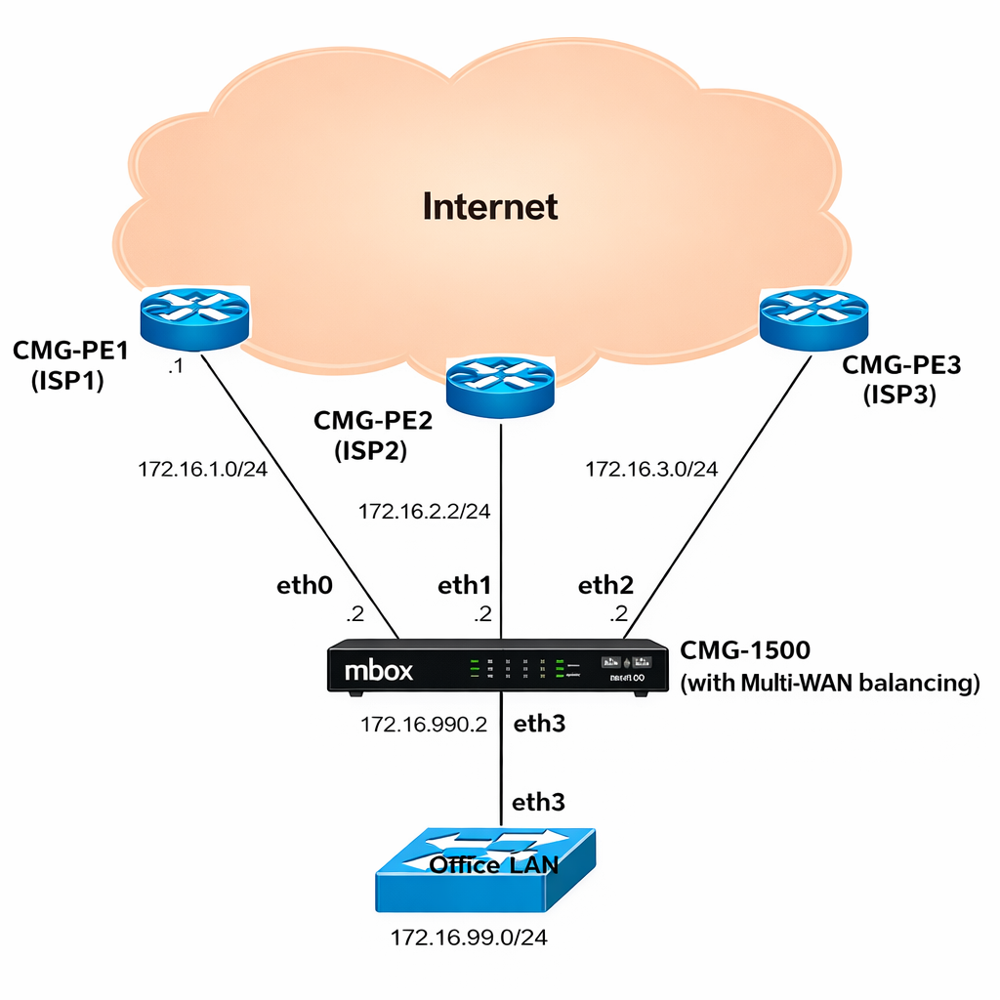
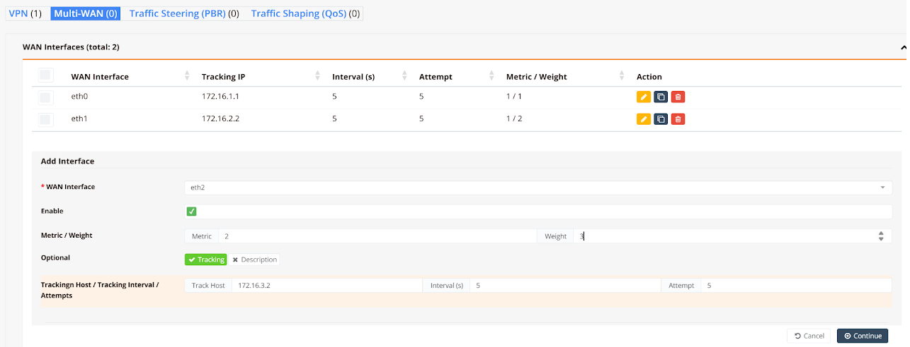
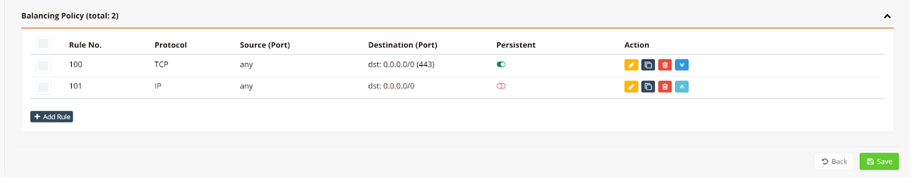
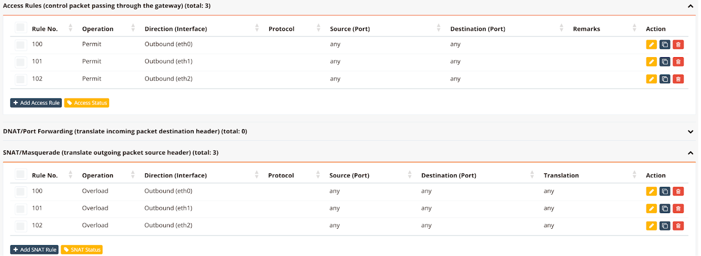

# Multi-WAN (MWAN)

## Overview

Multi-WAN (MWAN) provides outbound traffic load balancing and automatic failover across multiple WAN links. It is included as a standard feature on HSG, CMG, and HSA series devices with no additional licensing required.

When multiple ISP connections are available, MWAN aggregates their bandwidth, monitors each link continuously, and automatically redirects traffic to surviving links when a connection drops. Traffic steering rules allow specific flows to be directed to a designated WAN link based on source IP, destination, port, or protocol — combining the flexibility of policy-based routing (PBR) with built-in failover.

### Key Features

- **Load balancing** — distributes outbound sessions across WAN links by configurable weight, proportional to each link's capacity
- **Automatic failover** — each link monitored via continuous ICMP ping; traffic rerouted to surviving links within seconds of failure detection
- **Active/standby** — configure primary and backup links using metric values; standby links activate only when all lower-metric links fail
- **Traffic steering** — direct specific flows by source IP, destination, port, or protocol to a designated WAN group, with failover support; equivalent to PBR with automatic failover
- **Persistent sessions** — keep sessions from the same source IP on the same WAN link, for applications requiring consistent source IP (e.g. inline IPS/HIPS)
- **All WAN types** — supports static, DHCP, and PPPoE WAN interfaces
- **Unlimited WAN links** — limited only by the number of available physical interfaces
- **Standard feature** — included on HSG, CMG, and HSA series; no additional licensing required

### Use Cases

| Scenario | Configuration approach |
|---|---|
| Aggregate bandwidth from two ISP links | Equal metrics, weights proportional to link capacity |
| Primary fibre with LTE failover | Lower metric for fibre, higher metric for LTE |
| VoIP via dedicated ISP, data via another | Traffic steering rule by destination object or port |
| HTTPS session stability for inline IPS/HIPS | Persistent rule for TCP 443 |
| Different departments using different ISPs | Traffic steering rules by source subnet |

---

## How It Works

### Load Balancing and Failover

MWAN groups WAN interfaces into an **mwan-group**. All interfaces in the group form a shared failover pool — traffic is distributed among active members by weight, and automatically rerouted to surviving members on failure.

Two parameters control each interface's role within the group:

- **Metric** — determines active vs. standby. Interfaces sharing the same metric load-balance against each other. Interfaces with a higher metric remain on standby and only activate when all lower-metric interfaces fail.
- **Weight** — relative share of sessions among interfaces with the same metric. An interface with weight `2` carries twice the sessions of weight `1`.

!!! tip "Metric and Weight"
    - **Same metric** → load balancing. Traffic distributed in proportion to weights.
    - **Different metrics** → active/standby failover. Lower metric = preferred; higher metric = standby.
    - Weights are only compared between interfaces sharing the same metric value.

### Link Health Monitoring

Each WAN interface is monitored by repeated ICMP ping to a configured tracking IP (typically the ISP default gateway). If a configurable number of consecutive pings fail, the interface is declared down and traffic is rerouted to the remaining active interfaces. When the interface recovers, traffic is redistributed according to the configured metrics and weights.

### Traffic Steering

MWAN rules match outbound traffic by protocol, source IP/port, and destination IP/port, and direct matching flows to a specified mwan-group. Rules are evaluated top-down — the first matching rule applies. A default catch-all rule at the bottom ensures all unmatched traffic is also covered.

### Persistent Sessions

By default, MWAN balances on a per-connection basis — each new session may be assigned to a different WAN link. For applications that require a consistent source IP across multiple sessions (e.g. some HTTPS services with inline IPS/HIPS), individual rules can be flagged as **persistent**. Persistent rules keep all sessions from the same source IP on the same WAN link for the duration of a configurable timeout.

!!! note "Per-Connection Load Balancing"
    MWAN balances on a per-IP-connection basis. A single-stream speed test or FTP transfer to one server will only use one WAN link and will not reflect aggregate bandwidth. Load balancing benefits are realised when multiple hosts access multiple destinations simultaneously, spreading sessions across links.

!!! note "Persistent Sessions — Use Sparingly"
    Each persistent session entry consumes system resources. In large networks with many active sessions, excessive persistent rules can impact performance. Use persistent rules only for protocols that genuinely require source IP consistency.

!!! warning "Applying Configuration Changes"
    Configuration changes require an MWAN service restart (`mwan stop` / `mwan start`). On devices with a large number of active connections, a service restart may not fully flush stale connection state — a full device reboot is recommended to ensure a clean restart.

!!! note "DNS Resolution with ISP Restrictions"
    Some ISPs block external DNS queries transiting their network. If users lose Internet access when traffic is balanced to a particular ISP link, verify DNS resolution is functional on that link. Use an internal DNS server or the ISP-provided DNS address instead of public resolvers such as `8.8.8.8`.

---

## Configuration

### Network Architecture

The following example is used throughout the configuration sections below — a CMG-1500 with three ISP uplinks and an office LAN:

| Interface | ISP | Subnet | Capacity | Metric | Weight | Role |
|---|---|---|---|---|---|---|
| `eth0` | ISP1 | `172.16.1.0/24` | 10 Mbps | 1 | 1 | Active — load balanced |
| `eth1` | ISP2 | `172.16.2.0/24` | 20 Mbps | 1 | 2 | Active — load balanced |
| `eth2` | ISP3 | `172.16.3.0/24` | 30 Mbps | 2 | 3 | Standby — failover only |
| `eth3` | LAN  | `172.16.99.0/24` | — | — | — | Office LAN |

`eth0` and `eth1` share metric `1` and load-balance in a 1:2 ratio, proportional to their 10/20 Mbps capacities. `eth2` has metric `2` and remains on standby — it activates only if both `eth0` and `eth1` fail. The weight of `eth2` has no effect on `eth0`/`eth1` balancing.



### Prerequisites

Before configuring MWAN, ensure each WAN interface is fully configured with its IP address and default route, and verify connectivity by pinging the ISP default gateway on each link. Refer to the Ethernet Interface section for interface configuration details.

Plan your MWAN groups in advance. A **group** is a set of WAN interfaces that back each other up within a shared failover pool. Multiple groups can be defined to apply different policies to different traffic types via MWAN rules.

### GUI Configuration

Navigate to **Device Settings → SD-WAN → Multi-WAN**.

#### Step 1: Add MWAN Interfaces

Click **Add Interface** to register each WAN interface with MWAN.



| Field | Description |
|---|---|
| **WAN Interface** | The physical WAN interface to register (e.g. `eth0`, `eth1`, `ppp0`) |
| **Enable** | Toggle to activate this MWAN interface entry |
| **Metric** | Failover priority. Lower value = preferred. Interfaces with the same metric are load-balanced |
| **Weight** | Relative session share among interfaces with the same metric. Weight `2` carries twice the sessions of weight `1` |
| **Tracking** | Enable link health monitoring via ICMP ping |
| **Track Host** | IP address to ping — typically the ISP default gateway |
| **Interval (s)** | Ping interval in seconds (default: `5`) |
| **Attempt** | Consecutive failed pings before declaring the link down (default: `5`) |

Click **Continue** after each entry. Repeat for all WAN interfaces.

#### Step 2: Define Balancing Policies

Click **Add Rule** to specify which traffic uses which WAN group. Rules are evaluated top-down; the first matching rule applies.



| Field | Description |
|---|---|
| **Protocol** | Traffic protocol to match: `IP` (all), `TCP`, `UDP`, or `ICMP` |
| **Source (Port)** | Source IP/subnet and optional port. Use `any` to match all sources |
| **Destination (Port)** | Destination IP/subnet and optional port |
| **Persistent** | When enabled, sessions from the same source IP reuse the same WAN link |

Click **Save** when all rules are defined.

!!! tip
    For most deployments, a single default rule matching all destinations (`0.0.0.0/0`) is sufficient. If persistence is needed for specific protocols (e.g. HTTPS), add a dedicated persistent rule **above** the default catch-all rule.

#### Step 3: Configure Firewall Rules

Navigate to **Device Settings → Security → Firewall Policies**.

Add one **Access Rule** and one **SNAT Rule** per WAN interface to permit outbound traffic and translate internal source addresses to the WAN public IP.



| Rule Type | Operation | Direction |
|---|---|---|
| **Access Rule** | `Permit` | `Outbound (ethX)` — one rule per WAN interface |
| **SNAT Rule** | `Overload` | `Outbound (ethX)` — one rule per WAN interface |

### CLI Configuration

#### Static WAN IP

Three ISP links with static addresses. `eth0` and `eth1` load-balance at metric `1`; `eth2` is standby at metric `2`:

```
hostname CMG-MWAN
!
interface eth0
 description "to ISP1 Internet"
 enable
 ip address 172.16.1.2/24
 mwan-group 99
  track 172.16.1.1
  metric 1
  weight 1
!
interface eth1
 description "to ISP2 Internet"
 enable
 ip address 172.16.2.2/24
 mwan-group 99
  track 172.16.2.1
  metric 1
  weight 2
!
interface eth2
 description "to ISP3 Internet"
 enable
 ip address 172.16.3.2/24
 mwan-group 99
  track 172.16.3.1
  metric 2
  weight 3
!
interface eth3
 description "to LAN"
 enable
 ip address 172.16.99.1/24
!
ip route 0.0.0.0/0 nexthop 172.16.1.1
ip route 0.0.0.0/0 nexthop 172.16.2.1
ip route 0.0.0.0/0 nexthop 172.16.3.1
!
ip dhcp-server 172.16.99.0 255.255.255.0
 description "DHCP for LAN users"
 dns 8.8.8.8 8.8.4.4
 router 172.16.99.1
 domain ransnet.com
 range 172.16.99.5 172.16.99.254
 static epson-printer 64:EB:8C:F9:30:C4 172.16.99.2
 start
!
firewall-access 100 permit outbound eth0
firewall-access 101 permit outbound eth1
firewall-access 102 permit outbound eth2
!
firewall-snat 100 overload outbound eth0
firewall-snat 101 overload outbound eth1
firewall-snat 102 overload outbound eth2
!
mwan-rule 100 tcp dport 443 group 99 persistent remark "https traffic"
mwan-rule 101 dst 0.0.0.0/0 group 99 remark "default rule"
!
```

Key points:

- All three interfaces share `mwan-group 99`. Metric and weight values determine balancing behaviour within the group.
- A static default route (`ip route 0.0.0.0/0 nexthop <gateway>`) is required for each static WAN link.
- MWAN rules are evaluated top-down. The persistent HTTPS rule (`100`) must appear before the default catch-all rule (`101`).

#### Dynamic (DHCP) WAN IP

When WAN interfaces use DHCP, the device learns default gateways automatically — no static default routes are needed:

```
hostname MWAN
!
interface eth0
 description "to ISP1"
 enable
 ip address dhcp
 mwan-group 0
  track 172.16.1.1
  timer 3 3
  metric 1
  weight 10
!
interface eth1
 description "to ISP2"
 enable
 ip address dhcp
 mwan-group 0
  track 172.16.2.1
  timer 3 3
  metric 1
  weight 20
!
interface eth2
 description "to LAN"
 enable
 ip address 172.16.3.1/24
!
mwan-rule 11 tcp dport 443 group 0 persistent remark "https traffic"
mwan-rule 14 dst 0.0.0.0/0 group 0 remark "default rule"
!
firewall-access 10 permit outbound eth0
firewall-access 11 permit outbound eth1
!
firewall-snat 10 overload outbound eth0
firewall-snat 11 overload outbound eth1
!
```

!!! note "Mixed Static and DHCP"
    When one WAN link is static and another is DHCP, explicit default routes must be added for **both** — including the DHCP link, even though it would otherwise learn its gateway automatically. MWAN requires all participating routes to be explicitly present in the routing table:

    ```
    ip route 0.0.0.0/0 nexthop 138.75.64.1
    ip route 0.0.0.0/0 nexthop 3g-lte0
    ```

#### PPPoE WAN

When a WAN link uses PPPoE, configure `mwan-group` under the virtual `ppp0` interface rather than the physical Ethernet uplink:

```
hostname mbox
!
interface eth0
 description "to ISP1 (static)"
 enable
 ip address 172.21.2.88/24
 mwan-group 0
  track 172.21.2.1
  metric 1
  weight 2
!
interface eth1
 description "to ISP2 (PPPoE uplink)"
 enable
 pppoe 11111 22222
!
interface eth2
 description "to LAN"
 enable
 ip address 192.168.10.1/24
 dhcp-server
  dns 8.8.8.8 8.8.4.4
  range 192.168.10.5 192.168.10.254
!
interface ppp0
 mwan-group 0
  track 182.253.32.1
  metric 1
  weight 1
!
ip route 0.0.0.0/0 nexthop 172.21.2.1
ip route 0.0.0.0/0 nexthop ppp0
!
mwan-rule 11 tcp dport 443 group 0 persistent remark "https traffic"
mwan-rule 14 dst 0.0.0.0/0 group 0 remark "default rule"
!
firewall-access 10 permit outbound eth0
firewall-access 11 permit outbound ppp0
!
firewall-snat 10 overload outbound eth0
firewall-snat 11 overload outbound ppp0
!
mwan start
```

Key points:

- Configure `mwan-group` under `interface ppp0`, not under `eth1` (the physical PPPoE bearer).
- Explicit default routes are required for both the static interface and `ppp0`.
