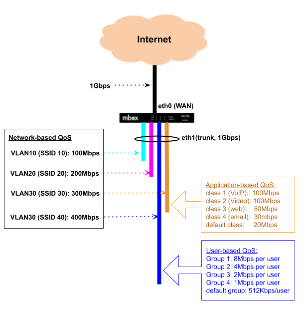
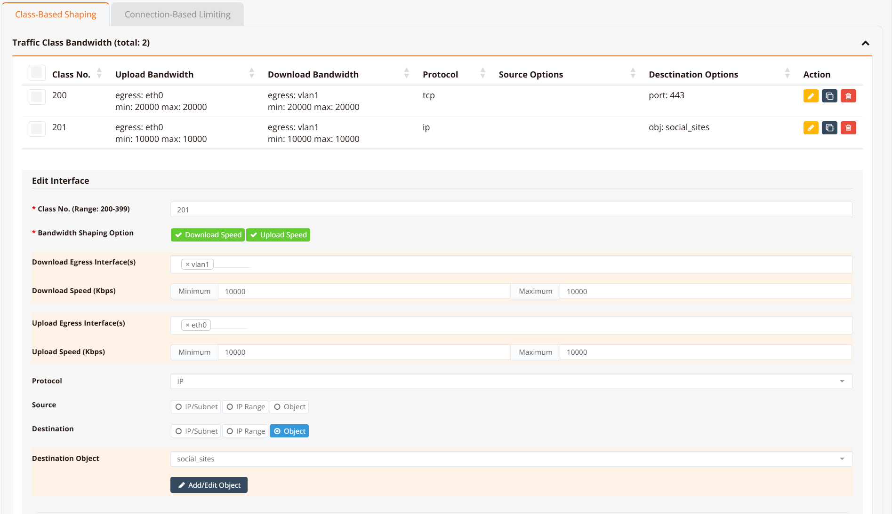
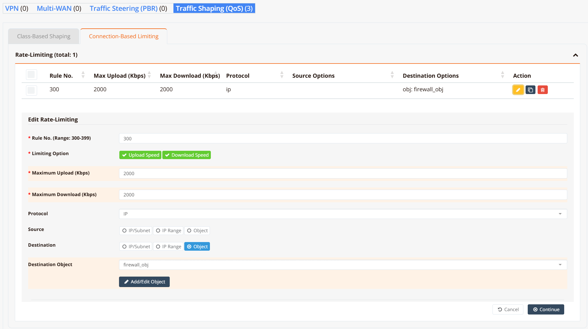

# Traffic Shaping (QoS)

Traffic shaping (Quality of Service, QoS) controls how bandwidth is allocated across different types of traffic, ensuring critical applications receive the throughput they need while preventing any single flow or user from monopolising the link.

RansNet appliances support three complementary approaches:

| Method | What it controls | Applies to |
|--------|-----------------|------------|
| **Class-Based Shaping** | Bandwidth per traffic category | Shared pool — all matching flows share the class limit |
| **Connection-Based Limiting** | Bandwidth per individual IP address | Per-device ceiling, applied independently to each IP |
| **User-Based Control** | Bandwidth per authenticated user | Covered separately in Hotspot |

Both class-based shaping and connection-based limiting use **firewall marks** for traffic classification. This gives the same matching flexibility as firewall rules — any combination of IP address, subnet, protocol, port, FQDN, or named application object group.



In the diagram above, a 1 Gbps backhaul is shared across multiple VLANs — each typically mapped to a separate wireless SSID or LAN segment. Each VLAN is allocated a minimum guaranteed bandwidth and a burst ceiling. When one VLAN is not using its allocation, others may borrow the unused capacity up to their ceiling.

Within a VLAN, traffic can be further subdivided by application type (VLAN 30) or by individual user (VLAN 40 via Hotspot).

---

## Class-Based Shaping

Class-based shaping uses **HTB (Hierarchical Token Bucket)** queuing to allocate bandwidth across defined traffic classes. Each class has a guaranteed minimum rate and a maximum ceiling. Under congestion, higher-priority classes are served first before lower-priority ones receive any remaining bandwidth.

Typical use cases:

- Guarantee bandwidth for business-critical applications (video conferencing, VoIP, ERP/CRM)
- Cap bandwidth for non-business traffic (social media, streaming) without blocking it entirely
- Prioritise real-time traffic over bulk transfers during peak hours
- Differentiate service levels between VLANs or departments sharing the same uplink

### How Traffic is Classified

Classification is a two-step process:

1. A `firewall-set` rule inspects traffic and stamps matching packets with a numeric **fwmark**.
2. A QoS `class` references the same mark number — the scheduler places marked packets into the corresponding class queue.

Because firewall rules handle all the matching, QoS classes inherit the full firewall matching vocabulary, including named application object groups and FQDN.

!!! note
    When configuring via the GUI or orchestrator, `firewall-set` rules and fwmark assignments are created automatically — no manual mark management is required. The orchestrator derives the fwmark from the class number (e.g. class `200` → upload mark `2001`, download mark `2002`). The CLI reflects these auto-generated values in `show running-config`.

### Upload and Download

QoS acts on **egress** (outgoing) traffic only. To shape both directions, configure `traffic-shape` on both the WAN and LAN interfaces:

- **Upload** (client → internet): configure on the **WAN interface** (`eth0`, `wwan0`, etc.)
- **Download** (internet → client): configure on the **LAN interface** (`vlan 1`, `vlan 2`, etc.)

Separate fwmarks are used for each direction — the upload mark matches on **destination** port or object (traffic going to the internet), and the download mark matches on **source** port or object (traffic returning from the internet). The orchestrator assigns these marks automatically following the class number convention.

### Class Priority

The **class number** (`flowno`) determines scheduling priority under congestion:

- **Lower class number = higher priority** — class `100` is always served before class `200` when the link is saturated
- Under normal load (link not congested), all classes can burst up to their `ceil` value
- Assign your most latency-sensitive traffic (VoIP, video calls) the lowest class numbers

### GUI Configuration

Navigate to **Device Settings → SD-WAN → Traffic Shaping** and click the **Class-Based Shaping** tab.



### CLI Configuration

```
interface eth0
 traffic-shape 10000000 10000000
  class 200 20000 20000 fwmark 2001 remark https-upload
  class 201 10000 10000 fwmark 2011 remark social-upload
!
interface vlan 1 1
 traffic-shape 10000000 10000000
  class 200 20000 20000 fwmark 2002 remark https-download
  class 201 10000 10000 fwmark 2012 remark social-download
  default bandwidth 1000 1000
!
object-group social_sites
 app Facebook
 app Tiktok
 app YouTube
!
firewall-set 2001 mark 2001 access tcp dport 443 remark https-upload
firewall-set 2002 mark 2002 access tcp sport 443 remark https-download
firewall-set 2011 mark 2011 access ip dst_object social_sites remark social-upload
firewall-set 2012 mark 2012 access ip src_object social_sites remark social-download
```

**Key points:**

- `traffic-shape <rate> <ceil>` sets the HTB root class bandwidth in Kbps. Use `10000000` (10 Gbps) when there is no overall interface cap — individual class limits do the actual shaping.
- `class <flowno> <rate> <ceil> fwmark <mark>` defines a class. `flowno` determines priority — lower is higher priority. `rate` is the guaranteed minimum; `ceil` is the maximum burst ceiling.
- `fwmark <mark>` links the class to a `firewall-set` rule carrying the same mark number. When using the orchestrator or GUI, this value is assigned automatically — no manual configuration needed.
- `default bandwidth <rate> <ceil>` creates a catch-all class for traffic that does not match any fwmark. Omitting it allows unmatched traffic to pass at wire speed, which is acceptable when only per-class ceilings are needed.
- `remark` is a free-text label stored in the running config for identification only — it has no effect on shaping behaviour.

!!! tip
    Assign lower class numbers to higher-priority traffic. For example, place VoIP or real-time video at class `100` and bulk/social media at class `400`. The scheduler always serves class `100` first when the link is congested.

!!! note
    `firewall-set` rules are evaluated for all traffic passing through the device. Only packets that match a rule receive a mark; all other traffic is unclassified. If a `default bandwidth` class is not configured, unclassified traffic exits at wire speed outside of HTB's control.

### Verification

Example output:

```
HSA-520# show interface traffic-shape

Interface: eth0
  Class    Rate        Ceil        Prio    FW Mark           Sent              Dropped
  -------  ----------  ----------  ------  ----------------  ----------------  -------
  200      20Mbit      20Mbit      200     2001/0x7d1        244247B/2141p     0
  201      10Mbit      10Mbit      201     2011/0x7db        0B/0p             0
  [i] No default class — unclassified traffic passes at wire speed (uncapped)

Interface: vlan1
  Class    Rate        Ceil        Prio    FW Mark           Sent              Dropped
  -------  ----------  ----------  ------  ----------------  ----------------  -------
  200      20Mbit      20Mbit      200     2002/0x7d2        0B/0p             0
  201      10Mbit      10Mbit      201     2012/0x7dc        0B/0p             0
  default  1Mbit       1Mbit       -       (catch-all)       868B/8p           0
```

**FW Mark** shows the decimal value (matching the `firewall-set` rule number) alongside the kernel's internal hex representation. **Prio** reflects the class number used for scheduling — the lower the number, the earlier the class is served under congestion.

For low-level inspection of the underlying `qos` state:

```
HSA-520# show interface traffic-class eth0     (HTB class details and statistics)
HSA-520# show interface traffic-filter eth0    (tc filter entries and fwmark handles)
HSA-520# show interface traffic-control        (qdisc state for all interfaces)
```

---

## Connection-Based Limiting (rate-limit)

Connection-based limiting enforces a per-IP bandwidth cap. Unlike class-based shaping — which is a shared pool across all matching flows — rate-limit applies independently to each source and destination IP address.

Typical use cases:

- Prevent any single device from saturating the internet link
- Enforce per-user fair-use policies on guest or hotspot networks
- Rate-limit access to a specific application or destination on a per-client basis

### GUI Configuration

Navigate to **Device Settings → SD-WAN → Traffic Shaping** and click the **Connection-Based Limiting** tab.



### CLI Configuration

```
object-group firewall_obj
 app WhatsApp
 fqdn docs.ransnet.com
 net 2.2.2.2
!
firewall-limit 3001 2000 all ip dst_object firewall_obj remark limit-upload
firewall-limit 3002 2000 all ip src_object firewall_obj remark limit-download
```

**Key points:**

- `firewall-limit <id> <rate_kbps>` creates a rate-limiting rule. `id` sets evaluation order — lower ID is evaluated first. `rate_kbps` is the per-IP ceiling in Kbps.
- Configure both an upload rule (`dst_object`) and a download rule (`src_object`) to limit traffic in both directions.
- The same object-group vocabulary applies: match by IP, subnet, FQDN, protocol, port, or application.

### Verification

Example output:

```
HSA-520# show firewall limit-list

###### Summary of Rate limit chain ########
 pkts bytes target         prot opt in   out   source     destination
    0     0 LIMITBPS-3001  all  --  *    *     0.0.0.0/0  0.0.0.0/0  match-set firewall_obj dst
    0     0 LIMITBPS-3002  all  --  *    *     0.0.0.0/0  0.0.0.0/0  match-set firewall_obj src

###### Chain-LIMITBPS-3001 details ###########
Chain LIMITBPS-3001 (1 references)
 pkts bytes target  prot opt in   out   source     destination
    0     0 DROP    all  --  *    *     0.0.0.0/0  0.0.0.0/0  limit: above 500000b/s mode dstip
    0     0 DROP    all  --  *    *     0.0.0.0/0  0.0.0.0/0  limit: above 500000b/s mode srcip
    0     0 ACCEPT  all  --  *    *     0.0.0.0/0  0.0.0.0/0

###### Chain-LIMITBPS-3002 details ###########
Chain LIMITBPS-3002 (1 references)
 pkts bytes target  prot opt in   out   source     destination
    0     0 DROP    all  --  *    *     0.0.0.0/0  0.0.0.0/0  limit: above 500000b/s mode dstip
    0     0 DROP    all  --  *    *     0.0.0.0/0  0.0.0.0/0  limit: above 500000b/s mode srcip
    0     0 ACCEPT  all  --  *    *     0.0.0.0/0  0.0.0.0/0
```

Each chain contains two DROP rules — one keyed on source IP (`srcip`) and one on destination IP (`dstip`) — so the per-IP cap is enforced for each endpoint independently. Packets exceeding the rate are dropped before forwarding; conforming traffic reaches the ACCEPT rule and is forwarded normally.

---

## Design Notes

### Class Numbering Convention

The orchestrator automatically derives fwmark values from the class number — class `N` gets upload mark `N×10+1` and download mark `N×10+2`. A suggested class numbering scheme:

| Priority | Class | Auto upload mark | Auto download mark | Typical use |
|----------|-------|-----------------|-------------------|-------------|
| Highest | 100 | 1001 | 1002 | VoIP, real-time video |
| High | 200 | 2001 | 2002 | Business-critical (HTTPS, SaaS) |
| Normal | 300 | 3001 | 3002 | General web browsing |
| Low | 400 | 4001 | 4002 | Social media, streaming |
| Lowest | 500 | 5001 | 5002 | Background / bulk transfers |

### Combining Methods

Class-based shaping and connection-based limiting work simultaneously and complement each other:

- **Class-based shaping** caps the *total* bandwidth for a traffic category — e.g. all social media traffic across all users combined ≤ 10 Mbps.
- **Connection-based limiting** caps each *individual device* within that category — e.g. each device ≤ 2 Mbps of social media, regardless of what others are doing.

Applying both gives aggregate control plus per-user fairness with a single configuration.

!!! note
    Per-connection means a specific 5-tuple (source IP, destination IP, protocol, source port, destination port). One device typically opens many connections simultaneously. Class-based shaping controls the aggregate of all those connections; connection-based limiting controls the total for each device IP.
