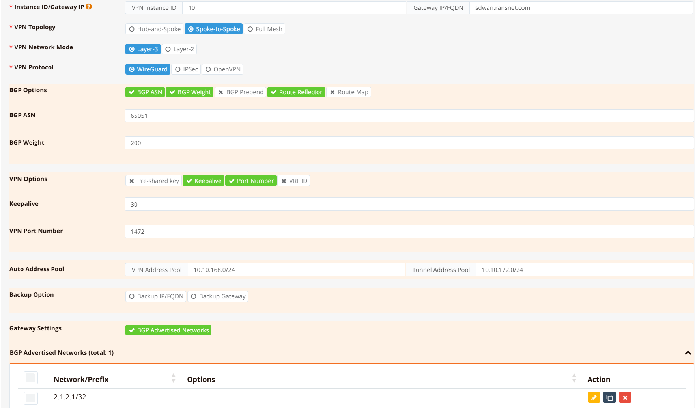
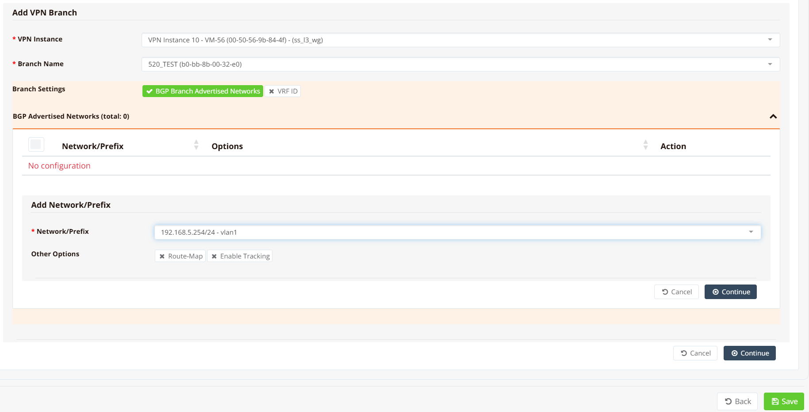

# VPN Instances

A VPN instance is the top-level SD-WAN object that ties together all the parameters for an overlay network: topology, network mode, encryption protocol, overlay IP addressing, and routing. Once a VPN instance is defined on the gateway, branch devices are enrolled into it — mfusion pushes the complete tunnel and routing configuration to all participating devices automatically.

Key points:

- VPN instances are configured on the **gateway device** via the mfusion Orchestrator.
- Each instance is assigned a numeric **instance ID** that must be **unique across the entire entity**, even across multiple gateways.
- A gateway can host multiple VPN instances simultaneously, each with different topology and protocol parameters. This is how hybrid topologies are achieved — for example, a full-mesh instance for sites that need direct interconnect alongside a separate hub-and-spoke instance for the remaining branches.
- In a high-availability setup with two gateways, each gateway typically hosts one VPN instance with the same parameters. Branch devices can be enrolled into both instances simultaneously; BGP weight controls which gateway is preferred.

---

## Before You Begin

### Planning Checklist

Gather the following before creating a VPN instance:

1. **Network addressing** — the LAN subnet at each site (hub and all branches).
2. **Overlay IP pool** — a private IP range dedicated to the VPN overlay. mfusion allocates individual overlay IPs from this pool for each gateway and branch. This range must not overlap with any site's LAN subnet or other VPN instances.
3. **VPN topology and network mode** — see [VPN Topology](topology.md) for the full breakdown of hub-and-spoke, spoke-to-spoke, and full-mesh options, and Layer 2 vs Layer 3 modes.
4. **Encryption protocol** — see [VPN Protocols](vpnintro.md) for a comparison. WireGuard is recommended for all RansNet-to-RansNet deployments.
5. **WireGuard UDP port** — default `1472`. Choose a port that is permitted inbound on the gateway's WAN firewall and on any upstream NAT devices.
6. **BGP AS number** — required for spoke-to-spoke and full-mesh topologies where routes are distributed dynamically. A single private AS (e.g. `65051`) shared across all devices in the instance is typical.
7. **Traffic management requirements** — any path preference, per-application steering, or QoS shaping policies to apply on top of the overlay. See [Traffic Steering](../traffic/steering.md) and [Traffic Shaping](../traffic/shaping.md).
8. **HA gateway preference** — if two gateways are deployed, decide which gateway is preferred. BGP weight is used to control path preference per branch.

### Device Readiness

All devices must be online and reachable before enrolling them in a VPN instance:

1. **Provisioned and online** — all devices must be registered in mfusion and show as online. See [Device Provisioning](../../start/device/provision.md) and [Device Onboarding](../../start/device/onboard.md).
2. **WAN and LAN configured** — each device needs a working WAN interface with a default route and a configured LAN/DHCP. See the [Interfaces](../../config/iface/ethernet.md) and [DHCP](../../config/dhcp.md) sections for reference.
3. **Gateway public IP or FQDN reachable** — branches must be able to reach the gateway on the configured WireGuard UDP port (or IPsec/SSL VPN port, depending on protocol).
4. **Firewall rules permit SD-WAN traffic** — Apply a firewall template or local policy to the gateway and branches to permit Internal traffic passing through the VPN tunnels. See [Firewall Policies](../../security/firewall/policies.md) and [Firewall Templates](../../security/firewall/templates.md).
5. **External firewalls** — if upstream NAT or a perimeter firewall sits in front of the gateway, ensure it permits inbound UDP/1472 (or the configured VPN port) to the gateway's WAN IP.
6. **NTP synchronised** — WireGuard and IPsec handshakes require accurate system time. Verify NTP is working on all devices before proceeding.

---

## Creating a VPN Instance

VPN instance configuration is performed entirely through the mfusion Orchestrator GUI. The following configuration example illustrate the mfusion GUI setting for a [**Spoke-to-Spoke (L3)**](topology.md#spoke-to-spoke-l3) deployment using **VXLAN over WireGuard with BGP** (instance ID `10`)

The CLI configuration shown later in this page is auto-generated by mfusion — direct CLI editing of VPN instance parameters is not recommended.

!!! note
    The IP/network addresses used in the GUI and CLI configurations on this page are for illustration only and do not correspond to the same sample topology.

On the gateway device, navigate to **Device Settings → SD-WAN → VPN**, then click **Add VPN Instance**.



The form parameters are:

| Parameter | Description |
|---|---|
| **Instance ID** | Numeric identifier for this VPN instance. Must be unique across the entire entity. Used as the suffix for auto-generated interface names (e.g. `wg10`, `vxlan10` for instance ID `10`). |
| **Name** | Descriptive label for the instance — displayed in the Orchestrator and used as the BGP peer group name. |
| **Topology** | Hub-and-Spoke, Spoke-to-Spoke, or Full-Mesh. See [VPN Topology](topology.md). |
| **Network Mode** | Layer 3 (separate subnets per site) or Layer 2 (shared subnet across sites). Determines whether VXLAN encapsulation is added. |
| **Protocol** | WireGuard, IPsec, or SSL VPN. See [VPN Protocols](vpnintro.md). |
| **Overlay IP Pool** | IP range from which tunnel endpoint IPs and VXLAN interface addresses are allocated. |
| **WireGuard Port** | UDP listen port on the gateway (default `1472`). Branches always initiate outbound; only the gateway needs this port open inbound. |
| **BGP AS Number** | iBGP autonomous system number shared by gateway and all branches in this instance. Required for spoke-to-spoke and full-mesh topologies. |
| **BGP Weight** | Path preference for this gateway. Set a higher weight on the primary gateway when running dual-gateway HA (higher weight = preferred path). |

The form adapts dynamically — fields that are not applicable to the selected topology or protocol are hidden.

---

## Adding Branch Devices

After the VPN instance is created, scroll down to the **Add VPN Branch** section.



For each branch to enrol:

1. Select the branch device from the list.
2. Enter the **local network(s)** the branch should advertise into the overlay (the branch LAN subnets).
3. If two gateways are deployed, repeat above step to assign the same branch to both gateway instances.

Repeat for all branches, then click **Save** and **Apply Config**. mfusion generates and pushes the full tunnel and routing configuration to the gateway and all enrolled branches.

!!! tip
    Branches can be added to a VPN instance incrementally — existing tunnels are not disrupted when new branches are enrolled. The gateway BGP session with existing peers is unaffected.

---

## Generated Configuration

The following CLI snippets are generated by mfusion. Direct CLI editing of these entries is not recommended — manage changes through the Orchestrator.

### Gateway

```
interface vxlan10
 description "Auto Interface from VPN (10)"
 vx-local 10.10.168.1
 enable
 ip address 10.10.172.1/22
!
interface wg10
 enable
 ip address 10.10.168.1/32
 wg-port 1472
 wg-peer b0-bb-8b-00-32-e0
  remote-net 10.10.168.4/32
!
router bgp 65051
 bgp timer 5 15
 neighbor 0168_RansNet_SSL3WG_10 as-peer
 neighbor 0168_RansNet_SSL3WG_10 as-remote 65051
 neighbor 0168_RansNet_SSL3WG_10 next-hop-self
 neighbor 0168_RansNet_SSL3WG_10 route-reflector-client
 neighbor 0168_RansNet_SSL3WG_10 soft-reconfiguration
 neighbor 0168_RansNet_SSL3WG_10 weight 200
 neighbor range 10.10.172.0/24 as-peer 0168_RansNet_SSL3WG_10
 network 2.1.2.1/32
!
```

**Key points:**

- `wg10` — WireGuard transport interface. Each enrolled branch is added as a `wg-peer` identified by its device MAC. The gateway listens on UDP `1472`.
- `vxlan10` — VXLAN overlay interface bound to the WireGuard transport (`vx-local` = gateway's WireGuard IP). Carries BGP sessions and routed traffic between sites.
- `route-reflector-client` — the gateway acts as a BGP route reflector, redistributing branch-advertised routes to all other branches. This is what enables spoke-to-spoke reachability without direct branch-to-branch tunnels.
- `network 2.1.2.1/32` — the gateway's own network (e.g. its public loopback or hub LAN) advertised into BGP so branches have a return path.

### Branch

```
interface vxlan10
  vx-local 10.10.168.4 remote 10.10.168.1
  description "Auto Interface from VPN (10)"
  enable
  ip address 10.10.172.4/24
!
interface wg10
  enable
  ip address 10.10.168.4/32
  wg-peer 00-50-56-9b-84-4f
    remote-ip sdwan.ransnet.com 1472
    remote-net 10.10.168.1/32
    keepalive 30
!
router bgp 65051
  bgp timer 5 15
  neighbor 0168_RansNet_SSL3WG_10 as-peer
  neighbor 0168_RansNet_SSL3WG_10 as-remote 65051
  neighbor 0168_RansNet_SSL3WG_10 next-hop-self
  neighbor 0168_RansNet_SSL3WG_10 soft-reconfiguration
  neighbor 0168_RansNet_SSL3WG_10 weight 200
  neighbor 10.10.172.1 as-peer 0168_RansNet_SSL3WG_10
  network 192.168.5.0/24
!
```

**Key points:**

- `remote-ip sdwan.ransnet.com 1472` — branch connects outbound to the gateway hostname and port. The branch WAN IP can be dynamic; only the gateway needs a fixed public address.
- `keepalive 30` — WireGuard persistent keepalive maintains the NAT mapping on the branch side, ensuring the tunnel stays active through idle periods.
- `network 192.168.5.0/24` — the branch LAN subnet advertised to the gateway via BGP. The gateway redistributes this to all other branches.

---

## Verification

### Gateway

**Check WireGuard peer status:**

```
show wg
```

```
interface: wg10
  public key: IQ+SK0S2rUlZ7xNvb4Q65UzEJXU4tg3hltL0sU8BCWc=
  private key: (hidden)
  listening port: 1472

WG Peer                 PublicKey                                     PublicIP:Port           Peer Net         Download/Upload        LastUpdate
---------------------------------------------------------------------------------------------------------------------------
10-b0-bb-8b-00-32-e0    PwomeF+Zt5e5P8DD41DWeEfyKNlNR9Oz0uYEjwthNzk=  61.13.198.166:51830     10.10.168.4/32   9.40 KiB/8.27 KiB      24 seconds ago
10-00-60-e0-6e-fa-d8    CjSA6AcHCr8OiDf2+BE8L/18lPpJxyf1U7Fr1iGzETg=  103.143.244.23:51830    10.10.168.2/32   68.47 MiB/68.11 MiB    52 seconds ago
10-00-60-e0-65-50-5b    Nm4+n9KiyrW8G1gXRr4M3fNrazdzuM5Gaqbc6Qxu1m8=  125.166.197.199:51830   10.10.168.3/32   14.47 MiB/15.13 MiB    1 minute, 20 seconds ago
Total configured WG peers:      3
Total active WG peers:          3
Total malfunction WG peers:     0
Total inactive WG peers:        0
```

All enrolled branches should appear under **Total active WG peers**. A peer appearing as inactive or malfunction indicates a connectivity problem — check that the branch WAN can reach the gateway on UDP `1472`.

**Check BGP sessions:**

```
show ip bgp summary
```

```
IPv4 Unicast Summary (VRF default):
BGP router identifier 10.65.31.56, local AS number 65051 vrf-id 0
BGP table version 6
RIB entries 3, using 576 bytes of memory
Peers 2, using 1448 KiB of memory
Peer groups 1, using 64 bytes of memory

Neighbor        V         AS   MsgRcvd   MsgSent   TblVer  InQ OutQ  Up/Down State/PfxRcd   PfxSnt Desc
*10.10.172.2    4      65051     22965     22968        0    0    0 1d07h53m            0        2 N/A
*10.10.172.4    4      65051        66        67        0    0    0 00:05:11            1        2 N/A

Total number of neighbors 2
```

Each enrolled branch should appear as a BGP neighbor with a non-zero **Up/Down** time and a `PfxRcd` value matching the number of networks that branch advertises.

**Check learned routes:**

```
show ip route bgp
```

```
B>* 192.168.5.0/24 [200/0] via 10.10.172.4, vxlan10, weight 1, 00:00:33
```

Each branch LAN subnet should appear as a BGP route (`B`) in the routing table, reachable via `vxlan10`.

**Ping a branch LAN from the gateway:**

```
ping 192.168.5.254 source 2.1.2.1
```

```
PING 192.168.5.254 (192.168.5.254) from 2.1.2.1 : 56(84) bytes of data.
64 bytes from 192.168.5.254: icmp_seq=1 ttl=64 time=4.16 ms
64 bytes from 192.168.5.254: icmp_seq=2 ttl=64 time=4.63 ms
64 bytes from 192.168.5.254: icmp_seq=3 ttl=64 time=4.62 ms
```

Use `source` to specify the hub LAN IP or loopback as the source address — this ensures the return path is tested through the BGP-learned route rather than the WireGuard transport IP.

### Branch

Run the same commands on a branch router to verify from the spoke side:

```
show wg
show ip bgp summary
show ip route bgp
ping <hub-lan-ip> source <branch-lan-ip>
```

The branch should show one active WG peer (the gateway), one BGP neighbor (the gateway's VXLAN IP), and BGP routes for the hub LAN and all other enrolled branch subnets.
