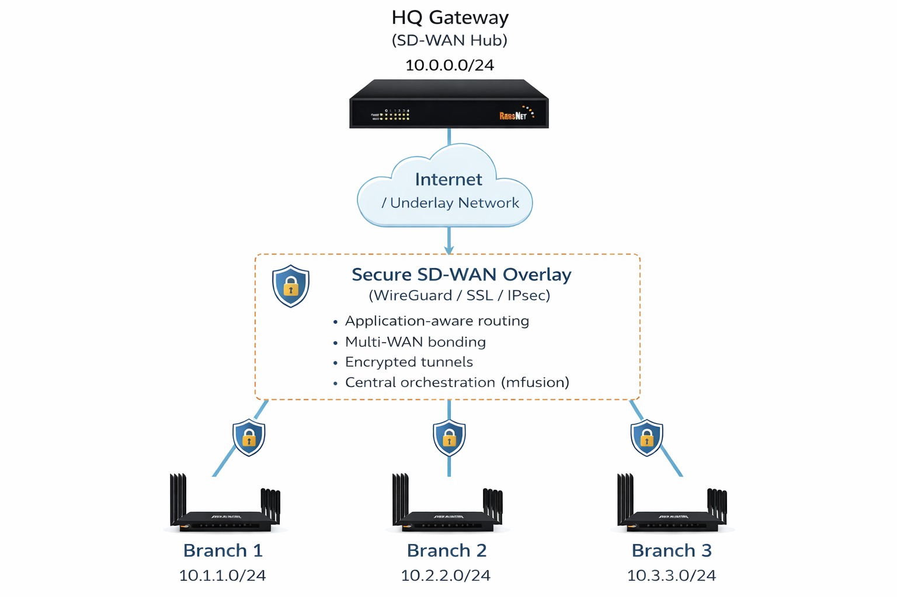
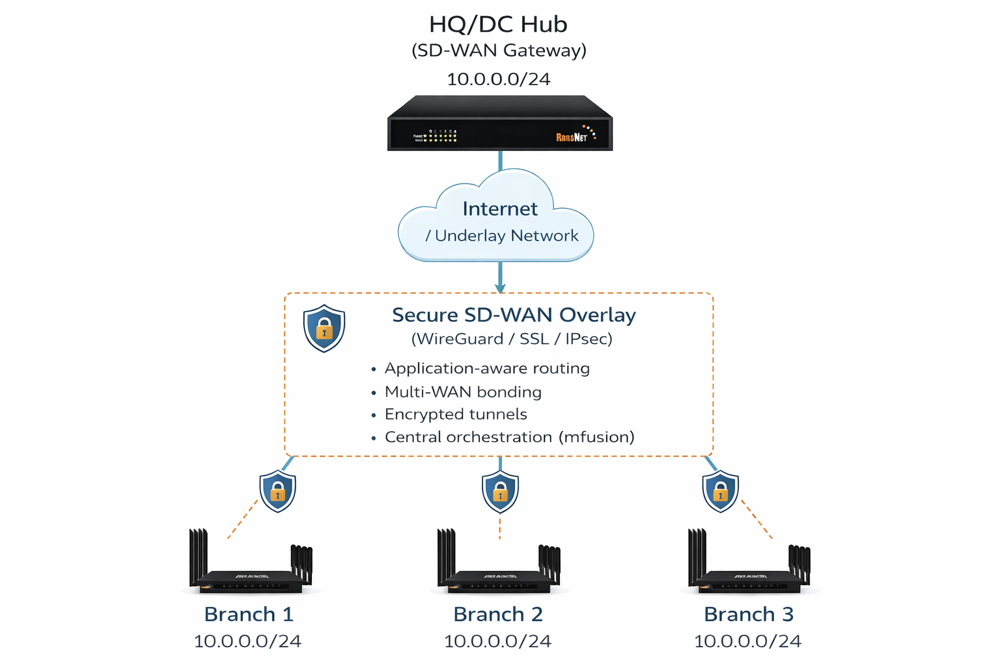
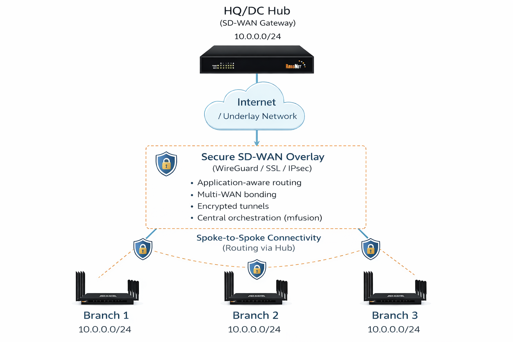
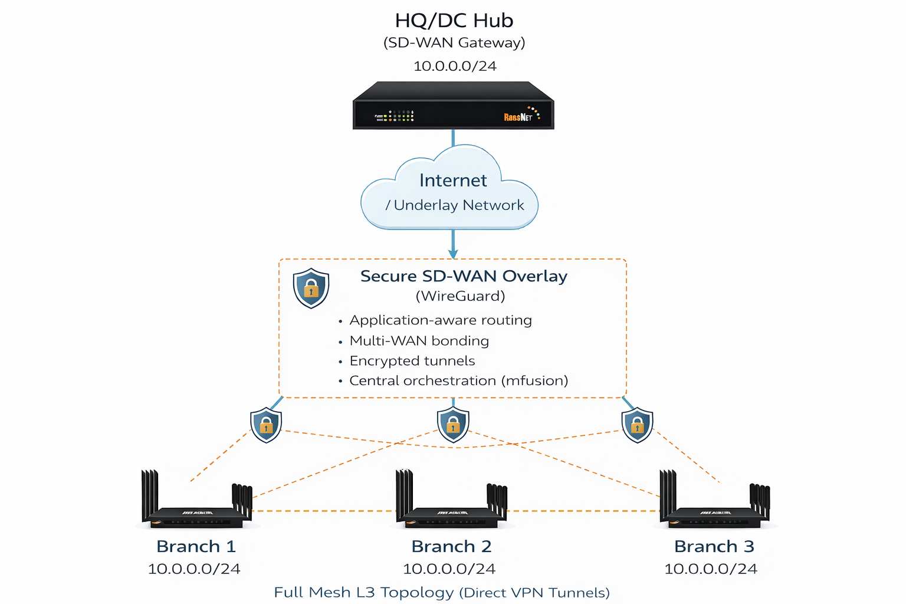

# SD-WAN Topology

RansNet SD-WAN supports multiple VPN topologies and network modes to match different traffic flow and addressing requirements. Three independent dimensions define a deployment: the **VPN topology** (how traffic flows between sites), the **network mode** (Layer 2 or Layer 3 overlay), and the **protocol stack** (encryption and encapsulation).

The table below summarises the supported combinations:

| Topology | Network Mode | Typical Protocol Stack |
|---|---|---|
| Hub-and-Spoke | L3 | WireGuard / IPsec / SSL VPN |
| Hub-and-Spoke | L2 | VXLAN + WireGuard or IPsec |
| Spoke-to-Spoke | L3 | VXLAN + WireGuard, or GRE + IPsec (with BGP) |
| Spoke-to-Spoke | L2 | VXLAN + GRE + WireGuard or IPsec (with BGP-EVPN) |
| Full-Mesh | L3 | WireGuard only |

---

## Topology Types

### Hub-and-Spoke

The most common topology in real-world SD-WAN deployments. Traffic flows only between each spoke/branch site and the central hub gateway where applications are hosted.

Only the hub must be statically reachable — either a direct static IP or a static NAT. Branch sites can have static, dynamic, or private IP addresses (including 4G/5G connections), as long as they can initiate outbound connections to the hub IP.

### Spoke-to-Spoke

Extends hub-and-spoke to allow inter-branch communication. Each branch still tunnels only to the hub — there is no direct tunnel between spoke sites. Traffic between branches is routed through the hub gateway, which adds latency and increases hub bandwidth consumption relative to a full-mesh deployment. IP addressing requirements are identical to hub-and-spoke: only the hub requires a static IP.

Use this topology when branches must reach each other (for example, VoIP or shared file services) but direct inter-site connectivity is not feasible.

### Full-Mesh

Every site establishes a direct tunnel to every other site. Traffic between any two branches flows directly without transiting the hub, minimising latency and hub bandwidth usage.

This topology requires that all sites are directly reachable from each other — public static IPs, or dynamic IPs with port forwarding configured on upstream NAT devices.

!!! warning
    Full-mesh creates O(n²) tunnel pairs. Each router must maintain and rekey every tunnel, which becomes a scalability problem as the number of sites grows. Only deploy full-mesh where direct inter-site connectivity is an absolute requirement.

For organisations where only a subset of sites need mesh access, use a **hybrid topology**: create one VPN instance with Full-Mesh for those sites and a separate Hub-and-Spoke instance for the remaining branches.

---

## Network Modes

### Layer 3

Each site operates on its own LAN subnet. The VPN overlay is a routed Layer 3 network — the hub and spokes exchange routes and forward IP packets between subnets. This is the standard mode for most deployments.

### Layer 2

The VPN overlay emulates a flat switched network. Sites at different physical locations appear to be on the same LAN segment, sharing a single subnet and broadcast domain. This is required when hosts at remote sites must communicate as if locally connected — for example, applications that rely on Layer 2 broadcasts, multicast, or MAC-level adjacency.

Layer 2 mode uses VXLAN for encapsulation combined with WireGuard or IPsec for encryption.

---

## Protocol Stack

### Encryption Protocols

| Protocol | When to Use |
|---|---|
| **WireGuard** ⭐ | Preferred for all RansNet-to-RansNet deployments — highest performance, simplest configuration, no PKI overhead |
| **IPsec** | Required for interoperability with third-party gateways, or where compliance mandates IPsec |
| **SSL VPN (OpenVPN)** | Legacy deployments; or where the same device must serve both SD-WAN tunnels and remote client VPN access |

### Encapsulation Protocols

Encapsulation is layered on top of the encryption tunnel when the topology or network mode requires it. The correct encapsulation protocol is selected automatically based on the chosen topology and network mode.

| Protocol | Purpose |
|---|---|
| **GRE** | Layer 3 tunnel that carries routing protocol traffic (BGP, OSPF) across the encrypted underlay |
| **VXLAN** | Layer 2 overlay that encapsulates Ethernet frames for L2 network mode; can also be assigned an IP address to act as a routed interface for L3 topologies |

---

## Topology Details

### Hub-and-Spoke (L3)

The simplest and most widely deployed configuration. Applications are hosted centrally at the hub (HQ, data centre, or cloud gateway); each branch tunnels to the hub to access them.

Supported encryption protocols:

- WireGuard ⭐
- IPsec
- SSL VPN

---

### Hub-and-Spoke (L2)

Used when branch sites require Layer 2 LAN extension to the hub — for example, when all sites must share the same IP subnet, or when applications rely on Layer 2 broadcast or multicast. VXLAN encapsulates Ethernet frames across the encrypted tunnel, and the VXLAN interface is bridged to the local LAN at each site.

Supported protocol combinations:

- VXLAN over WireGuard ⭐
- VXLAN over IPsec
- SSL VPN in bridge (tap) mode

---

### Spoke-to-Spoke (L3)

Extends Hub-and-Spoke to allow inter-branch communication. Each branch tunnels only to the hub and advertises its local networks via BGP. The hub distributes these routes to all branches, enabling spokes to reach each other — with traffic routed through the hub.

Supported protocol combinations:

- VXLAN over WireGuard (with BGP) ⭐
- GRE over IPsec (with BGP)
- SSL VPN (with BGP)

---

### Spoke-to-Spoke (L2)

Extends Hub-and-Spoke (L2) to allow inter-branch Layer 2 communication. Each branch connects to the hub via VXLAN; BGP-EVPN distributes MAC and IP reachability across all branches so that traffic between spokes is forwarded correctly through the hub.

!!! tip
    If branch sites can reach each other directly, consider Full-Mesh (L3) instead — it is simpler to operate and avoids the hub bottleneck.

Supported protocol combinations:

- VXLAN over GRE over WireGuard (with BGP-EVPN) ⭐
- VXLAN over GRE over IPsec (with BGP-EVPN)

---

### Full-Mesh (L3)

Every site establishes direct tunnels to all other sites. Traffic between any two branches flows directly, bypassing the hub and minimising inter-site latency.

All sites must be directly reachable from each other — public static IPs, or dynamic IPs with port forwarding on the upstream NAT.

!!! note
    Only WireGuard is supported for full-mesh topology.
