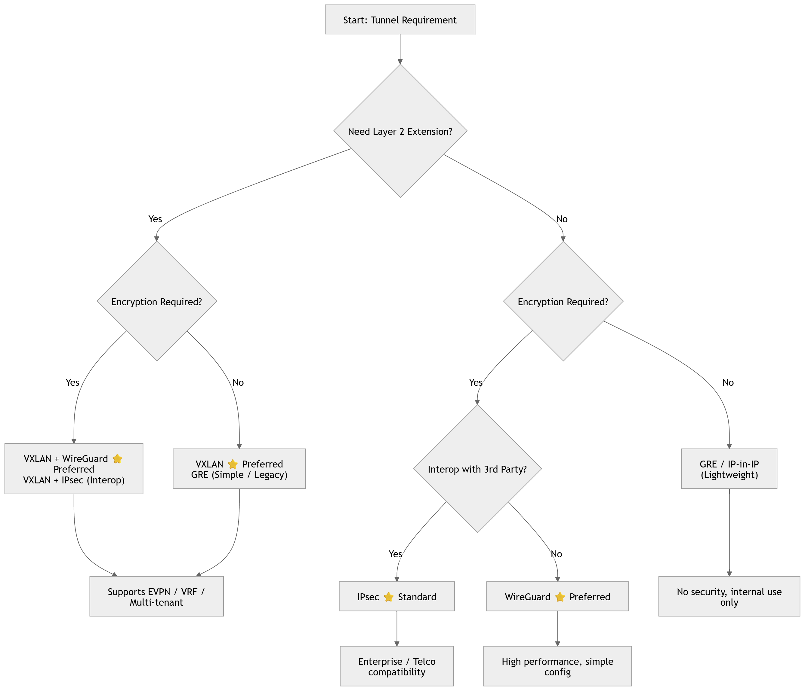

# VPN Protocols

SD-WAN connectivity is built on VPN tunnels. Each tunnel forms a virtual point-to-point link between two sites over the public Internet, creating an encrypted overlay network that carries private traffic securely. Understanding the underlying VPN protocols helps you choose the right one for each deployment scenario.

RansNet supports five VPN protocols, each with different characteristics in terms of encapsulation layer, encryption, transport, and use case:

| Protocol | Tunnel Layer | Encryption | Transport | Primary SD-WAN Role |
|---|---|---|---|---|
| **WireGuard** ⭐ | L3 | Built-in — ChaCha20/Poly1305 | UDP | **Preferred** — primary SD-WAN overlay, all deployments |
| **SSL (OpenVPN)** | L2 (tap) or L3 (tun) | Built-in — TLS/AES | TCP or UDP | Legacy deployments, L2 bridging requirements |
| **IPsec** | L3 | Built-in — AES/3DES | ESP over IP | Interoperability with third-party gateways |
| **GRE** | L3 | None (combine with IPsec) | IP | Routing protocol transport, multicast over WAN |
| **VXLAN** | L2 | None (combine with IPsec/WG) | UDP/4789 | Layer-2 extension across L3 WAN |

---

## WireGuard

WireGuard is the **preferred protocol** for RansNet SD-WAN deployments. It is a modern, high-performance Layer 3 VPN built on a minimal codebase and state-of-the-art cryptographic primitives. It operates exclusively over UDP, requires no certificate infrastructure, and consistently outperforms both OpenVPN and IPsec in throughput and latency benchmarks.

### Key Characteristics

- **Cryptokey routing** — each peer is identified by its public key. The `AllowedIPs` parameter per peer defines both which traffic is sent to that peer and which source IPs are accepted from it. Routing and security are unified in a single configuration.
- **NAT traversal** — WireGuard works behind NAT and does not require inbound port-forwarding on branch sites. Optional persistent keepalive maintains the tunnel through NAT mappings.
- **Silent when idle** — does not respond to unauthenticated packets, making the endpoint invisible to port scanners.
- **High performance** — runs in the Linux kernel; outperforms OpenVPN and is comparable to or faster than IPsec in most deployments.

### Cryptography Suite

| Function | Algorithm |
|---|---|
| Key exchange | Curve25519 |
| Encryption | ChaCha20 |
| Authentication | Poly1305 |
| Hashing | BLAKE2s |
| Handshake | Noise Protocol Framework |

### Packet Structure

WireGuard encapsulates the original IP packet inside an authenticated encrypted UDP datagram:

```
 ┌──────────────────────────────────────────────────────────────────────┐
 │                      WireGuard Packet                                │
 ├──────────────┬───────────────┬─────────────────────────┬────────────│
 │  Outer IP    │  UDP Header   │  WireGuard Header        │  Auth Tag  │
 │  Header      │  (WAN port)   ├─────────────────────────│  Poly1305  │
 │  (WAN IPs)   │               │  Encrypted Payload       │            │
 │              │               │  ┌────────────────────┐  │            │
 │              │               │  │ Inner IP Hdr│ Data │  │            │
 │              │               │  └────────────────────┘  │            │
 └──────────────┴───────────────┴─────────────────────────┴────────────┘
```

The entire inner IP packet — including its header — is encrypted. An observer on the WAN sees only the outer IP/UDP headers and encrypted ciphertext.

### When to Use

- High-throughput site-to-site tunnels where performance matters
- Modern deployments preferring minimal configuration and no PKI overhead
- Environments where a small, auditable codebase is a security requirement

---

## SSL VPN (OpenVPN)

SSL VPN uses OpenVPN to create encrypted tunnels over TLS. It supports two operating modes — **tap** (Layer 2) and **tun** (Layer 3) — making it suitable for legacy deployments and scenarios where dynamic routing protocols must run natively across the tunnel without additional encapsulation. For new deployments, WireGuard is preferred unless L2 bridging or legacy compatibility is a hard requirement.

### Key Characteristics

- **Client-server model** — one device acts as the VPN server; others connect as clients. Server identity is verified by TLS certificate; clients authenticate by certificate or pre-shared credentials.
- **tap mode (L2)** — the tunnel interface carries full Ethernet frames. Remote sites share the same broadcast domain, enabling OSPF, BGP, and EIGRP to run natively across the tunnel without GRE.
- **tun mode (L3)** — the tunnel interface carries IP packets only. Simpler routing model; no broadcast forwarding.
- **TCP or UDP transport** — UDP is preferred for performance; TCP mode allows traversal of restrictive firewalls that block UDP, at the cost of TCP-in-TCP retransmission behaviour under packet loss.
- **Dynamic IP compatible** — the server requires a reachable IP or FQDN; branch clients can have dynamic WAN IPs.

### Cryptography Suite

| Function | Algorithm |
|---|---|
| Handshake / key exchange | TLS (RSA or ECDSA certificates) |
| Bulk encryption | AES-256-GCM (default) |
| Integrity (CBC mode) | HMAC-SHA256 |
| TLS control channel | TLSv1.2 or TLSv1.3 |

### Packet Structure

**tap mode** — encapsulates a complete Ethernet frame inside a TLS record:

```
 ┌──────────────────────────────────────────────────────────────────────────────┐
 │                        SSL VPN — tap mode Packet                             │
 ├──────────────┬───────────────┬──────────────────────────────────────────────│
 │  Outer IP    │  TCP/UDP Hdr  │  TLS Record (Encrypted)                      │
 │  Header      │  (WAN port)   ├──────────────────────────────────────────────│
 │  (WAN IPs)   │               │  OpenVPN Hdr  │  Encrypted Ethernet Frame    │
 │              │               │               ├────────────┬────────────────  │
 │              │               │               │  Eth Hdr   │ Inner IP │ Data │
 └──────────────┴───────────────┴───────────────┴────────────┴──────────┴──────┘
```

**tun mode** — encapsulates an IP packet directly inside a TLS record:

```
 ┌──────────────────────────────────────────────────────────────────────────────┐
 │                        SSL VPN — tun mode Packet                             │
 ├──────────────┬───────────────┬──────────────────────────────────────────────│
 │  Outer IP    │  TCP/UDP Hdr  │  TLS Record (Encrypted)                      │
 │  Header      │  (WAN port)   ├──────────────────────────────────────────────│
 │  (WAN IPs)   │               │  OpenVPN Hdr  │  Encrypted IP Packet         │
 │              │               │               ├──────────────────────────────  │
 │              │               │               │  Inner IP Header  │  Data     │
 └──────────────┴───────────────┴───────────────┴───────────────────┴───────────┘
```

### When to Use

- Existing deployments built on SSL VPN that are not yet migrated to WireGuard
- Layer 2 site-to-site bridging where tap mode is needed (same subnet across sites, without a separate VXLAN overlay)
- Environments where dynamic routing protocols (OSPF, BGP) must run over the tunnel without GRE
- Sites behind firewalls that block UDP — switch to TCP transport mode

---

## IPsec

IPsec is a mature, standards-based protocol suite for securing IP communications. It is universally supported across vendors, making it the standard choice when interconnecting RansNet gateways with third-party firewalls, routers, or cloud VPN endpoints.

### Key Characteristics

IPsec tunnel establishment is a two-phase process:

**Phase 1 — IKE (Internet Key Exchange)**
Authenticates peers and negotiates a secure channel. Supported parameters:

| Parameter | Options |
|---|---|
| Authentication | Pre-shared key (PSK), RSA signature |
| Encryption | 3DES, AES-128, AES-192, AES-256 |
| Integrity | MD5, SHA-1, SHA-256, SHA-512 |
| Version | IKEv1, IKEv2 |

**Phase 2 — ESP (Encapsulating Security Payload)**
Encrypts and authenticates the actual data. RansNet uses ESP in tunnel mode exclusively (AH and transport mode are not supported):

| Parameter | Options |
|---|---|
| Encryption | 3DES, AES-128, AES-192, AES-256 |
| Integrity | MD5, SHA-1, SHA-256, SHA-512 |

### Packet Structure

IPsec ESP in tunnel mode wraps the entire original IP packet:

```
 ┌────────────────────────────────────────────────────────────────────────────┐
 │                      IPsec ESP Tunnel Mode Packet                          │
 ├──────────────┬─────────────┬──────────────────────────────────┬────────────│
 │  New IP Hdr  │  ESP Header │  Encrypted Payload               │  ESP Auth  │
 │  (WAN IPs)   │  (SPI + Seq)├──────────────────────────────────│  (HMAC)    │
 │              │             │  Orig IP Hdr │  Protocol │ Data  │            │
 └──────────────┴─────────────┴──────────────────────────────────┴────────────┘
                               ◄─────────── encrypted ──────────►◄─ auth ────►
```

The original IP packet — including its source and destination addresses — is fully encrypted. The outer IP header carries the WAN endpoint IPs.

### When to Use

- Interoperability with third-party gateways (Cisco, Fortinet, Palo Alto, AWS, Azure)
- Compliance requirements mandating IPsec
- Deployments where IKEv2 with certificate authentication is required

---

## GRE

GRE (Generic Routing Encapsulation, RFC 2784) is a lightweight Layer 3 tunneling protocol that encapsulates arbitrary network layer protocols inside an IP tunnel. GRE itself provides no encryption or authentication — it is typically combined with IPsec when security is required.

### Key Characteristics

- Protocol-agnostic — carries IPv4, IPv6, multicast, and non-IP traffic
- Low overhead — the GRE header adds only 4–8 bytes
- Supports multicast natively, enabling dynamic routing protocols (OSPF, BGP, EIGRP) to run across the tunnel
- No built-in encryption; use with IPsec for secure deployments

### Packet Structure

GRE wraps the original packet with a new IP header and a small GRE header:

```
 ┌──────────────────────────────────────────────────────────────────┐
 │                        GRE Packet                                │
 ├──────────────┬────────────────┬────────────────────────────────── │
 │  Outer IP    │  GRE Header    │  Original Packet                  │
 │  Header      │  (4–8 bytes)   ├──────────────┬────────────────── │
 │  (tunnel     │  Protocol Type │  Inner IP    │  Protocol │ Data  │
 │   endpoints) │  + Flags       │  Header      │           │       │
 └──────────────┴────────────────┴──────────────┴───────────┴────────┘
```

GRE over IPsec (GRE encapsulated first, then IPsec ESP wraps the result) is a common pattern for encrypted multicast or routing protocol transport.

### When to Use

- Carrying multicast or routing protocol traffic (OSPF, BGP) across a WAN that does not natively support it
- Paired with IPsec when encryption is required
- Lightweight site-to-site tunneling in trusted environments

---

## VXLAN

VXLAN (Virtual Extensible LAN, RFC 7348) is a Layer 2 tunneling protocol that extends Ethernet segments across a Layer 3 IP network. It encapsulates Ethernet frames inside UDP packets, making geographically dispersed networks appear as a single LAN.

### Key Characteristics

- **24-bit VXLAN Network Identifier (VNI)** — supports up to 16 million isolated Layer 2 segments, far exceeding the 4,096 limit of traditional VLANs
- **VTEP (VXLAN Tunnel Endpoint)** — each router acts as a VTEP, performing encapsulation and decapsulation
- **UDP transport** (default port 4789) — compatible with existing routing infrastructure and NAT traversal
- No built-in encryption; combine with IPsec or WireGuard when encryption is required

### Packet Structure

VXLAN encapsulates the original Ethernet frame inside UDP, preserving the complete Layer 2 frame:

```
 ┌──────────────────────────────────────────────────────────────────────────────┐
 │                            VXLAN Packet                                      │
 ├──────────────┬──────────────┬───────────────┬────────────────────────────────│
 │  Outer IP    │  UDP Header  │  VXLAN Header │  Original Ethernet Frame       │
 │  Header      │  port 4789   │  (8 bytes)    ├────────────┬────────────────── │
 │  (VTEP IPs)  │              │  VNI (24-bit) │  Eth Header│ Inner IP │ Data  │
 └──────────────┴──────────────┴───────────────┴────────────┴──────────┴────────┘
```

The entire original Ethernet frame — including MAC addresses — is preserved inside the tunnel. Remote sites sharing the same VNI behave as if connected to the same switch.

### When to Use

- Layer 2 SD-WAN: extending a LAN segment across WAN to remote sites (e.g. same subnet across locations)
- Multi-tenant environments requiring isolated L2 segments
- Data centre interconnect requiring MAC-level transparency
- Any scenario where hosts at remote sites must be on the same broadcast domain

---

## Choosing a Protocol



For most RansNet SD-WAN deployments, **WireGuard** is the recommended starting point — it delivers the best throughput, simplest configuration, and requires no certificate infrastructure. Use **SSL VPN** for legacy deployments or where tap-mode L2 bridging is needed without a separate VXLAN overlay, **IPsec** where third-party interoperability is required, and **VXLAN** (combined with IPsec or WireGuard for encryption) for dedicated Layer 2 extension scenarios.
