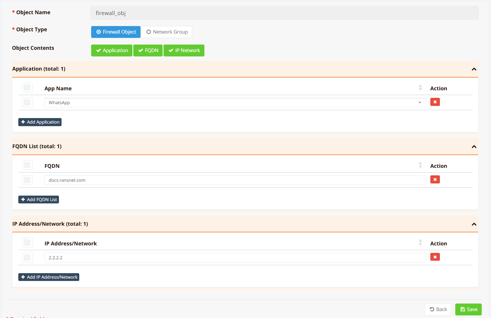
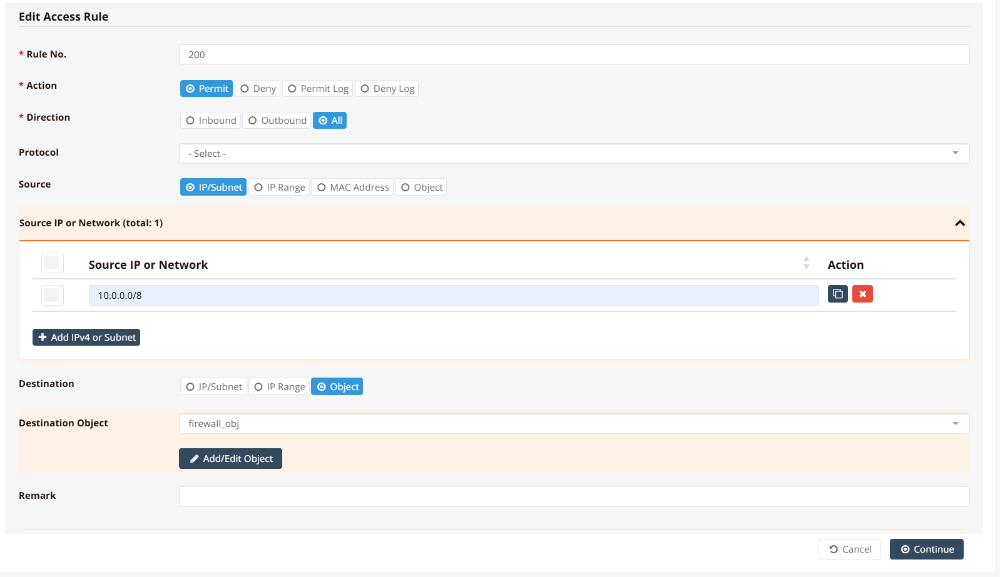

# Firewall Objects

Firewall rules become complex when you need to match against large sets of sources, destinations, or applications. Instead of listing individual IPs or FQDNs directly in every rule, you can define a **Firewall Object** — a named group of entries — and reference it by name in any rule that needs it.

This keeps rules concise and maintainable: update the object once and every rule that references it is updated automatically, without touching the rules themselves.

Firewall Objects support three entry types that can be combined freely:

| Type | Description |
|---|---|
| **net** | A static IP address or subnet in CIDR notation (e.g., `10.0.0.0/8`, `203.0.113.0/24`) |
| **fqdn** | A fully qualified domain name. Resolved to IPs via DNS at configuration time and refreshed every 10 minutes. |
| **app** | A named application. The system fetches and maintains the application's IP list from the cloud, refreshed every 10 minutes. |

!!! note
    Firewall Objects are distinct from [Network Groups](../../config/route/groups.md) used in static routing. Both support the same entry types, but they are configured separately and serve different purposes — Firewall Objects are referenced in firewall policy rules; Network Groups are referenced in static routes.

---

## GUI Configuration

Navigate to **ORCHESTRATOR → Templates → Object Groups**, click **New Object Group**.

Enter an object name and select type **Firewall Object**.



Add one or more entries to the object:

- **IP Network** — enter a prefix in CIDR notation. Multiple prefixes can be added to the same object.
- **FQDN** — enter a domain name. The system resolves it immediately and re-resolves every 10 minutes to track IP changes.
- **Application** — select from a pre-defined application list. The system fetches and maintains the corresponding IP list from the cloud.

Once saved, the object becomes available for selection in any firewall rule under **Device Settings → Security → Firewall Policies**.

When adding or editing a rule, set the **Source** or **Destination** type to **Object** and select the object name from the list.



---

## CLI Configuration

Define the object and its members:

```
object-group firewall_obj
  net 2.2.2.2/32
  net 203.0.113.0/24
  fqdn docs.ransnet.com
  app WhatsApp
```

Reference the object in a firewall rule using `src_object` or `dst_object`:

```
firewall-access 200 permit all src 10.0.0.0/8 dst_object firewall_obj
```

```
firewall-access 201 deny all src_object firewall_obj
```

**Key points:**

- `object-group <name>` enters the object configuration view. Add members with `net`, `fqdn`, or `app`; remove them with the `no` prefix (e.g., `no fqdn docs.ransnet.com`).
- `src_object <name>` and `dst_object <name>` are available in `firewall-access`, `firewall-input`, `firewall-dnat`, and `firewall-snat` rules.
- An object can be used alongside direct IP entries in the same rule — for example, a rule can specify both a `src` IP range and a `dst_object` simultaneously.

---

## Verification

Show the resolved members of an object:

```
show object-list firewall_obj
```

Example output:

```
Name: firewall_obj
Type: hash:net
Revision: 6
Header: family inet hashsize 1024 maxelem 65536
Size in memory: 824
References: 1
Members:
2.2.2.2
185.199.108.153
185.199.109.153
185.199.110.153
185.199.111.153
3.33.192.0/18
15.197.192.0/19
31.13.64.0/19
34.192.181.12
```

The member list includes all statically configured `net` entries plus all IPs currently resolved from `fqdn` and `app` entries.

Confirm the object is referenced correctly in the active firewall rule chain:

```
show firewall access-list
```

Example output:

```
 pkts bytes target     prot opt in     out     source               destination
 ------------------------------------------------------------------------------
 1922  792K ACCEPT     all  --  *      *       0.0.0.0/0            0.0.0.0/0            /* access-list 000 */
    0     0 ACCEPT     all  --  *      *       10.0.0.0/8           0.0.0.0/0            /* access-list 200 */ match-set firewall_obj dst
```

The `match-set firewall_obj dst` entry confirms the object is active and being matched against destination addresses in the forwarding chain.
