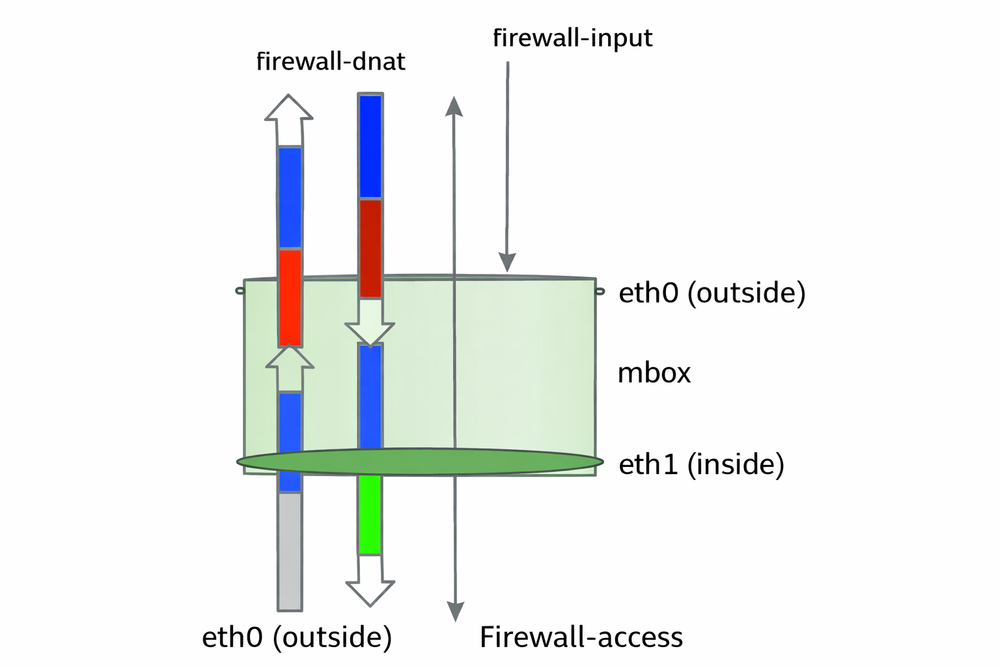
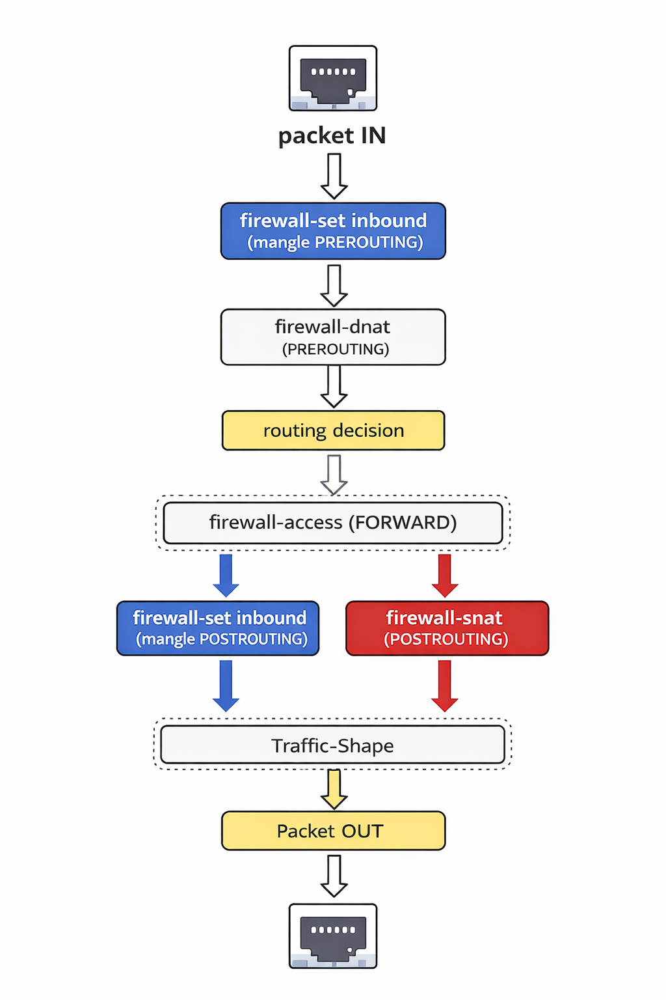

# Firewall Overview

RansNet SD-WAN routers include a built-in stateful firewall that controls all traffic entering, leaving, and passing through the device. Rules are evaluated per packet against configured criteria — source/destination IP, port, protocol, and connection state — and the result is either to permit, deny, or modify the packet.

The firewall is organised into distinct **rule chains**, each applied at a specific point in the packet processing pipeline. Understanding which chain to use for a given requirement is the starting point for any firewall configuration.

!!! note "Implicit Deny"
    All firewall rule chains enforce an **implicit deny** at the end. Any traffic that does not match an explicit permit rule is dropped automatically — no configuration is needed to block unmatched traffic.

---

## Rule Chains

The diagram shows how the four firewall chains map to packet direction and interface zone on the router. Each chain has a distinct purpose:

| Chain | Applied To | Purpose |
|---|---|---|
| **firewall-input** | Traffic destined **for the router itself** | Restrict access to management services — SSH, HTTPS, SNMP, API. Only authorised source IPs or networks are permitted to reach router-hosted services. |
| **firewall-access** | Traffic **passing through** the router (forwarded between interfaces) | Permit or deny transit traffic between network segments — LAN-to-WAN, VLAN-to-VLAN, VPN-to-LAN, etc. This is the primary chain for inter-zone access policy. |
| **firewall-dnat** | Inbound traffic — applied **before** the routing decision | Rewrite the destination IP and/or port of incoming packets. Used for port forwarding, DMZ access, and directing public traffic to internal servers. |
| **firewall-snat** | Outbound traffic — applied **after** the routing decision | Rewrite the source IP of outgoing packets. Used for PAT/masquerading (translating multiple internal hosts through a single public IP) and other source NAT scenarios. |

!!! note
    NAT rules (DNAT/SNAT) only rewrite packet addresses — they do not bypass access control. Traffic that has been NATed is still subject to `firewall-access` rules. Both NAT and access rules must be configured for traffic to flow end-to-end.

---

## Packet Flow

Every packet entering the router passes through the following stages in order:

1. **firewall-set inbound** *(mangle PREROUTING)* — optional packet marking for QoS classification, applied before any routing decision
2. **firewall-dnat** *(PREROUTING)* — destination address rewriting; packets destined for a published service are redirected to the internal server at this stage
3. **Routing decision** — the kernel determines whether the packet is destined for the router itself or needs to be forwarded to another interface
4. **firewall-access** *(FORWARD)* — transit traffic is evaluated against the access policy; packets belonging to established sessions are automatically permitted; unmatched packets are implicitly denied
5. **firewall-set outbound** *(mangle POSTROUTING)* — post-routing packet marking for egress QoS
6. **firewall-snat** *(POSTROUTING)* — source address rewriting for outbound traffic
7. **Traffic shaping** — QoS queuing and bandwidth policies applied before transmission
8. **Packet OUT** — packet exits via the egress interface

!!! note
    Traffic directed **at the router itself** (e.g. SSH, HTTPS management) exits the routing decision into the `firewall-input` chain rather than `firewall-access`. The two chains are independent — rules in one do not affect the other.

---

## Stateful Inspection

The firewall tracks active connections in a state table. Once an outbound connection is established and permitted through `firewall-access`, all subsequent return packets belonging to that session are automatically allowed — there is no need to write explicit inbound rules for return traffic.

Packets that do not belong to an existing session are evaluated against the rule set **from top to bottom**. The **first matching rule** is applied. If no rule matches, the packet is **implicitly denied**.

---

## Firewall Sections

The following pages cover each rule chain in detail:

| Page | Chain | Use case |
|---|---|---|
| [Access](input.md) | `firewall-input` + `firewall-access` | Management access restrictions and inter-zone transit policy |
| [DNAT](dnat.md) | `firewall-dnat` | Port forwarding and inbound destination NAT |
| [SNAT](snat.md) | `firewall-snat` | Outbound source NAT and PAT/masquerading |
