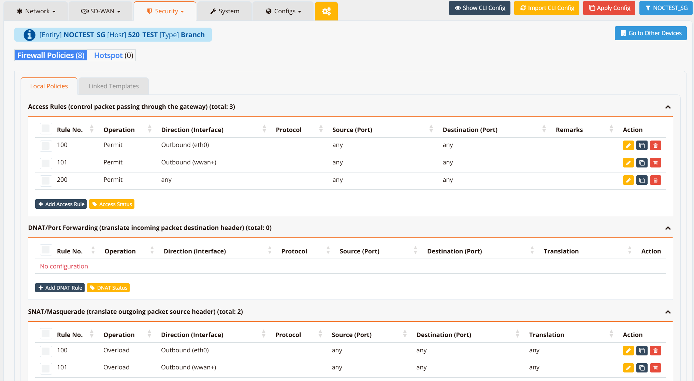
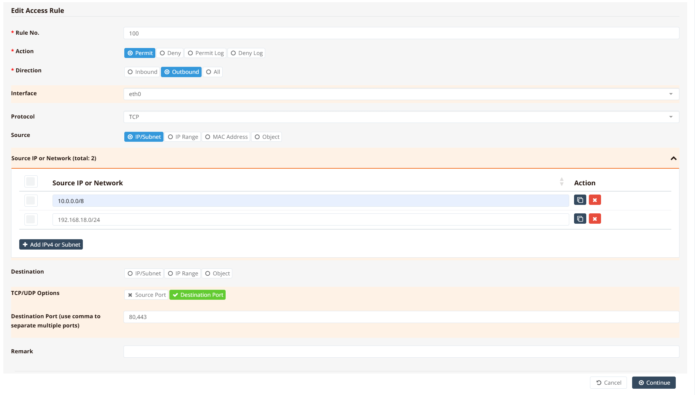
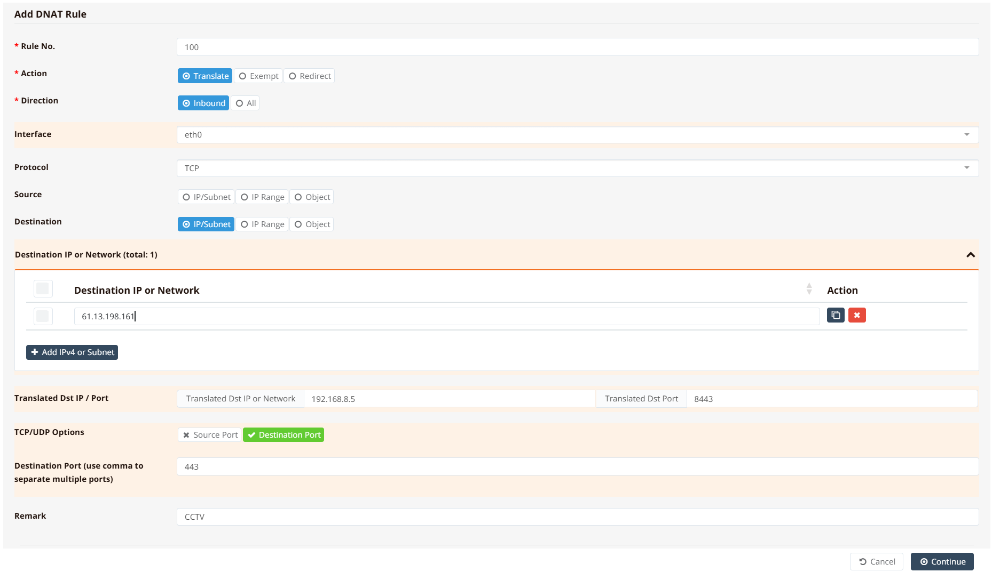
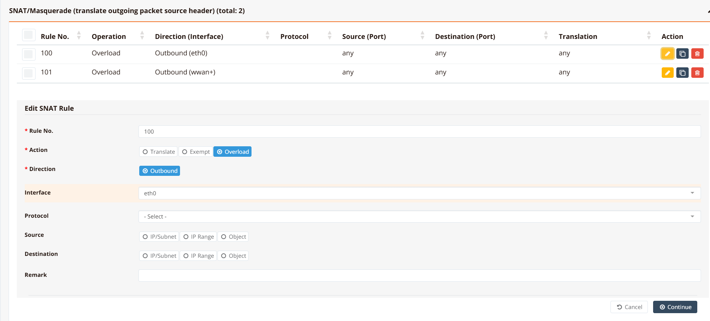
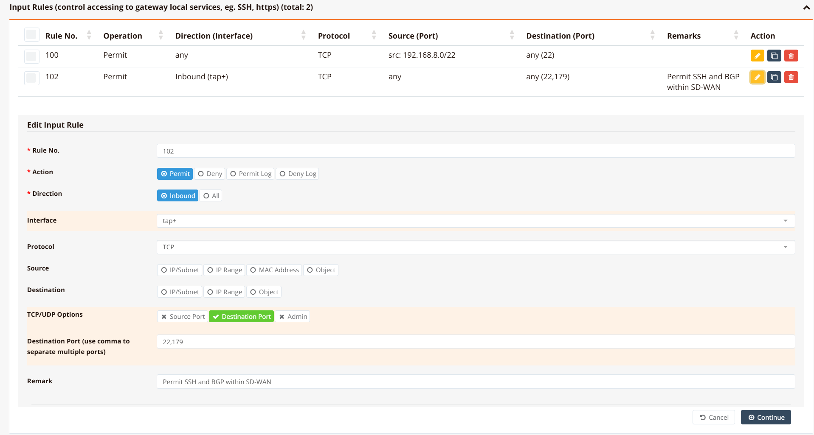

# Firewall Policies

Firewall policies are the rules that control which traffic is permitted, denied, or translated as it passes through or terminates on the router. Each rule chain has a dedicated section — **Access**, **DNAT**, **SNAT**, and **Input** — and all rules within a chain are evaluated top-to-bottom by rule number.

For an explanation of how these chains relate to the packet flow, see [Firewall Overview](overview.md).

## Rule Evaluation Conventions

- Rules are processed **in ascending rule number order** — lower numbers are evaluated first. A packet that matches a rule is acted on immediately and not evaluated by any subsequent rules.
- **Device-local rules** are numbered in the range `100`–`499`. These are configured directly on the device.
- **Template rules** are numbered in the range `500`–`999`. These are inherited from a device template in mfusion and apply in addition to local rules.
- Within a single rule, you may specify **multiple source or destination entries** of the same type (e.g. multiple source subnets). All entries are evaluated as OR — the rule matches if any one of them matches the packet.
- An **Object** can be used in place of individual IP/subnet entries to reference a named group of IPs, networks, applications, or FQDNs. See [Firewall Objects](objects.md).

!!! note "Implicit Deny"
    All rule chains end with an implicit deny. Any traffic that does not match an explicit permit rule is dropped silently. No explicit deny-all rule is needed.

---

## Firewall Policies Page

Navigate to **Device Settings → Security → Firewall Policies**.



The page displays three collapsible sections — **Access Rules**, **DNAT/Port Forwarding**, and **SNAT/Masquerade** — each showing the currently configured rules for that chain. An **Input Rules** section is also available by scrolling down.

Each rule table shows the following columns:

| Column | Description |
|---|---|
| **Rule No.** | The rule's position in the chain. Rules are evaluated lowest-first. |
| **Operation** | The action applied — `Permit`, `Deny`, `Overload`, `Translate`, or `Exempt` |
| **Direction (Interface)** | The traffic direction and the interface it applies to (e.g. `Outbound (eth0)`, `Inbound (tap+)`) |
| **Protocol** | The IP protocol matched — `TCP`, `UDP`, `ICMP`, or `any` |
| **Source (Port)** | Matched source IP/network and optional source port |
| **Destination (Port)** | Matched destination IP/network and optional destination port |
| **Remarks** | Optional free-text label describing the rule's purpose |
| **Action** | Edit, clone, or delete the rule |

---

## firewall-access

The `firewall-access` chain controls traffic **passing through** the router between interfaces — for example, from LAN to WAN, between VLANs, or from a VPN tunnel to a local subnet. It is equivalent to a FORWARD policy.

Key behaviours:

- Packets belonging to an **established or related session** are automatically permitted — no rule is needed for return traffic.
- All other traffic is evaluated top-to-bottom against the access rules.
- Unmatched traffic is **implicitly denied**.

**GUI Configuration**

Click **+ Add Access Rule** to open the rule form.



| Field | Description |
|---|---|
| **Rule No.** | Position in the rule chain. Lower numbers are evaluated first. |
| **Action** | `Permit` — allow matching traffic. `Deny` — drop matching traffic silently. `Permit Log` / `Deny Log` — same as above, but also log each matched packet to syslog. |
| **Direction** | `Inbound` — traffic arriving on the specified interface. `Outbound` — traffic leaving via the specified interface. `All` — both directions. |
| **Interface** | The interface this rule applies to. Leave blank to match all interfaces. |
| **Protocol** | `TCP`, `UDP`, `ICMP`, or leave blank for any protocol. |
| **Source** | Match by `IP/Subnet`, `IP Range`, `MAC Address`, or `Object`. Multiple entries can be added — the rule matches if any entry matches the packet's source. |
| **Destination** | Match by `IP/Subnet`, `IP Range`, or `Object`. Multiple entries supported. See [Firewall Objects](objects.md) for how to define named groups. |
| **TCP/UDP Options** | Enable `Source Port` and/or `Destination Port` matching. Enter multiple port numbers or ranges separated by commas (e.g. `80,443` or `8000-8080`). |
| **Remark** | Optional free-text description for the rule |

!!! tip
    Use the **Object** source/destination type to group multiple IPs, subnets, FQDNs, or application signatures under a single named reference. This keeps rules concise and makes policy changes easier to manage — update the Object once and all rules using it are updated automatically. See [Firewall Objects](objects.md).

**CLI Configuration**

```
firewall-access 100 permit outbound eth0 tcp src 10.0.0.0/8,192.168.18.0/24 dport 80,443
```

**Key points:**

- `100` — rule number; evaluated before any rule numbered 101 or higher
- `permit outbound eth0` — permit traffic leaving via `eth0`
- `tcp` — match TCP protocol only
- `src 10.0.0.0/8,192.168.18.0/24` — match packets from either source subnet (comma-separated, no spaces)
- `dport 80,443` — match destination port 80 or 443

---

## firewall-dnat

The `firewall-dnat` chain rewrites the **destination IP address and/or port** of inbound packets before the routing decision is made. This is the mechanism for port forwarding and inbound access to internal servers — a packet arriving on the WAN interface addressed to the public IP is redirected to an internal host.

**GUI Configuration**

Click **+ Add DNAT Rule** to open the rule form.



| Field | Description |
|---|---|
| **Rule No.** | Position in the DNAT chain. Lower numbers are evaluated first. |
| **Action** | `Translate` — rewrite the destination IP/port as configured. `Exempt` — bypass address translation for matching traffic; place exempt rules above translate rules when specific sources must not be NATed. `Redirect` — redirect traffic to a local service on the router itself (e.g. transparent proxy). |
| **Direction** | `Inbound` — apply to traffic arriving on the interface. `All` — apply in both directions. |
| **Interface** | The WAN interface on which inbound traffic arrives (e.g. `eth0`). |
| **Protocol** | `TCP`, `UDP`, or leave blank for any. |
| **Source** | Optional — restrict the rule to packets from specific source IPs or networks. Leave blank to match all sources. |
| **Destination** | The public IP address (or range) that incoming packets are addressed to — typically the router's WAN IP. |
| **Translated Dst IP / Port** | The internal host IP and port to forward the traffic to. |
| **TCP/UDP Options** | Enable `Source Port` and/or `Destination Port` to match specific ports. Multiple ports can be entered comma-separated. |
| **Remark** | Optional free-text label |

!!! note
    A DNAT rule alone does not permit the forwarded traffic. A corresponding `firewall-access` rule must also exist to allow the translated packet to reach the internal host. DNAT rewrites the address; `firewall-access` controls whether the packet is forwarded.

**CLI Configuration**

```
firewall-dnat 100 translate inbound eth0 tcp dst 61.13.198.161 dport 443 xdst 192.168.8.5 xdport 8443 remark CCTV
```

**Key points:**

- `translate inbound eth0` — rewrite destination on packets arriving on `eth0`
- `tcp dst 61.13.198.161 dport 443` — match TCP packets addressed to the WAN IP on port 443
- `xdst 192.168.8.5 xdport 8443` — translate destination to internal host `192.168.8.5` port `8443`
- `remark CCTV` — optional label identifying this rule

---

## firewall-snat

The `firewall-snat` chain rewrites the **source IP address** of outbound packets after the routing decision. The most common use is PAT/masquerading — all internal hosts sharing a single public WAN IP, with each session distinguished by a unique source port assigned by the router.

**GUI Configuration**

Click **+ Add SNAT Rule** to open the rule form.



| Field | Description |
|---|---|
| **Rule No.** | Position in the SNAT chain. Lower numbers are evaluated first. |
| **Action** | `Overload` — PAT/masquerade; translate all matching source IPs to the outgoing interface's IP, using unique source ports to track sessions. `Translate` — rewrite the source IP to a specific address or pool. `Exempt` — bypass source address translation for matching traffic; place above translate/overload rules for traffic that should not be NATed. |
| **Direction** | Typically `Outbound` — apply to traffic leaving via the specified interface. |
| **Interface** | The WAN interface on which source translation is applied (e.g. `eth0`, `wwan0`). |
| **Protocol** | Optional — restrict to a specific protocol. Leave blank to apply to all traffic. |
| **Source** | Optional — restrict to packets from specific internal subnets. Leave blank to apply to all outbound traffic. |
| **Destination** | Optional — restrict to packets addressed to specific destinations. |
| **Remark** | Optional free-text label |

!!! note
    A SNAT rule alone does not permit the forwarded traffic. A corresponding `firewall-access` rule must also exist to allow the translated packet to reach the internal host. SNAT rewrites the address; `firewall-access` controls whether the packet is forwarded.

**CLI Configuration**

```
firewall-snat 100 overload outbound eth0
firewall-snat 101 overload outbound wwan+
```

**Key points:**

- `overload outbound eth0` — masquerade all outbound traffic on `eth0` behind the interface's WAN IP
- `wwan+` — the `+` wildcard matches all WWAN interfaces (`wwan0`, `wwan1`, etc.); a single rule covers all cellular uplinks regardless of how many modems are present

---

## firewall-input

The `firewall-input` chain controls traffic **destined for the router itself** — management services such as SSH, HTTPS, BGP, SNMP, and RADIUS. It does not affect transit traffic between interfaces, which is handled by `firewall-access`.

By default, the system pre-permits a set of commonly required, low-risk services: ICMP, DHCP requests, GRE, IPsec (IKE + ESP), and others. These are listed as `DEFAULTHIDE99` entries in the rule list. Use `show firewall input-list all` in the CLI to view all active default rules.

**GUI Configuration**

Click **+ Add Input Rule** to open the rule form.



| Field | Description |
|---|---|
| **Rule No.** | Position in the input chain. Lower numbers are evaluated first. |
| **Action** | `Permit`, `Deny`, `Permit Log`, or `Deny Log` |
| **Direction** | `Inbound` — restrict to traffic arriving on a specific interface. `All` — apply regardless of which interface the packet arrives on. |
| **Interface** | The interface on which the management access is permitted (e.g. `tap+` for SD-WAN tunnel interfaces, `eth1` for a trusted LAN port). |
| **Protocol** | `TCP`, `UDP`, `ICMP`, or blank for any. |
| **Source** | Optional — restrict access to specific source IPs, ranges, or Objects. Leave blank to allow from any source. |
| **Destination** | Optional — restrict to packets addressed to specific destination IPs on the router. |
| **TCP/UDP Options** | `Source Port`, `Destination Port`, or `Admin` (matches the router's management port). Multiple ports comma-separated. |
| **Remark** | Optional free-text description |

!!! tip
    Always restrict management access (`SSH`, `HTTPS`) to known trusted source IPs or networks — at minimum, limit to the SD-WAN tunnel interface (`tap+`) and the LAN management subnet. Avoid permitting management access on WAN interfaces without source IP restrictions.

**CLI Configuration**

```
firewall-input 102 permit inbound tap+ tcp dport 22,179 remark "Permit SSH and BGP within SD-WAN"
```

**Key points:**

- `permit inbound tap+` — permit traffic arriving on any SD-WAN tunnel interface (`tap0`, `tap1`, etc.)
- `tcp dport 22,179` — match TCP destination port 22 (SSH) or 179 (BGP)
- `remark` — labels the rule for identification in the policy list

---

## firewall-disable

The system's default permit rules cover commonly required traffic (ICMP, IKE, ESP, DHCP, GRE). If a security policy or compliance requirement mandates disabling one of these defaults, use the `firewall-disable` command rather than attempting to add an explicit deny rule on top.

```
firewall-disable ?
  access     Disable default access rules
  br-filter  Disable layer-2 firewall
  input      Disable default input rules
  sip-alg    Disable NAT ALG for SIP
```

To verify which default rules are currently active:

```
show firewall access-list all
show firewall input-list all
```

Rules marked `DEFAULTHIDE99` are system defaults. Rules without this tag are user-configured.
