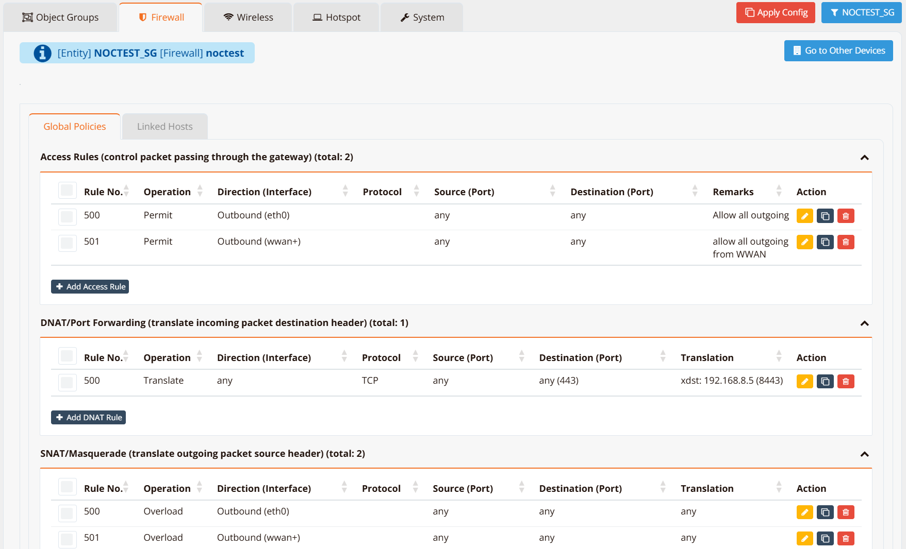
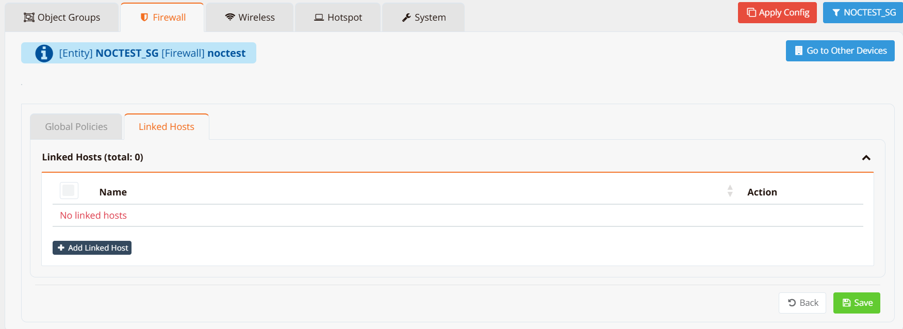
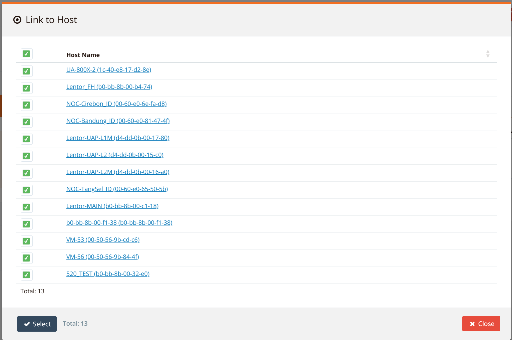
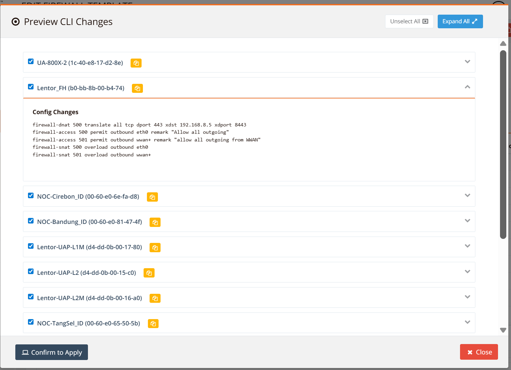
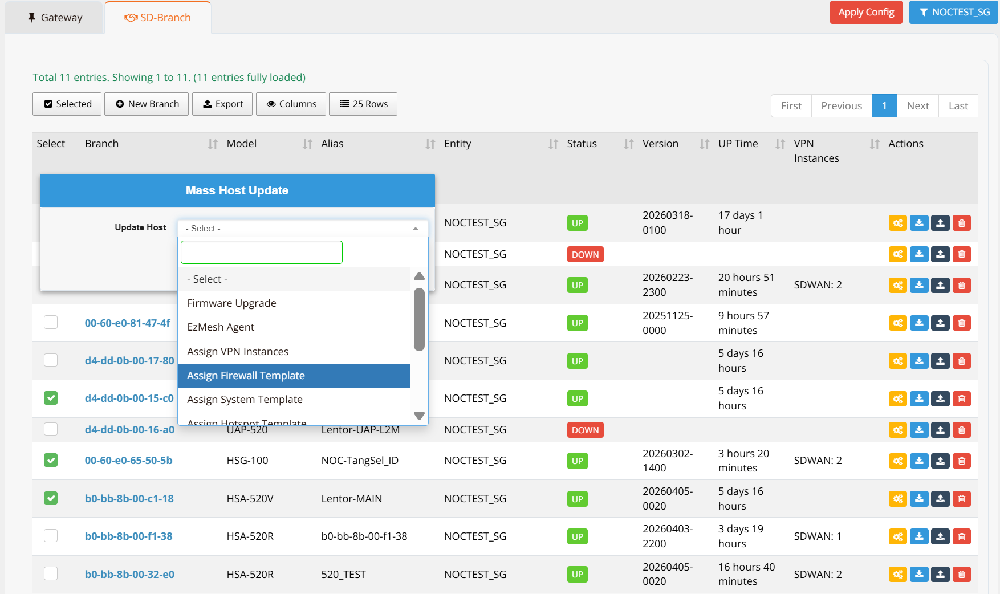

# Firewall Templates

A Firewall Template is a shared set of firewall policies defined once in the Orchestrator and pushed automatically to all devices linked to it. Instead of repeating the same rules on every device, you configure the policy in a template and attach the template to as many devices as needed.

Each device continues to maintain its own local policies alongside the inherited template rules. The rule number range determines precedence:

| Rule Range | Source | Description |
|---|---|---|
| `100` – `499` | Local device | Configured directly on the device. Evaluated first — local rules always take precedence. |
| `500` – `999` | Firewall template | Inherited from the linked template. Evaluated after all local rules. |

A device can have both local rules and a template active simultaneously. A packet is matched against local rules (100–499) first; if no local rule matches, template rules (500–999) are evaluated.

!!! note
    Templates are **entity-scoped** — they are usable to all devices within the same entity in mfusion. A template configured in one entity is not visible to devices in a different entity.

---

## Creating a Template

Template policies can only be configured in the Orchestrator.

Navigate to **ORCHESTRATOR → Templates → Firewall**, click **New Firewall Template**, enter a name, then click **Add**.



The template opens in edit mode. Configure rules exactly as you would on a per-device basis — the interface is identical to **Device Settings → Security → Firewall Policies**. Rule numbers in a template automatically start from `500`.

---

## Linking Devices to a Template

There are two ways to assign a template to devices.

### Method 1 — From the template

Open the target template, click the **Linked Hosts** tab.



Click **Add Linked Host**. A list of all devices within the entity appears — select the devices to link.



Click **Save**, then **Apply Config** (upper right corner). mfusion pushes the template policies to all linked devices immediately.



### Method 2 — Mass update from the device list

Navigate to **ORCHESTRATOR → Branch/Gateway Devices**. Filter and select the target devices, then open the **Selected** menu and choose **Mass Update → Assign Firewall Template**.



Select the template to assign, click **Save**, then **Apply Config** to push the policies.

---

## Ongoing Management

Once devices are linked, any change to the template is applied to all linked devices automatically on the next **Apply Config**. You do not need to touch individual device configurations for policy changes that are covered by the template.

To apply a policy that is unique to one device, configure it as a local rule (number `100`–`499`) on that device — it will be evaluated before the template rules regardless of content.

!!! tip
    Use templates to enforce a common baseline security policy across all sites — for example, blocking known malicious destinations or permitting SD-WAN management traffic. Use local rules for site-specific exceptions on top of that baseline.

---

## Verification

To confirm that template rules have been applied to a device, run the following on the device CLI:

```
show firewall access-list all
```

Rules inherited from the template appear alongside local rules, identified by their rule number (500–999). Rules marked `DEFAULTHIDE99` are system defaults.

```
show firewall input-list all
```

Use this command to verify template-pushed input rules in the same way.
