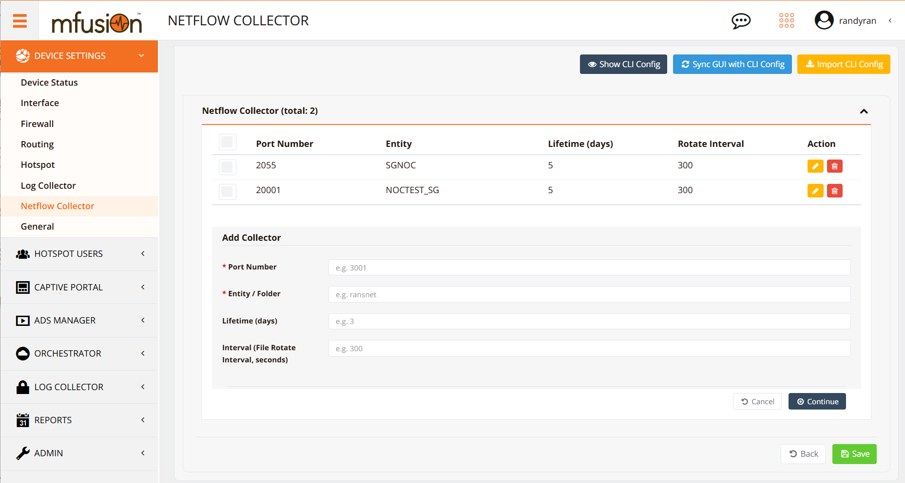
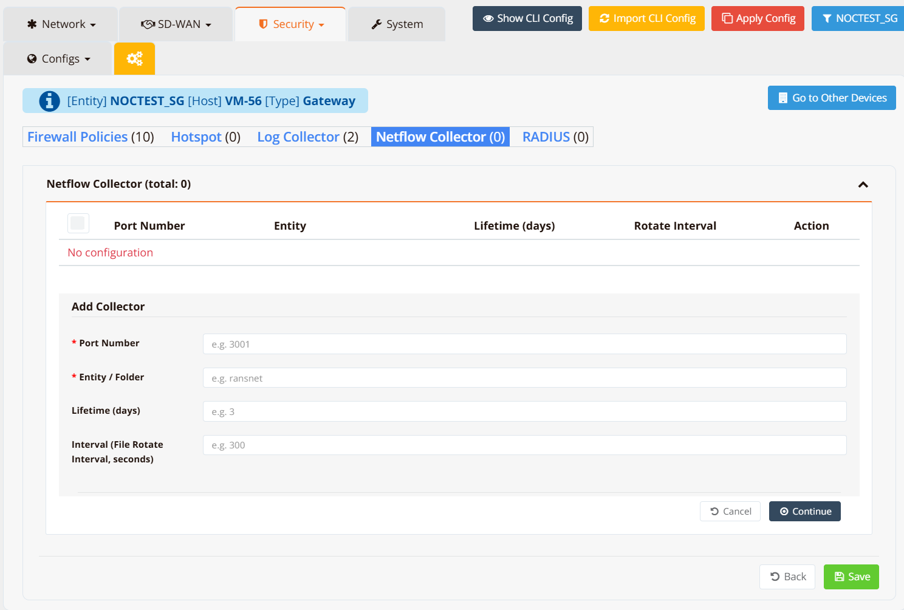

# NetFlow Collector

!!! note
    This feature requires the appliance to be licensed as **mfusion**, which includes local storage for collecting, storing, and analysing NetFlow data. See [Device Monitoring → NetFlow](../monitor/netflow.md) for the analysis dashboard.

The mfusion appliance can act as a NetFlow collector, receiving flow exports from remote routers and presenting them through the NetFlow analyser GUI. A single collector can receive NetFlow from multiple remote routers simultaneously, with each router's data isolated into a separate tenant (entity) for independent analysis.

---

## Planning

Before configuring the collector, map out your tenants and port assignments:

- Each **entity** in mfusion corresponds to one data tenant — NetFlow data from different customers or sites is stored separately per entity.
- Each entity is assigned a **dedicated UDP port**. All routers belonging to that entity export NetFlow to the collector on that port, so their data lands in the correct tenant folder.
- Ensure the collector's designated ports are reachable from the remote routers — either directly over the internet or via VPN tunnels.

See [Provisioning → Create Customer Entity](../start/device/provision.md#create-customer-entity) for how to set up entities, and [NetFlow Export](../config/iface/netflow.md) for how to configure routers to export.

---

## GUI Configuration

**Option 1 — Configure directly on the mfusion appliance**

Navigate to **Device Settings → NetFlow Collector**.



**Option 2 — Configure via the orchestrator (if managed by another mfusion)**

Navigate to **ORCHESTRATOR → Device Settings → Security → NetFlow Collector**.



---

### Parameters

| Parameter | Description |
|---|---|
| **Port** | UDP port the collector listens on for incoming NetFlow exports from remote routers. Each entity should use a unique port. |
| **Data (Entity)** | The entity name this port's data is stored under. Must match the entity name exactly as defined during provisioning. |
| **Life (days)** | How long NetFlow data is retained before being purged. NetFlow data can consume significant storage — keep this as short as your analysis requirements allow. |
| **Interval (seconds)** | How frequently the collector rotates the active capture file. A shorter interval (e.g. `60`) gives more near-real-time visibility in the dashboard; a longer interval (e.g. `300`) produces fewer files. |

!!! warning
    The **Data** (entity name) value must match the entity name defined during provisioning exactly — including capitalisation. A mismatch will cause the data to be stored in the wrong location or dropped.

---

## CLI Configuration

```
nf-collector port <port> data <entity> life <days> interval <seconds>
```

**Example** — two entities on separate ports:

```
nf-collector port 20001 data NOCTEST_SG life 5 interval 300
nf-collector port 2055 data SGNOC life 5 interval 300
```

This configures the collector to:

- Listen on port `20001` for routers belonging to entity `NOCTEST_SG`, retaining 5 days of data with 5-minute file rotation
- Listen on port `2055` for routers belonging to entity `SGNOC`, with the same retention and rotation settings

---

## Verification

Run a tcpdump on the interface facing the remote routers to capture incoming NetFlow packets, filtering on the collector port:

```
tcpdump interface eth0 port 2055
```

Expected output shows UDP packets arriving from the remote router's IP at the collector port:

```
10:15:32.451293 IP 192.168.10.1.49155 > 10.65.30.2.2055: UDP, length 984
10:15:37.882104 IP 192.168.10.1.49155 > 10.65.30.2.2055: UDP, length 456
10:15:42.119867 IP 192.168.10.1.49155 > 10.65.30.2.2055: UDP, length 1416
```

If no packets arrive, check:

- The remote router has `ip flow-export` configured pointing to this collector's IP and port
- The port is not blocked by a firewall rule on the collector or upstream
- The remote router has a route to reach the collector (directly or via VPN)
