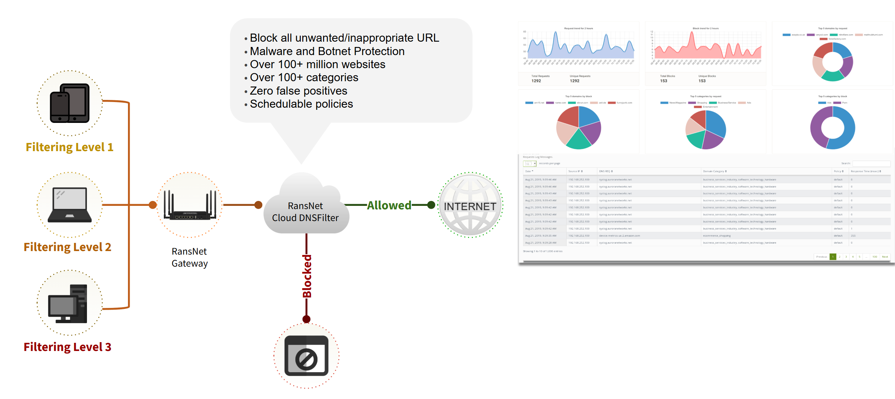
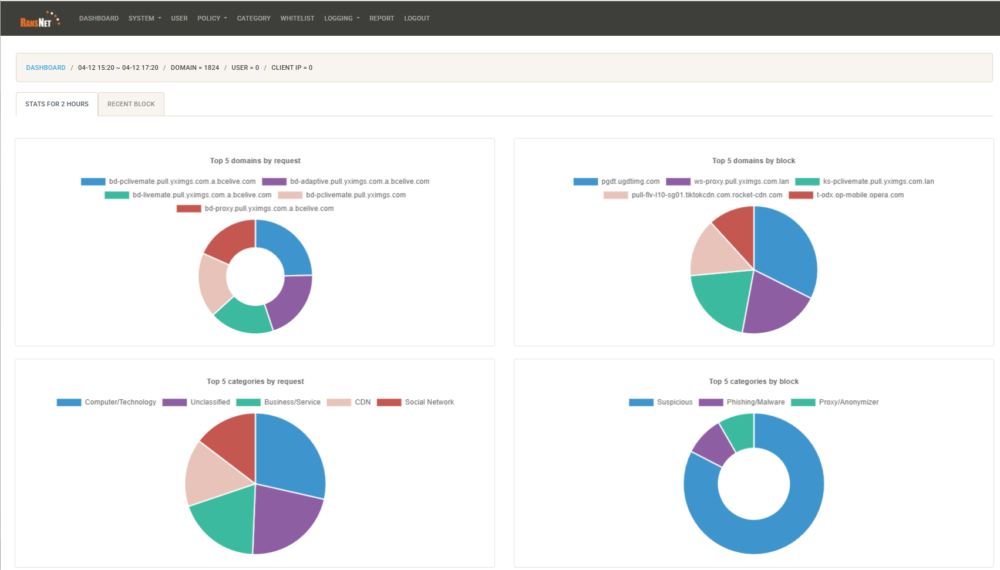
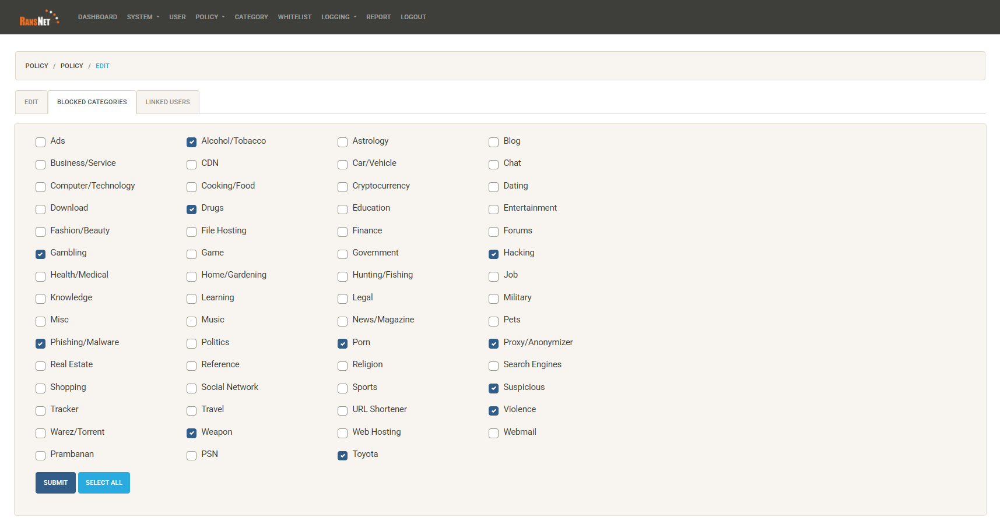

# Web Filtering

Web filtering controls which websites and internet services users on the network are permitted to access. Three complementary methods are available, each operating at a different layer:

| Method | How it works | Granularity | Bypass resistance |
|---|---|---|---|
| **[Firewall Rules + Objects](#method-1-firewall-rules-with-objects)** | Blocks actual TCP/UDP connections by IP, subnet, FQDN, or application | Rule-level — precise per source/destination control | High — blocks at connection level regardless of DNS |
| **[DNS Filtering](#method-2-dns-filtering)** | Intercepts DNS queries and returns no address for blocked domains | Domain-level — covers all subdomains automatically | Moderate — can be bypassed by DoH or hardcoded DNS |
| **[Cloud DNS Category Filtering](#method-3-cloud-dns-category-filtering)** | Routes DNS through a cloud resolver enforcing category-based policies | Category-level — managed lists, no manual domain maintenance | Moderate — same DNS-layer caveats; combines well with Method 1 |

These methods can be used independently or combined. A typical layered deployment uses firewall rules for application-level blocking, DNS filtering for custom domain controls, and cloud DNS for broad category enforcement across all sites.

---

## Method 1: Firewall Rules with Objects

This method uses `firewall-access` rules combined with **Firewall Objects** to permit or deny traffic based on IP addresses, subnets, FQDNs, or application signatures. Unlike DNS filtering, it operates at the connection level — a client that successfully resolves a domain will still be blocked if a matching firewall rule denies the connection.

**When to use this method:**

- Blocking specific applications (e.g. deny all traffic to Facebook's IP ranges)
- Denying access to known malicious IP ranges
- Permitting only approved destinations from a guest or IoT network
- Environments where DNS bypass (DoH, hardcoded DNS) is a concern

**How it works:**

1. Define a [Firewall Object](firewall/objects.md) containing the destinations to block or permit — using `net` (IP/subnet), `fqdn` (domain), or `app` (application, with IP lists maintained by the cloud).
2. Create a `firewall-access` rule referencing that object as the source or destination.

### GUI Configuration

Navigate to **ORCHESTRATOR → Templates → Object Groups**, create a Firewall Object with the destinations to control. Then navigate to **Device Settings → Security → Firewall Policies** and add an access rule using **Object** as the destination type.

See [Firewall Objects](firewall/objects.md) and [Firewall Policies](firewall/policies.md) for full configuration details.

### CLI Configuration

**Block specific applications by name:**

```
object-group blocked_apps
  app Facebook
  app TikTok
  app YouTube

firewall-access 100 deny outbound eth0 dst_object blocked_apps
```

**Block a set of IP ranges and domains:**

```
object-group blocked_sites
  net 203.0.113.0/24
  fqdn malicious-site.example.com

firewall-access 110 deny all dst_object blocked_sites
```

**Permit only approved destinations (default-deny approach):**

```
object-group approved_dst
  fqdn corporate.example.com
  net 10.0.0.0/8

firewall-access 100 permit outbound eth0 dst_object approved_dst
firewall-access 200 deny outbound eth0
```

**Key points:**

- `app` entries use cloud-maintained IP lists that update automatically — no manual IP management needed for well-known applications
- `fqdn` entries in objects are resolved periodically; resulting IPs are matched against connection destinations — this differs from DNS filtering which intercepts the query itself
- Rules are evaluated top-to-bottom; place more specific permits before a broad deny

---

## Method 2: DNS Filtering

DNS filtering intercepts client DNS queries at the router and returns a controlled response — blocking a domain (returning `0.0.0.0`) or permitting it through to the upstream resolver. Because filtering happens at the DNS layer, it requires no changes on client devices and applies to all clients on the network automatically.

### Prerequisites

Before configuring DNS filtering, redirect client DNS traffic to the router. A **DNAT rule** captures port 53 traffic from clients, and a paired **firewall-input rule** permits the redirected traffic into the router itself:

```
firewall-dnat 201 redirect inbound br-vlan1 udp dport 53
firewall-input 201 permit inbound br-vlan1 udp dport 53
```

Replace `br-vlan1` with the LAN-facing interface for your deployment.

### Wildcard Matching and Specificity

!!! note "Automatic subdomain coverage"
    Every domain entry covers the domain itself **and all its subdomains** — no wildcard syntax required. Adding `domain facebook.com` blocks or permits `facebook.com`, `www.facebook.com`, `m.facebook.com`, `static.xx.fbcdn.net`... and any other subdomain automatically.

**More specific entries always take precedence over broader ones**, regardless of rule order. This means you can:

- Block `facebook.com` (covers all subdomains) while permitting `business.facebook.com` with a separate entry
- Permit `google.com` while denying `ads.google.com` for a specific subdomain exception

Lower rule IDs have higher priority. Once a domain is matched by a rule, it is not re-evaluated by later rules.

### DNS Groups

DNS groups let you organise domains into named lists referenced by filter rules. This keeps rules concise and makes bulk changes easy — add or remove a domain from the group without modifying any rules.

```
dns-group adult-sites
  domain playboy.com
  domain pornhub.com
!
```

Managing group members:

```
dns-group adult-sites
  no domain playboy.com
!
```

Removing an entire group:

```
no dns-group adult-sites
```

Viewing configured groups:

```
show dns-group
show dns-group adult-sites
```

### Blacklisting — Block Specific Domains

Default-permit: all domains resolve normally except those explicitly denied.

**CLI Configuration**

```
dns-group adult-sites
  domain playboy.com
  domain pornhub.com
!
dns-filter 100 deny group adult-sites
dns-filter 200 permit all
```

Rule 100 blocks all domains in the `adult-sites` group (and their subdomains). Rule 200 permits everything else. Rules are evaluated in ascending ID order.

To block a single domain directly without a group:

```
dns-filter 100 deny domain malicious-site.example.com
dns-filter 200 permit all
```

To remove a rule:

```
no dns-filter 100 deny domain malicious-site.example.com
```

### Whitelisting — Allow Only Approved Domains

Default-deny: all domains are blocked except those explicitly permitted. A `deny all` catch-all at a high rule ID blocks everything; `permit domain` rules with lower IDs override it for approved domains.

!!! note
    Many sites depend on multiple domains — CDNs, authentication endpoints, API services, and analytics. Permitting a site requires permitting all its supporting domains. Use `tcpdump` or DNS query logging to identify them.

**CLI Configuration**

```
dns-filter 100 permit domain google.com
dns-filter 110 permit domain googleapis.com
dns-filter 120 permit domain gstatic.com
dns-filter 130 permit domain ransnet.com
dns-filter 900 deny all
```

The `deny all` catch-all at rule 900 blocks any domain not explicitly permitted by a lower-numbered rule.

### GUI Configuration

*[Screenshot — to be added]*

Navigate to **Device Settings → Security → DNS Filter**. Add domain groups under **DNS Groups** and configure filter rules under **DNS Filter Rules**.

### Verification

After configuring DNS filtering, verify blocked domains return `0.0.0.0`:

```
C:\Users\yingd>nslookup playboy.com
Server:  dns.google
Address:  8.8.8.8

Name:    playboy.com
Address:  0.0.0.0
```

The router transparently intercepts the DNS query — even though the client is configured to use an external resolver (8.8.8.8), the DNAT rule redirects the query to the router's DNS engine, which returns `0.0.0.0` for blocked domains.

After removing the block (`no domain playboy.com` under `dns-group adult-sites`), the domain resolves normally:

```
C:\Users\yingd>nslookup playboy.com
Server:  dns.google
Address:  8.8.8.8

Name:    playboy.com
Addresses:  2606:4700:7::d1
            2606:4700:3033::d0
            162.159.140.211
            162.159.141.211
```

### Identifying Required Domains

When whitelisting, use `tcpdump` on the router to capture all DNS queries clients make while browsing a target site:

```
tcpdump interface br-vlan1 port 53 detail
```

Watch the output while navigating the site fully — including login, media loading, and background API calls. Add each unresolved domain to the whitelist.

### Limitations

| Limitation | Detail |
|---|---|
| **DNS over HTTPS (DoH)** | Browsers can send DNS queries over HTTPS directly to a cloud DoH provider, bypassing the router's DNS interception entirely. |
| **DNS over TLS (DoT)** | DNS queries over TCP port 853 bypass the DNAT redirect. Block outbound port 853 if needed. |
| **Hardcoded DNS** | Applications using a hardcoded DNS server IP bypass the DNAT redirect. |
| **VPN / Proxy** | Traffic inside a VPN or proxy tunnel bypasses DNS filtering. |

To prevent clients from bypassing DNS controls:

```
firewall-access 150 deny outbound eth0 udp dport 53
firewall-access 151 deny outbound eth0 tcp dport 53
firewall-access 152 deny outbound eth0 tcp dst 1.1.1.1,1.0.0.1,8.8.8.8,8.8.4.4 dport 443
```

Rules 150–151 block direct DNS to external resolvers; rule 152 blocks HTTPS to known DoH providers. The DNAT redirect continues to intercept all port 53 traffic and process it locally.

---

## Method 3: Cloud DNS Category Filtering

Cloud DNS Category Filtering routes client DNS queries through a managed cloud DNS resolver that enforces category-based policies. Instead of maintaining manual domain lists, the cloud service categorises millions of domains into content groups — administrators simply select which categories to block. The cloud service also logs all DNS queries and generates usage reports, providing visibility into browsing activity across the network.

### How It Works



1. Client DNS is pointed to the router's LAN IP (via DHCP or static configuration).
2. When a client queries a domain, the router forwards the request to the RansNet cloud DNS server as its upstream resolver.
3. The cloud DNS server authenticates the request source, checks whether the queried domain falls within a permitted category, and either returns the resolved IP or blocks the query.
4. Every DNS request is logged in the cloud dashboard, categorised and attributed for reporting.

!!! note
    The cloud DNS server authenticates requests by **source IP** — the router's public WAN IP address. Each subscription is tied to one WAN IP per location. Provide your WAN IP to the RansNet provisioning team at the time of subscription.

### Requirements

- A **static public WAN IP** address on the router. The cloud resolver authenticates by source IP; a dynamic IP will cause the subscription to fail on IP changes.
- The router must intercept client DNS queries so they are forwarded through the router to the cloud resolver. See [DNS & DNS Rewrite](../config/dnsrewrite.md) for setup details, including the DNAT rule that transparently redirects port 53 traffic from clients regardless of what DNS server they have configured.

!!! tip
    If your router's WAN connection does not have a static public IP, you can route DNS queries through the RansNet SD-WAN to break out from a RansNet cloud gateway that has a static IP. See the Cloud SD-WAN section for details.

### Subscription and Activation

Cloud DNS Category Filtering is a subscription service licensed per router (per network location). To subscribe, contact RansNet sales at [ransnet.com/home/contact](https://ransnet.com/home/contact) and provide the public WAN IP of each router location to be covered.

Once provisioned, the RansNet team will:

- Configure the cloud DNS resolver for your WAN IP
- Provide the cloud DNS server IP to set as your upstream resolver
- Grant admin access to the management portal at **[webfilter.ransnet.com/admin](https://webfilter.ransnet.com/admin)**

### Router Configuration

Point the router's upstream DNS to the cloud DNS server IP provided by RansNet at provisioning:

```
ip name-server <cloud-dns-ip>
```

Ensure clients are using the router as their DNS server (set via DHCP). No additional router configuration is required — the cloud resolver handles all category enforcement.

### Managing Filtering Policies

Log in to the admin portal at **[webfilter.ransnet.com/admin](https://webfilter.ransnet.com/admin)**.



Navigate to **POLICY → LIST/CREATE** to edit or create filtering policies. Each policy defines which content categories are blocked or permitted — by default all categories are permitted.



Tick the categories you want to block. Common categories include:

| Category group | Examples |
|---|---|
| **Security threats** | Malware, Phishing, Spyware, Botnets, Command & Control |
| **Adult content** | Pornography, Adult themes, Nudity |
| **Social media** | Facebook, Instagram, TikTok, Twitter/X, Snapchat |
| **Video streaming** | YouTube, Netflix, TikTok video, Twitch |
| **Gaming** | Online games, Game downloads |
| **Gambling** | Online casinos, Sports betting, Lottery |
| **Proxy & anonymisers** | VPN services, Tor, Web proxies |
| **File sharing** | Torrents, P2P, Cyberlockers |
| **Productivity** | Ads & tracking, Instant messaging, Shopping |

Changes to the policy take effect within a few minutes and apply to all clients at locations linked to that policy.

### Viewing Logs and Reports

The admin portal provides a dashboard showing DNS query activity across all linked locations:

- **Per-domain logs** — every queried domain, its category, and whether it was permitted or blocked
- **Category breakdown** — traffic volume by content category over a selected time period
- **Top domains** — most frequently queried domains across the network
- **Blocked query history** — a list of blocked requests for audit and policy review

Use the logs to identify which domains are being blocked unexpectedly and add custom whitelist exceptions where needed.

### Custom Whitelist and Blacklist

Within the portal you can override the category policy for specific domains:

- **Custom whitelist** — always permit a domain regardless of its category (e.g. a legitimate business site miscategorised as social media)
- **Custom blacklist** — always block a specific domain regardless of category settings (e.g. block a specific competitor site outside any standard category)

This allows fine-grained exceptions on top of the broad category policy without modifying the policy itself.
