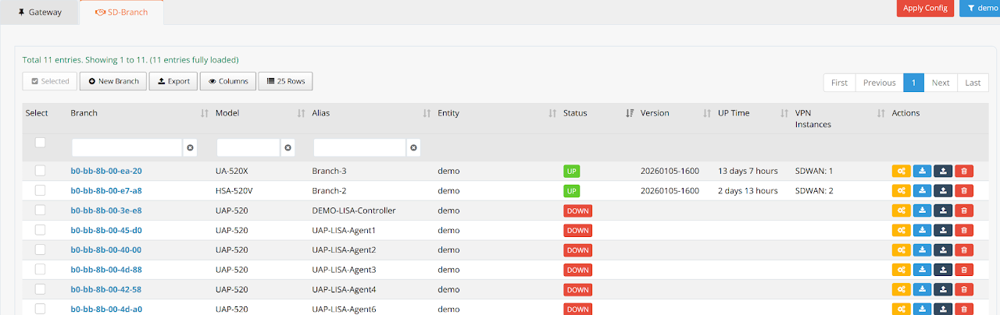
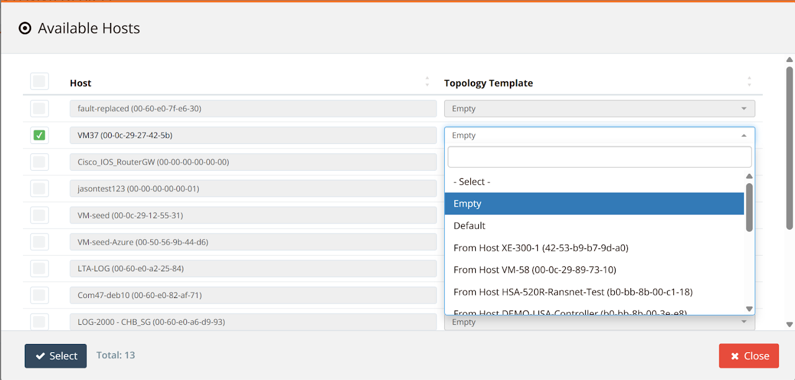
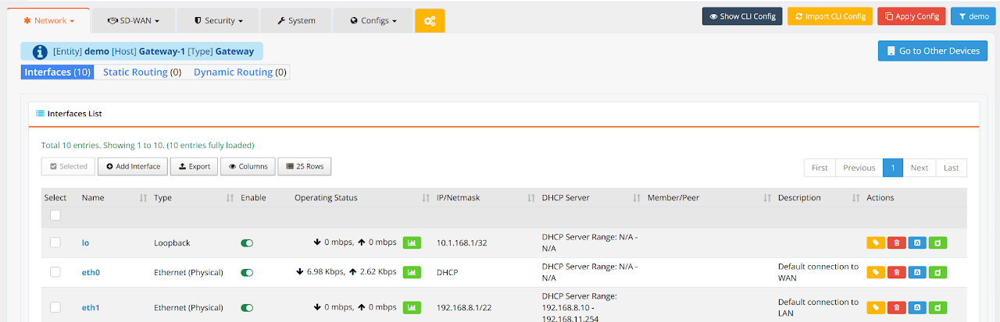
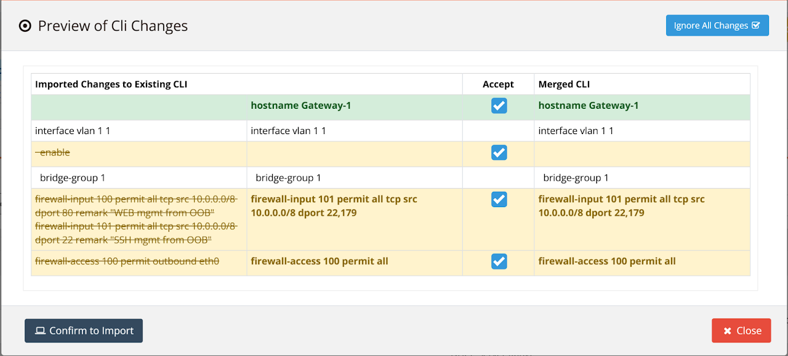
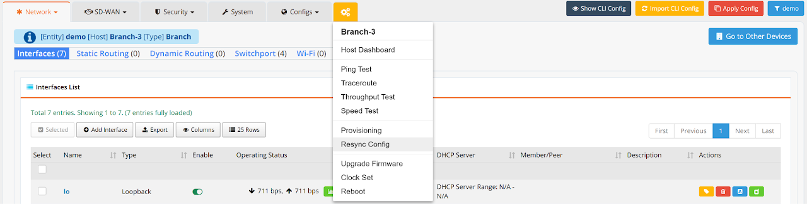

# Device Onboarding

By default, once a device is provisioned on mfusion, they're automatically monitored (same for both RansNet and 3rd-party SNMP devices).

In order for mfusion to manage the devices configuration (RansNet devices only), the devices need to be onboarded.

Oboarding involves importing the device into the mfusion orchestrator so that you can start configuring SD-WAN features and all other settings to meet your connectivity and security requirements.

!!! note
    For 3rd-party device monitoring, this step is not necessary.

We suggest plotting out the overall network map clearly before you begin, so you know exactly what you intend to achieve. You can use the mfusion **topology** feature to draw the topology map.

---

## Terminologies

Before you begin, it is important to understand some basic terminologies and principles used by mfusion.

### SD-WAN Device Types

Functionally, there are two types of devices — **Gateway** and **Branch**.

- **Gateway devices** (CMG/HSG series) function as the central SD-WAN gateway (and/or captive portal gateway). They are usually located at the customer HQ/DC network or in cloud hosting (e.g. VM, AWS, Azure), where central applications reside. Gateways terminate VPN tunnels from branch routers and handle route exchanges for the entire SD-WAN network. They are attached with `Template_mbox` during provisioning.

- **Branch devices** are the remote routers at each location, typically the branch series (UA/HSA/XE/UAP). Note that CMG/HSG can also be used as a branch device (e.g. for large branch networks with high speed and many users), but branch series devices cannot be used as gateway devices.

### GUI vs CLI Configuration

RansNet devices can be configured either through the **mfusion orchestrator** (recommended) or through the **CLI**. It is important to understand the differences:

- **mfusion orchestrator** stores GUI configuration into a device topology database for each device, compiles it into CLI configuration commands, and pushes them to the device for local application.
- **CLI configuration** (via console or SSH) is not automatically synced to mfusion. You can use the **Import CLI Config** function to manually merge CLI settings into the GUI later.

---

## Onboard Devices

1. Go to **ORCHESTRATOR → Configuration → Gateway/Branch Devices**.
2. Click **New Gateway/Branch**, select the device, and attach a topology template.

**Topology Templates**

| Template | Description |
|----------|-------------|
| **Empty** | mfusion will not pre-fill any GUI settings for this device. |
| **Default** | Matches the device's default CLI configuration. |
| **From host ...** | Copies GUI settings from an existing device of similar configuration, so you only need to make minor changes (e.g. LAN IP) and resync. |

---

## Import CLI Config

If your device already has existing default or bootstrap CLI configuration that you want to merge into your GUI settings, use the **Import CLI Config** feature.

!!! note
    If you want to start from a clean/zero config (e.g. using the **Empty** template), skip this step. Instead, configure GUI settings and use **Resync Config** to overwrite all existing CLI configs.

To import CLI config:

1. Ensure the device is properly bootstrapped, onboarded and online.
2. Go to the device list and click on the device MAC address.
3. In the device editing menu, click **Import CLI Config** (top-right corner).

    

4. Review the differences between the CLI and GUI settings.

    

5. Accept the settings you want to keep and click **Confirm to Import**.

---

## Resync Config

Before making configuration changes, you may optionally run a **Resync Config** to ensure the GUI configuration is fully synced to the device CLI.

!!! warning
    This action will overwrite all existing CLI settings with the GUI configuration and **force a reboot** of the device.

!!! note "Check the following before resyncing"

    - **If you used "Copy from host ..."** during onboarding — update interface settings (e.g. LAN IP) and hostname before resyncing.
    - **If you used the "Empty" template** — you must configure at minimum the WAN IP and routing so the device can reach mfusion after reboot.
    - **If you have important bootstrap CLI config** (e.g. `ip host portal.ransnet.com ...` for on-premise mfusion) — import the CLI config first to merge that setting into the GUI, so the device can still reach mfusion after reboot.

To resync:

1. Open the device editing menu.
2. Click the **Resync Config** button from the drop-down menu.

---

## Zero-Touch Provisioning

You can onboard a device to mfusion, prepare all configurations and resync, **before** the device is physically online or deployed.

Once the device comes online (e.g. after proper bootstrapping), it will automatically pull its configuration, reboot, and start operating as per your configuration — with no manual intervention required on-site.
