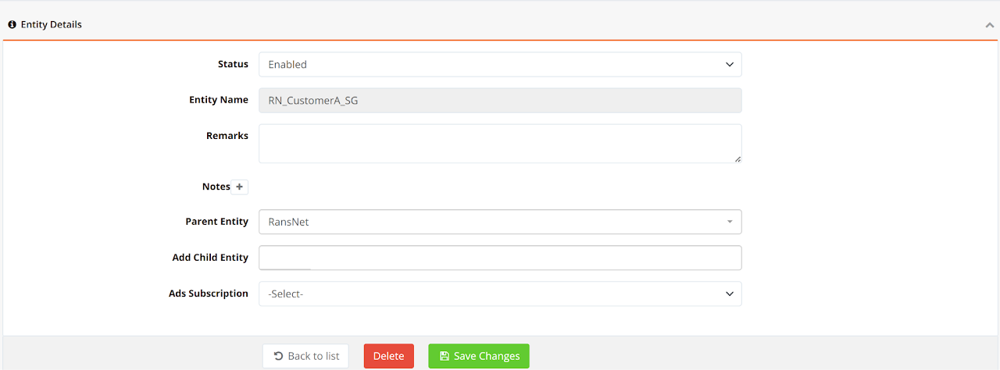
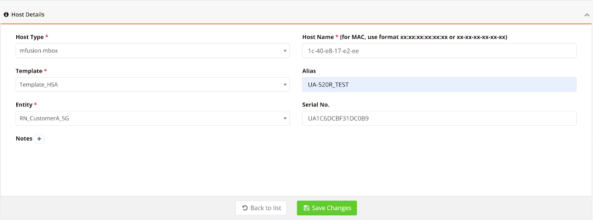
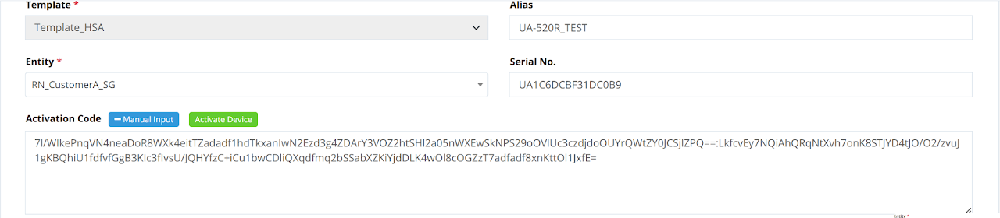
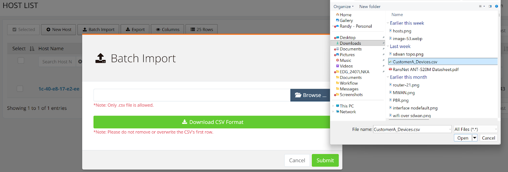
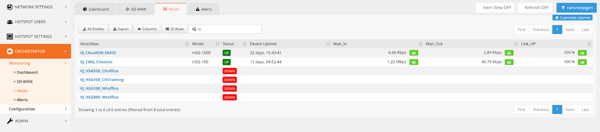
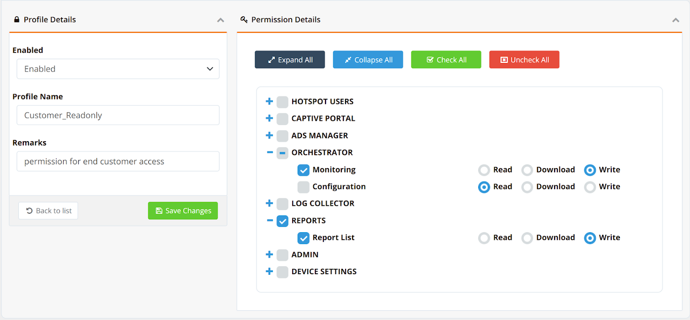
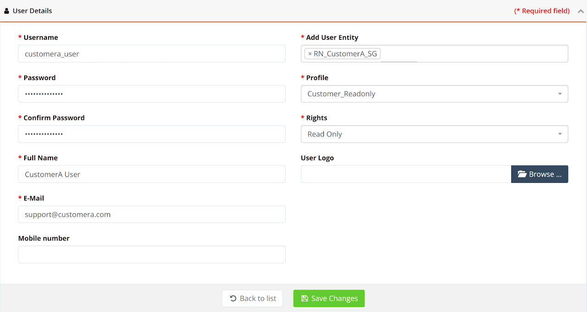

# Device Provisioning

Before a device can be monitored or managed by mfusion, it needs to be provisioned on mfusion as an authorized host.

---

## Preparation

Before you begin, ensure that:

- The device has a valid support status (e.g. within warranty support)
- The device has an **activation code**
- You have collected the device **MAC address** and **Serial Number**

These details are usually provided in spreadsheet format by the RansNet distributor to partners and customers.

---

## Create Customer Entity

If you are adding a device for a **new customer**, you need to create a customer entity first. If you are adding new devices to an **existing customer**, skip to the next section.

!!! note
    - For partners sharing the RansNet **cloud mfusion**, you will be provided a partner account to access [https://portal.ransnet.com](https://portal.ransnet.com).
    - For partners/customers using **on-premise/private mfusion**, you will be given the default super-admin access to your own mfusion.
    - If you have problems accessing mfusion for the first time, contact RansNet support.

To create a customer entity:

1. Log in to mfusion and go to **ADMIN → Entities**.
2. Click **New Entities**, provide an entity name, and click **Save Changes**.

!!! tip
    Entity names should be as specific as possible while remaining short enough for easy searching. Include a country code to identify the location (e.g. `YourCompanyCode_CustomerCode_SG`). Avoid spaces — use `-` or `_` instead.

---

## Add Device to Entity

To add a device to a customer entity:

### Manual Entry

1. Go to **ADMIN → Hosts** and click **New Host**.
2. Fill in the required fields:

    | Field | Value |
    |-------|-------|
    | **Host Type** | `mfusion mbox` |
    | **Host Name** | Device MAC address (eth0 MAC) — printed on the product label |
    | **Serial No.** | Printed on the product label |
    | **Alias** | A readable name for the device. Use a meaningful name for easy identification. Avoid spaces — use `-` or `_` instead. |
    | **Template** | `Template_HSA` for branch series (UA/HSA/XE/UAP) · `Template_mbox` for gateway series (CMG/HSG) |

3. Click **Save Changes**. You will then be prompted to enter an activation code.

    

4. Click **Manual Input**, paste the activation code, and click **Activate Device**.

    

!!! warning
    Make sure there are no gaps or line breaks in the activation code.

### Batch Import

For large numbers of devices, use the **Batch Import** function:

1. Go to **ADMIN → Hosts** and click **Batch Import**.
2. Browse to your CSV file containing the device list.

    

!!! tip
    Ensure your spreadsheet follows the correct format. You can download a sample CSV format from the Batch Import interface. RansNet distributors typically provide this CSV file to partners or customers.

### Verifying Device Status

Once a device is successfully activated, monitoring starts automatically.

1. Go to **ORCHESTRATOR → Monitoring → Hosts**.
2. Filter to the target customer entity (top-right corner).
3. If the device is properly bootstrapped and online, you should see **UP** status within **3 minutes**.

    

Repeat the steps above to add more devices to the same entity.

---

## Create Permission Profile
!!!Optional
    Skip if using RansNet cloud mfusion, which already includes suitable permission profiles for read-only and read-write access. Just select the pre-defined profiles for your user accounts.

If you are using **on-premise mfusion**, you may want to create a custom permission profile to control customer access rights (e.g. read-only access to their own devices only).

1. Go to **ADMIN → Permissions** and click **New Profile**.
2. Give the profile a name and description.
3. Select the appropriate access rights.
4. Click **Save Changes**.

---

## Create mfusion User Account

To create user accounts for admin or read-only access:

1. Go to **ADMIN → Accounts** and click **New User**.
2. Fill in the required fields.

!!! tip
    - If you want the customer to receive **email alerts** (e.g. device failures or network anomalies), enter an accurate email address. The customer can also use this email to recover and reset their password.
    - You can optionally upload your company or customer company logo for **white-labeling/branding** purposes.
