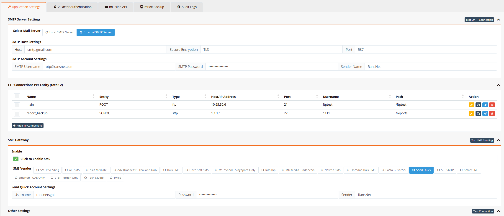
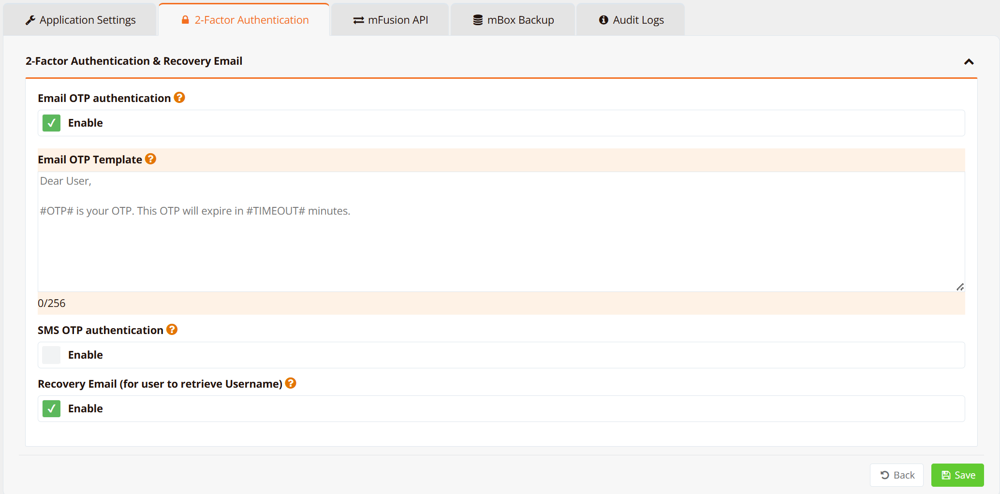
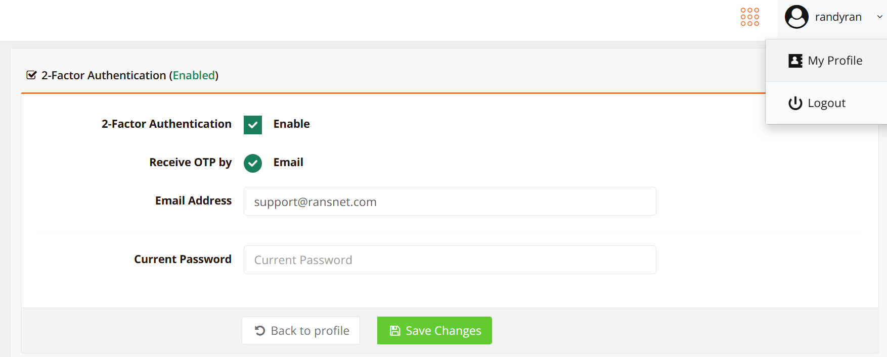
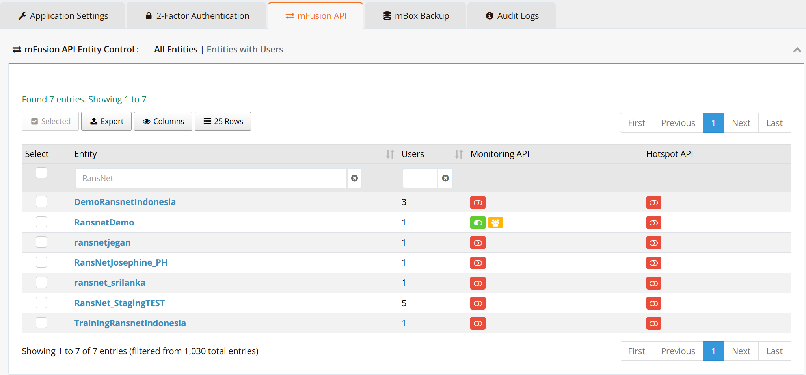
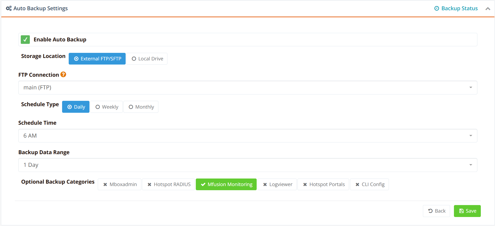
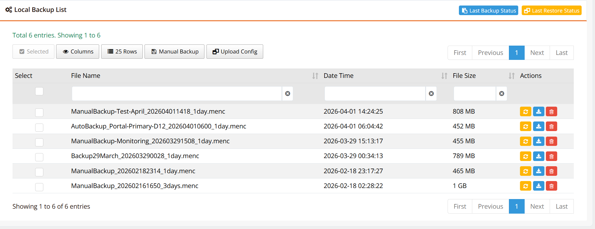
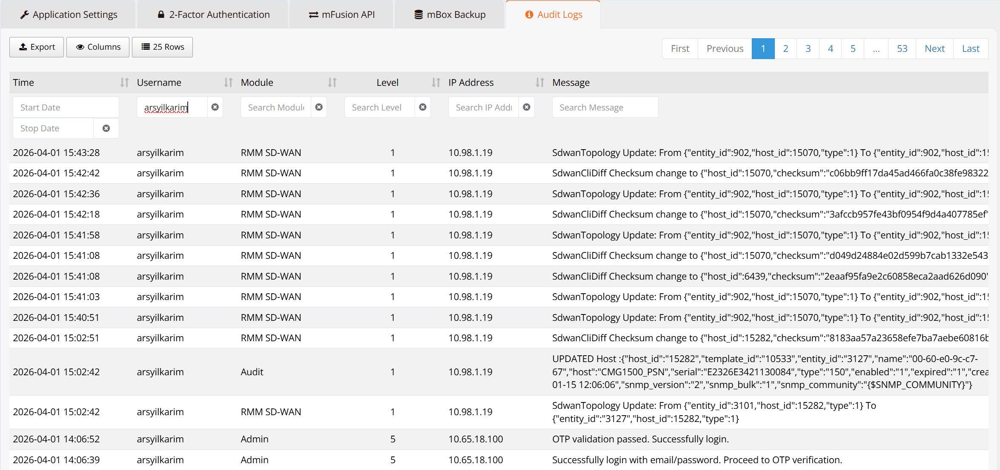
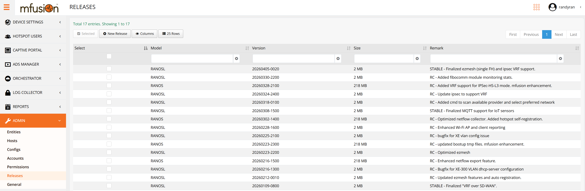

# Administration

This section applies to **on-premise / private mfusion deployments** where you manage your own mfusion server. The Administration panel provides the critical backend configuration needed for mfusion to operate — covering outbound communications, authentication security, API access control, data backup, and operational audit trails.

---

## Application Settings

Navigate to **ADMIN → General → Application Settings**.

This tab configures the backend communication services that mfusion relies on for outbound notifications, OTP delivery, and data archival.

### SMTP

SMTP is used for two purposes: delivering automated reports (hotspot usage, network monitoring) to recipients on a schedule, and sending email OTP codes for two-factor authentication (2FA) during dashboard login.

**Select Mail Server** — Choose between using the built-in local MTA on the mfusion appliance, or relaying through an external SMTP provider such as Gmail or SendGrid.

| Field | Description |
|---|---|
| Host | SMTP server hostname or IP address |
| Secure Encryption | Encryption protocol — `TLS` (port 587) or `SSL` (port 465) |
| Port | SMTP port corresponding to the selected encryption |
| Email | Sender address used for all outbound mail |
| SMTP Password | Authentication password for the SMTP account |
| Sender Name | Display name shown in the From field of outgoing emails |

### SMS Gateway

The SMS Gateway integrates with supported SMS providers via API to send OTP codes for 2FA dashboard login. mfusion supports a broad list of regional and global SMS providers, including Asia Webhost, Asia Broadcast, Vist Broadcast, Built SMS, and others.

Under **Send Quick SMS Settings**, enter your SMS provider API credentials (username, password, and sender ID), then click **Send Quick SMS** to send a test message and confirm the gateway is working.

### FTP / SFTP

FTP and SFTP connections allow mfusion to push data to external NAS or file servers automatically. Typical use cases include:

- Scheduled report archival
- Syslog file exports
- Encrypted mfusion configuration and monitoring data backups

Multiple connections can be configured and scoped to different entities (e.g., the root organization or a specific tenant). Click **+ Add FTP Connection** to add a new entry.

| Field | Description |
|---|---|
| Name | A label identifying this connection |
| Entity | The organizational entity this connection is associated with |
| Type | Protocol — `ftp` or `sftp` |
| Host / IP Address | Address of the remote server |
| Port | Port number (`21` for FTP, `22` for SFTP by default) |
| Username | Login credential for the remote server |
| Path | Remote directory where files will be written |

---

## 2-Factor Authentication

Navigate to **ADMIN → General → 2-Factor Authentication**.

This tab controls the 2FA policy for dashboard login. mfusion supports OTP delivery via **email** or **SMS** (or both). Administrators can also customize the OTP message template sent to users.

| Setting | Description |
|---|---|
| Email OTP Authentication | Enable OTP delivery via email |
| Email OTP Template | Customizable message body — use `#OTP#` and `#TIMEOUT#` as placeholders |
| SMS OTP Authentication | Enable OTP delivery via SMS (requires SMS Gateway to be configured) |
| Recovery Email | Allow users to retrieve their username via a registered recovery email |

!!! Info
    Once 2FA is enabled at the system level, individual administrators can activate it for their own account under **My Profile**.

Each user selects their preferred OTP delivery method (email or SMS) and registers the corresponding contact details. Their current password is required to save the change.

---

## mfusion API

Navigate to **ADMIN → General → mfusion API**.

mfusion exposes a secure REST API for integration with third-party and external systems, enabling seamless automation of provisioning, monitoring, and hotspot workflows. API access is controlled at the entity level — each entity can have independent API keys scoped specifically to **Monitoring API**, **Hotspot API**, or both.

The API control table lists all entities with their current API enablement status. Access can be granted or revoked per entity without affecting others, providing fine-grained control suitable for multi-tenant environments.

!!! note
    Full API reference documentation will be available at a dedicated URL (to be published).

---

## Backup and Restore

Navigate to **ADMIN → General → Backup and Restore**.

### Auto Backup

The auto backup feature allows mfusion to create scheduled, encrypted backups and store them either locally or on a remote FTP/SFTP server. Administrators can configure:

| Setting | Description |
|---|---|
| Enable Auto Backup | Master toggle to activate scheduled backups |
| Storage Location | Destination — External FTP/SFTP server or Local Drive |
| FTP Connection | The pre-configured FTP/SFTP connection to use for remote storage |
| Schedule Type | Backup frequency — Daily, Weekly, or Monthly |
| Schedule Time | Time of day the backup job runs |
| Backup Data Range | Rolling data window included in each backup (e.g., 1 day, 7 days) |
| Optional Backup Categories | Selectively include data sets — Mboxadmin, Hotspot RADIUS, mFusion Monitoring, Logviewer, Hotspot Portals, CLI Config |

!!! Note
    It is highly recommended to use external SFTP backup. Backup to **Local Drive** allows up to last 3 backups only to prevent overwelming mfusion server local storage space.

### Restore

The backup list shows all available backup files stored locally, including both automatic and manual backups. Each entry displays the file name, timestamp, and size. From this view, administrators can:

- **Download** a backup file for off-site archival
- **Restore** mfusion from a selected backup
- **Upload Config** — upload an encrypted backup file (e.g., retrieved from an SFTP server) to restore from

Backup files use the `.menc` (encrypted) format to ensure data security at rest and in transit.

---

## Audit Logs

Navigate to **ADMIN → General → Audit Logs**.

The Audit Logs provide a complete, tamper-evident record of all operational activity within mfusion. Every significant action is logged with a timestamp, the user who performed it, the module affected, severity level, source IP address, and a detailed message describing the change.

Logged events include:

- Administrator login sessions and OTP validation
- Device provisioning and configuration changes
- SD-WAN topology updates
- System-level configuration modifications

Logs can be filtered by time range, username, module, severity level, IP address, or message content, making it straightforward to audit specific incidents or track changes made by a particular user. This data is essential for security audits, compliance reporting, and operational troubleshooting.

---

## Firmware Releases

Navigate to **ADMIN → Releases**.

mfusion acts as an on-premise firmware repository, allowing managed devices to perform over-the-air upgrades by downloading firmware directly from the mfusion server — without requiring each device to reach the internet. Only super-administrators can upload firmware packages to this repository; firmware files are provided by the RansNet support team.

Firmware releases are organised by device family:

| Category | Description |
|---|---|
| **RANOSL** | Firmware for branch-series devices (e.g. HSA, UA, XE, UAP) |
| **RANOL** | Firmware for gateway-series devices (e.g. CMG, HSG) |

Once uploaded, the release becomes available for selection when triggering a firmware upgrade from the device management interface.

!!! note
    Only active devices with a valid activation code and an active support contract are permitted to download firmware from mfusion.

