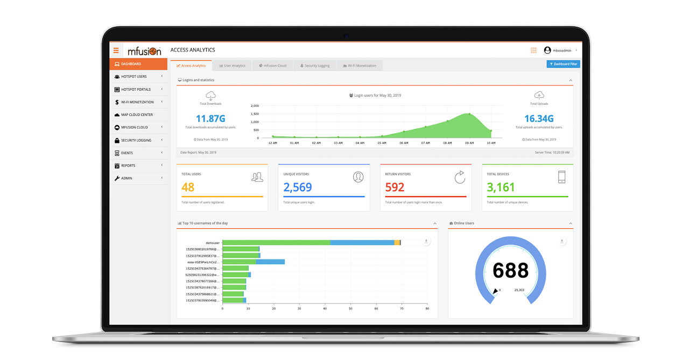

# mfusion Features

RansNet **mfusion** is a centralized monitoring and management platform that enables administrators to securely manage RansNet network devices through an intelligent and scalable system.

The key capabilities of the mfusion platform include:

- **Zero-Touch Provisioning**  
  RansNet devices (HSA, UA, CMG, XE, UAP, and HSG) automatically "call home" when powered on. Administrators can remotely provision, configure, and onboard devices without requiring on-site intervention, significantly reducing deployment time and operational cost.

- **Centralized Device Management**  
  mfusion provides centralized configuration management, backup, firmware and patch management, and remote control (e.g., reboot). This enables efficient management of large-scale deployments without accessing individual devices.

- **Centralized Visibility and Monitoring**  
  mfusion continuously monitors device and network health, including system status, wireless performance, NetFlow analytics, and IoT data. It generates real-time alerts based on defined thresholds and includes a reporting engine for scheduled and customized reports.

- **Service Provider–Oriented Architecture**  
  Designed for ISPs and MSPs, mfusion supports large-scale, multi-customer environments with strict role-based access control and tenant isolation. Service providers can grant customers controlled visibility without exposing other tenants' data.

RansNet operates a cloud-hosted mfusion platform built on scalable and high-availability infrastructure, allowing multiple customers to securely share the platform within isolated tenants.

For customers requiring localized/on-premise deployments, mfusion is also available as a dedicated hardware or virtual appliance. The appliance runs a pre-built, hardened, and optimized RansNetOS, enabling rapid deployment with minimal setup.

In addition to RansNet devices, mfusion supports monitoring of third-party network and IoT devices via standard protocols such as SNMP (v2/v3), ICMP, netflow, and MQTT, providing unified, end-to-end network visibility.