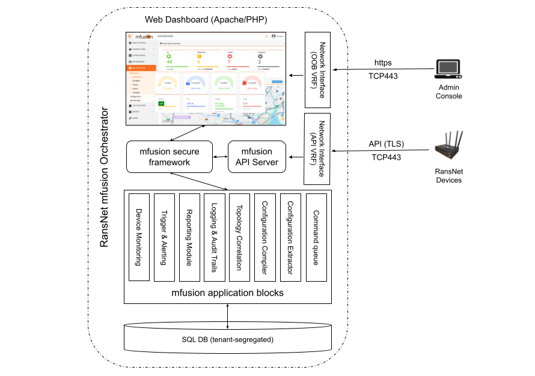
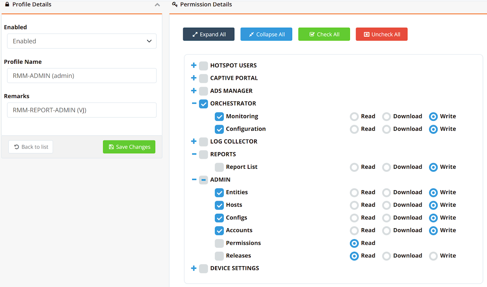
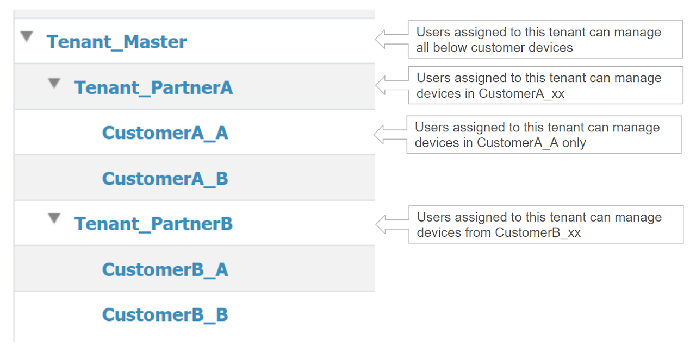
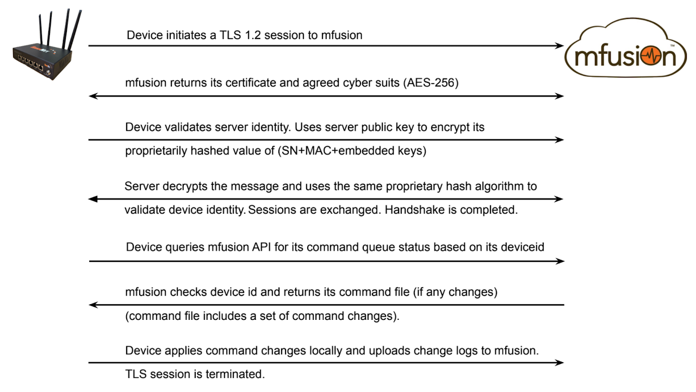
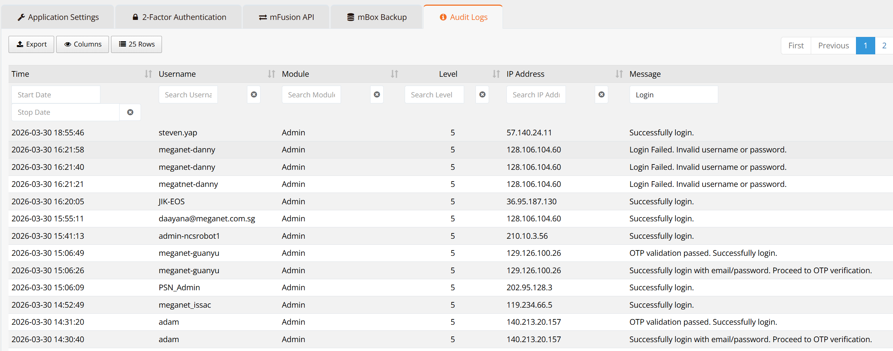
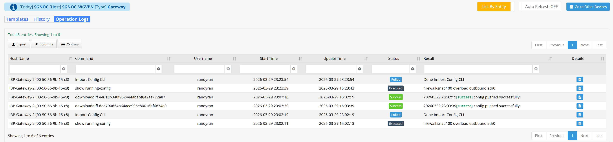
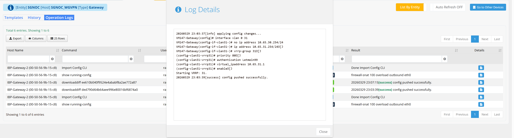

# mfusion Secure Architecture

The mfusion platform is built with multiple software components to deliver monitoring and orchestration capabilities while maintaining strong security controls.

There is a clear separation between functional modules and internal data flows. A proprietary secure framework provides an additional protection layer between external web/API access and internal application databases, reducing the attack surface and enhancing system integrity.

---

## Multi-Tenancy and RBAC

The mfusion platform supports a **super-tenant architecture** with Role-Based Access Control (RBAC).

Each customer is provisioned as a separate tenant, with devices assigned accordingly. User accounts are associated with their respective tenant and assigned predefined permission profiles.

This ensures:

- Strict access isolation between tenants  
- Secure data separation  
- Controlled user access based on roles and responsibilities

Users can only access resources within their assigned tenant, based on their permission profile.

---

## Data Security and Privacy

Only **management data** is exchanged between RansNet devices and mfusion. This includes:

- Configuration commands  
- Monitoring statistics  
- Historical reports  

All customer data is logically separated per tenant and stored in an encrypted database.

For cloud-hosted deployments, RansNet enforces strict data confidentiality. As an ISO 27001-certified organization, RansNet acts solely as a data processor for service delivery.

For on-premise deployments, all management data remains within the customer’s local mfusion system.

mfusion supports periodic database backups, which are:

- Encrypted using AES-256  
- Stored locally or transferred to external storage (e.g., NAS via SFTP)  

Importantly, **user data (business or Internet traffic)** does not pass through mfusion. Traffic either:

- Breaks out locally to the Internet, or  
- Traverses secure VPN tunnels between devices and customer gateways (e.g., HQ or data center)  

---

## Secure API Communication

RansNet devices communicate with mfusion using a proprietary API over a secure TLS tunnel (TLS 1.2 with AES-256 encryption).

Each device is authenticated using a combination of:

- MAC address  
- Serial number  
- Embedded certificates  
- Proprietary validation mechanisms  

This ensures strong device identity verification and prevents spoofing.

When a configuration change is made via the mfusion dashboard:

1. The configuration compiler converts GUI changes into command sets  
2. The commands are stored securely in a device-specific queue  
3. The device periodically connects to mfusion to retrieve updates  

Devices establish an outbound TLS connection to mfusion every **5 seconds** to:

- Check for pending configuration updates  
- Retrieve and apply updates if available  

This communication model is strictly **device-initiated (outbound only)**.

**Key Advantages**

- **No static IP required**  
  Devices can operate with dynamic IPs, including cellular connections, as long as they can reach the mfusion platform.

- **No inbound access required**  
  No ports or services need to be exposed on the device, significantly reducing attack surface.

- **Secure communication**  
  All management data is encrypted using AES-256 over TLS.

- **Replay and interception protection**  
  Session keys are dynamically exchanged for each interaction, preventing replay and man-in-the-middle attacks.

The result is a secure, efficient communication model with minimal bandwidth usage (typically **1–2 kbps** during operation).

---

## Secure Audit Logs ##

mfusion captures detail audit trails for admin access and configuration changes, which are important for security compliance and audit requirements.

The **Admin Audit Trails** page logs all administrator activities, including login attempts, configuration actions, and system events.

Each record includes key information such as:

- **Timestamp** — when the activity occurred  
- **Username** — the administrator account involved  
- **Module** — the system component accessed (e.g., Admin, Monitoring)  
- **Level** — severity or event classification  
- **IP Address** — source IP of the request  
- **Message** — description of the action or result (e.g., login success, failure, OTP validation)  

This allows administrators to:

- Track successful and failed login attempts  
- Identify unauthorized or suspicious access  
- Monitor administrative actions across the system  
- Support compliance and audit requirements  

---

## Operation Logs ##

The **Operation Logs** page captures all configuration-related activities performed on a device.

Each log entry includes:

- **Host Name** — the device where the change was applied  
- **Command** — the action performed (e.g. config push, CLI command)  
- **Username** — the administrator who initiated the change  
- **Start Time / Update Time** — when the operation started and completed  
- **Status** — execution status (e.g. Pulled, Executed, Success)  
- **Result** — outcome or response from the device  

This allows administrators to:

- Track all configuration changes across devices  
- Identify who made specific changes and when  
- Verify whether a configuration was successfully applied  
- Review historical changes for troubleshooting and auditing  

---
## Change Logs ##

Each operation log entry provides detailed execution output.

Click the **Details** icon to view:

- Full CLI command execution logs  
- Step-by-step configuration changes  
- System responses and status messages  

This enables deep inspection of configuration behavior, including validation of applied settings and troubleshooting failed operations.

