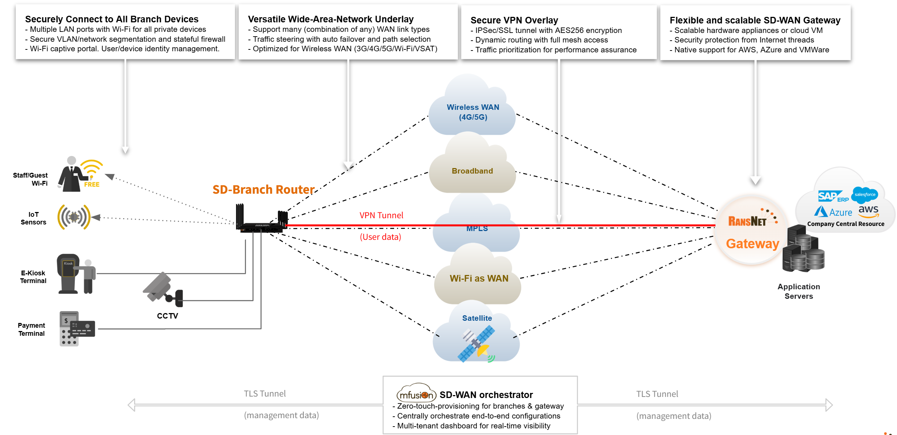

# Product Overview

RansNet develops end-to-end SD-WAN/SD-Branch and Wi-Fi Hotspot solutions for enterprise networks and service provider deployments.

The product portfolio covers two solution families:

- **SD-WAN / SD-Branch** — branch routers and gateway appliances for secure WAN connectivity, managed through the mfusion orchestrator
- **Wi-Fi Hotspot** — captive portal gateways and enterprise access points for guest Wi-Fi, monetization, and high-density wireless deployments

---

## SD-WAN / SD-Branch Products

### Branch Routers — Series Comparison

Branch routers (mbox) are deployed at sites to provide WAN connectivity, routing, firewall, VPN, and Wi-Fi. Four series are available, spanning enterprise branch, industrial, and vehicle/mobility deployments.

| | **HSA-520** | **UA-520** | **UA-800** | **XE-300** |
|---|---|---|---|---|
| **Cellular** | 4G LTE (Cat 4) | 5G NSA/SA (or 5G RedCap) | 5G NSA/SA (Qualcomm X62 or Quectel RM5xx) | 4G LTE or 5G RedCap |
| **Wi-Fi** | Wi-Fi 6 (802.11ax), 2.4/5GHz | Wi-Fi 6 (802.11ax), 2.4/5GHz | Wi-Fi 6 (802.11ax), 2.4/5GHz | Wi-Fi 4 (802.11n), 2.4GHz only |
| **Ethernet** | 5 × GbE (all configurable WAN/LAN) | 5 × GbE (all configurable WAN/LAN) | 3–5 × GbE (M12 or RJ45, see variants) | 1 × FE WAN + 3 × FE LAN (100Mbps) |
| **Firewall throughput** | 1 Gbps | 1 Gbps | 1 Gbps | 100 Mbps |
| **VPN throughput** | 200 Mbps (IPSec), 300 Mbps (WG) | 200 Mbps (IPSec), 300 Mbps (WG) | 600–800 Mbps (IPSec) | 10 Mbps (IPSec), 20 Mbps (WG) |
| **Concurrent devices** | Up to 100 | Up to 100 | Up to 200 | Up to 20 |
| **Form factor** | Compact desktop, metal, 195×150×30mm | Compact desktop, metal, 195×150×40mm | Industrial metal, 195×150×30mm (NR/M) or 135×150×30mm (X); M12 ports on vehicle variant | Ultra-compact, 115×87×40mm, <200g |
| **Operating temp** | −30°C to 70°C | −30°C to 70°C | −30°C to 70°C (NR/M) / −30°C to 80°C (X) | −30°C to 70°C |
| **IP rating** | IP30 | IP30 | IP30 (NR) / IP65 (M) | IP30 |
| **Target use case** | Enterprise branch, retail, SD-Branch with 4G backup | Enterprise branch, SD-Branch with 5G, FWA, IoT | Industrial IoT, vehicle/mobility, Fixed Wireless Access, AIoT | Industrial IoT, harsh environments, compact machine-mount |
| **Datasheet** | [HSA-520](RansNet%20HSA-520%20Datasheet.pdf) | [UA-520](RansNet%20UA-520%20Datasheet.pdf) | [UA-800NR](RansNet%20UA-800NR%20Datasheet.pdf) / [UA-800M](RansNet%20UA-800M%20Datasheet.pdf) / [UA-800X](RansNet%20UA-800X%20Datasheet.pdf) | [XE-300](RansNet%20XE-300%20V_R_X%20Datasheet.pdf) |

### HSA-520 Model Variants

| Model | Cellular | SIM | Multi-WAN | Notes |
|---|---|---|---|---|
| **HSA-520V** | None | None | Up to 5 WAN | Fixed-line only; no cellular module |
| **HSA-520R** | 4G LTE (Cat 4, Quectel EM05) | Dual (Active/Standby) | Up to 6 WAN | Standard 4G model |
| **HSA-520L2** | 4G LTE × 2 (2× Quectel EM05) | Dual (Active/Active) | Up to 7 WAN | Dual 4G modem for load balancing or separate SIM pools |

### UA-520 Model Variants

| Model | Cellular | 5G Peak Rate | Notes |
|---|---|---|---|
| **UA-520R** | 5G NSA/SA (Qualcomm X62) | DL 3.4 Gbps / UL 550 Mbps | Full 5G Sub-6; primary model for high-bandwidth branch |
| **UA-520X** | 5G RedCap (Qualcomm X35) | DL 223 Mbps / UL 123 Mbps | Cost-efficient 5G; suitable for lower-bandwidth IoT/branch |

### XE-300 Model Variants

| Model | Cellular | WAN | Notes |
|---|---|---|---|
| **XE-300V** | None | Fixed line only | Wired WAN only; lowest cost entry point |
| **XE-300R** | 4G LTE (Quectel EM05) | Fixed + 4G | Standard industrial IoT model |
| **XE-300X** | 5G RedCap (Quectel RG255) | Fixed + 5G | 5G-capable industrial model |

### UA-800 Model Variants

The UA-800 series is the industrial and vehicle-grade branch router line, built on the Qualcomm IPQ6010 platform. It is distinguished from the UA-520/HSA-520 desktop series by its ruggedized construction, higher concurrent device capacity (200), higher VPN throughput, and vehicle-specific options including M12 connectors, ignition-sensing power control, and IP65 weatherproofing.

All UA-800 models include: integrated GNSS/GPS, Bluetooth, Z-Wave\*, and a built-in MQTT broker\* for IoT device integration.

| Model | Type | Cellular | SIM | Ethernet | Power Input | IP Rating | Notes |
|---|---|---|---|---|---|---|---|
| **UA-800NR1** | Industrial FWA | 5G NSA/SA (Qualcomm X62) | Dual, Active/Standby | 5 × GbE (RJ45) | Screw Jack, 12–56V DC | IP30 | Standard industrial form factor; Fixed Wireless Access |
| **UA-800NR2** | Industrial FWA | 5G NSA/SA (Qualcomm X62) | Dual, Active/Active | 5 × GbE (RJ45) | Screw Jack, 12–56V DC | IP30 | Dual-SIM active/active for load balancing or SIM redundancy |
| **UA-800M1** | Vehicle/Mobility | 5G NSA/SA (Qualcomm X62) | Dual, Active/Standby | 4 × GbE (M12) | M12, 12–56V DC + ignition sensing | IP65 | Vehicle-grade; EN 61373 vibration certified; ISO 16759 |
| **UA-800M2** | Vehicle/Mobility | 5G NSA/SA (Qualcomm X62) | Dual, Active/Active | 4 × GbE (M12) | M12, 12–56V DC + ignition sensing | IP65 | Vehicle-grade; dual-SIM active/active |
| **UA-800X** | Compact IoT | 5G NSA/SA (Quectel RM5xx) | Single | 1 × WAN + 2 × LAN (GbE) | 12–56V DC / USB-C 5V / Terminal block | — | Most compact (135×150×30mm, <800g); −30°C to 80°C; automotive E-Mark\* |

!!! note
    All branch router models include full SD-WAN features: multi-WAN failover, IPSec/SSL/WireGuard/GRE/VXLAN VPN, OSPF/BGP dynamic routing, PBR traffic steering, stateful firewall, VLAN, NAC, SNMP/NetFlow/Syslog, and zero-touch provisioning via mfusion.

---

### SD-WAN Gateway — CMG Series

The CMG series is deployed as the SD-WAN gateway (data center or headquarters side), forming the hub of a hub-and-spoke SD-WAN topology with branch mbox devices as spokes. It is available as a hardware appliance or as a virtual machine (NFV).

| | **CMG-1500** | **CMG-2000** | **CMG-3000** | **CMG-5000** |
|---|---|---|---|---|
| **Tier** | Business | Enterprise | Enterprise | Carrier |
| **Router throughput** | 1.5 Gbps | 10 Gbps | 10 Gbps | 10 Gbps |
| **Firewall throughput** | 1.5 Gbps | 2 Gbps | 5 Gbps | 10 Gbps |
| **Concurrent connections** | 300,000 | 500,000 | 1,000,000 | 2,000,000 |
| **Recommended users** | 200 | 500 | 1,000 | 3,000 |
| **Multi-WAN links** | Up to 3 | Up to 7 | Up to 15 | Up to 28 |
| **LAN/WAN ports** | 4 × GbE | 6 × GbE | 8 × GbE | 8 × GbE |
| **10G expansion** | — | Optional | Optional | Optional |
| **Redundant PSU** | — | — | Optional | Included |
| **Form factor** | Desktop | Desktop | 1U rack | 2U rack |
| **Datasheet** | [CMG Series](RansNet%20CMG%20Product%20Datasheet.pdf) | [CMG Series](RansNet%20CMG%20Product%20Datasheet.pdf) | [CMG Series](RansNet%20CMG%20Product%20Datasheet.pdf) | [CMG Series](RansNet%20CMG%20Product%20Datasheet.pdf) |

!!! note
    All CMG models include: stateful firewall, IPSec/SSL/WireGuard/GRE/VXLAN/SSL VPN, OSPF/BGP, VRRP HA, PBR, QoS, SNMP/NetFlow/Syslog, VRF support, and mfusion zero-touch provisioning.

    Redundant PSU available for CMG-3000; included for CMG-5000.

---

### mfusion — SD-WAN Orchestrator

mfusion is the central management and orchestration platform for all RansNet mbox devices. It can be deployed as a cloud-hosted service or installed on-premise.

Key capabilities:

- **Zero-touch provisioning** — new devices auto-register and receive their configuration on first boot
- **Centralized monitoring** — real-time dashboard, topology map, wireless visibility, NetFlow analytics, and alert management
- **Template-based configuration** — define once, push to hundreds of devices or groups
- **VPN orchestration** — auto-provision hub-and-spoke or full-mesh VPN topologies
- **Multi-tenant** — role-based access with super-tenant dashboard for service providers and MSPs
- **Firmware management** — schedule and deploy firmware updates across the fleet

---

## Wi-Fi Hotspot Products

### Product Comparison

| | **HSG Series** | **UAP-520** | **HSA-520 / UA-520** |
|---|---|---|---|
| **Role** | Captive portal gateway + AP controller | Enterprise access point | Branch router with built-in Wi-Fi |
| **Wi-Fi** | Via any APs | Wi-Fi 6 (AX3000), 2.4/5GHz | Wi-Fi 6 (AX3000), 2.4/5GHz |
| **Captive portal** | Yes — full CMS, templates, ad engine | Via external HSG integration | Via external HSG integration |
| **Authentication** | SMS, email, social, POS, CRM, LDAP, RADIUS, PMS, payment gateway | RADIUS/802.1x, WPA1/2/3-PSK, Web| RADIUS/802.1x, WPA1/2/3-PSK, Web |
| **AP management** | Can be licensed with mfusion features to manage local UAP-520 | Managed by mfusion or standalone or EzMesh Controller | Managed by mfusion or standalone|
| **Target use case** | Hotels, malls, F&B, schools, hospitals — venues needing guest access + monetization | Enterprise / outdoor Wi-Fi coverage extension | Small branch with integrated Wi-Fi |
| **Datasheet** | [HSG Series](RansNet%20HSG%20Series%20Datasheet.pdf) | [UAP-520](RansNet%20UAP-520%20Datasheet.pdf) | See branch router tables above |

### HSG Series — Model Tiers

| Model | Max Throughput | Max Devices | Form Factor |
|---|---|---|---|
| **HSG-200** | 500 Mbps | 200 | Desktop |
| **HSG-400** | 500 Mbps | 400 | Desktop |
| **HSG-800** | 2 Gbps | 800 | Desktop |
| **HSG-1000** | 2 Gbps | 1,000 | Desktop |
| **HSG-2000** | 2 Gbps | 2,000 | 1U rack |
| **HSG-5000** | 2 Gbps | 5,000 | 1U rack |
| **HSG-15000** | 3 Gbps | 15,000 | 2U rack |
| **HSG-25000** | 3 Gbps | 25,000 | 2U rack |

Redundant PSU available from HSG-2000; included from HSG-15000.

### UAP-520 — Access Point Highlights

The UAP-520 is an enterprise-grade access point (indoor/outdoor, IP67) designed for deployment alongside HSG or mfusion-managed networks.

| Specification | Value |
|---|---|
| **Wi-Fi standard** | 802.11a/b/g/n/ac/ax (Wi-Fi 6, AX3000) |
| **Max throughput** | 2.976 Gbps combined (2.4 + 5 GHz) |
| **Max clients** | 128 (recommended 50) |
| **Ports** | 1 × GbE PoE WAN, 1 × GbE LAN |
| **Power** | PoE 802.3af or DC 12V |
| **Mounting** | Pole / ceiling / wall |
| **IP rating** | IP67 (weatherproof) |
| **Operating temp** | −10°C to 55°C |
| **Datasheet** | [UAP-520](RansNet%20UAP-520%20Datasheet.pdf) |

---

## Accessories

### Antenna Accessories — Comparison

| | **ANT-520D** | **ANT-520M** | **YB0007AA** |
|---|---|---|---|
| **Type** | Directional flat-panel | Omnidirectional monopole | 5G/4G antenna box (puck) |
| **Application** | Wi-Fi — long-range PtP/PtMP | Wi-Fi — wide-area coverage | 5G/4G cellular — MIMO |
| **Frequency** | 2.4 GHz & 5.8 GHz | 2.4 GHz & 5.8 GHz | 700–960 / 1100–2690 / 3300–5000 MHz |
| **Gain** | 10 dBi (2.4 GHz) / 12 dBi (5.8 GHz) | 6 dBi (2.4 GHz) / 8 dBi (5.8 GHz) | ≥ −0.5 dBi (omnidirectional) |
| **Pattern** | Directional, dual polarization | Omnidirectional, 360° | Omnidirectional |
| **Max range** | Up to 800 m (open) | Up to 300 m (open) | — |
| **Connectors** | RP-SMA Female × 2 (with 2 m cable) | N-female | SMA Male × 4 (500 mm cables) |
| **IP rating** | IP65 | IP67 | IP67 |
| **Operating temp** | −40°C to +60°C | −40°C to +55°C | −20°C to +80°C |
| **Mounting** | Pole (Ø30–55 mm), tilt 0–180° | Pole / wall / device-mount | Screw through panel (φ28 mm hole) |
| **Datasheet** | [ANT-520D](RansNet%20ANT-520D%20Datasheet.pdf) | [ANT-520M](RansNet%20ANT-520M%20Datasheet.pdf) | [YB0007AA](RansNet-ANT-YB0007AA-Datasheet.pdf) |

### ANT-520D — High-Gain Directional Wi-Fi Antenna

The ANT-520D is an outdoor flat-panel directional antenna designed for long-range Wi-Fi coverage up to 800 m in open environments. With dual polarization and high gain, it is suited for point-to-point (PtP) and point-to-multipoint (PtMP) sector links, outdoor hotspot deployments, smart city wireless infrastructure, and video surveillance backhaul. The UV-resistant ABS radome and DC grounding for lightning protection make it suitable for permanent outdoor installation.

| Specification | Value |
|---|---|
| **Frequency** | 2400–2500 / 5150–5850 MHz |
| **Gain** | 10 dBi (2.4 GHz) / 12 dBi (5.8 GHz) |
| **Polarization** | Dual (Vertical + Horizontal) |
| **Horizontal 3 dB beamwidth** | 65° ± 5° (both bands) |
| **Vertical 3 dB beamwidth** | 40° ± 5° (2.4 GHz) / 30° ± 5° (5.8 GHz) |
| **Front-to-back ratio** | ≥ 28 dB |
| **Connector** | RP-SMA Female × 2 (with 2 m 3DFB cable) |
| **Dimensions** | 220 × 220 × 25 mm, 0.8 kg |
| **Mounting** | Pole Ø30–55 mm, mechanical tilt 0–180° |
| **IP rating / Compliance** | IP65, CE, FCC |
| **Operating temp** | −40°C to +60°C |
| **Lightning protection** | DC Grounded |

### ANT-520M — High-Gain Omnidirectional Wi-Fi Antenna

The ANT-520M is an outdoor monopole omnidirectional antenna delivering 360° Wi-Fi coverage up to 300 m in open environments. Its low-profile form factor and flexible mounting options (pole, wall, or direct device mount) make it well suited for access points and mesh nodes requiring broad-area coverage. It is optimized to work with RansNet's multi-hop self-healing mesh technology to maximize WLAN reachability and reliability across UAP-520 and HSA-520/UA-520 deployments.

| Specification | Value |
|---|---|
| **Frequency** | 2400–2500 / 5150–5850 MHz |
| **Gain** | 6 dBi (2.4 GHz) / 8 dBi (5.8 GHz) |
| **Polarization** | Vertical |
| **Beamwidth** | 360° horizontal (omnidirectional) |
| **Connector** | N-female |
| **Dimensions** | Ø20 × 350 mm, 0.226 kg |
| **Mounting** | Pole / wall / direct device-mount |
| **IP rating / Compliance** | IP67, CE, FCC |
| **Operating temp** | −40°C to +55°C |
| **Lightning protection** | DC Grounded |

### YB0007AA — 5G Antenna Box

The YB0007AA is a compact screw-mount 5G antenna box (puck form factor) providing four SMA connections for simultaneous 4G/5G MIMO operation. It covers the full 4G and 5G Sub-6 GHz spectrum (700–5000 MHz) and is validated with the Quectel RM500Q-GL module across LTE bands 1–71 and 5G bands N41, N77, N78, and N79. The low-profile IP67 enclosure mounts flush to surfaces on vehicles, enclosures, or wall panels — making it a practical external antenna upgrade for UA-520 and HSA-520 deployments where built-in or stub antennas are insufficient for reliable cellular coverage.

| Specification | Value |
|---|---|
| **Frequency** | 700–960 / 1100–2690 / 3300–5000 MHz |
| **Connectors** | 4 × SMA Male: LMH# (4G/5G main), LMH (4G/5G diversity), \*MH (5G MIMO1), MH (5G MIMO2) |
| **Gain** | ≥ −0.5 dBi |
| **Polarization** | Linear |
| **Cable length** | 500 mm ± 30 mm |
| **Dimensions** | Ø120 × 43 mm |
| **IP rating** | IP67 |
| **Operating temp** | −20°C to +80°C |
| **Installation** | Screw-mount through panel (φ28 mm hole, wall thickness 2–4 mm) |
| **Shell material** | KIBILAC® ASA, Black |

---

## Which Product Do I Need?

| Scenario | Recommended Product |
|---|---|
| Branch site needing 5G WAN + SD-WAN + Wi-Fi 6 | UA-520R |
| Branch site needing 4G WAN + SD-WAN + Wi-Fi 6 | HSA-520R |
| Industrial 5G Fixed Wireless Access (enterprise, retail, AIoT) | UA-800NR |
| Vehicle or mobile 5G router (fleet, robotics, public transport) | UA-800M |
| Compact 5G IoT router for in-vehicle or enclosure mounting | UA-800X |
| Industrial/IoT device with 4G backhaul in harsh environment | XE-300R |
| Compact 5G IoT backhaul at lower cost | XE-300X or UA-520X |
| Fixed-line only branch or HQ gateway | CMG-1500 or CMG-2000 |
| High-performance SD-WAN hub / data center gateway | CMG-3000 or CMG-5000 |
| Hotel / mall / venue guest Wi-Fi with captive portal | HSG series (size by device count) |
| Wi-Fi coverage extension for indoor/outdoor enterprise | UAP-520 |
| Long-range outdoor Wi-Fi sector or PtP/PtMP link | ANT-520D |
| Wide-area omnidirectional Wi-Fi coverage for APs or mesh nodes | ANT-520M |
| External 4G/5G MIMO antenna for vehicle or panel mounting | YB0007AA |
